# Cascade R-CNN: Delving into High Quality Object Detection

## Abstract

> 1. **hypotheses**：假设，猜想；在文中可以理解为：proposal，object candidate 或 pred bbox，以下就不中文翻译此词了；
> 2. close false positives：缩写close FP，指目标检测任务中与 ground true 很靠近，却属于 false positives，很容易被检测器**误检为正样本的负样本**，也即 “close but not correct” bbox；

在目标检测当中，IoU 是决定正样本和负样本的重要参数。同时，检测的性能会随着 IoU 与阈值的提高而下降。造成这样的原因主要有两个：

1. 训练中由于正样本呈指数级消失导致过拟合。提高了 IoU 阈值导致满足这个阈值条件的 proposal 比之前少了，容易导致过拟合。
2. 推理时，检测器最优的 IoU 阈值 和输入的 proposal 之间不匹配（mismatch 问题）

为了解决以上两个问题，本文提出了以下几种方式解决：

1. 本文的网络结构是把经过不同 IoU 阈值训练的检测器组合在一起，对 close FP 有更强的鲁棒性。分多个阶段来训练检测器，用上一个检测的输出的分布作为输出，输入到下一个检测器以便能够训练更高的检测器。
2. 逐步改进 proposal 的重采样，保证所有的检测器都有一组相同大小的正样本集，减少过拟合的问题。
3. 在推理过程中同样使用级联操作，使得 proposal 和每个阶段的检测器的输出结果之间更加匹配。

在 COCO 数据上，本文算法超过了所有单模型的目标检测算法，还可以将本文算法迁移到其他目标检测算法时，作为 baseline  也能够取得性能上的提升。

## Introduction

目标检测主要解决两个任务：

1. recognition：检测器要解决 recognition 的问题，把前景目标从背景力提取出来，并且给予正确的类别标签。（一般来说，人脸检测只需要把前景从背景提取出来即可，通用的目标检测需要给出准确且清晰的类别）
2. localization：检测器要解决 localization 的问题，给前景目标预测出正确的 bbox 位置。

解决这两个任务会面临海量 “close” false positives （像正样本，但是不是正样本 FP），而且还会和 TP 混淆，不仅要检测出 TP 还要抑制 close FP。

现在大多数都是使用 two-stage 的方式实现目标检测，也就是同时完成 分类 + bbox 回归的 multi-task，IoU 阈值用来定义生成的正负样本，使用 $u$ 值表示 IoU 阈值，通常来说 $u = 0.5$ 对正样本来说条件比较宽松，像 figure 1 (a) 中会产生许多噪声 bbox。人眼能够判断为 close FP 的 proposal 可以通过使用 $IoU \ge 0.5$ 的方式来约束，尽管使用 $IoU=0.5$ 可以生成数量足够多且多样化的正样本，但是也会导致 close FP 的生成，导致检测器很难区别 close FP 和 TP。

:::tip

- **hypothesis 的质量**：hypothesis 与 ground true 的 $IoU$；

- **detector 的质量**：用于训练该 detector 的 $IoU$ 阈值 $u$；

:::

为了能够实现 figure 1 (b) 的效果，输出要尽可能减少 close FP，本文主要探索在给定什么 IoU 阈值的情况下能够达到最优的效果，而不是考虑降低 FP 的数量。

figure 1 (c) 和 (d)展示了在 IoU 阈值 u = 0.5、0.6、0.7 下，训练的检测器在 localization 和 detection 上的性能，fig 1(c)为 localization 性能，基于输入 / 输出 proposals 与ground true 的 IoU 评估（三条彩色线都在baseline的灰色线之上，说明检测器输出的结果对于输入而言，性能还是有提升的），figure 1 (d)为 detection 性能，使用COCO中经典的动态调整 IoU 阈值得到不同 AP 性能的方案。

figure 1 (c) 中，每个 bbox 回归器只有在训练时给定 IoU 阈值的情况下才对应最佳的检测性能，直到过拟合。从 figure 1 (d) 中可以看出，$u = 0.5$ 训练的检测器在低 IoU 阈值下，性能优于 $u = 0.6$，但在高 IoU 阈值下，性能低于 $u = 0.6$，同理 $u = 0.7$；这说明如果仅使用单一的 IoU 阈值训练检测器，其并不能在各个 level 的 proposals 上都取得最佳性能。（检测器在低 IoU 的情况下训练能够让其知道如何把不准确的 proposal 大幅度调整到和 ground true 匹配，但对于高质量的 proposal，主要稍微调整就可以和 ground true 匹配）

上面得出了一个**结论**：不同质量的 proposal 最好使用不同分支进行操作，对于不同质量的 proposal 需要在不同 IoU 阈值的情况下训练才能更好地和 ground true 以及对应的 proposal 匹配。

通常来说，一个检测器只能在单一的 IoU 阈值下面进行优化，并不会其他 IoU 阈值下达到最优。

所以，为了训练更高质量的检测器，只是简单提高训练过程中的 $u$ 值是远远不够的。正如 figure 1 (d) 所说的 提高 $u$ 值会降低检测性能。问题在于：

1. 政府样本分布不均衡，如果再提升 IoU 阈值来筛选样本，正样本的数量会大幅度呈指数级减少，导致样本更不均衡了，同时也导致模型过拟合。
2. 经过 figure 1 (c)，可以看出，看个检测分支经过特定 IoU 阈值下取得的样本训练后，若检测的 hypothese 也处于该 IoU 的范围内就可以获得较优的检测效果。反之，如果该分支作用在其他 IoU 阈值下获得的只能是次优的效果。也即在训练、测试阶段，不同 IoU 阈值下获取的样本训练的检测分支效果不同。

所以对于整个检测网络来说，最优的方式应该是：在低 IoU 阈值的情况下训练低质量的 hypotheses，经过 refine 后，低 IoU 阈值的分支无法处理高质量的 hypotheses，此时把高质量的 hypothese 交给高 IoU 阈值的分支进行训练，使其恰好能够 match，可以做进一步 refine。（通过观察figure 1 (c)中各区间段性能就可以发现，不同IoU分支最适合处理其对应训练IoU下的hypotheses。）

另一个主要的不同之处在于本文使用了 resampling 不是为了挖掘难以区别的负样本，相反，是通过调整 bbox 让每一个阶段都找到一组接近 close FP 的 stage 来 train 下一个 stage。这样做就可以解决过拟合的问题。

在推理过程中，使用与训练相同的级联操作。经过不同 IoU 分支训练之后提升的 hypotheses 可以更好在每个阶段提升检测的质量。

本文算法不仅可以吊打所有的单模型目标检测网络，在 COCO等更高评估标准上也同样能够吊打，还能够把本文的思想迁移到其他任意 R-CNN 的 two-stage 方法上，提升 2 ~ 4 个点效果非常显著。

## Related Works

基于 R-CNN 的 two-stage 目标检测算法，包含了 proposal detector + region-wise classifier 两步骤，同时完成分类 +  bbox 回归的 multi-task。

为减少 R-CNN 中的冗余计算，SPPNet、Fast RCNN 使用 region-wise feature extraction（空间金字塔pooling、RoI pooling），只需对图像单次前向卷积提特征，避免了多个 proposals 重复计算卷积提特征的高计算量，Faster R-CNN 采用 RPN 进一步提高提取 proposals 的速度且做到了整个检测框架的 end2end；

R-FCN：通过替换 RoI pooling 为 position sensitive RoI pooling，采用 region-wise 的全卷积替换 Fast R-CNN 中的 fc 层，将 Faster RCNN 中 2nd-stage 的 Fast RCNN 计算量进一步压缩，速度快，效果好；

MS-CNN、FPN：two-stage，在特征金字塔的多个分支上生成 proposals，可以有效避免 Faster R-CNN 中单个 feature map 上目标尺度与感受野尺度不匹配的问题，以达到 proposals 的高召回率；

YOLO：one-stage，对图像一次前向操作即可在 7 x 7 的 feature map 网格上得到检测结果，检测速度实时，且效果还不错；

SSD：one-stage，采用了 RPN 中预定义 anchor + YOLO 中同时输出 分类得分 + bbox回归 的思想，而且在特征金字塔 FPN 的多个不同分辨率分支上预测不同尺度目标，速度快，性能更好；

RetinaNet：one-stage，通过 focal loss 改进目标检测中 foreground / background 类别不平衡的问题，比 sota 的 two-stage 方法性能还要好；

iterative bbox reg：multi-stage，如fig 3(b)，通过对同一个 R-CNN 操作多次，以生成更高质量的 bbox；

AttractioNet、CRAFT：使用 multi-stage 操作生成更准确的 proposals，再用 Fast-RCNN 做进一步目标检测；

Cascade CNN、CC-Net：使用经典的 Cascade 方案完成人脸、目标检测；

## Object Detection

下面介绍目标检测所包含的任务。

- 第一阶段：在整张图像上使用 proposal 子网络 H0，生成最初的 proposal。
- 第二阶段：hypotheses 输入到 RoI 检测子网络 H1，表示检测头（detection head）
- 最终每个 hypotheses 得到一个分类分数 C 和 bbox 回归值 B

Cascade RCNN关注于multi-stage的检测子网络，proposals基于RPN（Region Proposal Network）生成。

### BBox 回归

一张图像 $x$ 上预测的 bbox 坐标：$\bold b = (b_x, b_y, b_w, b_h)$，bbox 回归任务：学习一个回归器$f(x, \bold b)$，将 $\bold b$ 尽量靠近 ground true bbox $\bold g$；训练流程通过训练样本集 $\{g_i, b_i\}$，最小化损失函数 $L_{loc}$ 实现：
$$
\mathcal{R}_{loc}[f]=\sum_{i=1}^NL_{loc}(f(x_i,\bold b_i), \bold g_i)
$$
$L_{loc}$ 在 R-CNN 中为 L2 loss，Fast R-CNN 中为 Smoothed L1 loss；为了保证回归对尺度、位置的不变性，一般 $L_{loc}$ 会操作向量 $\Delta=(\delta_x, \delta_y, \delta_w, \delta_h)$，处理方式表示为：
$$
δ_x = (g_x − b_x)/b_w,\ δ_y = (g_y − b_y)/b_h \\ δ_w = \log(g_w/b_w),\ δ_h = \log(g_h/b_h).
$$
$g$ 表示 ground true 对应的坐标，$b$ 表示预测出来的坐标。因为 refine 的幅度可能比较小，（2）中的数值也比较小，为了提升训练的效率，会对 $\Delta$ 做正则化，用 $δ_{x}' = (δ_x − μ_x) / σ_x$ 替代 $\delta_x$。

还有一种观念认为，单个回归操作 **f** 并不能对 bbox 准确定位，那么在检测出 proposals 之后，可以叠加回归操作 **f** 若干次，作为 post-processing step 来更精确地调整 bbox：
$$
f'(x,\bold b)=f\circ f\circ f\circ\cdots\circ f(x,\bold b)
$$
这种方式也称为 *iterative bound ing box regression*，但所有的 head 都相同参数（即同一个 **f** ），但此操作会带来两个问题：

1. 如figure 1 (c) 所示，一个回归器 **f** 在 u = 0.5 阈值下训练，那么仅对同样为 u = 0.5 范围内的 hypotheses 性能最佳，更高 IoU 对应的 hypotheses 在该同样的 **f** 下性能不是最好的，而且 观察 figure 1 (c) 可以看到，对于 IoU > 0.85 的 hypotheses，u = 0.5阈值下训练的 **f** ，refine 输出后性能竟然还下降了。
2. 如 figure 2 所示，bbox 向量内各元素数据的分布随着每个 stage 操作都会有很大变化，尽管最开始 u = 0.5 的回归器 **f** 对于该 hypotheses 的分布处理是最优的，但接下来两个 stage，很明显数据分布都改变了，再要求 **f** 同样能搞定它们就达不到好的效果。

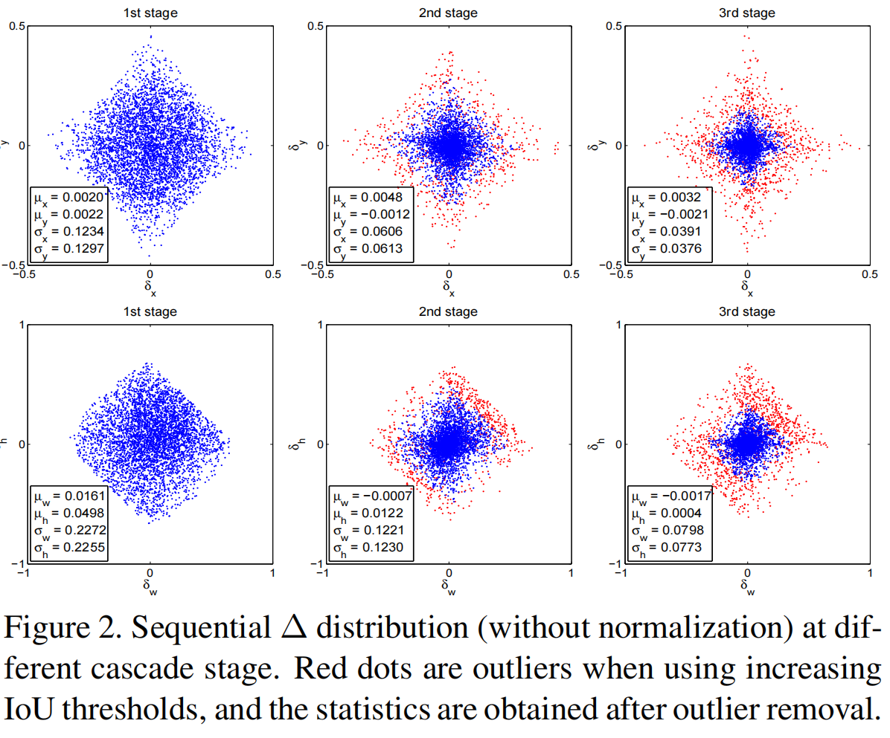

经过不同阶段的训练，$\Delta$ 的大概分布如图，红点表示增加 IoU 阈值之后的离群值，剔除之后得到的数据。

### Classification

分类器 $h(x)$ 的目标是将一张图像 $x$，预测为 M + 1 个类别中的一个类，因为分类对应的是一个 $M+1$ 维的向量，所以基于各个类别的后验分布函数 $h_k(x)=p(y=k|x)$ 得到对应的类别。$y$ 就是类别。假设给定训练集 $(x_i, y_i)$，最小化优化的目标是：
$$
R_{cls}[h]\sum_{i=1}^NL_{cls}(h(x_i), y_i)
$$
$L_{cls}$ 一般用交叉熵损失函数。

### Detection Quality

目标检测一般使用 IoU 确定正负样本集，如果与某个 ground true 的 $IoU >  u$，那么 hypotheses 可以认为是该 ground true 类下对应的一个正样本，那么 hypotheses 的类标签是$u$ 的函数：
$$
\begin{cases}
g_y, & IoU(x, g)\ge u \\
0,& \text{otherwise}
\end{cases}
$$
目标检测比较难搞的一个原因是，不管IoU阈值 u 如何设定，检测任务总是一个对抗互斥关系的（detection setting is highly adversarial）：

- $u$ 设置得高一点吧，正样本里 background 信息少，但对正样本的标准高了，正样本数量就少。
-  $u$ 设置得低一点吧，可以获得到更多样化，数量更多的正样本，训练的检测器就搞不定 close FP 。

另一种解决方案如 figure  3 (c)，集成若干个不同检测能力的检测分支，各个分支也设定不同的 $u$，损失函数也定位于学习各个分支的参数（optimized with a loss that targets various quality levels）：
$$
L_{cls}(h(x), y)=\sum_{u\in U}L_{cls}(h_u(x), y_u)
$$
$U：IoU$ 阈值集，如 $U = \{ 0.5, 0.55, ...,0.75 \}$，类似 *integral loss*，但可以发现各个分支是独立输出预测结果的，没有cascade的叠层进阶关系。最后融合各个分支的检测结果，得到最终的检测结果。

但此操作还是有这么个问题：IoU 阈值高的话，正样本依然不好收集，正负样本依然不平衡，就依然会对高 IoU 阈值下的检测分支产生过拟合。

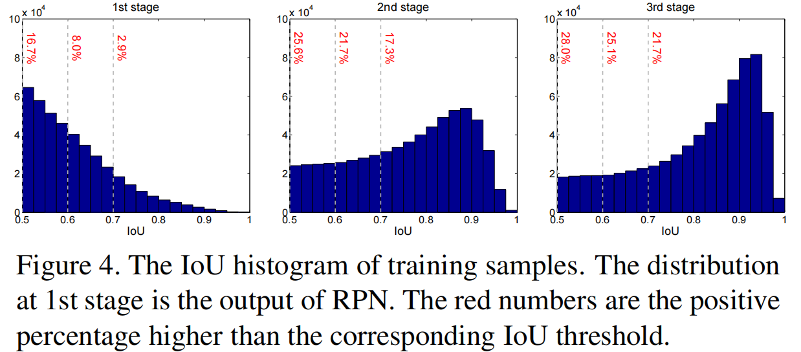

从 figure 4 中可以看到，1st-stage 输入 hypotheses 由 RPN 生成，质量比较低（大部分都是IoU：0.5 ~ 0.6之间），随着 IoU 阈值的提升，对应直方图数据分布就减少，如果依旧用这些 hypotheses 训练 *integral loss* 的各个高 IoU 阈值分支，经过 u 筛选之后，原先低 IoU 阈值的分支的正样本就分类到负样本了，正样本更少，正样本更加不均衡。

## Cascade R-CNN

Cascade R-CNN  的结构如下图所示：

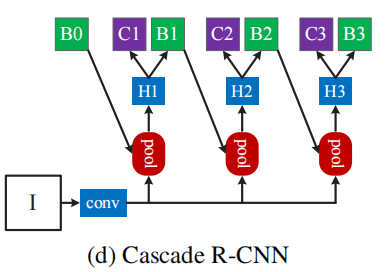

### Cascade BBox Regression

$$
f(x,\bold b)=f_T\circ f_{T-1}\circ\cdots\circ f_1(x, \bold b)
$$

$T$ 表示 Cascade RCNN 叠加的分支数；cascade 中每个分支 $f_t$ 通过各个分支上的训练数据 $\{ b_t \}$优化，$\{ b_t \}$ 来源于 $\{ b_1 \}$ 经过之前所有分支输出后的结果，而非直接使用 RPN 的初始分布 $\{ b_1 \}$ 来训练 $f_t$。；---- 这也是Cascade RCNN中经过进阶方式逐步提升hypotheses质量的精髓；

Cascade RCNN 与 iterative BBox 的不同之处在于：

1. iterative BBox 相当于一个提升检出 bbox 质量的后处理步骤，但 Cascade RCNN 中各个分支上的回归操作相当于在每一个阶段通过改变 hypotheses 的分布达到了**重采样**目的

2. Cascade RCNN 同时应用于 train + inference，两者实操过程在性能上不会有差异

3.  每个专门的检测分支 $\{ f_T，f_{T−1},\cdots ,f_1 \}$ 基于每个 stage 调整分布后的 hypotheses 进行训练，而 iterative BBox仅使用到了一个 **f** ，该 **f** 来自于 RPN 输出的初始化分布。

   优势：Cascade RCNN 随后的分支可以做更精细化的回归训练，预测也能得到更精准的定位结果，且不需要人为干预；

### Cascade Detection

如 figure 4(a)，RPN 输出的初始 hypotheses 质量还是比较低的，大部分都在 $u = 0.5 ~ 0.6$，Cascade RCNN 通过各个分支 cascade 式叠加达到对 hypotheses重采样的目的；同样受启发于figure 1(c)，三条彩色线都在 baseline 的灰色线之上，说明所有 $u$ 阈值下训练的检测器，输出的结果对于输入而言，性能还是有提升的。

给定初始hypotheses：$(x_i，\bold b_i)$，cascade 上检测分支对 $(x_i, \bold b_i)$ 一番操作，产生新的样本分布 $(x_i'，\bold b_i')$ 以适配更高 IoU 阈值下的检测分支，那么如 figure 4，经过每个 stage 的样本重采样工作，hypotheses 质量也变得越来越好，且即使 IoU 阈值和检测分支性能逐步提升，在所有 stage中正样本的数量大致保持在稳定范围内。

以上操作两个优势：

1. 不会出现因正样本过少带来的训练过拟合，如 fig 4，每个 stage 上正样本的数量都比较充足；
2. 更高 stage 上的检测分支使用更高 IoU 阈值下收集的样本训练，且从 fig 2 中可知，通过逐步提升的 IoU 阈值可以在各个 stage 上去除 outliers，就可以筛选到足够高质量的 hypotheses 用于训练各个分支；

每个 stage $t$，检测分支包含分类器 $h^t$ + 回归器 $f^t$，并使用 $IoU = u^t$ 阈值下收集的样本集，且 $u^t > u^{t−1}$，损失函数为：
$$
L(x^t, g)=L_{cls}(h_t(x^t), y^t)+\lambda[y^t\ge1]L_{loc}(f_t(x^t, \bold b^t), g)
$$
其中，$b^t = f^{t−1}(x^{t−1}, b^{t−1})$, $g$ 对应 $x^t$ 的 gt bbox，$λ = 1$ 表示权重因子； $[·]$ 表示只在正样本上算 reg loss，$y^t$就是 $x^t$ 按照公式 (5)和 $u^t$ 计算出的 label。

与公式(6)中 iterative BBox 的 loss 不同之处在于，公式 (7)、(8) 确保各个检测分支的检测质量逐步提升。

在预测阶段，hypotheses 随着 cascade 上各个检测分支的操作，质量逐步提升，且更高质量的 hypotheses 刚好对应基于更高 IoU 阈值训练的检测分支，最终就产生 fig 1(c)、(d)中检测性能越来越好的效果。

## Experiment

### Baseline Networks

三个baseline检测器：

1. Faster-RCNN：VGG作主干网；原始 frcnn 中 2nd-stage 的 Fast RCNN 有连个 fc 层，本文做了精简以减少参数数量，每个 fc 层输入 2048 个单元，无 dropout，128 RoIs / images；
2. R-FCN：ResNet作主干网；R-FCN 基于 ResNet 使用全卷积操作完成 分类 + bbox回归（Cascade RCNN 的 head 与之保持一致），无 OHEM，256 RoIs / images；
3. FPN：ResNet作主干网；使用了 RoIAlign，实验中表示为 FPN+，主干网 ResNet-50 用于消融实验，最终预测使用 ResNet-101，256 RoIs / images；

都使用原论文中默认训练参数，采用end2end训练；

### Quality Mismatch

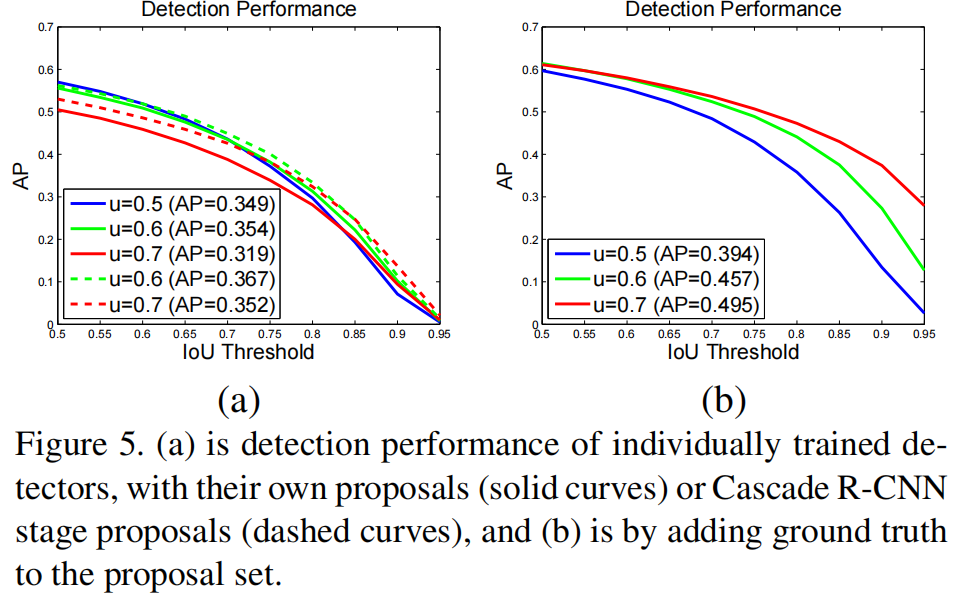

如 fig 5(a)，三个独立训练的检测器在阈值 U = { 0.5，0.6，0.7 }下的AP，可以发现 u = 0.5 下训练的检测器，在低 IoU 条件下性能优于 u = 0.6 下训练的检测器，但高 IoU 条件下 u = 0.6 的性能更好，u = 0.5 的检测器性能最差；---- **但终究都是IoU阈值越高，检测器的AP性能越差；**

fig 5(b)：改变了预测阶段 proposals 的质量：将 ground true bbox 也加入至 RPN 输出的初始化 proposals 中，可以发现所有阈值 u 下训练的检测器性能都有提升，且 u = 0.7 下性能提升最明显，说明两个问题：

1. u = 0.5下训练的检测器并不利于精准地检测目标，仅仅在低质量 hypotheses 下表现出色；
2. 若想得到高精度的检测结果，就需要 hypotheses 质量更能匹配上检测分支的质量；

fig 5(a)中虚线：将初始化的 proposals 替换为 Cascade R-CNN 中 2nd（u = 0.6）、3rd（u = 0.7）输出的更高质量proposals，**结果也说明了测试阶段当 proposals 的质量与检测器更匹配时，其性能会显著提升。**

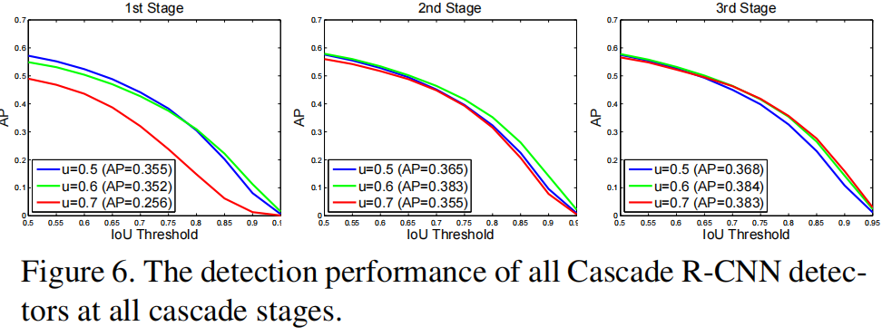

从 Cascade RCNN 的所有 stage 上做性能测试，得到的结果也大致类似，如 fig 6 中可知，当使用更高质量 hypotheses 时，各个检测器性能提升明显，特别是高 IoU 阈值下训练的检测分支，性能提升得更夸张；例如：u = 0.7的检测器在低质量 proposals 的 1st-stage 性能很差，但 2nd、3rd-stage 若输入了更高质量的 hypotheses，u = 0.7 的检测器性能提升也很明显；

此外，对比 fig 6 与 fig 5(a)，尽管使用了相同的 proposals，fig 6 中基于 cascade 方式进阶训练的检测器，性能明显优于 fig 5(a) 中各个分支独立训练的检测器，这充分说明了，Cascade RCNN 这种通过进阶 boosting 改变训练数据分布的方式，训练的检测器性能更好；

### Comparison with Iterative BBox and Integral Loss

我们比较了我们的方法和 Iterative BBox、Integral Loss 方法。Iterative Loss 方法是使用 FPN+ 持续迭代三次实现。Integral Loss 有相同数量的 heads，分别对应 $U=\{0.5, 0.6, 0.7\}$

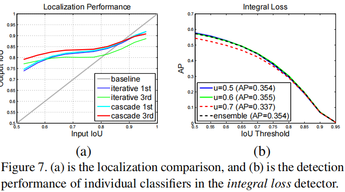

**Localization**

fig 7(a)：Iterative BBox 与 Cascade RCNN 在定位性能上的比较；

Iterative BBox 中，1st-stage 在高 IoU 的 hypotheses 输入时，其输出性能竟然下降了（低于 baseline 的灰色线），且在 iterative BBox 的 3rd-stage 分支下，其性能进一步下降。但 Cascade RCNN 中 3rd-stage 性能优于 1st-stage，且在所有输入 IoU hypotheses 情形下，输出的 hypotheses 性能都优于 Iterative BBox；

**Integral Loss**

Integral Loss Detector：与 Cascade RCNN 相同数量的 cls heads，性能如 fig 7(b)；u = 0.6 下检测器性能最好，u = 0.7 下性能却最差，且即使所有检测器 ensemble，性能也没显著提升；

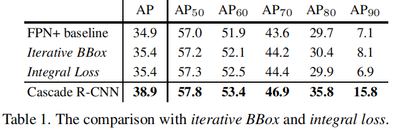

Table 1 中，iterative BBox / integral loss / Cascade RCNN 三者性能都优于 FPN+的baseline，且随着 AP 标准的提升，Cascade RCNN 的领先优势更明显；

### Ablation Experiments

**Stage-wise Comparison**

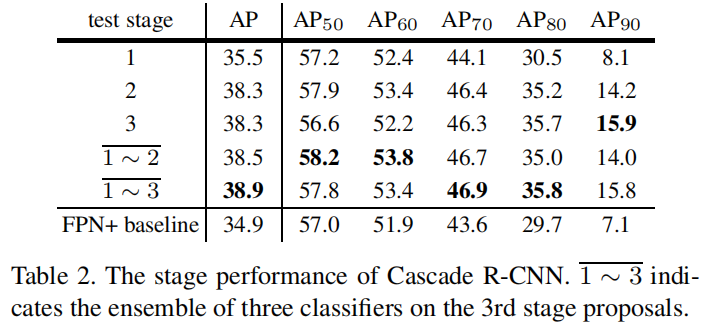

table 2 为针对 stage 的消融实验，可以发现仅融合 1st-stage 性能就优于 baseline（受益于 multi-stage multi-task 的训练方式），2nd-stage、3rd-stage 也可以进一步提升性能，并且可以发现不同于 integral loss，更高的 IoU 检测分支，性能是提升的；最终三个检测分支 ensemble 后性能最好；

**IoU Thresholds**

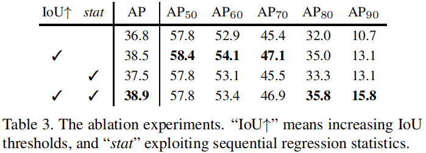

row 1：baseline版Cascade RCNN，所有检测分支的head使用同样IoU下收集的样本训练，各个stage的差异就仅体现在输入hypotheses的差异上（参照fig 1(c)、fig 2，各个stage输入还是有区别的，但大致与fig 2中一致）；但从row 1中可以看到，尽管各个分支在同IoU下收集的样本，但cascade结构还是提升了baseline性能，充分证明了cascade结构之优越性；

row 2：通过进阶提升IoU阈值 u 的方式，各个分支可以获得更多的close FP用于训练，进而可以提升更多的检测精度，结果与4.2小节分析保持一致；

**Regression Statistics**

如 fig 2，进阶地探索回归的统计结果有利于 cls + reg 的 multi-task 学习，从 table 3 中也可以看到该方案的优势，但作者提到：The learning is **not sensitive** to these statistics，为什么我觉得还是有区别的？

**Number of Stages**

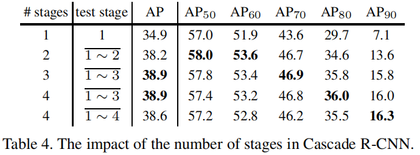

table 4 中针对 stage 的消融实验，对比 baseline，增加一个 stage 性能提升明显 (34.9% -> 38.2%)，增加两个 stage 性能提升更明显，但增加三个 stage（u = 0.75）性能却还下降了，此外可以发现 4th-stage 的 AP 性能尽管降低了，但却在AP90下性能依然是最好的；

总结下来，3-stage 是性能 / 速度的最佳 trade-off；

### Comparison with the Sota

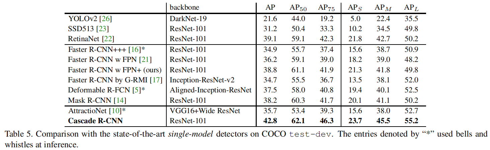

table 5，Cascade RCNN + FPN+ + ResNet-101 的 single-model 检测器，RoIs 数量：512；

table 5 中group 1：1-stage检测器；group 2：2-stage；group 3：3-stage；所有其他检测器在 u = 0.5阈值下训练，从frcnn + FPN+ 拓展成 Cascade RCNN，性能提升 4% (38.8% -> 42.8%)，从table 5中可以发现，Cascade RCNN 在 single-model 下，各个指标都是 sota；

AttractioNet：multi-stage，通过 Iterative BBox 生成 proposals，但性能还是比 Cascade RCNN 差了 7.1%，且 Cascade RCNN 不像 Mask R-CNN 那样，还需要使用分割的监督信息；

### Generalization Capacity

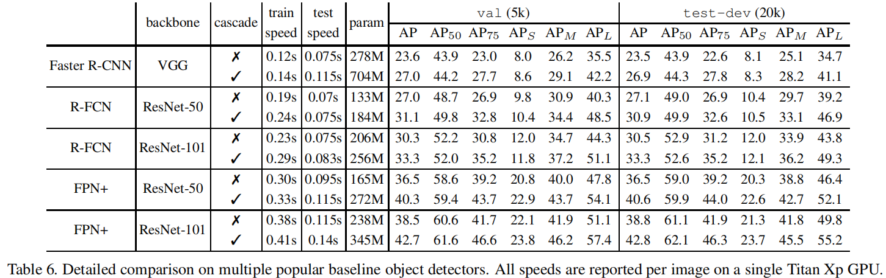

Faster RCNN、R-FCN、FPN+上都添加了3-stage的Cascade R-CNN结构，性能对比如table 6；

**Detection Performance**

从 table 6 中可以发现，添加 Cascade RCNN 结构后，三个 baseline 都能在 val / test-dev 上获得 2 ~ 4% 的性能提升，充分说明 Cascade RCNN 的普适性。

**Parameter and Timing**

随着 cascade 检测分支数量的增加，模型的参数也会增大，但对于 baseline head 来说，**检测分支数量增加带来的模型参数增加却是线性的**，此外各个检测分支的计算量一般远远小于 RPN 层，因此 train / test 阶段，Cascade RCNN 的计算量带来的额外开销都比较少；

## Conclusion

1. 我们提出了一个 two-stage 的目标检测框架，Cascade R-CNN，用于检测高质量的 proposal
2. 这个架构避免了训练过程中过拟合和推理过程中 quality mismatch 的问题
3. Cascade RCNN 在 COCO 上的高性能充分说明，通过理解和掌握影响目标检测的各种小因素，并作出一丢丢小改进，也会有很大的性能提升空间；
4. 本文算法可以应用在更多目标检测算法上，可以作为一个很好的 baseline