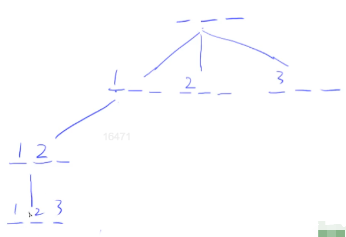
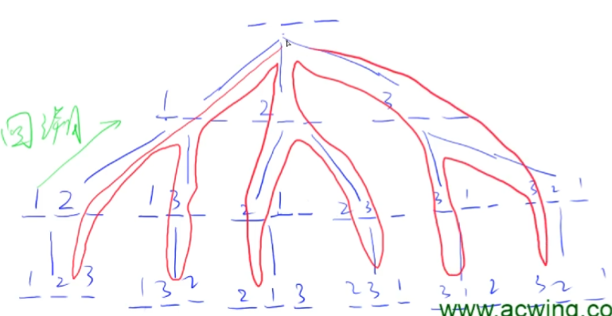

# Chapter3 Search and Graph

## DFS

> 深度优先搜索

每次先从深度的方向开始搜索，走到头之后开始回溯继续搜。（*注：边回头比看还能不能往深度搜索，如果可以则继续搜，否则回溯）

数据结构：栈

空间复杂度：$O(h)$（$h$ 为高度）

性质：不具有最短性

剪枝：提前判断某些节点不符合要求，直接从这个位置开始回溯，不用搜索多余的节点。

### 排列数字问题（Acwing 842）

#### 问题描述

给定一个序列的数字，要求输出这个序列数字的全排列

#### 分析

如何用DFS来做？
DFS最重要地需要考虑的问题就是**顺序**（暴力搜索），主要就是要想清楚搜索的顺序，

一个什么样的顺序来把一个题目的方案全部遍历一遍，用什么样的顺序遍历所有的方案。不同的题目搜索的顺序不一样

DFS对应的搜索流程就是一个树，太抽象可以先画一个棵树。**DFS本质其实就是递归。**

这里的搜索顺序是：

假设我们以及有三个空位了，从第一位开始填，从前往右一位一位填，每次填的数字和前面的数字不一样就可以了。

最开始的时候三个都是空的，第一位一共有三种填法，对应了三种分支。
第一位有3种不同的填法，不同的填法会走到不同的分支去。


第一个位置填完了就继续往下搜第二个位置，也有三种方案，但是DFS会先一路走到底，然后再后来遍历后续的情况。



一直往下走，直到得到答案就输出。走到底之后会往回退一步，虽然有一位可以填，但这一位只能填走，所以也没有分支，所以继续往回走。

**他是什么怎么往回走的？**

第二位可以继续填3，同理可得答案。 不断回溯...搜索顺序可以看成一棵树。


DFS并不会真的存一棵树，而是**存遍历的路径，回溯的时候就没了**，利用系统的递归来帮我们回溯和存储。

*注意：回溯的时候要注意一点——**恢复现场**

进行回溯的时候要保障原来的状态，也就是要保存好原来的状态，不能在上一次往下走之后准备要回来了但是原来的状态不见了那就回溯不了了。




## BFS

> 宽度优先搜索

一层一层搜索，对于每一条路径都会探索。每次都会拓展一层。

数据结构：队列

空间复杂度：$O(2^h)$

性质：具有最短性，具有最短路。

按距离远近开始搜索，从距离起点距离为 1 的位置开始搜索。逐步往外扩散，对于每一条路径都记录距离起点的距离，从起点开始，以此由 0，1，2，3，4，5，6.....，n 直到无法搜索为止。类似于一个向外扩散的过程。

:::info

DP 问题和最短路问题可以看成一类问题，DP 是特殊的最短路的问题，没有环存在的最短路问题。

边权都为 1 时才能用最短路。

:::

算法思路：

1. 初始状态放入队列
2. 当队列不为空时遍历
3. 每次拿出队头，扩展队头

## 树和图DFS

树和图的存储方式：

树是一种特殊的图，无环，连通。

两种存储方式：

:::tip

稠密图：边多。

稀疏图：边少的图。

:::

1. 有向图

   - 建立一条边即可，a 到 b。

   - 邻接矩阵（二维数组 g[a,b]）（稠密图）

   - 邻接表（单链表，与拉链哈希类似，每个点都是单链表）（稀疏图）

     

2. 无向图（特殊的有向图，考虑有向图即可）

   - 建立两条边，a 到 b 和 b 到 a。

模板代码

```cpp
const int N = 1e5 + 10, M = N * 2;
int h[N], e[N], ne[N], idx;
// dfs
bool st[N];  // 存储遍历过的点

void add(int a, int b) { e[idx] = b, ne[idx] = h[a], h[a] = idx++; }
void dfs(int u) {
    st[u] = true;  // 标记一下，表示搜索过了
    for (int i = h[u]; i != -1; i = ne[i]) {
        int j = e[j];
        if (!st[j]) dfs(j);
    }
}
int main() {
    memset(h, -1, sizeof h);
    dfs(1);
    return 0;
}
```

## 树和图BFS

存储方式与上述一样。

算法思路：

1. 初始状态放入队列
2. 当队列不为空时遍历
3. 每次拿出队头，扩展队头所有的邻点
4. 判断是否遍历（只有第一次遍历才是最短路）
5. 插入到队列，移动方向

模板代码：

```cpp
const int N = 1e5 + 10;

int n, m;
int h[N], e[N], ne[N], idx;
int d[N], q[N];

void add(int a, int b) {
    e[idx] = b;
    ne[idx] = h[a];
    h[a] = idx++;
}

int bfs() {
    int hh = 0, tt = 0;
    q[0] = 1;
    memset(d, -1, sizeof d);

    d[1] = 0;

    while (hh <= tt) {
        int t = q[hh++];
        for (int i = h[t]; i != -1; i = ne[i]) {
            int j = e[i];
            if (d[j] == 1) {
                d[j] = d[t] + 1;
                q[++tt] = j;
            }
        }
    }
    return d[n];
}

int main() {
    cin >> n >> m;

    memset(h, -1, sizeof h);

    for (int i = 0; i < m; i++) {
        int a, b;
        cin >> a >> b;
        add(a, b);
    }

    cout << bfs() << endl;

    return 0;
}
```

:::info 经典应用

求解拓扑序列（BFS 应用，有向图）

:::

## 拓扑排序

拓扑序列：若一个由图中所有点构成的序列 $A$ 满足：对于图中的每条边 $(x,y)$，$x$ 在 $A$ 中都出现在 $y$ 之前，则称 $A$ 是该图的一个拓扑序列。（所有的边都是从前指向后面的）

:::tip 性质：

1. 有向无环图一定存在拓扑序列，拓扑图。
2. 一个有向无环图一定至少存在一个入度为 0 的点。

:::

入度为 0 作为起点，说明没有任何节点指向该节点，所以可以作为出发点。没有一个点在这个点后面，排在最前面。

算法思想：

1. 所有入度为 0 的点，进入队列
2. 当队列不为空时遍历
3. 每次拿出队头，枚举 t 的所有的出边
4. 删除掉出边，d[j]-- 表示路减少
5. 如果 d[j] == 0 说明已经 j 前面所有的点都已经放好了。
6. j 入队


```cpp
int n, m;
int h[N], e[N], ne[N], idx;
int q[N], d[N];

bool topsort() {
    int hh = 0, tt = -1;
    q[0] = 1;

    for (int i = 1; i <= n; i++) {
        if (!d[i]) q[++tt] = i;
    }
    while (hh <= tt) {
        int t = q[hh++];
        for (int i = h[t]; i != -1; i = ne[i]) {
            int j = e[i];
            d[j]--;
            if (d[j] == 0) q[++tt] = j;
        }
    }
    return tt == n - 1;
}
```

## 最短路

:::tip

源指起点，汇指终点。约定 $n$ 表示点数，$m$ 表示边数。

:::

- 单源最短路（一个点到所有点的最短路）

  - 边权为正数

    - 朴素 Dijkstra 算法 $O(n^2)$（常用于稠密图）

    - 堆优化 Dijkstra 算法 $O(m\log n)$ （常用于稀疏图）

  - 存在负权边
    - Bellman-Ford 算法 $O(mn)$ （经过的边数小于等于 k 的最短路）
    - SPFA 算法 $O(m)$ 

- 多源汇最短路（多个点到所有点的最短路） Flyord 算法 $O(n^3)$

### Dijkstra

朴素 Dijkstra：


堆优化 Dijkstra：

### bellman-ford

### spfa

### Floyd

## 最小生成树

### Prim

### Kruskal

用于求解最小生成树问题，算法步骤如下:

1. 将所有的边按照权重从小到大排序 O(nlogn)
2. 枚举每条边ab，权重是c
    + 如果ab不连通，将这条边加入集合中(并查集简单应用)

## 二分图判定

## 匈牙利算法
