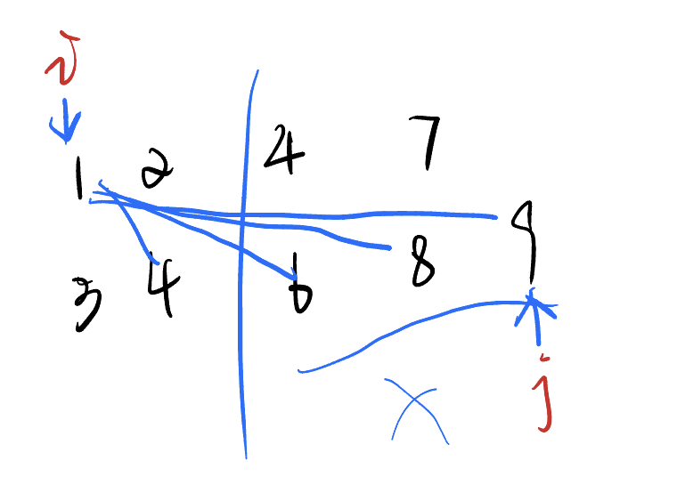

# 800. 数组元素的目标和

:::caution

原题链接：[https://www.acwing.com/problem/content/802/](https://www.acwing.com/problem/content/802/)

:::

## 思路

先写暴力写法，然后优化暴力。

设目标值为 $x$

由题目可以知道，这个序列是升序的，所以当固定一个指针 $i$，移动另一个指针 $j$ 的时候，如果相加起来比 $x$ 大，说明 $j$ 往后的不可能找到 $x$（因为一个 $A$ 中最小的数加上一个 $B$ 中最大的数都比 $x$ 大，那么不可能在 $A$ 中找到另一个数加起来比 $x$ 小），所以 $j$ 要往前找，**故可以想到指针从后往前移动。**只有当相加起来比 $x$ 小的时候，说明此处 $j$ 指向的就是最接近 $x$ 的值，那么固定指针 $i$ 就可以向前移动了。



换句话说，只要相加起来还比目标值要大，那么就继续往前，也就是 `j--`。

## 代码

暴力：

```cpp
#include <bits/stdc++.h>

using namespace std;

const int N = 1e5 + 10;

int n, m, x;
int a[N], b[N];


int main() {
    cin >> n >> m >> x;
    
    for (int i = 0; i < n ;i++ ) cin >> a[i];
    for (int i = 0; i < m; i++) cin >> b[i];
    
    int flag = 0, p1, p2;
    for (int i = 0, j = 0; i < n; i++) {
        for (int j = 0; j < m; j++) {
            if (a[i] + b[j] == x) {
                p1 = i, p2 = j;
                break;
            }
        }
    }
    cout << p1 << " " << p2 << endl;
    
    
    return 0;
}
```

双指针优化：

```cpp
#include <bits/stdc++.h>

using namespace std;

const int N = 1e5 + 10;

int n, m, x;
int a[N], b[N];


int main() {
    cin >> n >> m >> x;
    
    for (int i = 0; i < n ;i++ ) cin >> a[i];
    for (int i = 0; i < m; i++) cin >> b[i];
    
    int flag = 0, p1, p2;
    for (int i = 0, j = m - 1; i < n; i++) {
        while (j >= 0 && a[i] + b[j] > x) j--;
        if (j >= 0 && a[i] + b[j] == x) {
            p1 = i, p2 = j;
            break;
        }
    }
    cout << p1 << " " << p2 << endl;
    
    
    return 0;
}
```

