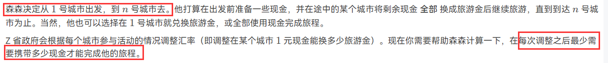

# 3.1 森森旅游

:::caution

原题链接：[https://pintia.cn/problem-sets/994805046380707840/problems/1386335159927652364](https://pintia.cn/problem-sets/994805046380707840/problems/1386335159927652364)

:::

## 思路

看到题目，可以发现大概确定是图论题，往图论的算法想。题目问的是最少需要带多少现金可以经过所有的城市（其实也就是找到到达哪一个城市之后开始兑换旅游金使得携带的现金最少），也就是说，在一个图中经过所有的点后，边权和最小，也就是**最短路问题**。



可以看到，城市为节点，路径为边，边的权为现金或者旅游金。

那么我们可以先求出只使用现金和只使用旅游金到达所有城市的最小花费。

:::info

因为现金可以换出多个旅游金，所以才会有携带的最少现金，因为中间可以换旅游金，也就是我不需要带那么多现金了，然后题目问的就是要最少要携带多少现金。

:::

这样我们就可以得到到达第 $i$ 个点所需要花费的现金。然后再求从第 $i$ 个点到 第 $n$ 个点所需要的旅游金数量，将其转换为现金，加上到达第 $i$ 点的花费的现金，也就是**得到在第 $i$ 个城市将现金换成旅游金的情况下所需要的现金总额。**

得到原来的现在总额之后，只需要根据调整的方案重新计算所需要的现金即可。

算法流程：

1. 确定为最短路问题
2. 题目求携带的最少现金，则求出到达每一个城市总共花费的最小现金和从第 $i$ 个点到达终点需要花费的旅游金（此处为反着建图即可）
3. 对现金正着建图，对旅游金反着建图
4. 求现金和旅游金的最短路
5. 根据当前汇率存储到达第 $i$ 个城市需要的最小现金和从第 $i$ 个城市到终点需要的最小旅游金；将旅游金转换为现金加上到达第 $i$ 个城市的最小现金得到携带现金总额。
6. 调整对应城市的汇率，按照 step5 重新计算现金总额，输出第一个即可。

## 代码

```cpp
#include <bits/stdc++.h>

using namespace std;

typedef long long ll;
typedef pair<ll, int> PII;

const int N = 1e5 + 10, M = 4e5 + 10;
const ll INF = 0x3f3f3f3f3f3f3f3fll;

int n, m, q;
int hc[N], hd[N], e[M], ne[M], w[M], idx;

int r[N];
bool st[N];
ll distc[N], distd[N];

void add(int h[], int a, int b, int c) {
    e[idx] = b;
    w[idx] = c;
    ne[idx] = h[a];
    h[a] = idx++;
}

void dijkstra_c() {
    memset(distc, 0x3f, sizeof distc);
    memset(st, 0, sizeof st);

    priority_queue<PII, vector<PII>, greater<PII>> heap;
    heap.push({0, 1});
    distc[1] = 0;

    while (!heap.empty()) {
        auto t = heap.top();
        heap.pop();

        int ver = t.second;

        if (!st[ver]) {
            st[ver] = true;
            for (int i = hc[ver]; i != -1; i = ne[i]) {
                int j = e[i];
                if (distc[j] > distc[ver] + w[i]) {
                    distc[j] = distc[ver] + w[i];
                    heap.push({distc[j], j});
                }
            }
        }
    }
}

void dijkstra_d() {
    memset(distd, 0x3f, sizeof distc);
    memset(st, 0, sizeof st);

    priority_queue<PII, vector<PII>, greater<PII>> heap;
    heap.push({0, n});
    distd[n] = 0;

    while (!heap.empty()) {
        auto t = heap.top();
        heap.pop();

        int ver = t.second;

        if (!st[ver]) {
            st[ver] = true;
            for (int i = hd[ver]; i != -1; i = ne[i]) {
                int j = e[i];
                if (distd[j] > distd[ver] + w[i]) {
                    distd[j] = distd[ver] + w[i];
                    heap.push({distd[j], j});
                }
            }
        }
    }
}

int main() {
    freopen("in.txt", "r", stdin);
    memset(hc, -1, sizeof hc);
    memset(hd, -1, sizeof hd);

    cin >> n >> m >> q;
    while (m--) {
        int u, v, c, d;
        cin >> u >> v >> c >> d;
        add(hc, u, v, c), add(hd, v, u, d);
    }

    dijkstra_c();
    dijkstra_d();

    multiset<ll> s;

    for (int i = 1; i <= n; i++) {
        cin >> r[i];
        if (distc[i] != INF && distd[i] != INF) {
            // ? dont understand
            s.insert(distc[i] + (distd[i] + r[i] - 1) / r[i]);
        }
    }

    while (q--) {
        int idx, a;
        cin >> idx >> a;
        if (distc[idx] != INF && distd[idx] != INF) {
            // ? dont understand
            s.erase(s.find(distc[idx] + (distd[idx] + r[idx] - 1) / r[idx]));
            r[idx] = a;
            // ! update the rate
            s.insert(distc[idx] + (distd[idx] + r[idx] - 1) / r[idx]);
        }
        cout << *s.begin() << endl;
    }

    return 0;
}
```

