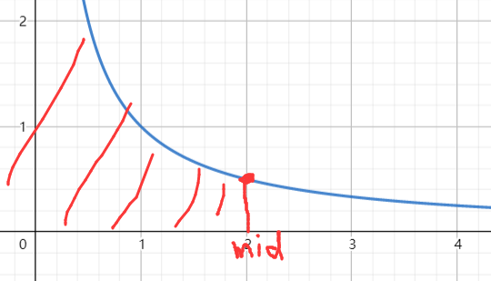

# 1227.分巧克力

:::tip

原题链接：[https://www.acwing.com/problem/content/1229/](https://www.acwing.com/problem/content/1229/)

:::

## 思路

二分。一切单调的都可以二分。（本质上是数学题）

:::info

以后遇到什么分东西的，基本可以往二分的方向想。

:::

解题流程：

- 本题从数学角度上分析可以看出，边长越长，块数越少。
- 求解可以切出多少块，相当于设切成边长为 x 的块，那么可以切出来的数量就是 $[\frac{H_i}{x}\times\frac{W_i}{x}]$，随着切出来的边长越长，块数就少。
- 相当于找到分得的块数 $f(x)\ge k$，k 为块数，找到 k 最大的时候取得的 x 就是所求解。

二分流程：

- 当 `check(mid) >= k`成立时

  

  因为是**单调递减**的，所以所有小于 mid 的数都是成立的，所以只需要把区间左边界更新到 mid 即可（$l = mid$）。不然则说明 mid 的右侧都是不满足答案的区间，所以可以把由区间更新成 mid - 1（$r = mid - 1$）。

  因为 l 是更新成 mid，一般来说要更新 mid + 1，所以现在 + 1 写到求 mid，故 `l + r + 1 >> 1`。

## 代码

```cpp
#include <bits/stdc++.h>

using namespace std;

const int N = 1e5 + 10;

int n, k;
int h[N], w[N];

bool check(int x) {
    int res = 0;
    for (int i = 0; i < n; i++) {
        res += (h[i] / x) * (w[i] / x);
        if (res >= k)   return true;
    }
    return false;
}

int main() {
    
    cin >> n >> k;
    
    for (int i = 0 ; i< n ; i++) cin >> h[i] >> w[i];
    
    int l = 0, r = N;
    while (l < r) {
        int mid = l + r + 1 >> 1;
        if (check(mid)) l = mid; 
        else r = mid - 1;
    }
    cout << r << endl;
    
    return 0;
}
```

