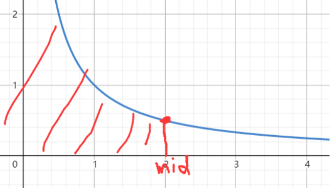

# 2226.每个小孩最多能分到多少糖果

:::tip

原题链接：[https://leetcode-cn.com/problems/maximum-candies-allocated-to-k-children/](https://leetcode-cn.com/problems/maximum-candies-allocated-to-k-children/)

:::

## 思路

分堆、分块问题，基本用二分解决。

解题思路：

- 可以看成每堆糖果可以分成 x 堆，因为分堆分得越多，每个小孩得到的糖果数量就少。

  

- 只要满足 $f(x)=\frac{candies[i]}{x}\ge k$ 时，找到 $f(x)$ 最大时， x 的取值就是题目所求解。

## 代码

```cpp
class Solution {
public:
    typedef long long ll;
    bool check(int x, vector<int>& candies, long long k) {
        ll res = 0;
        for (int i = 0; i < candies.size(); i++) {
            res += (candies[i] / x);
            if (res >= k) return true;
        }
        return false;
    }

    int maximumCandies(vector<int>& candies, long long k) {
        ll l = 0, r = 1e7 + 10;
        while (l < r) {
            ll mid = (l + r + 1) >> 1;
            if (check(mid, candies, k)) l = mid;q
            else r = mid - 1;
        }
        
        return r;
    }
};
```

