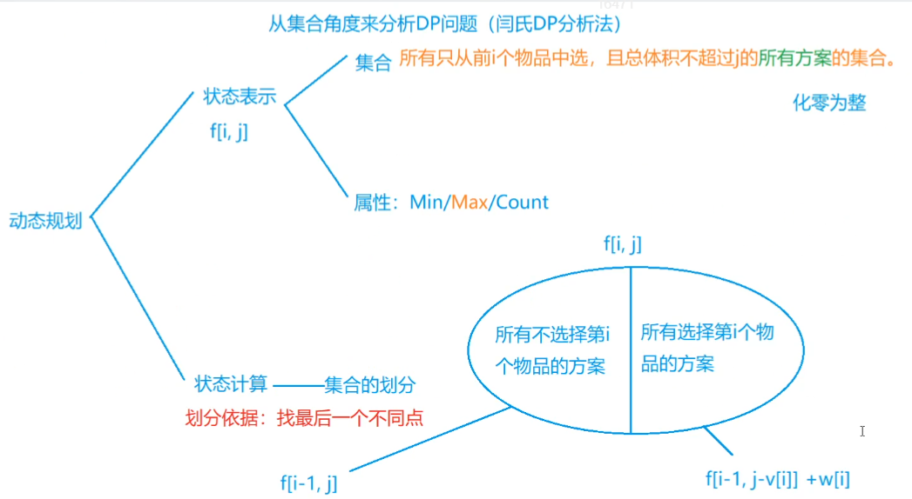

# 2.01背包问题

:::tip

原题链接：[https://www.acwing.com/problem/content/2/](https://www.acwing.com/problem/content/2/)

:::

## 思路

:::caution

DP 一般可以从集合角度来分析问题，闫式 DP 分析法。

:::



动态规划一般求解流程：

- 将所有方案同时减小（所有人减去同一个数最大值不变）
- 找到最大值
- 最大值 + i (属性)

这样思考的主要关键就是把方案和属性分开，只要我确定了方案是什么，只要加上对应的属性即可。

确定好 f 数组的含义。

## 代码

```cpp
#include <bits/stdc++.h>

using namespace std;

const int N = 1e3 + 10;

int n, m;
int v[N], w[N];
int f[N][N];

int main() {
    
    cin >> n >> m;
    
    for (int i = 1; i <= n; i++) cin >> v[i] >> w[i];
    
    for (int i = 1; i <= n; i++) {
        for (int j = 1; j <= m; j++) {
            if (j < v[i]) {
                f[i][j] = f[i - 1][j];
            } else {
                f[i][j] = max(f[i - 1][j], f[i - 1][j - v[i]] + w[i]);
            }
        }
    }
    cout << f[n][m] << endl;
    
    return 0;
}
```


简写：

```cpp
#include <bits/stdc++.h>

using namespace std;

const int N = 1e3 + 10;

int n, m;
int v[N], w[N];
int f[N];

int main() {
    cin >> n >> m;
    
    for (int i = 0; i < n; i ++ )
    {
        int v, w;
        cin >> v >> w;
        for (int j = m; j >= v; j -- )
            f[j] = max(f[j], f[j - v] + w);
    }
    cout << f[m];
    return 0;
}
```

