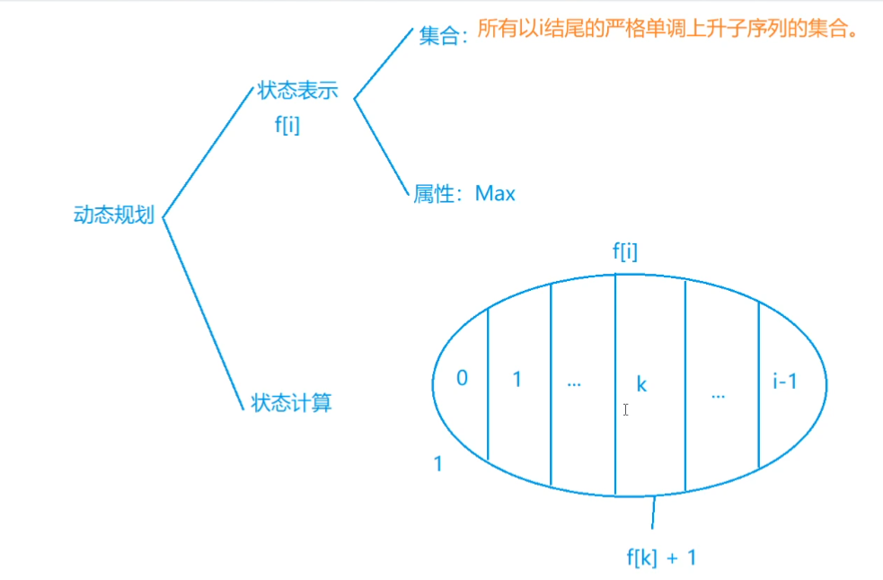

# 895.最长上升子序列

:::tip

原题链接：[https://www.acwing.com/problem/content/897/](https://www.acwing.com/problem/content/897/)

:::

## 思路

状态表示：

- f[i]
  - 集合：（问的是什么集合的含义就是什么，所有以 i 结尾的xxxxxx的集合）所有以 i 结尾的严格单调上升子序列集合。
  - 属性：最长，也就是最大值

划分子集的依据：找划分子集的不同点。（自己本身或者前一个）

用集合的角度来思考。



## 代码

```cpp
#include <bits/stdc++.h>

using namespace std;

const int N = 1e3 + 10;

int n;
int f[N], a[N];

int main() {
    
    cin >> n;
    
    for (int i = 1; i <= n; i++) cin >> a[i];
    
    int res = 0;
    
    for (int i = 1; i <= n; i++) {
        f[i] = 1;
        for (int j = 1; j < i; j++) {
            if (a[i] > a[j]) f[i] = max(f[i], f[j] + 1);
        }
        res = max(res, f[i]);
    }
    
    cout << res << endl;
    
    return 0;
}
```


