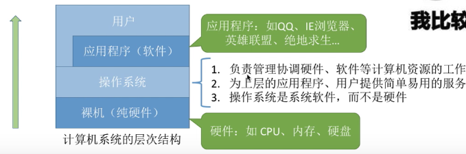
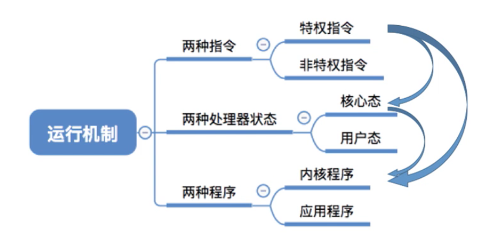
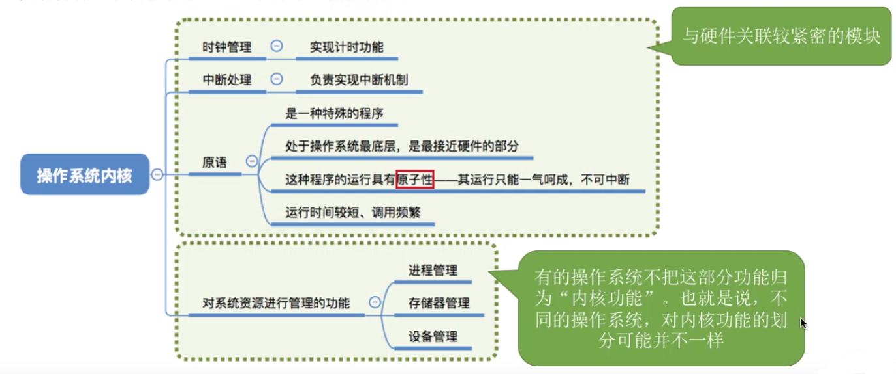
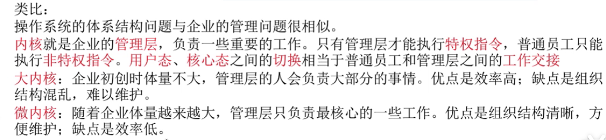
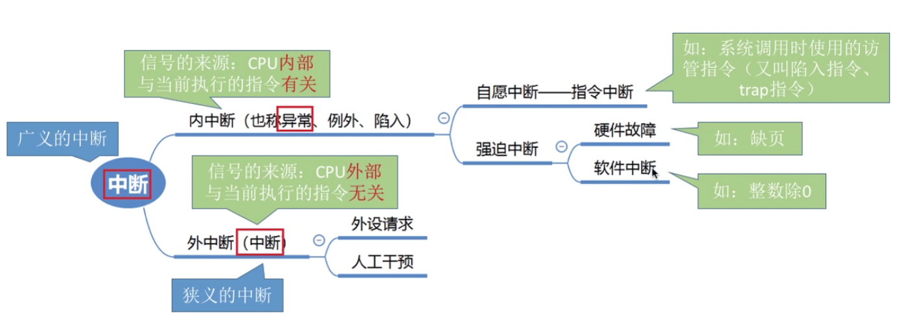
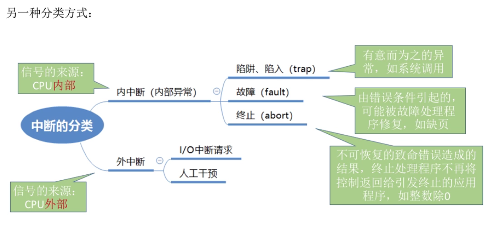

# 操作系统基础概念

## 概念

:::note 

一定要清楚操作系统是一种**系统软件**。学习操作系统的时候可以结合自己平时日常使用操作系统的经验来理解、记忆和应用，真正做到学以致用。

:::

概念图:

操作系统主要是有以下三个方面的定义：

1. 负责管理和协调硬件、软件等计算机资源的工作（控制和管理整个计算机系统的硬件和软件资源，对计算机的工作进行调度和资源的分配）
2. 是一种能够为上层用户、应用程序提供简单易用的服务（给用户和其他软件提供方便的接口和环境）
3. 是一种**系统软件**

## 功能和目标

1. 服务用户——操作系统作为用户提供接口和公共服务程序
2. 进程交互——操作系统作为进程执行的控制者和协调者
3. 系统实现——操作系统作为扩展器或者虚拟机
4. 资源管理——操作系统作为资源的管理者和控制者

## 操作系统四大特征

### 并发

并发概念：指两个或者多个事件在同一时间间隔内发生，宏观上是同时发生，微观上是交替切换发生。

并行概念：指两个或者多个事件在同一时间时刻发生。

### 共享

:::tip

失去并发性，系统中只有一个程序在运行，不能跟其他程序共享，故共享性失效。

失去共享性，不同程序之间不能同时访问资源，不能同时执行不同的程序，这样程序失去了并发性。

:::

共享概念：共享意思为资源共享，操作系统中的资源被多个并发执行的程序共同使用。

资源共享的方式：主要分为两种，**互斥共享** 和 **同时访问**。

1. 互斥：一个时间段内只允许一个进程访问该资源。
2. 同时访问：一个时间段内允许多个进程同时对资源进行访问。

### 虚拟

:::tip

没有并发性就谈不上虚拟性

:::

虚拟概念：把一个物理上的实体变成若干个逻辑上对应的物体。物理实体是实际存在的，而逻辑上的物体是用户感受到的。

### 异步

:::tip

失去并发性，系统只能串行执行程序，当程序执行完毕后才会归还，只有系统具有并发性，才能有异步性。

:::

异步概念：异步是指在多道程序环境下，允许多个程序并发执行，但资源有限，进程的执行是走走停停的，不连贯的，以不可预知的速度向前推进。

## 三种基本操作系统及特征

1. 批处理操作系统

   批量集中处理多道程序，多道程序运行，作业脱机工作

2. 分时操作系统

   具有同时性、独立性、及时性、交互性

3. 实时操作系统

   提供即时响应和高可靠性

## 运行机制和体系结构

### 运行机制

OS 你可以分成不同的类别进行描述：

- OS 上运行的是接近计算机底层的指令，指令包括特权指令和非特权指令。特权指令是只能由 OS 程序来调用的指令，非特权是可以提供给用户程序或者 OS 来调用的指令。要判断哪些指令是特权指令和非特权指令就要引入 CPU 的状态

- OS 在 CPU 上运行，OS 会与CPU进行一系列相关的操作，但由于 CPU 的资源有限，所以就产生了两种 CPU 状态——核心态和用户态。核心态指程序在 CPU 当中需要执行特权指令（非特权也可）。用户态指此时程序只需要执行非特权指令。

  > 状态是通过 PSW 程序状态字寄存器来记录，通过标志位来标识当前 CPU 状态。

### OS 程序

OS 本质上也是一个程序，但是包含了很多种程序，你可以划分为如下两种

> - 为什么要这样划分？
>   1. 为了保证 OS 的安全，避免因为用户的误操作导致整个系统瘫痪，不让用户接触到计算机底层的操作。
>   2. 方便管理

- 内核程序

  内核程序，简称内核，是专门管理整个 OS 的，能够运行特权指令和非特权指令（在核心态运行）

- 应用程序

  应用程序，顾名思义，最接近用户层的程序，这部分主要是给用户来使用的程序，只能执行非特权指令。（在用户态运行）

### 体系结构

因为内核程序和应用程序有着很大的区别，所以你需要对这种两种程序进行分类。所以我们要对 OS 进行划分。应用程序的特征是即使没有这个程序 OS 也是能正常工作，内核程序的特征则是必须要这些程序，OS 才能工作。故你就可以把计算机系统划分为如下结构：

OS 可以划分为两层

- 一层为非内核功能，主要包括用户使用的程序。

- 一层为内核，内核（**底层软件**）主要负责管理 OS 最核心的程序，最接近硬件层的程序。像时钟管理、中断处理等，这些操作都是 OS 最基本的操作，没有这些操作 OS 就无法运行。计算机也就无法运行。

  

## 中断

中断是**并发程序**的基础！！因为中断相当于打断了原本程序的执行顺序，原本你是1，2，3这样运行，但是引入中断之后变成了1，2，5，4，6，3。这样操作程序能够让程序**并发执行（宏观上是可以看成一起在运行，微观上其实就是两个程序之间以极快的速度进行切换执行）**。

### 中断处理

发生中断执行的操作：

1. 每执行一条指令，CPU 检查是否有外部中断信号。

2. CPU 收到进程1 中断信号，CPU 状态需要进入核心态来处理中断信号。（发生中断意味着操作系统需要介入处理）

3. 保存进程1 的状态（各种参数），包括：PSW、PC、各种寄存器的值。（保存是为了中断结束之后能够继续执行进程1）
4. OS 用完进程1 的时间片，进入进程2 的时间片，处理不同的中断信号。
5. 恢复进程1 的状态，直到执行完毕。

> **使得 CPU 状态从用户态到核心态只能通过中断实现。**
>
> **核心态到用户态通过执行特权指令使得 PSW 的标志位设置为 用户态 即可**

### 中断类别

