---

title: 计网知识杂记
tags:
  - Computer Network

---
# 杂记

## 基础

### 信息交换方式

1. 电路交换

   通过电路来对信息进行转发交换，交换其实就是把信息通过中间多种方式连接传输，最后传输到对应的目标机上。电路交换需要先建立连接（物理电路的连接），随后传输信息，传输完毕后释放连接。

   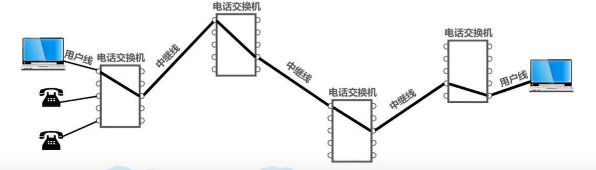

2. 分组交换

   将数据包进行分组，分成多个等长的数据段，分别加上首部作为标识（首部包含不同的目标IP地址信息），**构造和发送**分组，分组经过不同的路径跳转到对应路由器进行**缓存转发**，最终送到主机 B上，最后主机 B **接收分组**并数据去掉首部进行整合，**得到原始数据**。

   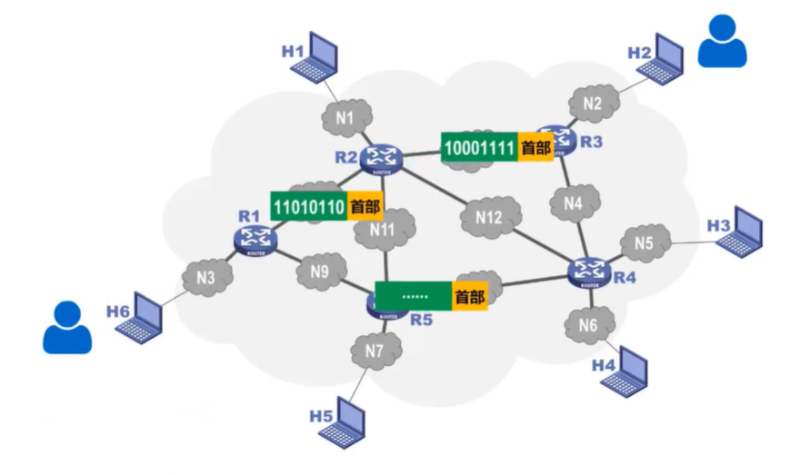

3. 报文交换

   不需要建立一条通信连接线路，可以实现直接发送，通过节点交换机进行转发，通过节点交换机进行查表，最后转发到对应的主机上。

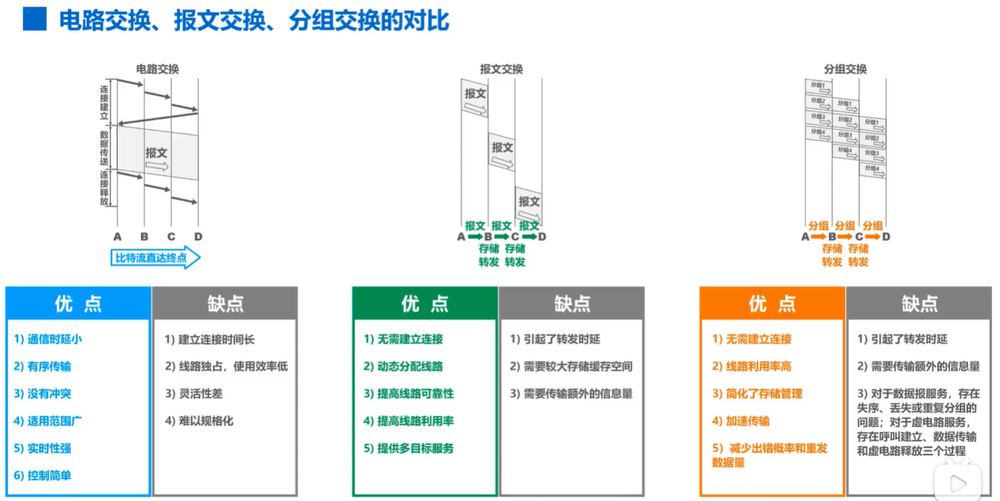

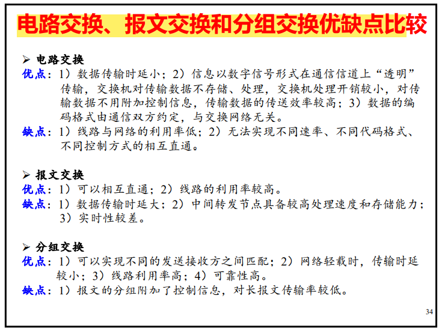

### 计算机网络分类方式

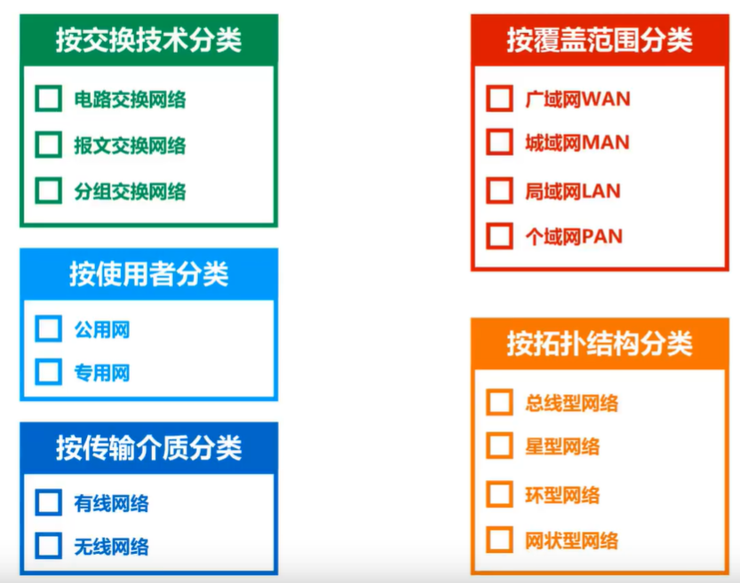

### 计算机网络模型结构

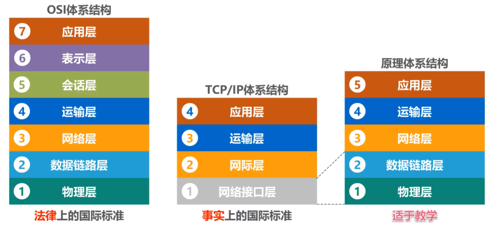

- 各层作用

  1. 物理层：用来指定数据应该通过什么介质进行传输，从物理硬件层面上描述数据的传输方式，以及针对指定对应计算机要接收的数据要对主机进行标识的方法，从比特流中区分地址和数据
  2. 数据链路层：用来解决数据传输过程中遇到的问题，例如：数据碰撞、数据出错、数据验证、流量控制等。
  3. 网络层：随着网络规模的增大，不可能只是以单一的网络存在，而是由很多个网络组成更大的网络，那要实现在不同网络之间进行数据传输，就要对主机和网络进行标识（IP 地址），以及不同网络之间如何选择对应的路由器进行转发才能使得目的主机收到数据，才能够让数据包知道传输的目的地。（路由器就像车站，数据包是乘客，乘客的目的就是要去到对应地方，那么路由器就是告诉数据前往目的地的路）
  4. 传输层：网络最终是要落实到应用，那么在不同应用之间区别网络数据呢，不同的数据需要交给哪个一个应用进程来处理，这时候就需要通过TCP、UDP 这种协议来规定不同应用所使用的端口。在不同网络之间传输可能也会产生**差错或者拥塞**等问题，所以需要解决这个问题在传输层上也要有对应的解决方案。
  5. 应用层：不同的应用具有不同的功能，那在不同应用之间处理数据的方式也不一样，所以针对不同的应用又提出了针对不同应用的协议，完成特定的网络应用功能。（SMTP 发邮件的、SSH 远程连接的、FTP 远程文件传输的）

  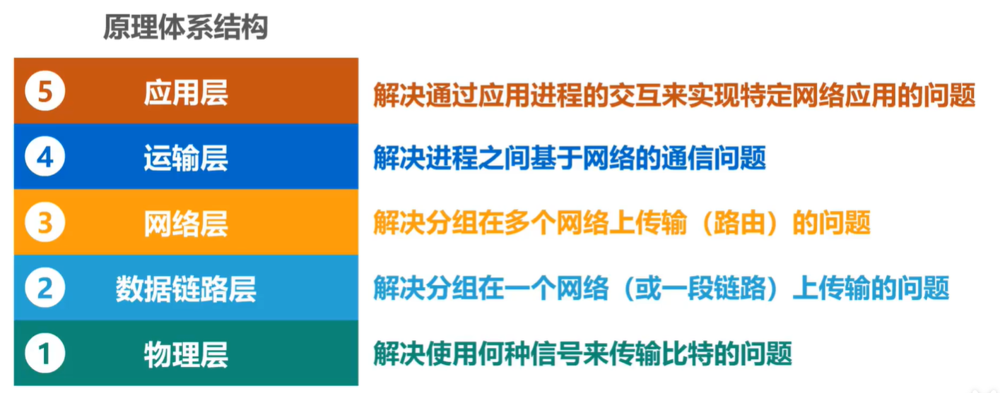

传输过程：

数据报先会从源主机的应用层开始，**到传输层**会添加 20B 的首部用来表示传输的src、dst 端口号，以及长度和对应的协议。

**到网络层**后添加 20B 的首部，用于表示发送使用的协议和数据报要去到的网络地址。

**到数据链路层**后添加 20B 的首部，用于表示要发送到达的主机的对应 MAC 地址。

最后经过物理层的编码和调制，从物理介质传输比特流，到达路由器后会对比特流进行解析，将比特流解析为数据报，到数据链路层后拆除首部，根据首部找到对应的 IP 地址，送到网络层，在网络层根据路由表查找对应要转发的路由器，最后路由器通过这个端口重新对数据报进行添加首部，标识新的 IP 地址，再次回到物理层转换为比特流传输到下一个主机 / 路由器。

### 专用术语

- 实体 / 对等实体

  任何可发送或接收消息的硬件或软件进程；对等实体就是指收发两方都处于相同层的实体。

- 协议

  控制两个**对等实体**进行逻辑通信的规则的集合，也就是规定了一组通信之间的规则，只有满足规则才可以进行通信。

  1. 语法，定义交换信息格式
  2. 语义，定义收发双方完成的操作
  3. 同步，定义收发双方时序上进行同步

- 服务

  两个对等实体之间逻辑通信来为上一层提供服务。

  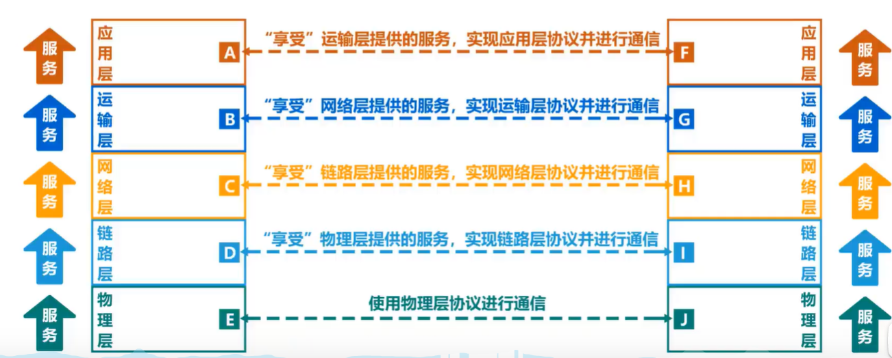
  
- 接口

  接口定义了下层向上层提供哪些原语操作和服务。

## 物理层

考虑在连接的各种计算机上如何传输数据比特流.

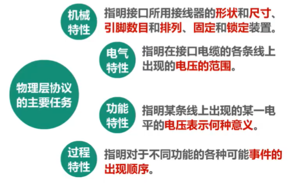

### 传输介质

- 双绞线

  双绞线绞合：抵御外界电磁波干扰、减少相邻导线之间的干扰

  1. 非屏蔽双绞线

     优点：成本低，尺寸小，易安装

     缺点：易受干扰，传输性能受传输距离限制

  2. 屏蔽双绞线

     优点：抗 EMI/RFI 干扰

     缺点：成本高，安装麻烦

- 同轴电缆

  1. 基带同轴电缆，用于数字传输，过去局域网较多，时分复用
  2. 宽带同轴电缆，用于有线电视，频分复用

  价格昂贵，布线不够灵活方便。

- 光纤

  - 依靠光波承载信息
  -  高传送速率，通信容量大 
  - 传输损耗小，适合**长距离传输** 
  - **抗干扰性能**好，保密性好 
  - 轻便

  1. 单向通信（单工通信）：只能有一个方向的通信而没有相反方向的交互（只有一个人在发） 

  2. 双向交替通信（半双工通信）：通信的双方都可以发送消息，但是不能同时发送（也不能同时接受） 

  3. 双向同时通信（全双工通信）：通信的双方可以同时发送和接收消息。

### 编码与调制

在物理层传输的过程中，比特流不是直接进行传输的，而是通过曼彻斯特编码、差分曼彻斯特编码进行 encoding（以太网当中是这样）。

- 波特是码元传输的速率单位，他说明每秒传送多少个码元。
- 码元：承载信息量的基本信号单位。
-  码元：一个信息单位，可能包含1或者多个比特的信息量。 若1个码元只携带1bit的信息量。那bit/s和baud在数值上面相等。

## 数据链路层

数据链路层的主要目的就是把数据按照一帧一帧地传输，将原始的比特流封装一帧，**使得数据可以以帧的形式发送。**也就是说，在数据链路层对比特流加入帧头和帧尾。同时，**数据链路层还负责数据的流量控制，差错检测**，我们要学习的也正是解决这些问题的算法。

### 封装成帧

将物理层交付的比特流进行封装，加入帧头和帧尾用于表示一个数据帧，帧头主要**标识数据要传输到的设备的 MAC 地址**，帧尾用于**差错检测**。帧头帧尾主要目的还是区别在一条无序传输的比特流当中提取出一个数据帧，用于区分数据帧与另一个数据帧，是一种分界线。

具体实例：

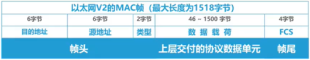

以太网v2的 MAC 帧传输过程中会在物理层添加前导码，用于区分不同数据帧

- 为什么要封装成帧

  提高传输效率

  进行差错控制

### 差错控制

### 流量控制

### 交换机工作原理（网桥）

### 数据链路层提供的服务

- 无确认的无连接服务

  不需要建立逻辑连接，也不需要检测丢包

- 有确认的无连接服务

  不用建立连接，但是会检测数据报是否到达

- 有确认的有连接服务

  建立连接且对数据包进行检测，是否收到。

## 介质访问控制层

### 静态信道划分

> 复用：一条物理线路同时传输多组用户的信号。
>
> 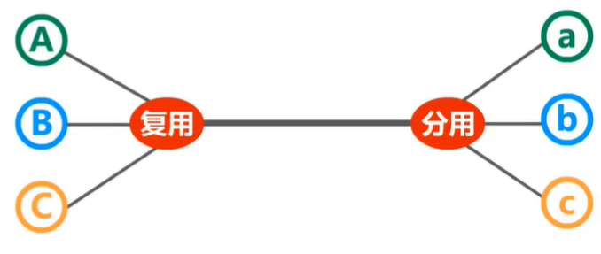

- 频分复用

  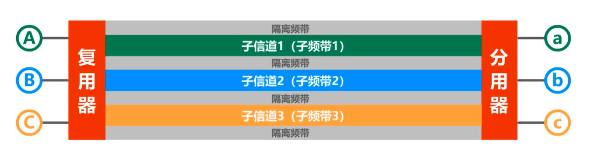

  频分复用所有用户同时占用不同频带资源并行通信

- 时分复用

  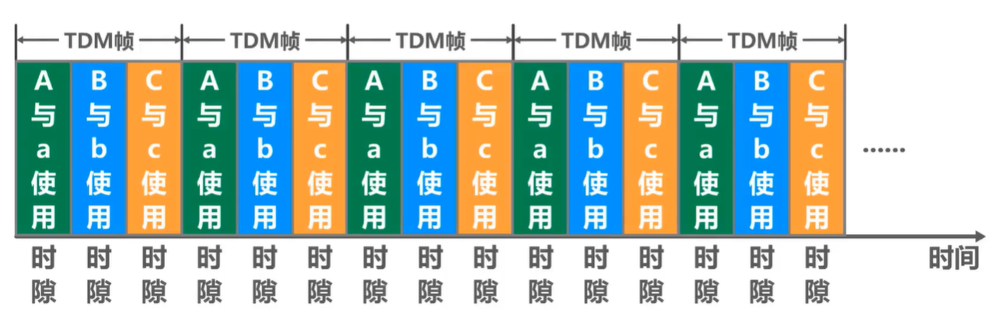

  类似时间片，轮流分配线路给用户传输。

- 波分复用

  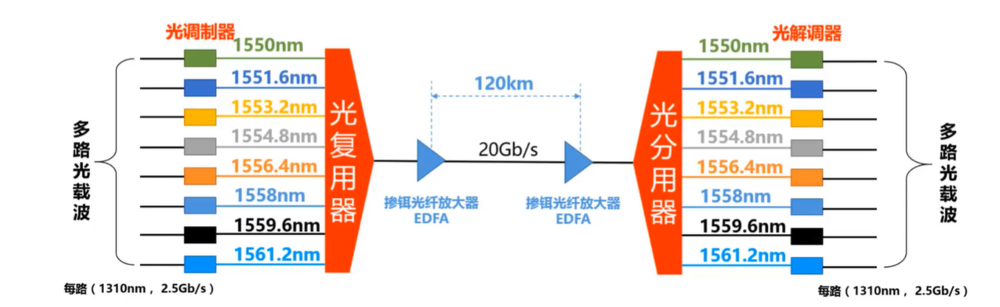

  光的频分复用

### CSMA / CD

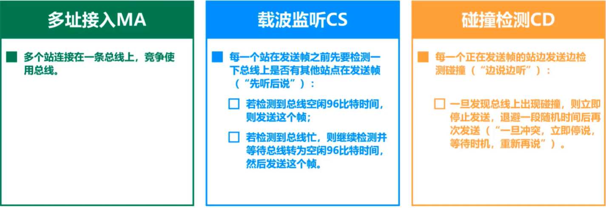

CSMA 其实就是以多站点共用一条线路的基础上，检测总线是否空闲，如果空闲即可发送数据，如果不空闲则等待，最后如果意外遇到碰撞则进行规避。

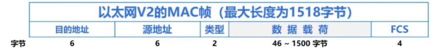

因为争用期为512 bit，所以至少要传输64 Bytes，帧头帧尾占18 Bytes，那么数据至少要 46 Bytes

### MAC地址、IP地址、ARP协议

- MAC 地址：可以理解为数据链路层地址，也就是物理设备的地址，网卡地址。MAC 地址是对网络接口的唯一标识。MAC 地址前 24 位由 IEEE 提供，后 24 位由厂商决定。

- IP 地址：主机和路由器使用的地址，标识网络编号和主机编号

  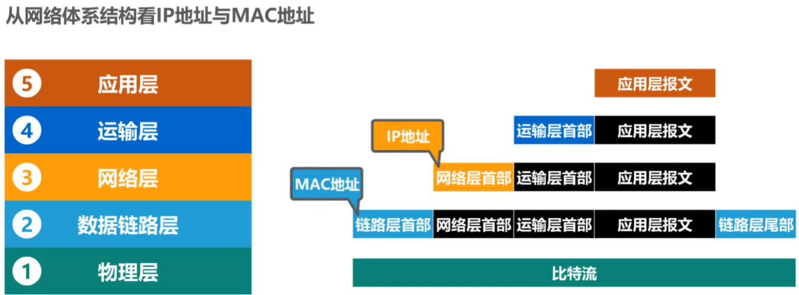

  整个传输过程中，IP 地址首部不发生变化，而 源 MAC 地址和目标 MAC 地址均发生变化。

- ARP 协议：因为数据包传输过程中，每一个设备都知道自己转发的下一个接口的 IP 地址，但是不知道对应的 MAC 地址，这个时候 ARP 协议就发挥作用了。

  - 工作原理：

    1. ARP 其实就是一个高速缓存表，由于记录所有经过的数据报对应 IP 地址和 MAC 地址的映射关系，如果请求过程中没有找到对应的映射关系，那么就会发送 ARP 请求报文（封装在 MAC 帧），获取对方的 MAC 地址。

    2. ARP 响应报文其实就是一个请求，假设 C 向 B 发起 ARP 报文请求，如果发起的报文的目的 MAC 地址与接收的主机的 MAC 地址不匹配，那么丢弃，如果匹配，则交给上一层来处理，ARP 进程解析 ARP 响应报文，将对方的 IP 地址和 MAC 地址存到高速缓存表当中。
    3. ARP 只能在同一个网络使用，不能跨网络使用，如果要跨网络，那么就需要逐段分别请求。

### 交换机与集线器

- 集线器
  就是把多个不同的主机使用星型的拓扑连接结构连接，但是逻辑上还是总线型的，也就是一个地方碰撞会导致整个网络发生碰撞，其实本质上就是构建了一个更大的以太网碰撞域，也就是一台主机发送信号，其他主机也会收到。中间会产生碰撞。

- 交换机

  不同于集线器，一台主机发送信号，交换机只会转发给对应的目的主机。交换机管理了一个帧交换表，用于指示对应 MAC 要转发的接口。这个表是通过自学习算法逐渐建立的。

### VLAN 虚拟局域网

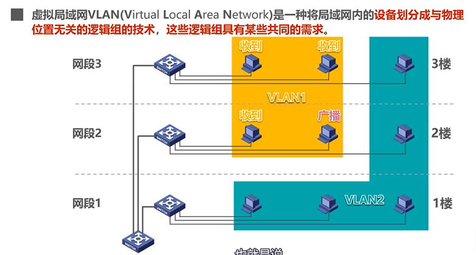

### 数据帧传输方式 ( MAC 子层 ) 

1. 单播

   从一台主机 A 发送的数据帧只会传给另一台**主机 B**

2. 广播

   从一台主机 A 发送的数据帧会传给局域网当中的**所有主机**

3. 组播

   从一台主机A 发送的数据帧会传给局域网当中的**部分主机**

### 虚拟局域网

是将一个局域网内部的设备进行划分，划分成为与物理位置无关的逻辑组，这些组有着相同的需求。

- 实现机制——IEEE 802.1Q 帧

  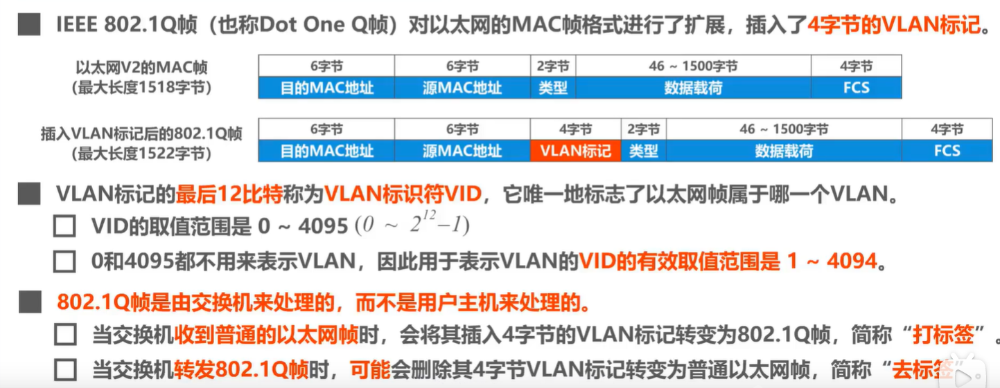

### 蓝牙

> 采用 IEEE802.15 协议

- 特点

  适用性强，无需电缆，进行无线通信。

  工作频段全球通用

  安全性和抗干扰能力强

  传播效率高

- 协议

  蓝牙不遵循 OSI模型、TCP/IP 模型、802 模型。使用逻辑链路控制适配协议（L2CAP），具有服务发现和射频通信两个服务。

  - 服务发现：是指在网络中查找对应可用的服务
  - 射频通信：通过模拟 PC 上的标准串行端口来连接和通信。

### 无线局域网

> 无线局域网可以在两种配置中的一种运行：（主要标准：802.11）

- CSMA / CA

  无线网络碰撞检测意义不大（当两个站点信号范围有重合时，同时给重合区域的主机发送会产生碰撞，但是站点无法检测碰撞。），无线电波的特殊性，所以应该做的是冲突避免。

  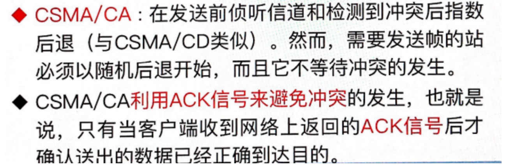

- 无线局域网发送数据流程：

  1. PC1 向接入点发送数据，并执行 CSMA / CA，生成随机避免时间
  2. PC1 开始发送数据，根据 PC1 的发送时间调整 PC2 的 NAV（发送一个数据帧所需要的时间）
  3. 接入点收到数据，等待一个 SIFS 时间后发送确认帧
  4. PC1、PC2 等待一个 DIFS 时间才能发送下一个数据
  5. DIFS 时间结束，信道空闲，PC2 可以发送数据

  总的来说，就是每次发送都要间隔一段时间，A 在发送的时候 B不能发，A 发送完之后也要等待一段时间才能让 B 发。

## 网络层

实现不同网络之间的互联，与不同的网络进行通信，在不同网络进行传输。要解决的问题就是**网络层向传输层提供什么服务（可靠还是不可靠传输），网络如何找到对方的地址，路由如何选择。**

### 虚电路

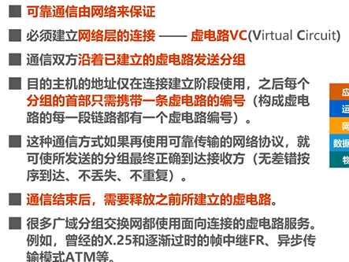

本质上就是类似一个不存在的电路，就是类似于一个虚拟存在的电路一样建立连接，是对连接这种方式的抽象。

在每次分组发送之前，必须在发送方与接收方之间建立一条逻辑连接。这是因为不需要真正去建立一条物理链路，连接发送方与接收方的物理链路已经存在。

虚电路通信与电路交换类似，两者都是面向连接的，即数据按照正确的顺序发送，并且在连接建立阶段都需要额外开销。

### 无连接数据报服务

网络本身不提供端到端的可靠传输，可靠传输是靠用户主机来保证的，也不需要建立网络连接。

数据报：同一报文的不同分组可以由不同的传输路径通过通信子网。数据报是完备的、独立的数据实体，该实体携带要从源计算机传递到目的计算机的信息，该信息不依赖以前在源计算机和目的计算机以及传输网络间交换。 

### IP 地址

- A 类地址：去掉 0 和 127 号网络号的地址，最大网络数为 $2^{(8-1)}-2=126$
- B 类地址：去掉 B 类地址所占的两位，故 $2^{(16-2)}=16384$
- C 类地址：去掉 C 类地址所占的三位，故 $2^{(24-3)}=2097162$

主机地址与源主机的子网掩码相与得到的网络地址与 C 的不同就是不同一个网络内。

### 路由聚合

本质上就是找到共同的前缀，多个IP地址的共同前缀。

### 路由选择

- RIP

  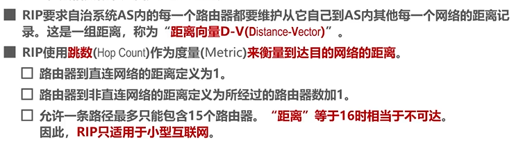

  相同下一跳：

  直接更新，因为网络路径发生了变化。

  不同下一跳：

  路径更短则更新，找不到也更新，路径更长不更新。相同网络则添加一条

  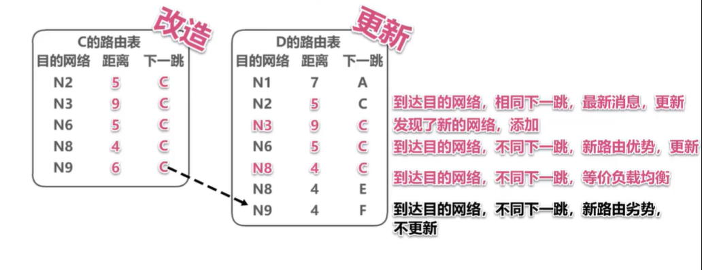

- OSPF

  

  

## 传输层

传输主要是解决通信进程之间传输问题，传输层能够为不同主机上的化进程提供服务，端到端协议。

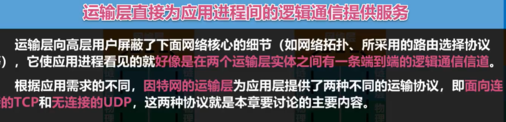

### 端口号

端口其实就是一个类似于进程 PID 的标识符。只不过因为不同主机上的进程号分配也不一样，所以需要一个统一的标准来表示，故就是通过端口的方式进行标识。

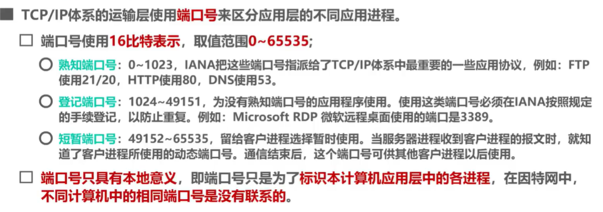

在传输过程中，其实就是每次对数据添加首部的时候都会把对应的源端口的和目的端口封装在 TCP 数据报文当中。将数据帧传输到对应的目的地后，对 TCP 首部进行解包，获取到对应的源端口和目的端口，在目的地主机上将该帧交给对应的端口的进程来处理数据，处理完毕后重新添加首部再返回给源主机，源主机解析对应的目的端口，交付给对应协议的端口进程处理。

### TCP 和 UDP

- UDP：不可靠传输服务，支持一对一、一对多通信。
- TCP：可靠传输服务，仅支持一对一通信。

### TCP 拥塞控制

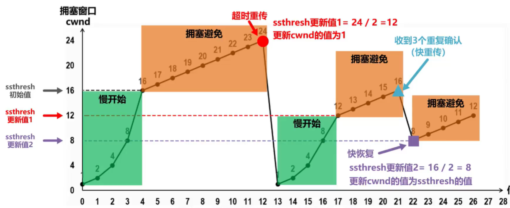

> 只要是没有按序接收的数据都不会返回确认报文，会等到原本该到达的数据到达之后才会发送最大序号数据的确认报文，表明前面的数据已经全部接收。

### 捎带确认

当数据帧到达接收方之后，接收方不会马上发送一个单独的确认帧，而等到接收方发送数据的时候将确认帧捎带进来帧头，一起发送到发送方。

## 应用层

应用层主要解决的问题是通过应用进程的交互实现对应的网络应用。主要是给建立不同的软件应用。

### P2P

在网络当中所有的主机都是对等的，所有的主机都是可以服务器，也都可以客户端。这里一般就不说服务端和客户端了，直接说既可以是请求服务的，也可以是提供服务的。

### DHCP

可以动态地给网络进行网络配置。因为一开始主机并没有被分配到 IP 地址，DHCP 发现报文到 DHCP 确认所发的都是广播地址和指向目标主机本身的地址，因为只有这种方式才能让未分配 IP 的主机收到报文请求。

### DNS

- 解析流程：

  1. 首先输入地址并发起请求时，查找缓存当中是否有对应域名的 IP 地址

  2. 如果没有，则向 DNS 服务器发起 DNS 查询报文请求，通过对应的 53 端口号访问 DNS 服务器对应的进程。
  3. 在 DNS 的数据库当中进行查询，返回查询的结果给用户主机，用户主机新增记录，开始访问对应的服务。

现在大多数采用的是一个域名对应一个域名服务器，这些域名解析服务器都是分布式的。

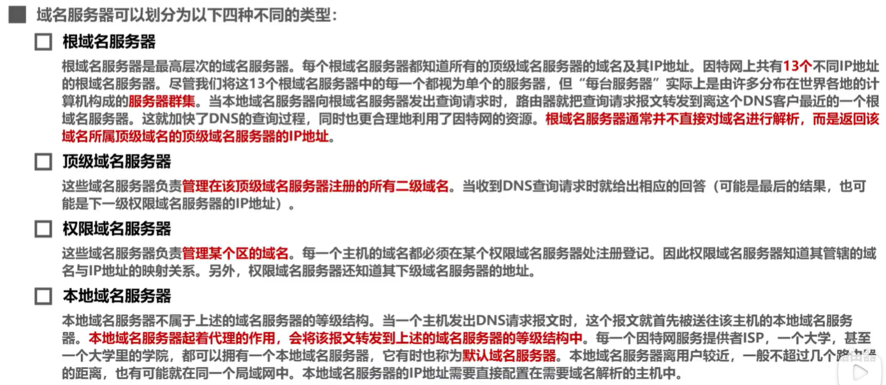

- 域名解析具体过程

  - 递归查询

    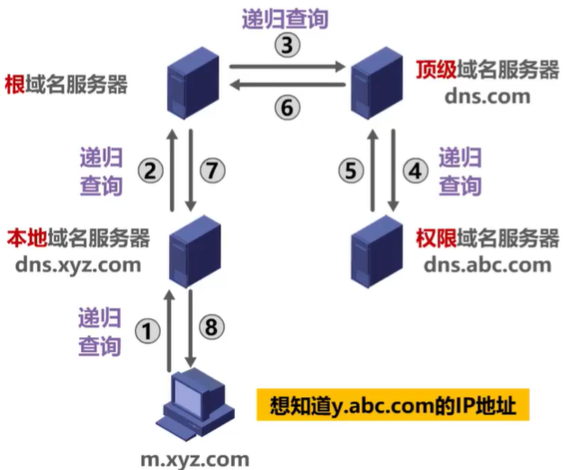

  - 迭代查询

    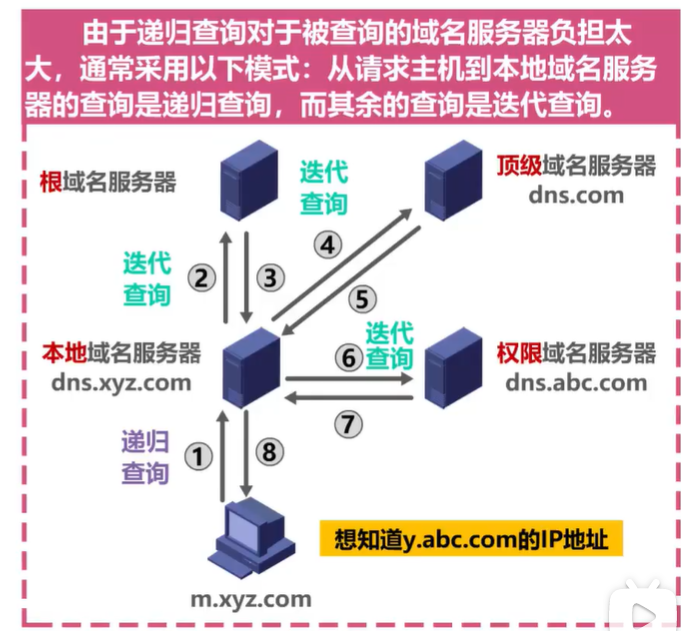

### FTP

是一种 C/S 模式的通信

FTP 会建立两个通信信道，一个是指令传输信道，一个是数据传输信道。

- 指令传输信道主要是为了传输用户对文件发起的指令操作
- 数据传输信道主要是为了传输文件数据

### SMTP

电子邮件的发送主要经过如下过程

1. SMTP 的客户端发送邮件信息，发送到对应的 SMTP 发送服务器

2. 发送服务器将邮件进行转发，转发到 SMTP 的接收服务器

3. 在接收服务器上，进一步交给 POP3 协议或者 IMAP 协议等进行接收。

   > Supplementary:
   >
   > - POP3 / IMAP 协议都是接收协议
   > - SMTP 只能发送 ASCII 文件，如果要发送非 ASCII 码数据要通过 MIME 进行转换。

使用 万维网的方式发送邮件

1. 客户端 A 向 B 发送邮件，邮件通过 HTTP 协议传输到 A 所在公司的邮件服务器
2. A 所在公司的邮件服务器通过 SMTP 发送数据到对应客户端 B 所使用的邮件服务器
3. 客户端 B 通过访问对应的程序即可看到发送给自己的邮件。

### WWW

万维网其实就是利用网页之间的超链接将不同网站进行连接的逻辑上的网络。使用 URL 对不同网站进行唯一标记。浏览器的作用主要是解析服务器返回的请求报文，获取其内容并对内容进行渲染。

- HTTP 协议

  HTTP 是一种专门用来传输超文本的传输协议，能够告诉浏览器怎么向 WWW 服务器请求网页，以及把网页传输给浏览器。本质上就是浏览器进程和 Nginx 服务器进程的通信交互。

- Cookie

  Cookie 其实是对无状态的 HTTP 进行状态标识的技术。一个 Cookie 就可以标识当前浏览器的用户状态。

- 浏览器访问网页的流程

  1. 用户填写 URL 链接并进行访问
  2. 解析用户输入的 URL。
  3. 提取出对应的地址信息和协议信息，按根域名->顶级域名->次级域名->主机名这样的方式来查找的方式，查找本地 DNS 缓存是否有记录，如果没有则发起 DNS 查找请求。（HTTPS 还要对数据进行 SSL 加密）
  4. 获取到对应域名所映射的 IP 地址之后以及通过 ARP 解析出对应的 MAC地址之后，建立 TCP 连接，经过三次握手，开始发送数据。
  5. 对应的 WWW 服务器接收到之后根据对应的操作返回对应的网页报文，通过 TCP 传输.
  6. 传输完毕后关闭传输连接，经过四次挥手。
  7. 浏览器根据数据渲染和解析网页，最后展示在浏览器上。