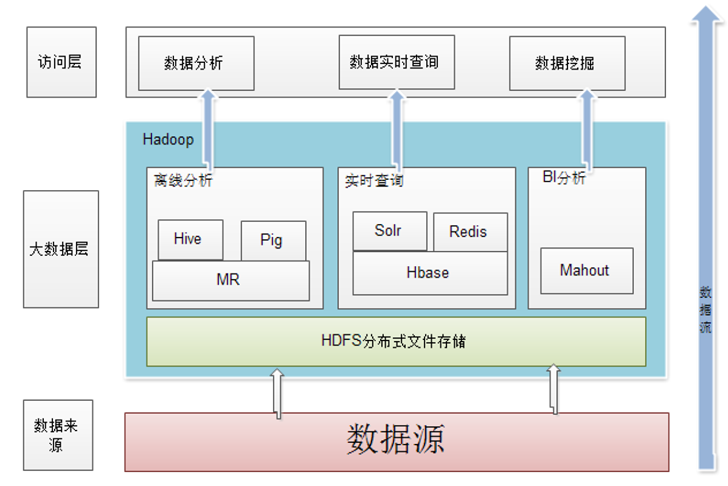
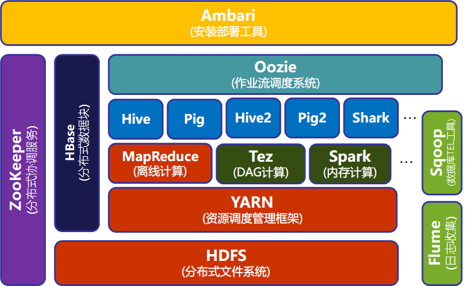

# Hadoop 技术原理

## 什么是 Hadoop？

Hadoop 是Apache软件基金会旗下的一个开源**分布式计算平台**，为用户提供了系统底层细节透明的分布式基础架构。

Hadoop 是基于Java语言开发的，具有很好的跨平台特性，并且可以部署在廉价的计算机集群中。

Hadoop 的核心是分布式文件系统 HDFS（Hadoop Distributed File System）和MapReduce。

## Hadoop 的特性

   Hadoop是一个能够对大量数据进行分布式处理的软件框架，并且是以一种可靠、高效、可伸缩的方式进行处理的。它具有以下几个方面的特性：

- 高可靠性

- 高效性

- 高可扩展性

- 高容错性

- 成本低

- 运行在 Linux 平台上

- 支持多种编程语言

## Hadoop 架构及生态

Common、Avro、Zookeeper、HDFS、MapReduce、HBase、Hive、Chukwa、Pig等子项目，其中，HDFS和MapReduce是Hadoop的两大核心组件。

| **组  件**    | **功  能**                                                                                                            |
| ------------- | --------------------------------------------------------------------------------------------------------------------- |
| **HDFS**      | 分布式文件系统，存储和管理分布式文件                                                                                  |
| **HBase**     | Hadoop 上的非关系型的分布式列式数据库                                                                                 |
| **MapReduce** | 分布式并行编程模型，支持对大规模数据集并行计算                                                                        |
| **Hive**      | Hadoop 上的数据仓库，对数据集进行数据整理、查询和分析存储                                                             |
| **Pig**       | 一个基于 Hadoop 的大规模数据分析平台，提供类似 SQL 的查询语言 Pig Latin，可查询大型半结构化数据（非结构化数据的查询） |
| **YARN**      | 资源管理和调度器                                                                                                      |
| **Tez**       | 运行在 YARN 之上的下一代 Hadoop 查询处理框架，DAG 计算                                                                |
| **Zookeeper** | 提供分布式协调一致性服务                                                                                              |
| **Flume**     | 一个高可用的，高可靠的，分布式的海量日志采集、聚合和传输的系统                                                        |
| **Sqoop**     | 用于在 Hadoop 与传统数据库之间进行数据交换                                                                            |
| **Oozie**     | Hadoop 上的作业流管理系统                                                                                             |
| **Storm**     | 流计算框架                                                                                                            |
| **Ambari**    | Hadoop 快速部署工具，支持 Apache Hadoop 集群的供应、管理和监控                                                        |
| **Kafka**     | 一种高吞吐量的分布式发布订阅消息系统，可以处理消费者规模的网站中的所有动作流数据                                      |
| **Spark**     | 类似于 Hadoop MapReduce 的通用**并行计算框架**                                                                        |
| **Mahout**    | 机器学习经典算法库                                                                                                    |

### Hadoop 集群节点类型

Hadoop 框架中最核心的设计是为海量数据提供存储的 HDFS 和对数据进行计算的 MapReduce。MapReduce 的作业主要包括：（1）从磁盘或从网络读取数据，即 IO 密集工作；（2）计算数据，即CPU密集工作。

一个基本的 Hadoop 集群中的节点主要有：

NameNode：负责协调集群中的数据存储；

DataNode：存储被拆分的数据块；

JobTracker：协调数据计算任务；

TaskTracker：负责执行由 JobTracker 指派的任务

SecondaryNameNode：帮助 NameNode 收集文件系统运行的状态信息。

### Hadoop 单机安装和伪分布式安装的区别

- 单机模式：Hadoop 默认模式为非分布式模式（本地模式），无需进行其他配置即可运行。非分布式即单 Java 进程，方便进行调试。（所有操作都不是在节点上进行，只是单纯的 Java 进程）**只在一台机器上运行，存储是采用本地文件系统，没有采用分布式文件系统HDFS。**

- 伪分布式模式：Hadoop 可以在**一台机器**上以伪分布式的方式运行，Hadoop 进程以分离的 Java 进程来运行，机器既作为 NameNode 也作为 DataNode，同时，读取的是 HDFS 中的文件。**存储采用分布式文件系统HDFS，但是，HDFS的名称节点和数据节点都在同一台机器上；**

- 分布式模式：使用多个节点构成集群环境来运行 Hadoop。**存储采用分布式文件系统HDFS，而且，HDFS的名称节点和数据节点位于不同机器上。**

