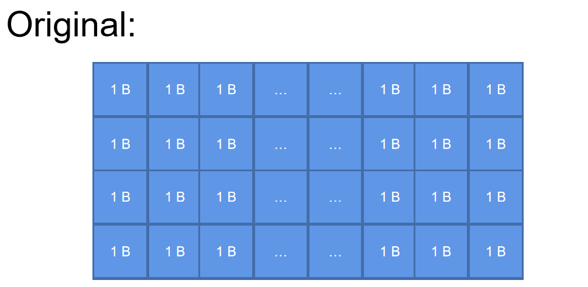
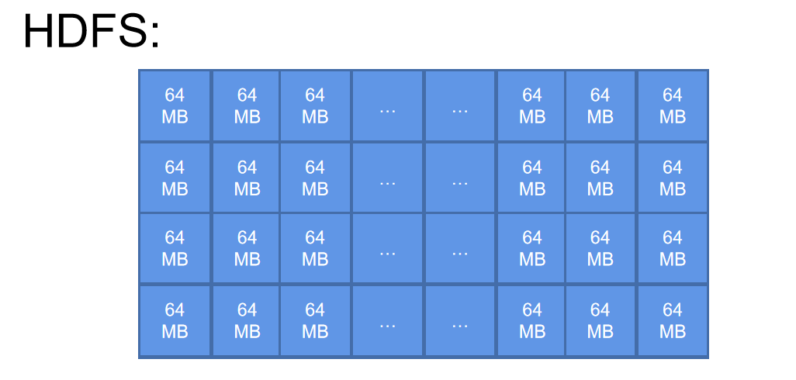
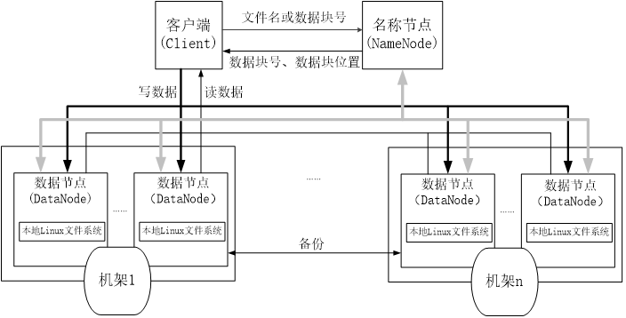
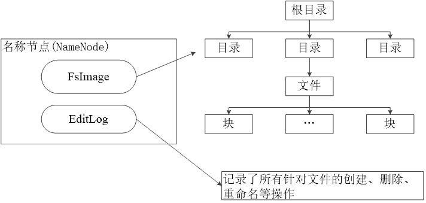
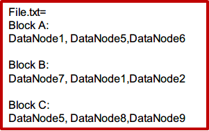
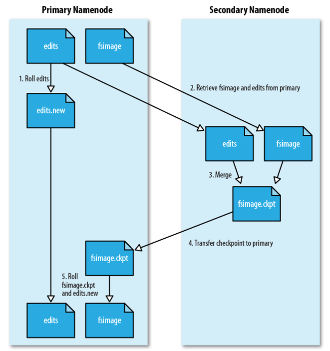

# HDFS 技术原理

## 什么是 HDFS？

HDFS全称为 Hadoop Distribution File System，与传统的操作系统文件系统类似，但HDFS是针对分布式存储设计文件系统，需要有能够有对分布式存储的支持，所以 HDFS 与传统的文件系统不同在于HDFS能够通过网络通信实现不同机器之间的通信，将多台机器设备连接到一起，将不同机器上的节点连接起来，形成分布式集群来存储相关的文件。

## HDFS 工作原理

### HDFS 相关概念

#### 数据块

块是 HDFS 当中存储的基本单位，你学过操作系统也知道，正常的文件系统是**字节**为单位的。但是在以 TB 级数据为前提的基础上，传统文件系统其实是不能够满足我们的需求的，光从查找时间上就不能够满足大数据的需求。

所以，你可以在此基础上扩大存储的基本单位的大小，原本是以 1 Byte 作为单位。现在你可以默认 64 MBytes 作为基本单位。说白了就是你扩大了传统文件系统的基本单位的大小。这样做就可以减少查找数据的时间。在数据量比较大的前提下，增大搜索盘块的步长能够有效提高搜索的速度。

> ### Attention
>
> 块只是一个逻辑结构，你目前看到的块都是逻辑块，实际计算存储的空间大小的时候你还是要按照实际的大小来计算，块只是描述了存储一个文件所占用块的大小的上限。

综上所述，你用这种方式来存储大量数据就能够**缩短查找数据的时间**，支持大规模的文件存储，另一个角度来说，因为每个块大小都比较大，所以你可以更加**方便管理元数据和数据**，通过简单的计算就可以知道一个文件存储了多少个块。在**冗余存储设计**上也很方便。

#### NameNode

名称节点主要不是用来存储数据的，而是存储**元数据**，元数据你可以理解为数据的数据，就是指代那些数据的位置和映射关系的数据，因为存储真正数据的位置信息和映射关系的数据也是数据。主要由两个数据结构组成：`FsImage` 和 `EditLog`

#### DataNode

数据节点就是真正用来存储文件数据的节点，能够负责写入和读取数据。

### HDFS 结构

HDFS主要设计的结构为主从式结构，由一个主服务器来控制旗下所有的从服务器。其中，主服务器一般不做任何存储数据，所有由网络传输过来的数据都会先经过主服务器存储到内存当中，在内存中等待HDFS文件系统将数据分配到各个从服务器上。

> **文件块**：因为如果按照字节来存储数据会导致寻址时间过长的问题，所以在分布式文件系统中所有的都是采用块结构来存储，一个块大概有64MB或者128MB。
>
> 通过不同的文件块来存储文件，能够最大程度减少寻址开销。
>
> 以块的方式存储能够支持存储大规模的文件，同时也简化了系统对文件系统设计，因为直接通过计算文件块就能得出不同节点的块的数量，方便管理数据。以块的方式存储在备份数据的时候具有较快的速度和效率，可以一次性存储到不同的节点。

HDFS 结构上主要分为名称节点 ( NameNode ) 和数据节点 ( DataNode ) ，HDFS通过名称节点对数据节点进行相关的操作，客户端只可以访问名称节点，不可以直接访问数据节点，而是由名称节点对数据节点进行操作，分配从客户端上传的数据。下面针对名称节点和数据节点的结构进行介绍：

#### NameNode

**名称节点 ( NameNode )**：主要存放上传上来的元数据，将元数据保存在内存当中，同时还要保存数据、块和节点之间的映射关系。名称节点记录了每个文件中各个块所在的数据节点的位置信息。

**数据结构：**名称节点主要由 `FsImage`和 `EditLog` 组成，分别用于维护文件目录和对数据的操作记录。

- `FsImage`

  FsImage **维护文件系统树及元数据**，其实就是相当于文件系统里的目录，FsImage 会记录各种文件存储的位置，你可以理解为 FsImage 维护的是一个**文件目录表**，里面描述的就是文件目录和索引文件信息的 inode 指针。与传统文件系统原理相同。

  FsImage 会将数据加载到内存中，在 EditLog 读取到对应的操作之后，文件系统就会开始执行。存储了文件的复制等级、修改、访问时间、访问权限、块大小以及组成文件的块。目录存储了修改时间、权限和元数据。

  

  

-  `EditLog`

  EditLog 是一个日志文件，EditLog 会存储用户对文件系统每一步的操作，记录所用户的**创建，删除，重命名**等操作。
  
  因为文件系统在操作文件的时候每一次都要去查找对应文件所在的位置和索引，这个过程在大量数据的情况下速度是比较慢的，也就是有时延，而 Log 文件记录对应的操作，按照所记录的操作执行能够保证操作数据的准确性。
  
  在 FsImage 存入内存的时候，同时也会加载 EditLog 里面的内容，执行对应的操作。EditLog 文件在整个 HDFS 运行的周期当中，一定要保持实时更新，但是这里就会导致一个问题，**当操作过多时导致 EditLog 文件过大，导致系统启动和运行十分缓慢**，下面会说到如何解决这个问题。
  
-  `元数据`

  元数据的结构主要包含了文件的具体位置记录等信息，记录了某一个文件在哪一个块，哪一个数据节点。

  

  

##### 名称节点启动流程：

1. 名称节点启动之后，会将 FsImage 加载到内存当中，之后执行 EditLog 文件中的各项操作。
2. 启动成功之后，会创建新的 FsImage 和 EditLog 文件。

#### SecondaryNameNode 

第二名称节点是一个辅助名称节点的节点，因为像上面所提到的，EditLog 随着使用时间越来越长，导致日志文件会变得越来越大，每一次启动和加载都会变得非常缓慢。所以，你可以用第二个名称节点来辅助 EditLog 的加载。本质上来说，第二名称节点执行的操作和名称节点一样。

因为HDFS分布式的特性，可以让处理数据的过程以并行的方式进行。所以提出解决这个问题的方案。

**解决 EditLog 文件不断变大的问题**：

你应该要把第二名称节点会部署到另一台服务器上，这样才能保证并行执行，第二名称节点会周期性地和 NameNode 进行通信，获得到 NameNode 的 FsImage 和 EditLog 文件，像 NameNode 一样。**从名称节点上下载 FsImage 和 EditLog，将获得的 FsImage 和 EditLog 文件进行处理，加载 FsImage 文件到内存，执行 EditLog 文件上的操作，修改 FsImage 的文件目录结构得到新的 FsImage.ckpt 文件，发送回 NameNode 的服务器上。**

在执行上述步骤的同时，**NameNode 会创建一个新的 edits.new 文件来继续记录后续的文件操作请求，等待第二名称节点将新的 FsImage 文件发送过来之后进行替换，同时也将edits.new 文件替换旧的 EditLog 文件。**

​    

综上所述，你把整个过程整合之后，其实就是通过第二名称节点来主要处理文件目录，而名称节点继续记录对应的操作，等待第二名称节点处理完毕后再合并到名称节点。**因为合并数据这个过程是不需要实时进行的，但是记录数据是需要实时进行的。**

**解决名称节点发生故障时的措施：**因为第二名称节点的特性，使得第二名称节点形成了一个**检查点**的作用，所以当你的名称节点发生故障之后，利用第二名称节点的元数据对名称节点进行恢复。

发生故障之后，直接读取第二名称节点的 FsImage，放到名称节点，然后重新生成新的 EditLog。

> **重启和故障修复都会清空 EditLog。**

### DataNode

- 数据节点是分布式文件系统 HDFS 的工作节点，**负责数据的存储和读取**，会根据客户端或者是名称节点的调度来进行数据的存储和检索，并且向名称节点定期发送自己所存储的块的列表。

- 每个数据节点中的数据会被保存在各自节点的本地 Linux 文件系统中。

### 合作关系

启动 HDFS 会先读取 EditLog 当中的内容，每次打开 FsImage 都会重新执行 EditLog 中的内容。第二名称节点定期通过网络请求下载 NameNode 的 EditLog 和 FsImage 到 第二名称节点所在的机器，在这台机器上执行 EditLog 的操作并应用到 FsImage，完成后将新的 FsImage 上传到名称节点替换掉原来的 FsImage。

## HDFS存储原理

### 冗余数据存储

针对一个文件系统，为了保证系统的容错性和可用性，HDFS 采用多副本的方式进行存储，就是每次从客户端发送的请求往集群当中添加数据，**都会将该数据复制两份，一份放到同一台设备上不同的数据节点，另一份放到不同设备上的数据节点，原来上传的数据则选择一台磁盘不满、CPU不忙的设备上写入**。如果是集群内进行的写入操作，则会将副本放到就近的数据节点上写入数据。

> 原则：
>
> - 就近选择机器，选择剩余容量最大的
> - 文件大小大于块大小需要多次存储，存多个块。

### 数据存取策略

#### 数据存放

- 第一个副本：集群内节点提交，放置在所选的目标数据节点；如果是集群外提交，则随机挑选一台磁盘不太满、CPU不太忙的节点
- 第二个副本：放置在与第一个副本不同的机架的节点上
- 第三个副本：与第一个副本相同机架的其他节点上
- 多副本：随机节点

> 存放原则：
>
> - 就近找节点存放，找剩余空间最多的。
> - 若文件大小大于块大小，则分多次进行存储。

#### 数据读取

- HDFS 提供了一个 API 可以确定一个数据节点所属的机架 ID，客户端也可以调用 API 获取自己所属的机架 ID
- 当客户端读取数据时，从名称节点获得数据块不同副本的存放位置列表，列表中包含了副本所在的数据节点，可以调用 API 来确定客户端和这些数据节点所属的机架 ID，**当发现某个数据块副本对应的机架 ID 和客户端对应的机架 ID 相同时，就优先选择该副本读取数据，如果没有发现，就随机选择一个副本读取数据。**

#### 数据复制

> **一旦原本的文件存放完成，副本也存放完成了**

你先发起写请求，然后 HDFS 会根据块大小将文件切分成多个小块，每个块都会向**名称节点**发起写入请求，然后被切分出来的块会一份一份进行处理，名称节点会返回一个可用数据节点 ID 的列表，根据这个列表依次写入数据节点，第一个节点接收到 4 KB 数据后，写入本地，并把刚才传入的列表传到第二个数据节点，向第二个数据节点发送连接请求，每接收到 4 KB 就向副本传输。依次像流水线一样处理。

### 数据错误、恢复

#### 名称节点出错

名称节点保存了所有的元数据信息，备份一般会读取第二名称节点服务器上的备份，当名称节点出错时，就可以根据备份服务器 SecondaryNameNode 中的 FsImage 和 Editlog 数据进行恢复。

#### 数据节点出错

数据节点会定期向数据节点发送信息，报告节点状态信息，当数据节点出错时，HDFS 会自动标记这些节点为“宕机”并不进行任何 IO 操作。

名称节点会定期检查冗余副本，一旦发现某个数据块的副本数量小于冗余因子，就会启动数据冗余复制，为它生成新的副本。HDFS 和其它分布式文件系统的最大区别就是可以调整冗余数据的位置。

#### 数据错误

你读取到数据之后，HDFS 使用 MD5 和 Sha1 进行数据校验，如果数据校验出错，那客户端就会向另一个数据节点读取备份的文件块，并向名称节点发送错误信息，让名称节点重新复制数据块。

在文件被创建时，客户端就会对每一个文件块进行信息摘录，并把这些信息写入到同一个路径的隐藏文件里面。

**读数据：**使用文件系统打开文件 $\rarr$ 获取文件输入流同时获取数据块的位置 $\rarr$ 通过`read()`方法读取 $\rarr$ 检查输入流状态是否被关闭 $\rarr$ 若未关闭则再次寻找下一个要读取的数据块 $\rarr$ 读取完毕后关闭输入流 $\rarr$ 读完成

**写数据：**发起操作文件请求 $\rarr$ 在名称节点创建元数据 $\rarr$ 客户端写入数据 $\rarr$ 将客户端数据封装成包通过输出流发送到数据节点并写入数据节点 $\rarr$ 接受完毕后数据节点发送确定包给输出流 $\rarr$ 输出流关闭 $\rarr$ 写完成

