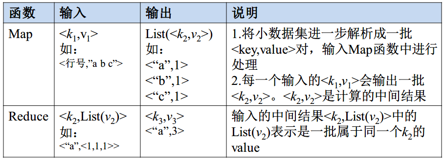
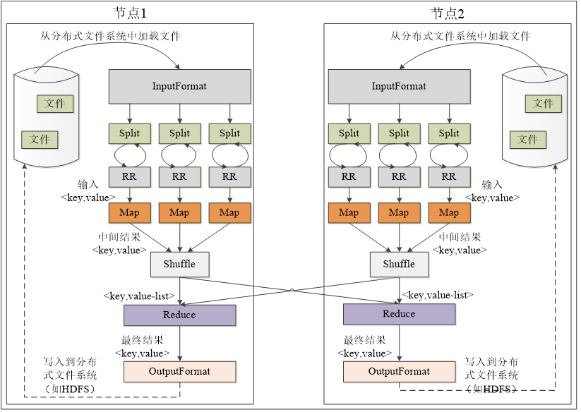
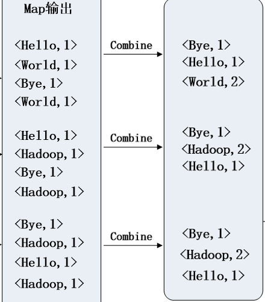
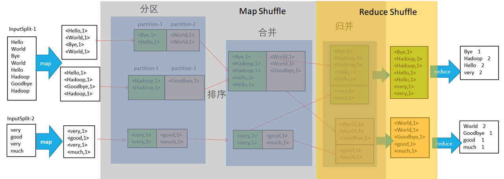
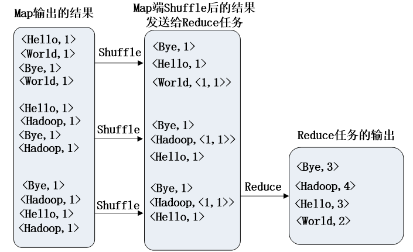
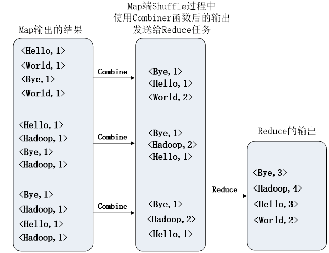
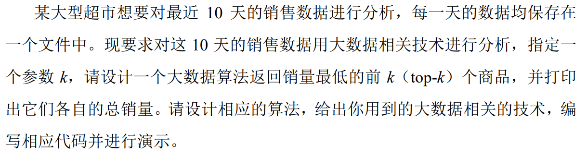
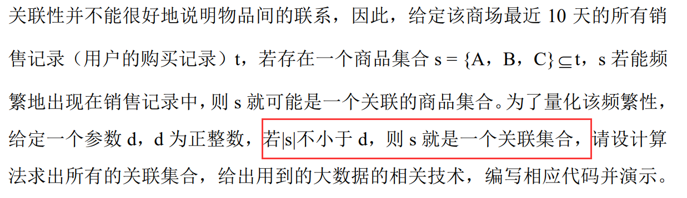

# MapReduce 技术原理

## Map 和 Reduce 方法

map 的输入是多个独立的键值对，经过 map 操作之后，应该要映射成一个 hash list。

> 例：
>
> 输入：$<k_1, v_1>, <k_2, v_2>, <k_3, v_3>, ....$
>
> 输出：$[<ka_1, va_1>, <k_2, va_2>, <k_3, va_3>,....]$

reduce 的输入是经过 shuffle 之后，将 key 相同的值合并为一个 list 作为 key 的值，经过 reduce 之后，得到单一的 hash。

> 例：
>
> 输入：$<ka_1, [va_{11}, va_{12}, va_{13},...]>$
>
> 输出：$<kb_1, vb_{1n}>, <kb_2, vb_{2n}>, <kb_3, vb_{3n}>, ....$

Map 任务的数量根据 split 的数量来定，split会根据文件大小进行分块，根据块大小将文件等分切分，如假设默认块大小为 64 MB，则现有输入的待统计的文件共有5个，且大小分别是 110 MB, 1 MB, 1 KB, 600 MB 以及 30 MB，则对每一个文件大小 $Size$ 除以块大小$B$ .
$$
number\_of\_block = \frac{Size}{B} \\
total\_number\_of\_block = \sum_{i=1}number\_of\_block_i
$$
Reduce 任务的数量取决于 slot 的数量。

## MapReduce 执行过程

MapReduce 的整体工作流程为：

1. 从 HDFS 加载文件数据，读入到 InputFormat，进行格式验证，然后执行 InputSplit 将多个数据切分，记录切分位置。
2. 将 InputSplit 切分的位置信息传给 RecordReader，读出对应不同切片位置的具体数据。
3. Map 端根据用户的操作进行 Map 操作。
4. 为了得到 <k, List(v)> 的结果作为 Reduce 的输入，需要通过 Shuffle 操作对 map 之后的数据进行整理。
   - 将 Map 结果写入缓存，等到缓存满之后启动溢写（溢出写入）操作，会对文件进行分区、排序、合并，最后将不同键值对进行归并。（将 <“a”,1>和 <“a”,1> 变成 <“a”,2>，然后再归并成 <“a”, [2,3]>）（指单个文件）
   - 最后将多个不同的溢写文件进行归并，合并成一个大文件。      
5. Reduce 任务来领取自己要处理的数据，从归并之后的磁盘文件当中获取。
   - Reduce 开始之前，从 Map 端领取属于自己的分区的数据，领取之后会被存放到 Reduce 任务所在的机器的缓存当中。
   - 之后会对数据进行归并，将从多个 Map 领取的数据像 Map 端一样执行溢写操作，溢写结束后会将多个溢写文件归并成大文件，归并的同时会对键值对**按照键值进行排序**。
   - 输入给 Reduce 任务。
6. 存储到 Reduce 任务对应的缓存当中，缓存满之后启动溢写操作，对输入 Reduce 的数据进行归并。（5，6 两步均在 Reduce 的 Shuffle 过程完成）
7. 将归并的数据输入 Reduce 端，根据用户的行为进行操作。最后输出到 OutputFormat。
8. OutputFormat 用来判断输出结果的类型和文件是否存在，输出对应的结果到 HDFS。

#### Map 流程

输入：多个输入的 $[k_1]$（**一个 Map 对应处理一个文件**）

操作：将输入的单个键值对，变成键值对 List（map 映射数据成为键值对，$v_1$ 的值取决于任务的目标，**取决于用户定义的操作**）

输出：$[<k_2, v_2>]$（其中一个文件的格式、结果，多个文件就形成一个 List）

#### Shuffle 流程

输入：$[<k_2, v_2>]$（其中一个文件的格式，多个文件就形成一个 List）

操作：在 Map 端结束之后，将文件写入缓存，缓存满启动溢写（分区，**排序**，合并），将多个 key 值相同的数据集归并成为一个 List。（将 map 之后的数据进行整理，对每个文件都是独立的，每个文件相同键值对的放到一起）

输出：$[<k_2, [v_2]>]$ （其中一个文件的格式，多个文件就形成一个 List）

#### Reduce 流程

输入：$[<k_2, [v_2]>]$（其中一个文件的格式，多个文件就形成一个 List）

操作：根据 Reduce 的操作将数据合并，得到最后对应的键值对结果。（$v_3$ 的值取决于任务的目标，也就是**取决于用户定义的操作**）

输出：多个输出的 $<k_3, v_3>$

最终流程：$<k_1, v_1> \rarr <k_2, v_2> \rarr <k_2, [v_2]> \rarr <k_3, v_3>$

> #### Attention
>
> - Map 和 Shuffle 操作都是单个文件进行，而 Reduce 则是操作所有单个文件 Shuffle 完的结果，对所有计算的结果进行合并得到最终的结果

## 基本关系运算转化为 MapReduce 方法

> 把任意形式的数据输入转换为**键值对**（Map），将相同键值的合并成一个 List 或者 value（Shuffle），整理输出的结果为相应的格式（Reduce）

- 选择

  只需要在 Map 端按照条件选择对应的 key 即可，构造$<t,t>$键值对，shuffle 和 reduce 无需任何操作，直接归并输出就行。（$t$ 表示关系当中的一个元组，也就是一行）

- 投影

  在 Map 端留下所选择的字段，形成新元组 $t'$，构造键值对 $<t', t'>$，shuffle 当中需要把相同键的合并到一起，在 Reduce 端剔除多余的 value 之后输出 $<t', t'>$

- 并集

  在 Map 端对两个关系构造 $<t, 1>$ 键值对，Shuffle 则是将 key 相同的 value 进行累加，Reduce 则负责判断 value 不等于 0 即可，输出 key。

- 交集

  Map 过程与并集相同，Shuffle 则是将 key 相同的 value 进行累加，Reduce 端判断 value 是否等于 2 即可。

- 差集

  在 Map 端对两个关系构造 $<t, R>$ 和 $<t, S>$ 键值对（R 和 S 代表两个关系名），Shuffle 把相同键的合并成同一个 List， Reduce 则筛选出 value 中只含 `被减关系` 的关系名的 key 作为输出。

- 自然连接

  Map 过程中，把两个关系当中都有的字段作为 key，也就是被连接的字段，构造$<R_b, [R,R_a,...]>$，$<S_b, [S,S_c,...]>$ 键值对。（$R_a$ 表示 R 关系的 a 字段，$S_b$ 表示 S 关系的 b 字段，这里假设关系为 $R(a,b)$ 和 $S(b,c)$）对要进行自然连接的两个关系都做同样的操作，Shuffle 也是把相同键值的放到一个 List，那么 Reduce 的过程，就要筛选出 R 和 S 中共同具有的字段 B 的元组进行合并，输出结构为 $<R_b, [R_a, S_c,...]>$
  
- 左连接

  Map 过程与自然连接相同，Shuffle 也是把相同键值的放到一个 List。Reduce 的过程则是输出 $<R_b, [R_a, null,...]>$

- 右连接

  Map 过程与自然连接相同，Shuffle 也是把相同键值的放到一个 List。Reduce 的过程则是输出 $<R_b, [null,...,S_c]>$

## 大作业第3、5题设计思路（WordCount 问题）

没有 Combiner 的结果

有 Combiner 的结果

- WordCount 问题的解决思路：

  本质上，很多问题都可以被转化成 wordcount 问题，wordcount 问题主要你先解析出不同文件的内容，单纯的文本单词你也不能够使用，所以为了能够使用 MapReduce 解决，我们通常都会通过 Map 方法建立一个键值对的关系。

  在 wordcount 里面我们的目标是解决统计单词的出现次数，所以我们在做 map 的时候，用单词作为 key，用 value 作为出现的次数，那么默认你每个单词都是独立存在的，所以出现次数都是 1。所以构建 $<word, 1>$ 的键值对。

  Shuffle 过程中，会将相同 key 的键值对进行组合，得到 $<word, List(times)>$ 的键值对（对每个文件都有一个这样的键值对）。times 表示由相同 key 的 value 组成的 List。如果有定义 Combiner 则可以直接用 每个单词出现的次数的数值代替 List， 也就是让 Shuffle 过程中得到的键值对中的 value 自动计算 List 的长度来得到出现次数。

  Reduce 过程主要就是整理所有文件的结果，把所有结果进行累加，得到最终结果。

### 第三题

Top-k 问题本质上是一个**排序**问题，因为只要将序列排好之后，通过索引 k 就能够得到对应的结果。所以，这道题我们本质上在使用 MapReduce 进行排序。

本题当中

解题思路 1：首先，将该问题变成一个经典的 wordcount 问题，word 即为商品名称，对应的 count 可以直接从原始文件中取，这样 **Map 任务即输出<商品，数量>的集合**，假设一**个文件对应一个 Map 任务，则 Reduce 端不需要任何处理，直接将最终的<数量，商品>写入HDFS 即可**，之所以是<数量，商品>的集合，**是因为 Shuffle 过程中会对 key 进行排序，若key 为数量，则我们不需要写任何排序代码**，将**第一次 MapReduce 生成的文件直接进行MapReduce 任务**，Map 直接读即可，**Reduce 端直接迭代并倒序输出即可**，不需要任何多余的代码。该方法代码量非常少（可能自己写的代码只要十几行），实现也非常容易。（第一次 MapReduce 是为了输出成 <数量，商品> 的集合，第二次是为了排序）

解题思路 2：该思路**只需要一次 MapReduce 过程，Map 过程类似于 wordcount 过程**，在Reduce 任务中，**可以获得所有商品的销售总量的哈希表，基于这个哈希表**，我们可以设计非常多高效的方法进行 Top-k 极值的选择，**最简单的方法就是先排序，再取前 k 个，代码量也很少，且容易实现，但时间复杂度为 O(n2)**。当然，这里面还有很多很多巧妙的解决方式，不 需 要 全 排 序 既 可 以 拿 到 结 果 ， 详 细 请 戳 ：https://blog.csdn.net/wufaliang003/article/details/82940218，最快可达到 $O(logn)$，请同学们根据自己的兴趣进行发挥。

### 第五题

题目所问的

这里可以看出，我们需要计算出一个 $d$，使得 $|s| \ge d$，那这个其实就是典型的 wordcount 问题，需要对 $d$ 进行计数。也就是给定某个集合，使得这个集合出现的次数超过 $d$ 之后就要输出。

基于 MapReduce 的特性，我们 Map 的输出一定得是 <集合，在当前数据集中存在的个数> 这样的一个键值对， 然而，数据集给的是一条一条的记录，一个记录里可能包含了很多的集合，因此，本题的难点在于如何把这些集合都拆解出来，而拆解集合其实就是一个求子集的过程，每读到一条购物记录，则将其所有子集拆出来（只含 1 项的去掉），然后转化为 $<子集，1>$ 的形式，这样 又变成了 1 个 wordcount 问题，Reduce 端不需要做任何处理，只要判断某个集合的计数是否 不小于 d，若不小于 d 则输出即可。
