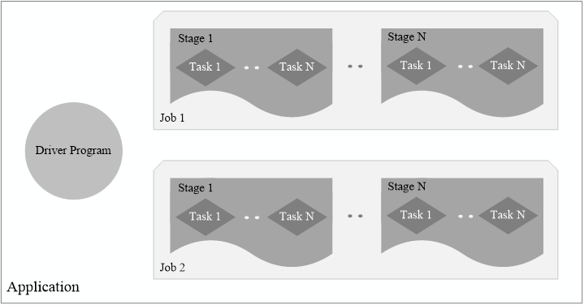
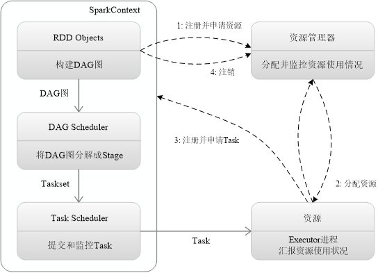
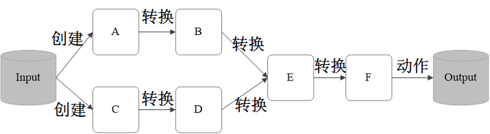
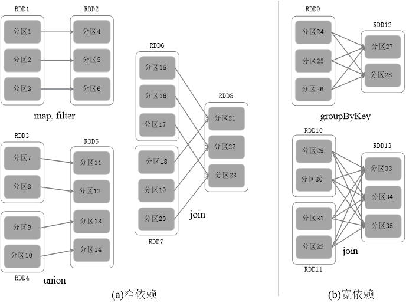

# Spark技术原理

## 基本概念

- RDD：是Resillient Distributed Dataset（弹性分布式数据集）的简称，是一种**共享内存**模型，本质上是一个只读的分区记录的 List，RDD 当中可以被划分多个分区，每一个分区就是一个数据集的片段。（内存共享就可以直接读取，不需要经过内核和 HDFS）。提供了 “动作” ( Action ) 和 “转换” ( Transformation )两种类型的数据操作。
- DAG：是Directed Acyclic Graph（有向无环图）的简称，反映RDD之间的依赖关系
- Executor：是运行在工作节点（WorkerNode）的一个进程，负责运行Task
- Application：用户编写的Spark应用程序
- Task：运行在Executor上的工作单元 
- Job：一个Job包含多个RDD及作用于相应RDD上的各种操作
- Stage：是Job的基本调度单位，一个Job会分为多组Task，每组Task被称为Stage，或者也被称为TaskSet，代表了一组关联的、相互之间没有Shuffle依赖关系的任务组成的任务集



## Spark 和 Hadoop 的对比

- Spark 的优点

  1. 计算模式与 Hadoop 相同，**但支持更多的操作类型，编程模型更加灵活**

  2. **提供了内存计算**，能够将中间结果保存在内存当中，计算效率和速度更高

  3. **基于 DAG 的任务调度执行机制**，优于 Hadoop 的迭代执行机制

- Hadoop 的缺点

  表达能力有限

  磁盘 IO 开销大

  延迟高（任务之间衔接和 IO开销，当前任务必须等前一个任务执行完毕之后才可以开始执行当前任务，复杂、多阶段的计算任务性能不佳）


## Spark 基本运行流程



1. 构建环境，由 Driver 创建 SparkContext，资源申请、任务分配和监控
2. 资源管理器为 Executor 分配资源，启动 Executor 进程
3. SparkContext 根据 RDD 的血缘关系构建 DAG 图，将 DAG 提交到 DAG Scheduler，将 DAG 图分解成 Stage 构建 Taskset，把 Taskset 提交到 TaskScheduler 底层调度器，Executor 向 SparkContext 申请 Task，Task Scheduler将Task发放给 Executor 运行。
4. Task 在 Executor 上运行，把执行结果反馈给 TaskScheduler，再反馈到 DAG Scheduler，写入数据，释放资源。

特点：每个应用程序都有自己的 Executor 来执行，且一切运行只与 Executor 进程有关，只要保持通信即可。Task采用了数据本地性和推测执行等优化机制。

## RDD的概念，对“血缘关系”以及“惰性调用”的理解

### RDD 概念

RDD 其实就是一个只读的分区记录集合，这个集合存的是数据集片段，因为是只读的，所以不能被修改。要修改只能先创建 RDD，然后在 RDD 上执行 转换操作，从而得到新的 RDD。

> 其实就是把数据进行封装，全部聚集到一起，通过特定的方法来对 RDD 当中更多数据进行操作。

RDD提供了一组丰富的操作以支持常见的数据运算，分为“动作”（Action）和“转换”（Transformation）两种类型操作。

- 转换：map、filter、groupBy、join等（都是粗粒度数据的操作），返回 RDD 类型的数据

- 动作：count、collect 等，返回 RDD 或者 非 RDD 类型的数据

### 血缘关系



RDD 典型的执行过程如下：

- RDD 读入外部数据源进行创建

- RDD 经过一系列的转换（Transformation）操作，每一次都会产生不同的RDD，供给下一个转换操作使用

- 最后一个 RDD 经过“动作”操作进行转换，并输出到外部数据源

这样一个过程就被称作 “血缘关系”，也就是对 DAG 进行**拓扑排序**的结果。上述图就叫做血缘关系，你可以理解为计算图。

### 惰性调用

**惰性调用指 DAG 在输出结果数据之前不会进行任何计算，当被要求输出结果之后才会从头开始按照计算图进行计算。**

惰性调用指的是，上述过程中经过一系列的 “转换” 逻辑上生成了 F，但是实际上还没有开始进行计算，只是构建了一个计算图，当 F 要开始输出，执行动作的时候，才会从起点开始根据 RDD 的血缘关系生成 DAG，并从头开始真正的计算。

也就是说，整个执行过程是不会主动进行计算的，而是要等到最后一个 RDD 开始输出的时候，才会调用前面的计算逻辑并生成 DAG。这个调用方法是惰性的，不会主动调用，而是等着别人来调用。

## RDD的操作，以及各个操作的辨析（图10-12）



- 窄依赖的操作：map、filter、union、join

  map,filter → 两个集合一对一（映射和过滤都是经过某个函数之后得到新值，原结构不变）

  union → 三个集合，两个集合一对一，指向第三个集合的不同节点（并集就是全部合并起来）

  join → 三个集合，两个集合一对一，指向第三个集合的任意节点（join 类似并集，是根据条件返回配对成功的）

- 宽依赖的操作：groupByKey、join

  groupByKey → 两个集合多对多（根据 key 来分组）

  join → 三个集合，两个集合多对多，指向第三个集合的任意节点（根据条件返回配对成功的）

> join：返回结果是前面和后面集合中配对成功的，过滤掉关联不上的

- 转换

  > 都是粗粒度数据的操作，都返回 RDD 类型的数据。

  filter(func)：筛选满足函数 func 的元素，返回一个新的 RDD。

  map(func)：将每个元素传递到函数 func 中，并返回一个新的 RDD，也原来的输入结构一样，只是经过 func 映射到新的值。

  flatMap(func)：与 Map 类似，先映射后扁平化。第一步与 map 相同，第二步会将 map 之后的结果合并成同一个对象 (Array)。

  groupByKey()：应用于 <K, V> 键值对的数据集，返回一个 <K, Iterable <V\>> 的数据集。function 返回 key，传入的 RDD 的各个元素根据这个 key 进行分组。

  reduceByKey()：应用于 <K, V> 键值对的数据集，返回一个新的 <K, V> 的数据集，将每个 key 传入到函数 func 中进行聚合。按照相同的 key,对 value 进行聚合（求和）。

- 动作

  > 不一定返回 RDD 类型的数据。

  count：返回数据集中元素的个数

  collect：以数组的形式返回数据集中的所有元素

  first：返回数据集中第一个元素

  take(n)：以数组的形式返回前 n 个元素

  reduce(func)：通过函数 func 聚合数据集中的元素
  
  foreach(func)：将数据集中每一个元素传到 func 函数中运行

## RDD的容错方式

> **粗粒度**：表示类级别（大类），仅考虑目标对象的类别，不考虑其实例（子集）。**一整个数据集。**
> **细粒度**：表示实例，即对象的实例（类别中的子集） 细粒度是在考虑粗粒度的对象类别之后才再考虑特定实例。**具体到特定的数据。**

- RDD 天生具有容错机制

  **因为 RDD 只读，不可以修改的特性**，所以出现错误的时候每次都会重新通过 RDD 之间的依赖关系（血缘关系）图重新计算丢失分区的数据，所以根据不需要数据冗余来实现容错，**因为每次的数据都是重新计算的。**

- **因为 RDD 的转换操作都是一些粗粒度的操作**，不需要记录具体的数据和各种细粒度操作的日志，降低了密集型应用中的容错开销。

## 宽依赖和窄依赖概念

- 宽依赖

  宽依赖则表现为存在**一个父RDD的一个分区对应一个子RDD的多个分区**（一对多）

- 窄依赖

  窄依赖表现为**一个父RDD的分区对应于一个子RDD的分区**或**多个父RDD的分区对应于一个子RDD的分区**（一对一 或 多对一）

## Stage 的划分

- 划分原则

  1. 反向来看 DAG 图，当遇到宽依赖就要断开
  2. 把断开处之前的 RDD 形成一个 Stage
  3. 窄依赖要划分到一个 Stage

  每当形成一个宽依赖就要划分一个 Stage，注意最外层也是一个 Stage

## 彻底搞懂RDD的wordcount代码（10.5.2）

```scala
val textFile = sc.textFile("file:///usr/local/spark/test.txt")
val wordCounts = textFile.flatMap(line => line.split(" ")).map(word => (word, 1)).reduceByKey((a, b) => a + b))
wordCounts.collect()
```

转化成人能看懂的 😓

```scala
def wordCount(textFile) {
    before_map = textFile.flatMap(line => line.split(" "));
    map_res = before_map.map((word) => {
        return (word ,1);
    });
    reduce_res = map_res.reduceByKey((a, b) => {
        return a + b;
    });
    return reduce_res.collect();
}

val textFile = sc.textFile("file:///usr/local/spark/test.txt");
val count = wordCount(textFile);
println(count)
```

