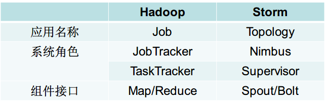
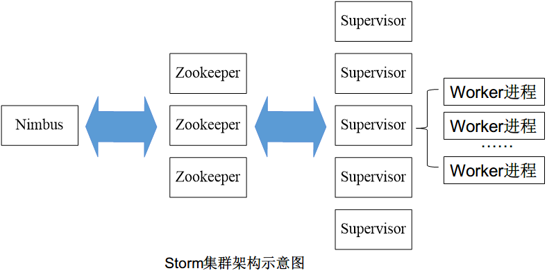
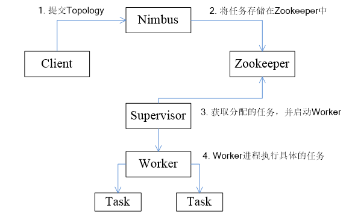
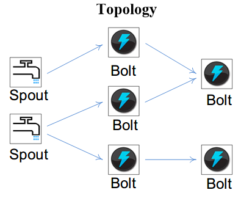
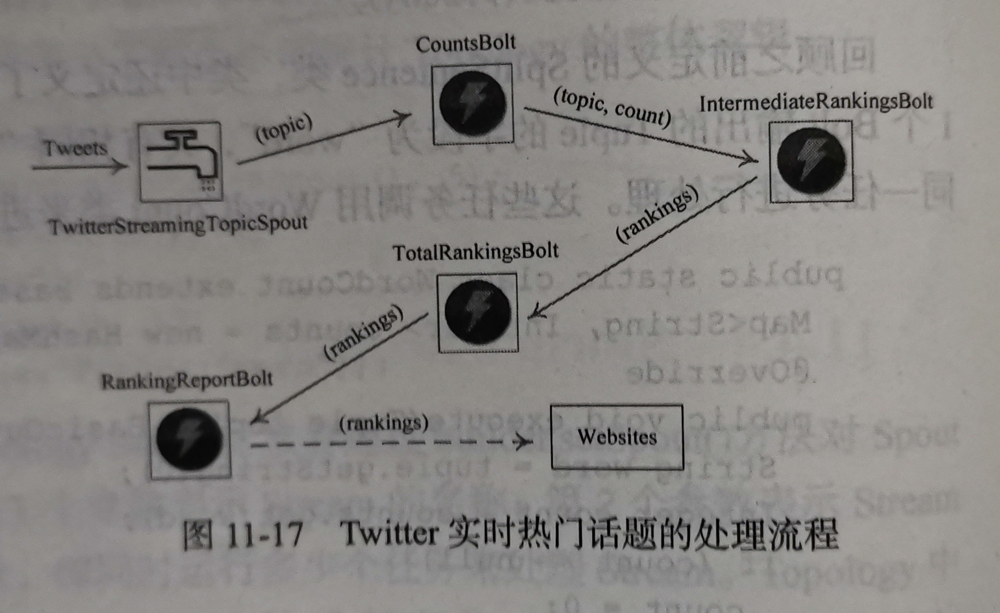

# Storm 技术原理

## 流计算概述

**流数据特征：**

1. 数据快速持续到达，潜在数据量无穷无尽
2. 数据来源众多、格式复杂
3. 数据量大，不十分关注数据存储
4. 注重数据的整体价值，不过分关注个别数据
5. 数据顺序颠倒，或者不完整，系统无法控制将要处理的新到达的数据元素的顺序

## 流计算系统需求

1. 高性能
2. 海量式
3. 实时性，保证较低时延
4. 分布式，支持大数据的基本架构、必须能实施扩展
5. 易用性，能够快速开发和部署
6. 可靠性，能够可靠的处理流数据

## 框架设计

Hadoop 和 Storm 彼此组件对应关系



Storm 运行任务的方式与 Hadoop 类似：Hadoop 运行的是 MapReduce 作业，而 Storm 运行的是 “Topology”

### Storm 工作流程





1. 客户端提交 Topology 到 Nimbus，对 Topology 分割成 多个 Task
2. 存储到 Zookeeper
3. Supervisor 从 Zookeeper 获取任务
4. Supervisor 启动对应的 Worker 进程，执行具体的任务

## 彻底读懂Storm的wordcount代码（11.4.5）

SplitSentence.java

```java
public static class SplitSentence extends ShellBolt implements IRichBolt {
    public SplitSentence() {
        super("python", "splitsentence.py");
    }
    public void declareOutputFields(OutputFieldsDeclarer declarer) {
        declarer.declare(new Fields("word"));
    }
}
```

splitsentence.py

```python
import storm
class SplitSentenceBolt(storm.BasicBolt):
	def process(self, tup):
        words = tup.values[0].split(" ")
        for word in words:
            storm.emit([word])
```

WordCount.java

```java
public static class WordCount extends BaseBasicBolt {
    Map<String, Integer> counts = new HashMap<>();
    
    @Override
    public void execute(Tuple tuple, BasicOutputCollector collector) {
        String word = tuple.getStirng(0);
        Integer count = counts.get(word);
        if (count == null)	count = 0;
        count++;
        counts.put(word, count);
        collector.emit(new Values(word, count));
    }
    
    @Override
    public void declareOutputFields(OutputFieldsDeclarer declarer) {
        declarer.declare(new Fields("word", "count"));
    }
}
```

main.java

```java
TopologyBuilder builder = new TopologyBuilder();
builder.setSpout("sentences", new RandomSentenceSpout(), 5);
builder.setBolt("split", new SplitSentence(), 8)
    .shuffleGrouping("sentences");
builder.setBolt("count", new WordCount(), 12)
    .fieldsGrouping("split", new Fields("word"));
```


setSpout()：第一个参数表示 Stream 的名称，第二个参数为 Stream 处理的具体函数或类，第三个则表示并发数。

setBolt()：第一个参数表示 Bolt 的名称，第二个参数为 具体处理的函数或者类，第三个则表示并发数

setBolt() 方法会返回 Bolt 对象，通过设置 Grouping 方法来筛选对应的数据。

## 拓扑图

Storm 将 Spouts 和 Bolts 组成的网络抽象成 Topology，它可以被提交到 Storm 集群执行。

Topology 可视为流转换图，图中节点是一个 Spout 或 Bolt，边则表示 Bolt 订阅了哪个 Stream。当 Spout 或者 Bolt 发送元组时，它会把元组发送到每个订阅了该 Stream 的 Bolt 上进行处理。





## Storm 分组策略辨析

1. ShuffleGrouping：**随机分组**，随机分发 Stream 中的 Tuple，保证每个 Bolt 的 Task 接收 Tuple 数量大致一致

2. FieldsGrouping：**按照字段分组**，保证相同字段的 Tuple 分配到同一个 Task 中
3. AllGrouping：**广播发送**，每一个 Task 都会收到所有的 Tuple
4. GlobalGrouping：**全局分组**，所有的 Tuple 都发送到同一个 Task 中
5. NonGrouping：**不分组**，和 ShuffleGrouping 类似，当前 Task 的执行会和它的被订阅者在同一个线程中执行
6. DirectGrouping：**直接分组**，直接指定由某个 Task 来执行 Tuple 的处理


## Spark Sstreaming 与 Storm 的对比

主要区别：

1. 实时性：一般 Storm 的时延性比 spark streaming 要低，原因是 Spark Streaming 是小的批处理，通过间隔时长生成批次，一个批次触发一次计算，Storm 是实时处理，来一条数据，触发一次计算，所以可以称 spark streaming 为流式计算，Storm 为实时计算。

2. 吞吐量 ：Storm 的吞吐量要略差于 Spark Streaming，原因一是 Storm 从 spout 组件接收源数据，通过发射器发送到 bolt，bolt 对接收到的数据进行处理，处理完以后，写入到外部存储系统中或者发送到下个 bolt 进行再处理，所以 storm 是移动数据，不是移动计算；Spark Streaming 获取 Task 要计算的数据在哪个节点上，然后 TaskScheduler 把 task 发送到对应节点上进行数据处理，所以 Spark Streaming 是移动计算不是移动数据。批处#理的吞吐量一般要高于实时触发的计算。
3. 容错机制：storm 是 acker（ack/fail消息确认机制）确认机制确保一个 tuple 被完全处理，Spark Streaming 是通过存储 RDD 转化逻辑进行容错，容错机制不一样，暂时无所谓好坏。

适用条件：

1. 在那种需要**纯实时**的场景下使用 Storm
2. 由于 Storm 可以动态调整实时计算程序的并行度，所以在需要针对高峰低峰时间段，动态调整实时计算程序的并行度，以最大限度利用集群资源（通常是在小型公司，集群资源紧张的情况）的情况下，考虑用 Storm。
3. **复杂的实时计算逻辑选用** Spark Streaming。
4. Spark Streaming 有一点是 Storm 绝对比不上的，那就是spark提供了一个统一的解决方案，在一个集群里面可以进行离线计算，流式计算，图计算，机器学习等，而 storm 集群只能单纯的进行实时计算。


Spark Streaming 无法实现毫秒级流计算，Storm 可以实现毫秒级响应。

Spark Streamikng 是按照批处理的计算模式，都会经过 DAG 分解，任务调度等过程，导致慢。Storm 处理单位为 Tuple，延迟低。


Spark Streaming 有一点是 Storm 绝对比不上的，那就是**spark提供了一个统一的解决方案**，在**一个集群里**面可以进行**离线计算，流式计算，图计算，机器学习等**，而 <u>storm 集群只能单纯的进行实时计算</u>。
