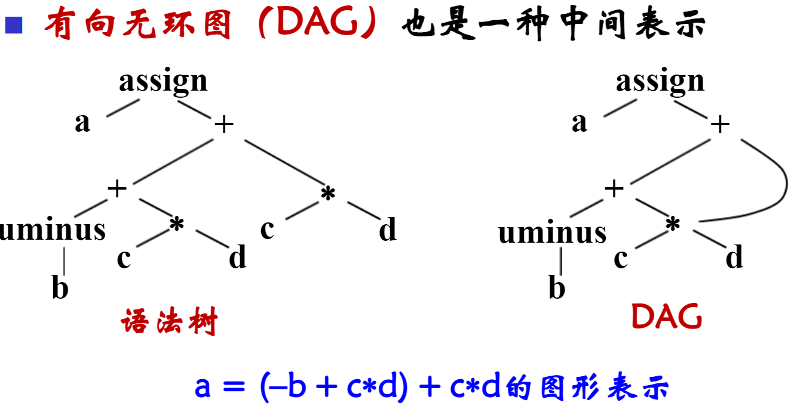
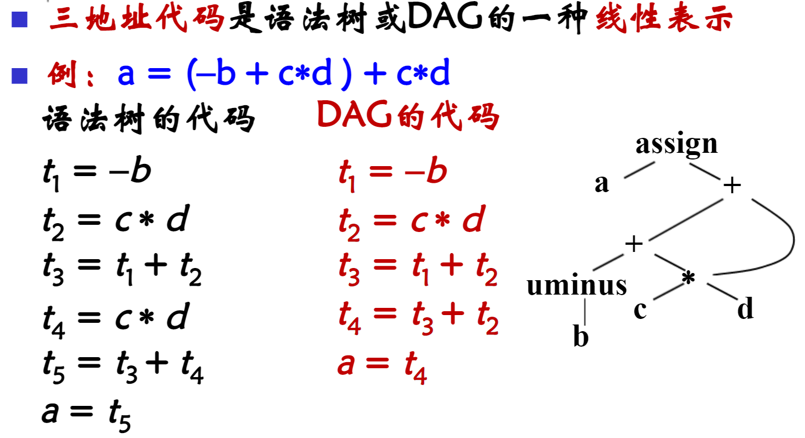
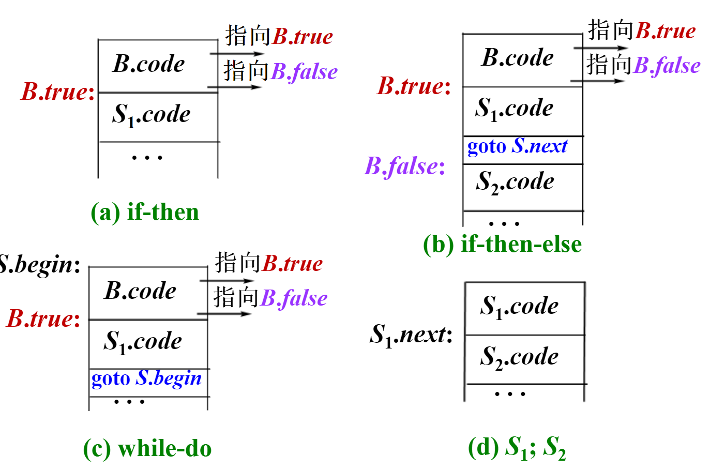
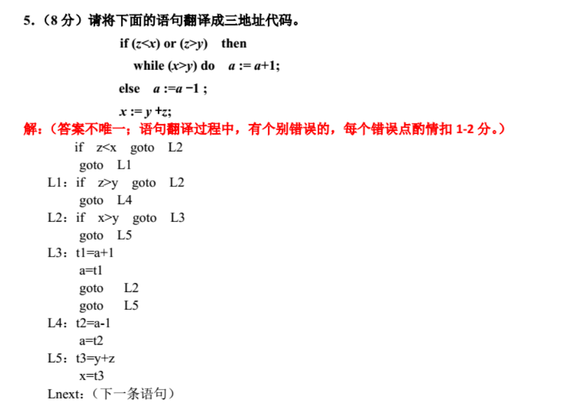
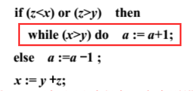
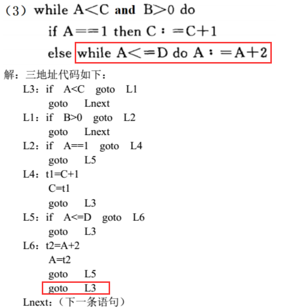

---
tags:
  - Course
  - 编译原理
---

# 中间代码生成

## 波兰表达式

中缀表达式转后缀表达式的方法：

1. 从最里面的括号开始计算，逐步拆解括号。
2. 将运算符放到最后，按照运算优先级，将运算优先级较小的往后放。

例：$-x-(y*z/(z-x)+y*x)$

1. 拆解 $(z-x)$ 得，-x - (y * z / z x - + y * z)
2. 调整符号顺序得，-x - (y z * z x - / y x * +)
3. 拆解 $(y\ z\ *\ z\ x\ -\ /\ y\ x\ *\ +)$ 得，x - y z * z x - / y x * + -
4. 得到答案。

## 三地址代码转换

### 有向无环图（DAG）

### 控制语句翻译

翻译过程：

1. 画出表达式的执行流程图

2. 根据流程图设计三地址代码的翻译

3. 结合三地址代码得到对应的翻译方案

   按照语句执行的顺序和逻辑来翻译即可。

:::caution

在 `if-then-else` 和 `while-do` 语句中需要写上 `goto S.next`（判断，跳到下一个代码块）或者 `goto S.begin`（循环。回到最初）

:::

:::danger 注意

把红框内的看成一个整体，因为在执行完里面的语句之后需要告诉 if 跳转到 `x := y + z` 处，所以后面需要加上一个 `goto (L1)`（L1 代指 `x := y + z` 的标号），这也就是上面答案出现的 `goto L5`。

把这个部分当成一个整体，然后需要告诉 if 执行完这里面的语句之后要跳转到哪。

while 同理，需要加上一条里面语句执行完之后要跳转到开头的语句。将红框内的语句当成一个整体，else 里面的语句执行完之后要告诉 else 下一个跳转的语句。

该情况只有在嵌套使用 `if` 和 `while` 的时候会出现。

:::
