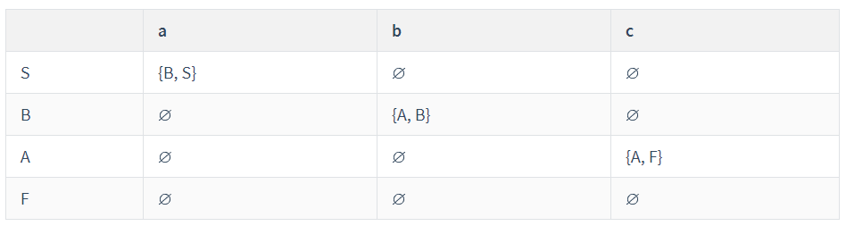
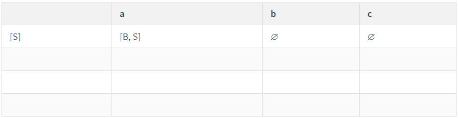
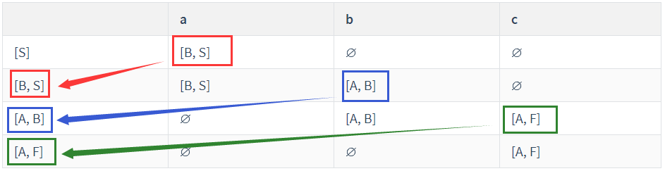
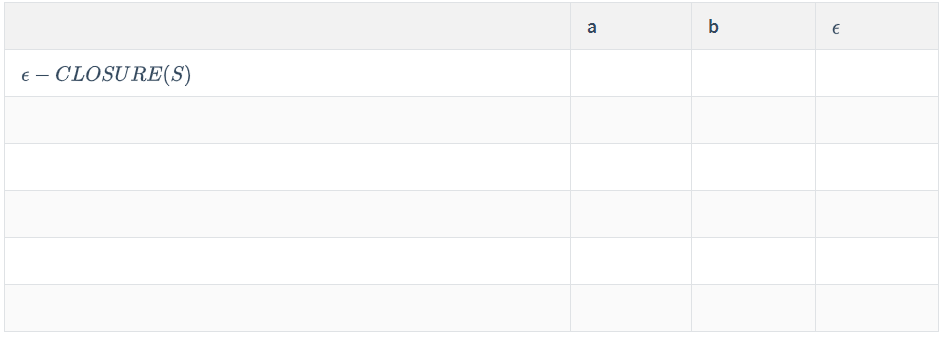
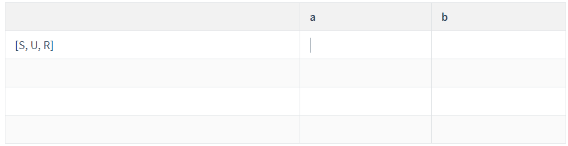
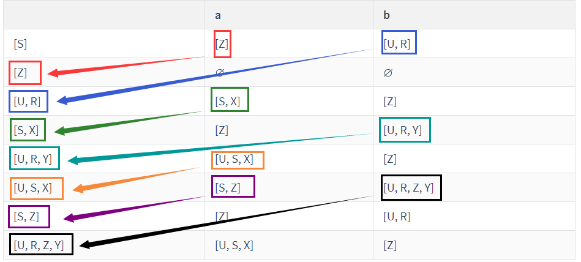

---
tags:
  - Course
  - 编译原理
---

# 词法分析

## FA 有限自动机

表达状态转换的过程，用来控制状态转化，表示从当前状态下满足什么条件之后应该转向什么状态。分别有 $NFA$、$\epsilon-NFA$、$DFA$、最小化 $DFA$ 

## 正规式

### 符号表示

- | 表示 “或”，表示选择
- \* 表示闭包运算，任意有限次的自重复连接
- $\cdot$ 表示 “连接”，可省略，连接两个式子

### 运算优先级

- \* 一元运算符优先级最高，左结合
- 其次为 “连接” $\cdot$ 运算，左结合
- “选择” | 优先级最低，左结合

## 正规式和 FA 的转换

 :::danger 注意

1. 对于正规式转 FA，在 $*$ 运算中，不是所有的都可以省略左右两边的空串。
2. 转换过程中，可以从优先级低的开始分解，优先级**从低到高**。

:::

- $*$ （闭包运算）转换如下图

  

- $\cdot$ （连接）转换如下图

  

- $|$ （选择/或运算）转换如下图

  

三种运算的**优先级从高到低**为：$* > · >\ |$

## NFA 确定化（子集构造法）

### 概念

NFA全称为不确定的有限自动机，也就是从一个状态开始，达到终态的过程中可以选择的状态不唯一，下一状态不唯一导致需要进行试探，如果不是正确的路径还要进行回溯。故对 NFA 进行**确定化**能够提高状态转换的效率。

### 求法

1. 根据**状态转换图**得出**状态转换矩阵**。

   

2. 确定初态 a，从初态 a 开始，将初态 a 对应的行写到结果表的第一行。

   

3. 根据初态 a 所接受的状态，如果出现了跟初态 a 不一样的状态 b，则从这个状态 b 开始，将所有 b 状态包含的元素进行合并，得到状态 b 转移的状态，以此类推。

   如：**红色箭头**为第一个新出现的状态，所以将原来状态转移矩阵中对应的状态 b 中包含的元素对应接受的下一个状态，即 $[B]_a=\varnothing, [S]_a=[B,S], [B,S]_a=[B]_a\cup[S]_a$。进行**并操作**。$[B,S]_a = [B,S],[B,S]_b = [A,B];$ 其他颜色同理，直到没有出现新的状态。

   

4. 重新命名状态，确定终态，一切包含 NFA 终态元素的集合在确定化后都是终态。

5. 画出 DFA

## ε-NFA 确定化（子集构造法）

### ε 闭包求解

$\epsilon$ 闭包表示的是所有仅通过标记为 $\epsilon$ 的路径所能够到达的集合，即经过所有带有 $\epsilon$ 标记的路径所经过的点组成的集合。例子如下：

:::caution

$\epsilon$ 闭包一定包含自己本身，因为任意一个节点都会通过自己回到自己。即$\epsilon-CLOSURE(X) \not=\varnothing$

:::

上例中解释如下：

- $\epsilon-CLOSURE(1)=\{1, 2, 3, 4\}$：1 能通过 $1\rarr 2$、$1\rarr 3\rarr 4$ 两条路径到达对应的点，所以它的闭包就包括了 2，3，4。
- $\epsilon-CLOSURE(2)=\{2\}$：2 没有标记 ε 的路径，所以只有它本身。
- 以此类推.......

### 求法

1. 根据**状态转换图**得出**状态转换矩阵**。

2. 求解状态转换图中所有节点对应的 ε 闭包。

3. 确定初态，从初态 a 的闭包开始，将初态 a 的闭包对应的行写到结果表的第一行，将初态 a 的闭包中包含的元素对应接受的下一状态。

   

   右侧需要填写对 S 计算闭包之后所包含的状态，把当前所包含的状态对应接受的下一个状态全部进行**并操作**。

   

   将 S，U，R 三个状态对应的下一个状态并起来，得到新的状态。

4. 根据初态 a 所接受的状态，如果出现了跟初态 a 不一样的状态 b，则从这个状态 b 的闭包开始（即$\epsilon-CLOSURE(b)$）开始，将所有 b 状态的闭包所包含的元素进行合并，得到状态 b 转移的状态，每一步得出结果后要套上 $\epsilon-CLOSURE(X)$，用闭包的结果代替。如果 $X$ 为集合则分别求解后进行**并操作**，以此类推。

   

5. 重新命名状态，确定终态，一切包含 NFA 终态元素的集合在确定化后都是终态。

6. 画出 DFA

## DFA 最小化

进行最小化要对当前确定化的 FA 进行划分。

1. 划分出终态集和非终态集。

2. 看两个集合的划分，以$\{0,2,3\},\{1\}$ 为例。

   - 对于 $\{0,2,3\}$ 而言，$\{0,2,3\}_a=\{1,1,1\}$，$\{0,2,3\}_b=\{2,2,3\}=\{2,3\}\subseteq \{0,2,3\}$，故无法区分。（说明是等价的）
   - 对于 $\{1\}$ 而言，只有一个元素，所以也无法区分。

3. 如果出现可以划分的则对其重新划分后再次判断是否可以继续划分，直到无法划分为止，即：

   - 对于 $\{0,2,3\}$ 而言，$\{0,2,3\}_a=\{1,1,1\}$，$\{0,2,3\}_b=\{2,3,1\}$，$\{0,2\}_b=\{2,3\}\subseteq \{0,2,3\}$。故 $\{0,2\}$ 不可划分，但 $\{3\}_b=\{1\}\not\subseteq \{0,2,3\}$，不是一家所以可以划分。

4. 修改原 DFA，画出新的状态转换图。
