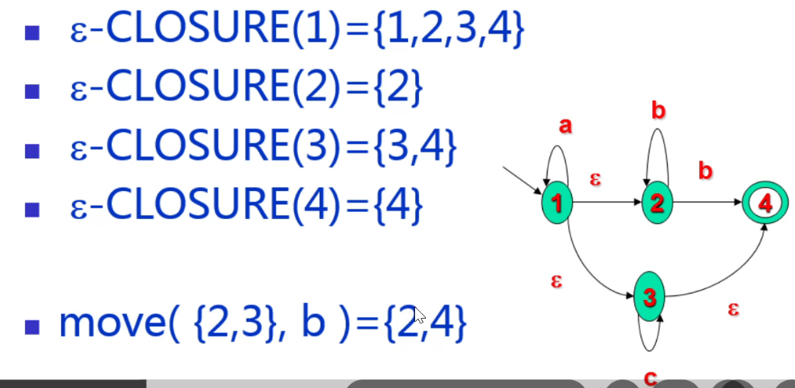

# 词法分析

## 正规式

### 符号表示

- | 表示 “或”，表示选择
- \* 表示闭包运算，任意有限次的自重复连接
- $\cdot$ 表示 “连接”，可省略，连接两个式子

### 运算优先级

- \* 一元运算符优先级最高，左结合
- 其次为 “连接” $\cdot$ 运算，左结合
- “选择” | 优先级最低，左结合

## NFA 确定化（子集构造法）

### 求法

1. 根据**状态转换图**得出**状态转换矩阵**。
2. 确定初态，对应状态转换图中对应初态的行写下来，并将集合转换成列表（即 {} 变为 []）
3. 根据初态得到的元素，将目前在表中不存在的元素进行求解，根据新列表当中的元素，合并列表中所包含元素的列，合并成列表后写到对应的位置。
4. 重新命名状态，确定终态，一切包含 NFA 终态元素的集合在确定化后都是终态。
5. 画出 DFA

## ε-NFA 确定化（子集构造法）

### ε 闭包求解

ε 闭包表示的是所有仅通过标记为 ε 的路径所能够到达的集合，即经过所有带有 ε 标记的路径所经过的点组成的集合。例子如下：

:::caution

ε 闭包一定包含自己本身，因为任意一个节点都会通过自己回到自己。即$\epsilon-CLOSURE(X) \not=\varnothing$

:::

上例中解释如下：

- $\epsilon-CLOSURE(1)=\{1, 2, 3, 4\}$：1 能通过 $1\rarr 2$、$1\rarr 3\rarr 4$ 两条路径到达对应的点，所以它的闭包就包括了 2，3，4。
- $\epsilon-CLOSURE(2)=\{2\}$：2 没有标记 ε 的路径，所以只有它本身。
- 以此类推.......

### 求法

1. 根据**状态转换图**得出**状态转换矩阵**。
2. 求解状态转换图中所有节点对应的 ε 闭包。
3. 确定初态，对应状态转换图中对应初态的行写下来，DFA 的初态要使用原 NFA 的初态的 ε 闭包作为初态。（设初态为 $S$，新初态为 $S’$，则$S’=\epsilon-CLOSURE(S)$），并将集合转换成列表（即 {} 变为 []）
4. 根据初态得到的元素，将目前在表中不存在的元素进行求解，根据新列表当中的元素，合并列表中所包含元素的列，合并成列表后写到对应的位置。每一步得出结果后要套上 $\epsilon-CLOSURE(X)$，用闭包的结果代替。如果 $X$ 为集合则分别求解后进行并运算。
5. 重新命名状态，确定终态，一切包含 NFA 终态元素的集合在确定化后都是终态。
6. 画出 DFA