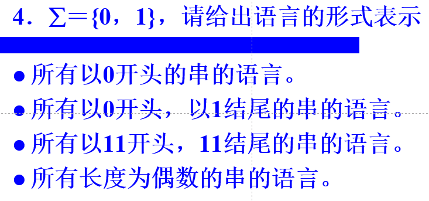
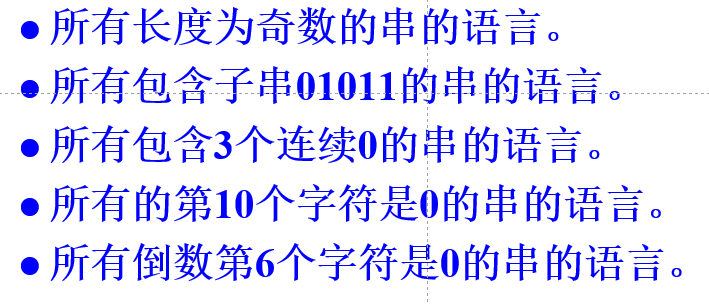

# 基础知识

## 语言

:::danger
万物皆是集合！
:::

### 前置知识

字母表 $\Sigma$：任意字符的集合是一个字母表 $\Sigma$。
特性：
1. 非空
2. 有穷
3. 单一

字符串 $s$：字母表 $\Sigma$ 中的字母按照某种顺序排列成的字符序列。$\epsilon$ 表示空串 (长度为 0 的字符串)。
语言 $L$：字符串 $s$ 组成的集合。

:::info 常用术语

1. {$\epsilon$}代表仅含有空串的集合。
2. 用 $\varnothing$ 代表空集：一个元素都不包含的集合。
3. 用 $\Sigma$ 代表字母表。
4. $\alpha\beta$ 表示两个字符串 $\alpha$ 和 $\beta$ 连接
若 $\alpha = a_1a_2a_3,\cdots, a_n$, $\beta = b_1b_2b_3,\cdots,b_m$
则 $\alpha\beta= a_1a_2a_3,\cdots, a_nb_1b_2b_3,\cdots,b_m$
且 $\alpha^2=\alpha\alpha, \epsilon\alpha=\alpha\epsilon=\alpha, \alpha^0=\epsilon$
:::

### 定义

对于字母表 $\Sigma$，则 $\Sigma^*$ 上任意一个子集都其中一种语言。称为 $\Sigma$ 上的一种语言 $L$。

对于 $\forall L\subset\Sigma^*$，$\forall w\in L$，则 $w$ 是语言 $L$ 上的句子。

## 集合运算

### 连接

$AB$ 表示两个集合的连接, $A=\{a_1,a_2,a_3,\cdots,a_n\}, B=\{b_1,b_2,b_3,\cdots,b_m\}$
$$
AB=\{
   a_1b_1, a_1b_2, a_1b_3, \cdots, a_1b_m,
   a_2b_1, a_2b_2, a_2b_3, \cdots, a_2b_m,
   a_3b_1, a_3b_2, a_3b_3, \cdots, a_3b_m,
   \cdots,
   a_nb_1, a_nb_2, anb_3, \cdots, a_nb_m
\}
$$

$A\varnothing = \varnothing A= \varnothing$
$A\{\epsilon\}=\{\epsilon\}A=A$
$A_2=AA$
$A_1=A$
$A_0=\varnothing$

$A^n$ 代表集合 $A$ 的 $n$ 次连接($n$ 次幂)
$A$ 的 $n$ 次幂定义为：
1. $A^0 = \{\epsilon\}$
2. $A^n = A^{n-1}A, n \ge 1$

### 闭包

$A^*$ 代表 $A$ 上所有字符串的集合，即表示集合 $A$ 中的所有串进行**任意次连接而形成的所有串的集合**。

$A^*$ 称为集合 $A$ 的闭包 (克林闭包)
> $A$ 所有情况的子集的并集，即 $A$ 的所有可能性。
$$
A^* = A^0 \cup A^1 \cup A^2 \cup\cdots\cup A^n=\bigcup^\infin_{i=0}A^i
$$

$A^+$ 称为 $A$ 的正闭包
> $A^*$ 去掉空串。
$$
A^+ = A^1 \cup A^2 \cup\cdots\cup A^n=\bigcup^\infin_{i=1}A^i
$$
$A^* = A^+ \cup A^0$，即 $A^* = A^+ \cup \{\epsilon\}$

:::info E.g. 
$A=\{0,1\}$

$A^0=\{\epsilon\}$, 即长度为0的0和1组成的串的集合。
$A^1=\{0, 1\}$，即长度为 1 的 0 和 1 组成的串的集合。
$A^2=AA=\{00,01,10,11\}$，即长度为 2 的 0 和 1 组成的串集合
$A^3=A^2A=\{000,001,010,011,100,101,110,111\}$，即长度为 3 的 0 和 1 组成的串的集合

$A^* = A^0 \cup A^1 \cup A^2 \cup \cdots \cup A^n = \{w | w 是 0 和 1 组成的串\}$

:::

## 练习

答案：第一章基础知识 PPT P121-P123
