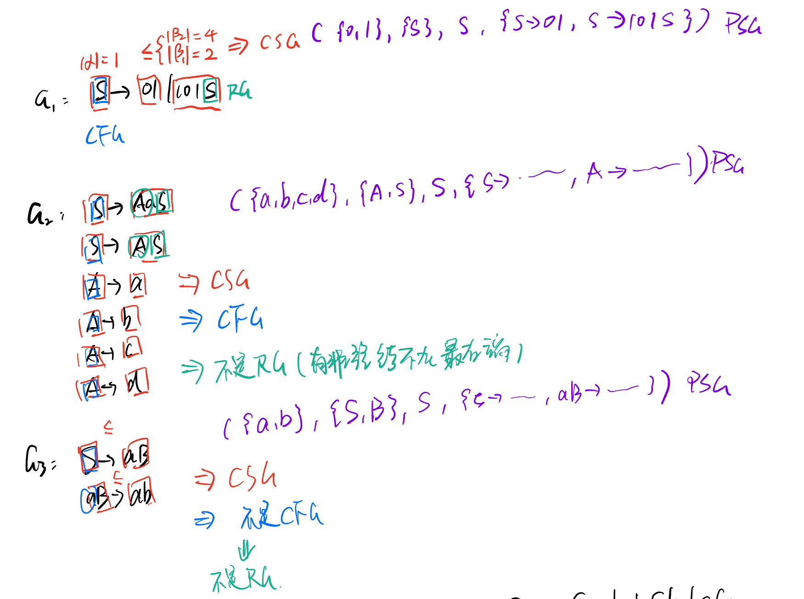
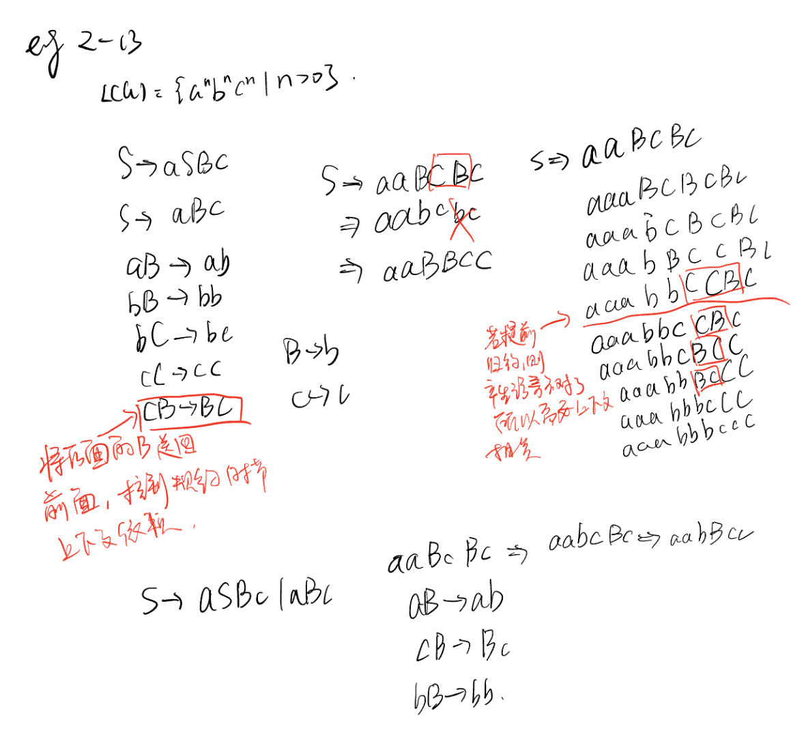
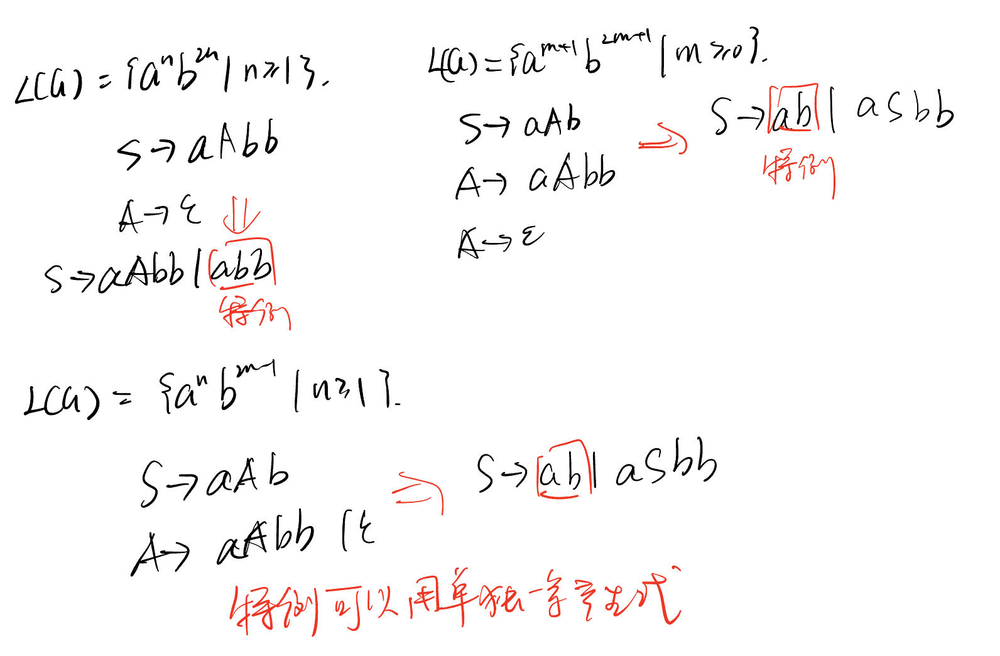
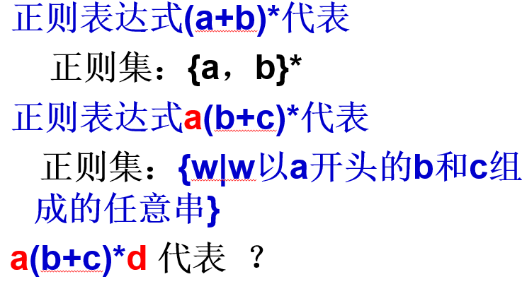
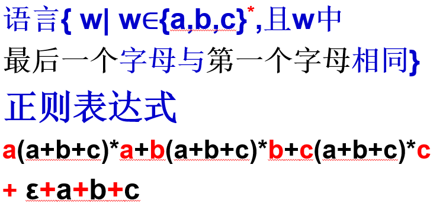

# 形式语言

  形式语言和自动机理论中的语言是一个宽泛的概念（不同于传统语言）。

- 一个字母表上的**语言就是该字母表的任意字符串的集合**。
-  语言中的**字符串称为该语言的句子**

一个语言应该有两方面来决定：

1. **产生**语言的角度（形式语言）

   根据语言中基本句子和其他句子的形成规则，产生该语言所包含的所有句子。

2. **接收/识别**语言的角度（自动机）

     使用自动机模型来接收字符串，接收的所有字符串，也形成一个语言。

## 定义

### 语言的定义

对于字母表 $\Sigma$，则 $\Sigma^*$ 上任意一个子集都其中一种语言。称为 $\Sigma$ 上的一种语言 $L$。

对于 $\forall L\subset\Sigma^*$，$\forall w\in L$，则 $w$ 是语言 $L$ 上的句子。

由 **文法** 产生 **语言**，从开始符号 $S$ 出发，经过推导生成句子，由句子组成语言。$L(G)=\{w|S\Rarr^* 且 w\in\Sigma^*\}$

一个语言表达的模式是固定的，表示一系列具有某种含义的句子，所以所有句子都是 $w\in L$，且 $\forall w$ 都是由 $L$ 产生。

## 文法的定义

$$
G=(\Sigma, V, S, P)
$$

其中，$\Sigma$ 表示终结符，$V$ 表示非终结符，$S$ 表示初始状态，$P$ 表示产生式的集合 $(\alpha\rarr\beta, \alpha\in(\Sigma\cup V)^+, \beta\in(\Sigma\cup V)^*)$

区分文法和语言：文法是产生语言的规则式子（产生式），语言是一系列文法表达的含义（语义）。

## 文法（语言）类型

### 短语结构文法（PSG）

任何文法都是 PSG，0 型文法

### 上下文相关文法（CSG）

对于 $\forall\alpha\rarr\beta\in P$，都有 $|\alpha|\le|\beta|$ 成立，则为 1 型文法。

标准形式为：$yAz\rarr ywz, y,z\in(\Sigma\cup V)^*, w\in(\Sigma\cup V)^+$

:::info

意思为文法是需要依赖上下文 $y$ 和 $z$ 的，需要上下文作为条件来产生句子。

:::

### 上下文无关文法（CFG）

对于 $\forall\alpha\rarr\beta\in$，都有 $|\alpha|\le|\beta|$ 且 $\color{red}{\alpha\in V}$，则为 2 型文法。

**所有非终结符均出现在产生式左边，且每条产生式只有一个非终结符。**

:::info

意思为和上下文无关，即不需要上下文的帮助也可以产生语言。

:::

### 右线性文法（RG）

对于 $\forall\alpha\rarr\beta\in$，都有 $A\rarr w$ 或 $A\rarr wB$，则为 3 型文法。

即左边只能出现一个字母，产生式右侧的非终结符出现在最右边。

### 文法类型判断

1. 任何文法都是 PSG
2. 所有产生式 左边长度 $\le$ 右边长度，则为 CSG
3. 满足 2 的前提下，产生式左边只有一个非终结符，则为 CFG
4. 满足 3 的前提下，产生式右边最多只有一个非终结符，且该终结符只出现在最右边，则为 RG

:::danger

请注意：CSG，CFG，RG，不含有 $\epsilon$ （$\alpha\rarr\epsilon$），但开始符号 $S$ 不出现在产生式右边，则可加入 $S\rarr\epsilon$，类型不变。

:::

一些例题：

## 正则表达式

$(R_1 + R_2), (R_1R_2), (R)^*, R^*, (R)^+, R^+$

## 本章核心

如何根据语言表达写出对应的文法。

