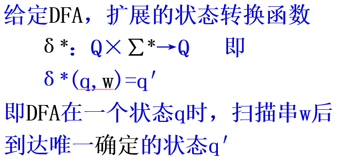
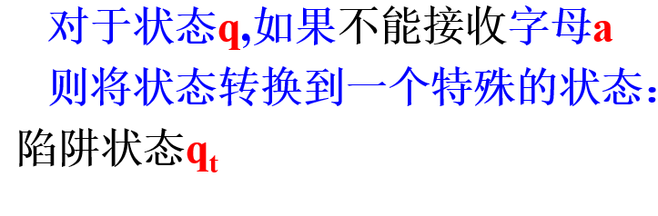
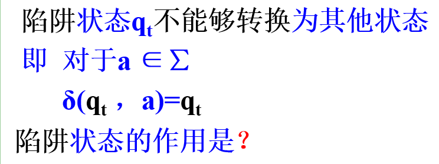
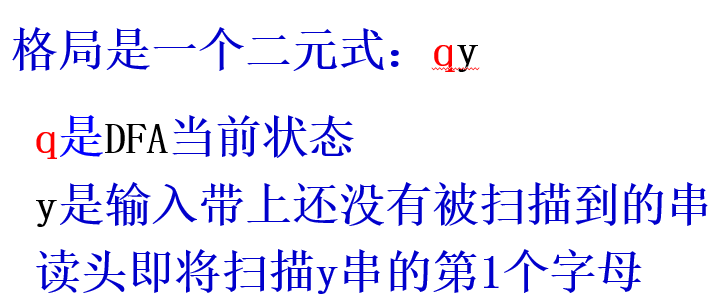
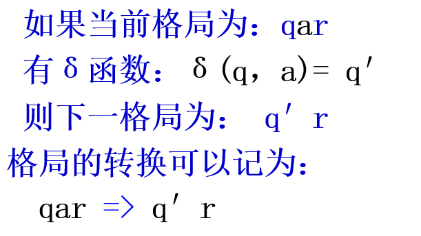
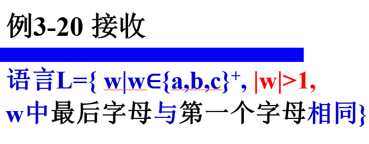
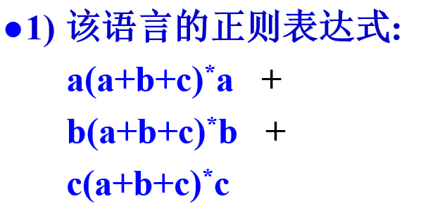
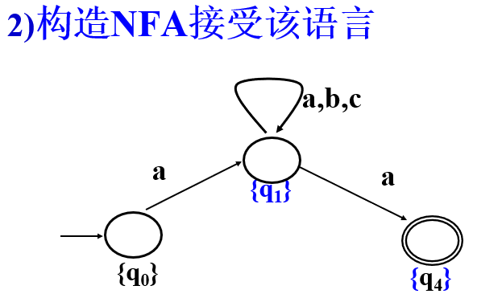
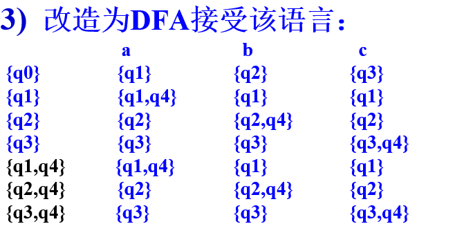

# 有限状态自动机

## 定义

FA是一个五元式
$$
FA=(Q，\Sigma，\delta，q_0，F)
$$
- $Q$ 是有限状态的集合

- $\Sigma$ 是字母表，即输入带上的字符集合

- $\delta$ 表示状态转移函数（$Q\times\Sigma\rarr Q$，即 $\delta(q, x)=q'$）代表 FA 在状态 $q$ 时，扫描字符 $x$ 后

  状态改变为 $q′$（也称到达状态 $q'$）

- $q_0$ 表示自动机的初态

- $F$ 表示自动机结束状态的集合

有限状态自动机的状态转换函数的个数应该为 $|Q|\times|\Sigma|$

对于Q中的每个状态，需要定义

对应∑每个字母的状态转换函数。

有向边的数目就是状态转换函数的个数**。** 

## DFA

对于不能接收的状态，应该要转换到一个特殊状态，陷阱状态

### 格局

格局是 DFA 某个瞬时状态的描述，格局发生变化是因为 $\delta$ 的一次作用。格局的转换如下：

### 停机

DFA 停机的情况是输入串扫描结束的时候，只有这个时候才可以停机，不然就是陷阱状态。

DFA将输入串扫描结束停机时，如果DFA处于某一个接收状态， 则表示接收整个输入串；反之，则表示不接收整个输入串

## NFA

扫描串w时，NFA的状态发生转换

可能会有三种情况：

- 可能在接收状态时终止；
- 可能在非接收状态时终止**；**
- 也可能在中途停止（中止）。

接收一个语言的步骤，做题步骤：

1. 给出该语言的正则表达式；
2. 构造 NFA 接受该语言；
3. 将 NFA 转换为等价的 DFA。

