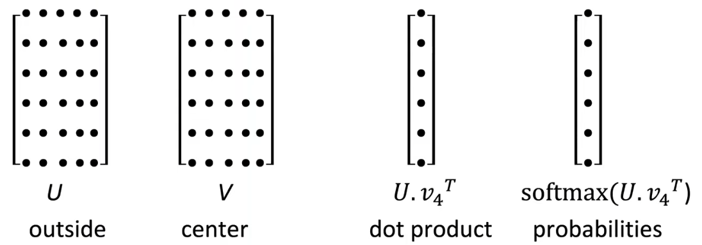
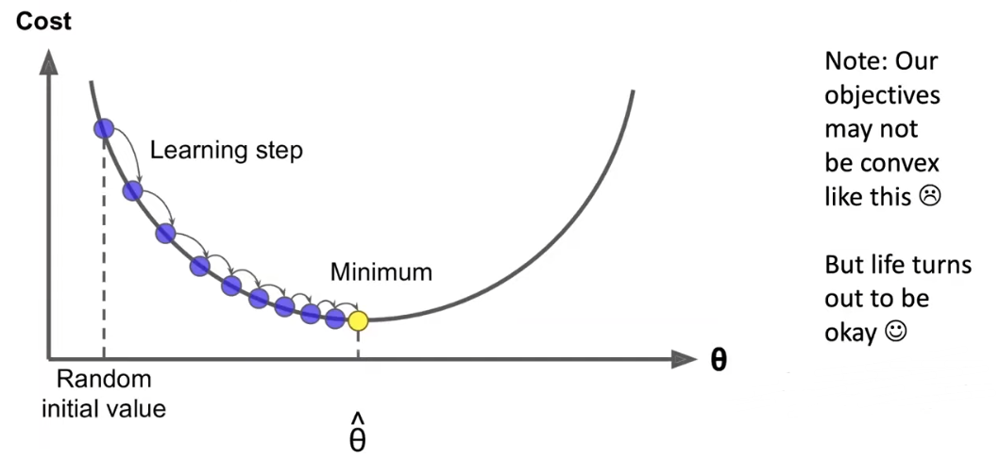

# Neural Classifiers

## Intro

本节课的目标：

1. 学会接触单词的词义
2. 学习神经网络分类器的概念
3. 能够顺场地看一些 word embedding 的论文，例如 Google word2vec 论文、GLoVe 论文等

## Review

上节课我们建立了如何构建 word vector 的模型，并且推导出如何求解和优化词向量模型，但这只是最简单的算法，这个算法能够比较好的学习单词之间的相似性和词义的方向，更好地预测周围的单词。

:::info Bag of Word Model

Bag of Word，也就是 NLP 当中的词袋模型。其实我们的词向量本质上也是一种词袋模型，他不会关注单词所在的位置或者顺序，预测的概率是相同的。但这种模型也是非常粗糙的，不够精细。  

:::

word2vec 其实是将意思相近的单词在高维的向量空间当中彼此靠近，将相似的单词分组。 

 

通过 $U$ 和 $V$ 的点乘，经过 softmax 后得到相应单词的概率。而词袋模型是对每个位置的单词都做同样的 prediction 的操作，我们最终的目标是对于每个单词出现的预测的概率最大。

## Word2Vec Optimization

构建目标函数之后需要求解其最优概率，去找到目标函数的最值，所以使用**梯度下降**进行优化。

梯度下降的核心思想是使用梯度来更新自变量，比较因变量之间的差距，通过不断更新自变量从而找到使得其函数达到最值的自变量的点。所以优化方式如下：
for a matrix:
$$
\theta^{new}=\theta^{old}-\alpha\nabla_\theta J(\theta) \\
$$

for a single parameter:
$$
\theta_j^{new}=\theta_j^{old}-\alpha\frac{\partial}{\partial\theta_j^{old}}J(\theta)
$$

但使用上面的方式会产生巨大的计算量，使得求得最值需要耗费长久的时间，所以提出 Stochastic Gradient Descent (SGD) 来优化，使用一批数据优化梯度下降的效率。

但是直接对 word vectors 使用梯度下降会产生一个问题，上下文间隔比较大的 word vector 可能概率值是很小的，所以就导致所计算的梯度矩阵是稀疏的（Sparse），从数学的角度上是合理的，但是从系统应用角度上这是不符合要求。

产生如下的稀疏矩阵：
$$
\nabla_{\theta}J_t(\theta)=\begin{bmatrix}
0 \\
\vdots \\
\nabla_{v_{like}} \\
\vdots \\
0 \\
\nabla_{u_I} \\
\vdots \\
\nabla_{u_{learning}} \\
\vdots
\end{bmatrix}\in \mathbb{R}^{2dV}
$$

所以提出了如下解决方案：

- We hope: 只更新真正出现在 word vectors 里面的参数
- Solution:
  1. 只更新整个 embedding matrices U 和 V 中的确实存在有单词的那几行
  2. 给 word vectors 记录 Hash 值

## Other Word2vec Algorithm

> 为什么需要两个向量？→ 更容易优化。（但可以实现每个单词一个向量的算法）

 对于 Word2vec 模型而言，还有一些变种的算法：

1. Skip-grams (SG)

   根据 center word 预测 context words

2. Continuous Bag of Words

   从 context words 预测 center words

提高训练效率的算法：

1. Negative Sampling (naive softmax methods)

### Skip-Gram Model with Negative Sampling

因为使用传统的 softmax 方法的计算量非常大，因为要遍历每一个单词。 所以提出了 Negative Sampling 来优化计算。Negative Sampling 的核心思想是：训练一个 true pair (center word and a word in its context window) 与多个 noise pairs (the center word paired with a random word) 的二元逻辑回归模型。

:::info

This method is from paper called “Distributed Representations of Words and Phrases and their Compositionality” (Mikolov et al. 2013)

:::

:::tip Main Idea

:::

最终的目标函数如下：
$$
J(\theta)=\frac{1}{T}\sum_{t=1}^TJ_t(\theta) \\
\sigma(x)=\frac{1}{1+e^{-x}} \\
J_t(\theta)=\log\sigma(u_o^Tv_c)+\sum_{i=1}^k\mathbb{E}_{j\sim P(w)}[\log\sigma(-u_j^Tv_c)]
$$
sigmoid function will become your good friends!

通过最大化两个向量同时成立的概率最大，而 noise words 的概率最小，从而达到最优解。
