# 训练神经网络

## 激活函数的选择

### Sigmoid

产生的问题

1. 饱和导致梯度消失

2. 输出都为正

   偏导数同号，所有梯度变化的方向相同

3. 使用 exp()，计算量较大。

### Tanh

特点：

1. 饱和导致梯度消失
2. 输出有正有负，关于 0 对称，避免了梯度变化方向相同的问题。

### ReLU (Rectified Linear Unit)

1. 不会饱和

2. 计算量很小

3. 收敛速度比 Sigmoid/tanh 要快 6 倍

4. 不是关于 0 对称的，且小于 0 的时候梯度为 0.

   因为小于 0 的情况下对应的神经元直接不激活，导致永远都不会更新，但我们还是希望一开始至少会能更新，使得一开始能偶输出一个梯度，所有的梯度都能进行更新，所以会给 ReLU 添加一个偏执项。

### Leaky ReLU

1. 不会饱和
2. 计算量小
3. 收敛速度快
4. 解决了 ReLU 小于 0 的时候梯度为 0 的问题，泄露出去一点梯度，不会出现 “死亡” 的神经元。

### ELU

1. 相比于 LReLU 更具有鲁棒性，改善了 ReLU 没有关于 0 对称的问题。
2. 但是指数运算带来更大的计算量

### Maxout

使用另一个神经网络对两个神经元的输出做处理。但是缺点是参数的个数成倍增加。

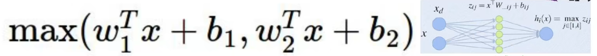

### 使用原则

TLDR: Too long didn’t read，废话少说

1. 设计神经网络的时候尽量在网络中间使用 ReLU 激活函数，并且注意学习率的调整，太大可能会梯度消失。

   因为如果在中间使用 sigmoid 可能就会导致梯度饱和导致梯度消失的问题，并且 sigmoid 计算量较大。

2. 可以尝试使用 LReLU / Maxout / ELU 等激活函数

3. 对 tanh 激活函数不要抱太大希望

4. 在中间层不要轻易使用 sigmoid，simoid 一般在网络的末尾使用，特定情况可以用

## 数据预处理

解决一个问题时候最关键的是从数据入手，对数据进行**特征工程**和分析，最后得出一个数据处理的方案，再使用神经网络拟合对应的数据才能达到更好的效果。

:::danger

大部分时间主要花在对于数据的预处理。

:::

### 标准化

标准化一般是指将数据规范到某一个数据分布的原点，如下图所示，原始数据是分布在某一个数据空间，通过标准化把数据规范到一个数据空间的中心，即原点。可以理解为将任意一个分布变成正态分布。

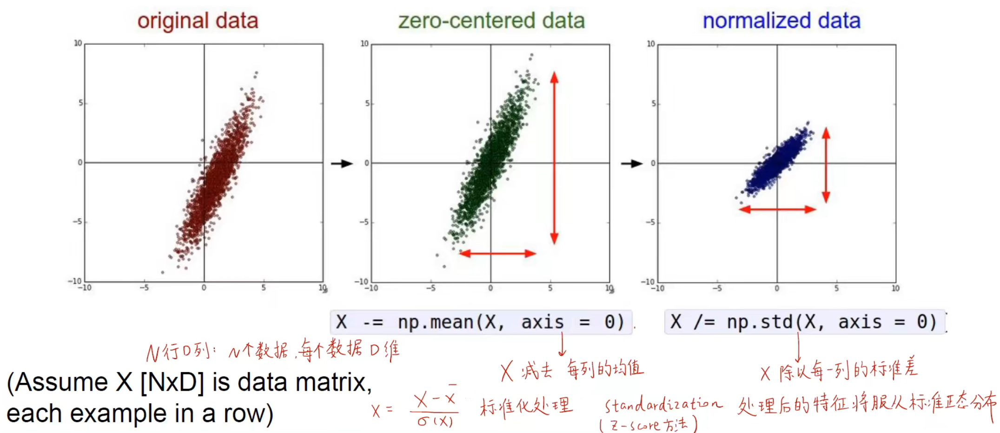

一般我们可以通过 PCA 主成分分析和白化对数据进行处理。


通过找到两个主成分对数据进行线性降维投影，最后对每个数据除以对应的标准差就是对数据的白化，转换为标准的正态分布。

- 对数据进行降维并方差为 1 的分布（PCA 白化）
- 对数据还原到原始的坐标系上（ZCA 白化）

### 标准化的作用

一般来说，在标准化之前的数据会对于微小的权重变化比较敏感，导致每次学习都需要用非常小的学习率去学习，也很难去优化。

而在标准化之后，损失函数对于权重微小变化不那么敏感，使得权重更容易优化，不会出现大幅度的震荡，使得能够更快的收敛。

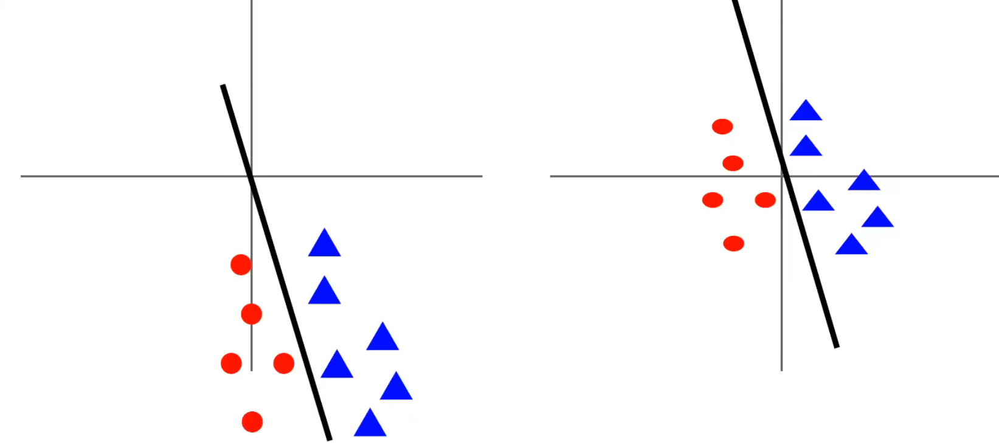

## 权重初始化

:::tip

设想一个问题：如果权重当中所有的数都相同会发生什么？

答：同一层当中所有的神经元的前向传播和反向传播完全相同，也就是说**中间所有的神经元都是等价**的。

:::

为了使得每一个神经元的权重互不相同，打破 “对称性”，使用不同的初始化方法变得尤为重要。

### 问题分析 

首先我们可以想到使用正态分布来初始化。

但是当初始化的幅值比较小的时候，收敛过程中会导致数据逐渐往 0 收敛。通过直方图可以看出，当求本层的梯度的时候，因为上一层是接近于 0 的，对于损失函数求导之后就会导致本层也接近于 0，因为上游梯度接近于 0。

```python
# 权重初始化 幅值=0.01
W = np.random.randn(Din, Dout) * 0.01
```


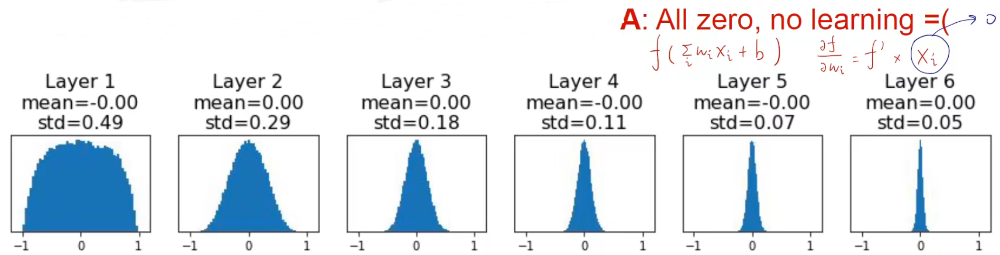

权重幅值较大的时候，局部梯度接近于 0，又导致了梯度消失。

```python
# 权重初始化 幅值=0.05
W = np.random.randn(Din, Dout) * 0.05
```


为了解决这个问题提出了新的权重初始化方法。

### Xavier 初始化

```python
# 权重初始化 幅值=1/din
W = np.random.randn(Din, Dout) * (1 / np.sqrt(Din))
```

 相当体育就是输入的大小越大，权重初始化时幅值就越小。对于其证明可以有如下推导：

**假设 $x, w$ 均值为 0 且独立同分布，**且目前没有考虑激活函数。
$$
y =Wx, h=f(y)
$$

$$
\text{Var}(y_i)=D_{in}\text{var}(x_iW_i) \\
=D_{in}(E[x_i^2]E[W_i^2]-E[x_i]^2E[W_i]^2) \\
=D_{in}\text{Var}(x_i)\text{Var}(W_i)
$$

如果 $Var(W_i)=\frac{1}{D_{in}}$，那么输入和输出的方差相等，使得输入和输出的变化幅度相同。

但是如果使用 ReLU 则会导致在 0 处接近于 0.

### Kaiming 初始化

为了解决考虑激活函数的问题，所以有 Kaiming 初始化。

他总结出：

若要让 $\text{Var}(y_i)=\text{Var}(x_j)$ 成立，则

若 $w_{ij}$ 服从正态分布，则 $w_{ij}\sim \text{Normal}(0, \frac{2}{d})$

若 $w_{ij}$ 服从均匀分布，则 $w_{ij}\sim \text{Uniform}(-\sqrt{\frac{6}{d}}, \sqrt{\frac{6}{d}})$

则初始化为：

```python
# 权重初始化 幅值=2/din
W = np.random.randn(Din, Dout) * (1 / np.sqrt(2 / Din))
```

## 批归一化（BN）

为了避免数据集中分布在某一个区间，我们在训练过程中对权重做多次的归一化，强制将**数据归一化到标准正态分布**，使得数据的分布更加均匀。因为我们传入的数据是一批一批的，所以我们使用批归一化的方式。

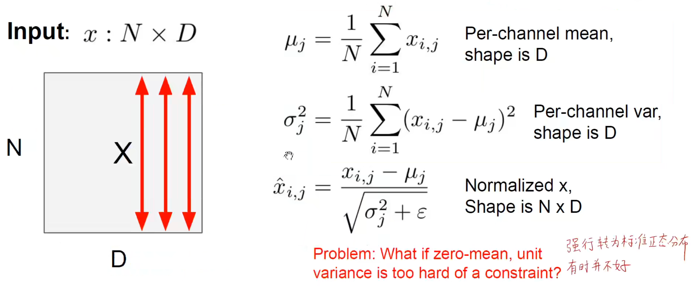

BN 一般放在非线性层之前。

### BN 层的作用

1. 能够让网络在训练的时候更快地收敛。
2. 改善梯度，减缓梯度消失。
3. 能够使得网络使用大学习率进行训练，因为数据对于权重的微小变化不敏感。
4. 使得网络对于权重初始化的依赖性没那么大。
5. 训练的时候起正则化的作用，对权重添加惩罚项。
6. 训练和测试的时候 BN 层不一样，训练的时候用一批里面的均值和方差，在测试的时候使用全局的均值和方差。

### 其他 BN

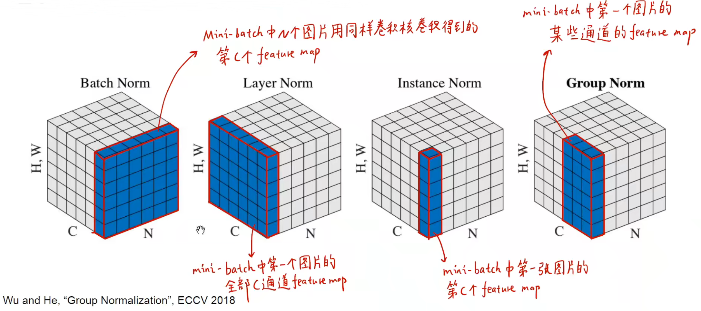

- BN：在 batch 层面上进行归一化，将一个 batch 里的某个 feature map 进行归一化。
- LN：在 layer 层面上进行归一化，将所有 channel 的 feature map 进行归一化。
- IN：在实例层面上进行归一化，将一个 batch 中的一张图片的第 c 个 feature map 进行归一化。
- GN：堆叠多个实例上进行归一化，将一个batch 中的一张图片的多个 feature map 进行归一化。

## 密切关注训练过程

### 优化器

优化器主要解决的问题是加快梯度下降的速度，也就是找到**最优解的速度并且不被局限在局部最优解**。如果只是单一调整学习率可能需要经过多次梯度下降之后才能找到最优解，但是并不是所有情况都可以适用学习率的调整，而且对于学习率的大小也会影响其梯度下降的速度，所以**需要有一种 “聪明” 的下降方式**，来提高训练的效率和模型的性能，使其能够找到**全局最优解**。

优化器其实就是一种调整梯度优化方向和速度的算法。

#### 传统方式

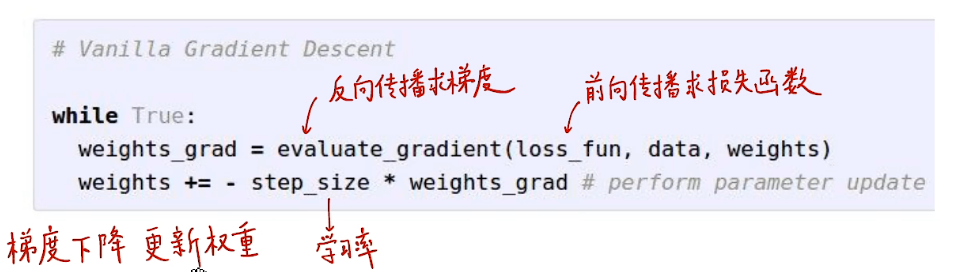

传统方式的梯度更新算法会在较大梯度的方向上进行震荡，通过学习率无法解决这样的问题。学习率只是前进的速度，并不能改变梯度优化的方向。从**传统随机梯度下降的缺点**主要有：

1. 梯度较大的方向上容易发生**震荡**，且不能单纯通过调整学习率解决。
2. 容易**陷入**局部最优点、鞍点，在高维空间中更普遍出现这个问题。高维空间中可能会出现多个可能是最优解的点，也就是局部最优解。

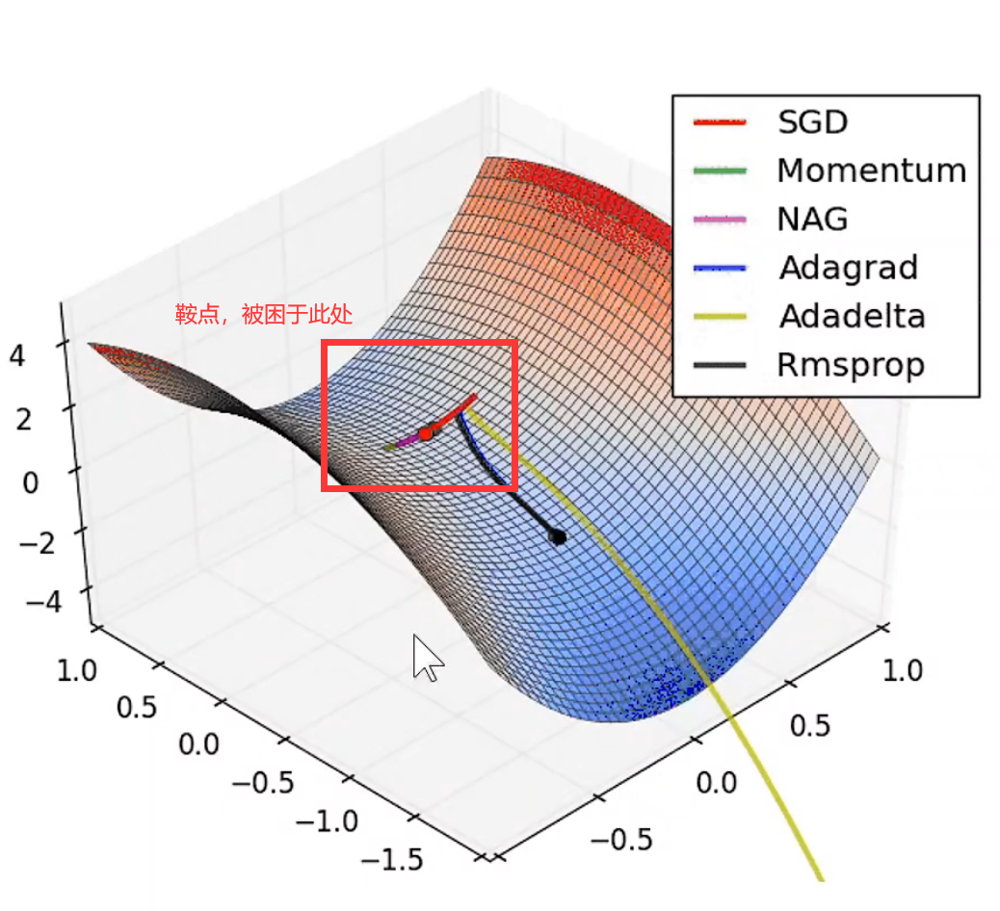

#### SGD

求得一批数据的损失函数，以及一批数据的梯度，然后进行更新。
$$
x_{t+1}=x_t-\alpha\nabla f(x_t)
$$
代码表示为：

```python
while True:
	dx = compute_gradient(x)
    x -= lr * dx
```

#### SGD + Momentum

由于使用 SGD 优化器无法引导梯度下降的方向，只能依靠本身的数值来更新，所以我们给梯度加上动量。通过动量来调整梯度下降的值。通过引入动量使其值的变化具有**滞后性**，通过一个系数逐渐衰减动量。
$$
v_{t+1}=\rho v_t+\nabla f(x_t) \\
x_{t+1}=x_t-\alpha v_{t+1}
$$
代码表示为：

```python
vx = 0
while True:
	dx = compuute_gradient(x)
    vx = rho * vx + dx
    x -= lr * vx
```

公式 (4) 中的 $\rho$ 可以理解为摩擦力，每次都会对之前的速度进行衰减。这里的 $\text{dx}$ 可以理解为加速度。通过引入动量让梯度的变化产生滞后性，使其不容易收到梯度变化的影响而导致收敛到局部最优解，起到了平均和平滑的作用。

#### Nesterov

对动量的再次进行优化，原本是先求出当前点的梯度和速度方向之后再得到实际下降的方向。

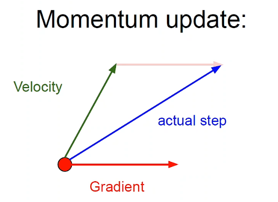

但是其实不用求解当前点的梯度，可以先求解当前沿这个方向前进之后的那个点的梯度，然后再与其作差求得目前下降的方向。再次提前考虑一步，继续优化下降的方向。

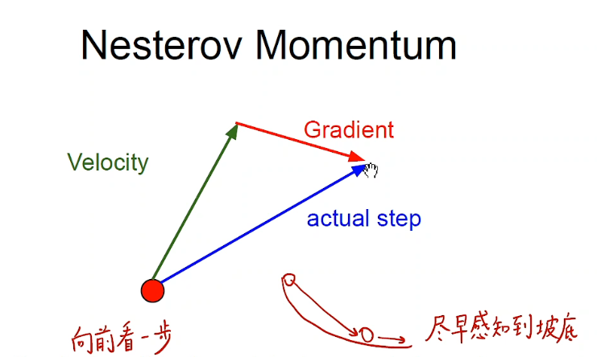


用公式表示为：

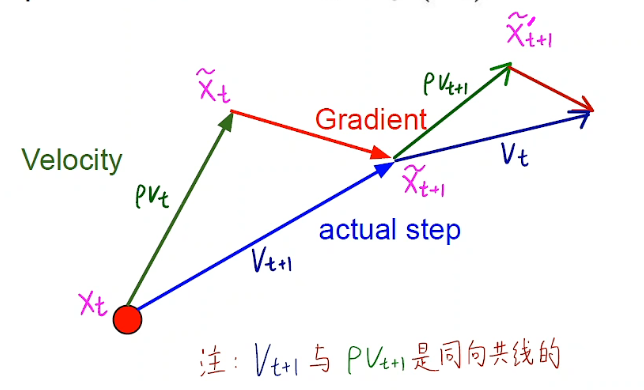
$$
v_{t+1}=\rho v_t - \alpha\nabla f(x_t + \rho v_t) \\
x_{t+1}=x_t+v_{t+1}
$$
其中，$x_t + \rho v_t$ 就代表了 $\hat x_t$ 这个点，故 $\hat x_t=x_t+\rho v_t$。当向前看的时候，也就是继续下降的时候，会继续更新。
$$
v_{t+1}=\rho v_t-\alpha\nabla f(\hat x_t) \\
\hat x_{t+1}=\hat x_t-\rho v_t+(1+\rho)v_{t+1}=\hat x_t+v_{t+1}+\rho(v_{t+1}-v_t)
$$

代码表示为：

```python
while True:
    dx = compute_gradient(x)
    old_v = v
    v = rho * v - lr * dx # rho * v_t - lr * gradient(x_t + rho * v_t)
    x += -rho & old_v + (1 + rho)
```

#### AdaGrad

因为 SGD 优化器是在梯度较大的地方发生震荡，那么我们只需要在梯度较大的方向上添加惩罚项，让梯度变大的时候不要更新那么多，避免产生震荡。因为 $y = x^2$ 这个函数的变化是 $x$ 值变化越大，$y$ 值变化也越大。所以可以充当惩罚项。代码表示为：

```python
grad_sq = 0
while True:
	dx = compute_gradient(x)
    grad_sq += dx * dx
    x -= lr * dx / (np.sqrt(grad_sq) + 1e-7)
```

相当于就是在更新梯度的时候累加梯度，当梯度值过大之后会**减少更新的步伐**，从而避免震荡的现象出现。

#### RMSProp

针对 AdaGrad 一直累加的问题，导致整个训练过程的更新量会越来越小，所有又对其进行优化。将梯度的累加更改为使用衰减因子来部分增加梯度。保留多少原来的梯度，增加多少新的梯度。

核心公式为：$\text{grad\_sq}=\text{decay\_rate} \times \text{grad\_sq} + (1 - \text{decay\_rate}) \times dx \times dx$

代码表示为：
```python
grad_sq = 0
while True:
	dx = compute_gradient(x)
    grad_sq = decay_rate * grad_sq + (1 - decay_rate) * dx * dx
    x -= lr * dx / (np.sqrt(grad_sq) + 1e-7)
```

#### Adam

Adam 其实就是将前面提到的动量方法和 AdaGrad 结合，使用第一动量解决震荡的问题，使用第二动量解决累加的问题。代码表示如下：

```python
first_moment = 0
seecond_moment = 0
while True:
    dx = compute_grad(x)
    # moment update
    first_moment = beta1 * first_moment + (1 - beta1) * dx
    second_moment = beta2 * second_moment + (1 - beta2) * dx * dx
    # bias correction
    first_unbias = first_moment / (1 - beta1 ** t)
    second_unbias = second_moment / (1 - beta2 ** t)
    x -= lr * first_moment / (np.sqrt(second_moment) + 1e-7)
```

其中的偏执修正是能够使得在训练的前期能够有较大的初始值，使得优化器能够开始更新参数，减少训练前期产生的波动。一般来说，上面的 `beta1` 取 0.9，`beta2` 取0.999，学习率可以选择 `1e-3 `或者 `5e-4`。是对于大部分模型来说能够适应的。所以 Adam 优化器作为比较**常用的优化器**。因为这个优化器能够同时解决震荡和累加的问题，更加好用。

#### 二阶优化

:::info

前面提到的所有优化器都属于一阶优化。一阶优化就是只求了损失函数对于某一个权重的一阶偏导数，只用了一阶梯度。把当前函数的函数面的切面给求出来。

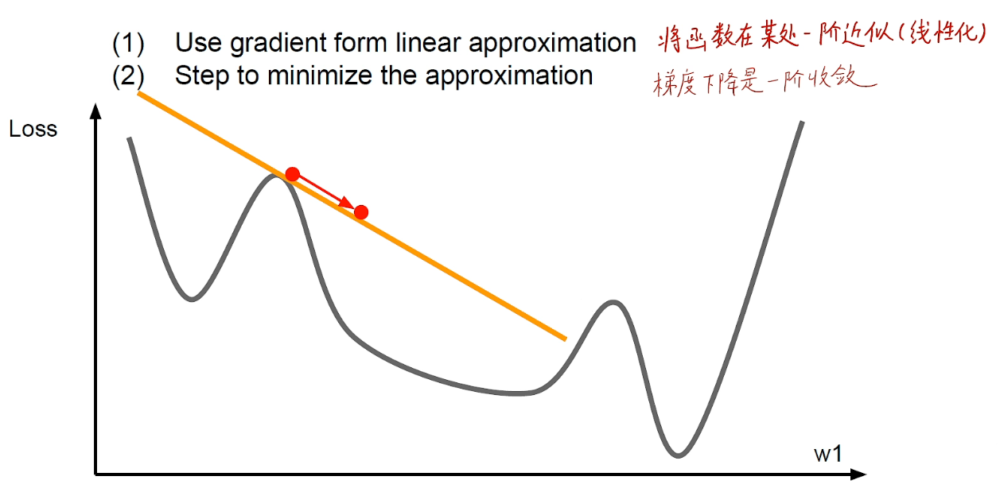

:::

如果我们求损失函数对于某一个权重的二阶偏导数，这时候就是二阶优化。相当于可以把问题转换成：**求损失函数的最小值 → 损失函数的导数为 0 的地方。**使用二阶的方法能够明显加快收敛的的速度，并且不会产生震荡的情况。因为相当于二阶优化使得能够知道当前点的加速度信息，能够反映速度的变化，能够感知到那个点的速度为 0，也就是梯度为 0 的点。**牛顿法则是每一步迭代都找到了梯度为零的**点，因此牛顿法更快。

二阶优化主要是使用牛顿法求解，先使用二阶泰勒展开近似原目标函数（相当于已经有了一个**先验知识**），对这个近似目标函数导数为 0 的地方简历迭代关系是，能够**同时考虑目标函数的梯度和目标函数梯度的变化**。

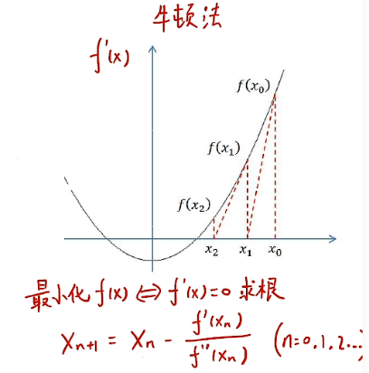

表达式：
$$
x_{n + 1} = x_n - \frac{f'(x_n)}{f''(x_n)}, (n=0,1,2,\dots)
$$
问题来了，为什么二阶优化这么好，但是平时都是在用一阶优化呢？是因为比较消耗计算量，主要是因为海森矩阵的逆矩阵比较难计算，所以比较难求解。所以我们使用一阶优化就能够达到工程上所需要的精度。

但是有人想到用别的矩阵代替海森矩阵，为了解决难以求得海森矩阵的逆矩阵的特点。（BFGS、L-BFGS）


### 学习率调整策略

学习率表示的是在优化过程中前进的步长的大小。那么在实际应用的到时候就会产生一个问题：在训练过程中，应该选用怎么样的学习率才合适呢？

:::tip

选择不同的损失函数对训练过程中优化的速度、方向和最后的效果都会产生影响。从优化器的角度就可以看出，**学习率也是影响优化器的其中一个影响因素。**所以会对训练的过程产生影响。

:::

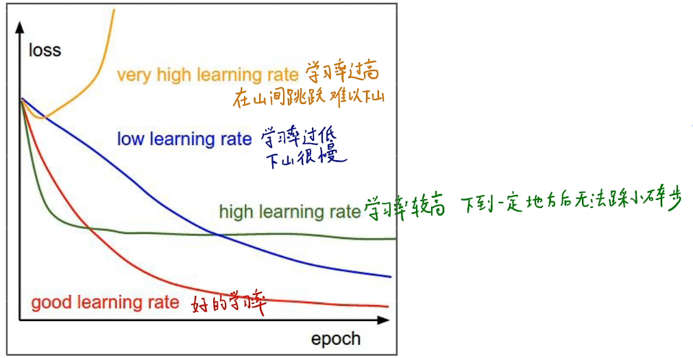

所以目前比较常用的方式是训练前期使用比较大的学习率，在训练后期使用比较小的学习率。所以对于学习率就有不同的调整策略。

#### 学习率衰减

1. 学习率周期折减：训练到指定的 epoch 数后对学习率进行衰减。如：每训练 30 轮，学习率乘 0.1
2. 各种函数衰减学习率：通过余弦函数、线性函数、幂函数来对学习率进行衰减

### 模型集成（Model Ensembles）

#### 常规集成

模型集成是指将使用不同的参数训练的模型进行集成：

1. 训练多个效果优良但是在不同点上优良的模型
2. 在推理阶段进行多次推理，取其平均值

大概会有 2% 的准确率的提升。

#### checkpoints 集成

我们可以在训练的过程中对不同阶段的模型进行集成，训练过程中不同时刻的模型表现的性能也不一样。可以把不同 epoch 的模型集成到一起。

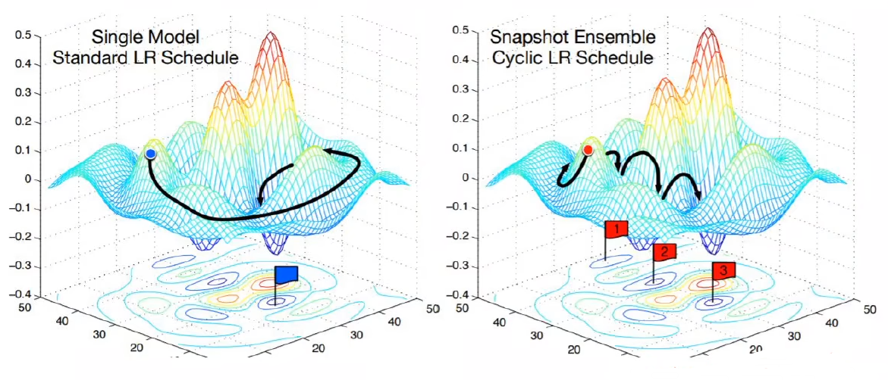

模型集成也能够有效地**提高模型的准确率并且减少对于模型的过拟合**。

### 正则化

正则化其实就是对权重的值进行惩罚（减少权重的值），使用不同的方法能够对权重进行不同程度的惩罚。本质上其实就是通过权重自身对权重进行压制，不让某些权重增加太多，从而防止梯度爆炸。通常的正则化方法有：、

1. 对权重计算 L1 norm：$R(W)=\sum_k\sum_lW_{k,l}^2$
2. 对权重计算 L2 norm：$R(W)=\sum_k\sum_l|W_{k,l}|$
3. 混合 L1 和 L2 norm：$R(W)=\sum_k\sum_l\beta W_{k}^2+|W_{k,l}|$

食用方式：
$$
L=\frac{1}{N}\sum_{i=1}^N\sum_{j\not=y_i}max(0,f(x_i;W)_j-f(x_i;W)_{y_{i}}+1)+\lambda R(W)
$$
相当于就是在损失函数后面加入一个惩罚项，将当前的权重也引入作为损失函数的参考因素之一，避免陷入局部最优解。

#### Dropout

Dropout 也是一种最常用的减少过拟合的方法。也就是训练过程中，随机将某个神经元的激活值为 0，相当于不存在这个神经元，通常会设置 0.5 概率让神经元失活。灵感来自于有性生殖。

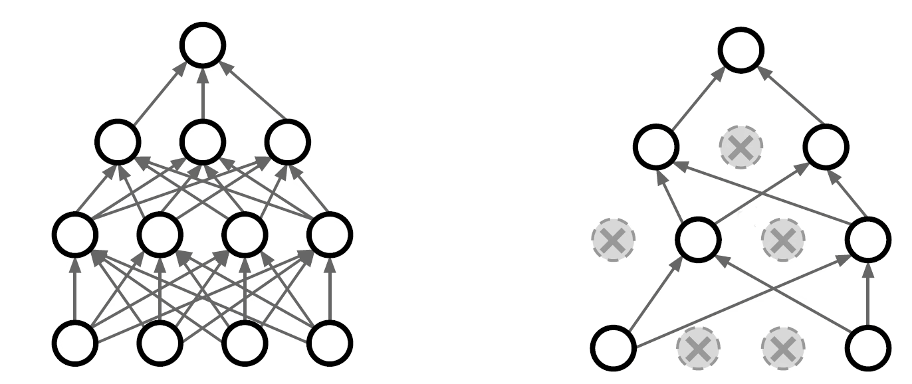

用代码表示可以表示为：

```python
p = 0.5

def train(X):
    # forward pass for  example 3-layer nn
    H1 = np.maximum(0, np.dot(W1, X) + b1)
    U1 = np.random.rand(*H.shape) < p # 生成一个 0-1 的 mask，用一个 mask 来消除对应位置的神经元的权重
   	H1 *= U1 # drop!
    
    H2 = np.maximum(0, np.dot(W2, H1) + b2)
    U2 = np.random.rand(*H2.shape) < p
    H2 *= U2 # drop!
    
    out = np.dot(W3, H2) + b3
    
    # backward pass: compute gradients...
    # perform parameter update...
```

那么我们现在可以探讨一下，为什么 dropout 能够实现这么有效的正则化？

因为在训练过程中，权重是不断更新的但是因为训练过程中的不稳定性，可能会导致学习到不重要的特征，但是不同的神经元之间会发生联合适应性，神经元之间的特征可能会产生依赖关系，依赖关系就会导致这个特征不是你所需要的特征，通过 dropout 能够打破特征之间的**联合适应性**，使得每个特征都能够独当一面，让每一个神经元都充当一个独立的个体。

使用 dropout 能够达到模型集成的效果，因为彼此之间会共享权重。在测试的过程中，我们需要使用的是一个完整的模型，所以要对权重进行补偿。所以预测的时候用代码表示为：

```python
def predict(X):
    H1 = np.maximum(0, np.dot(W1, X) + b1) * p # 这里要乘以 p
    H2 = np.maximum(0, np.dot(W2, H1) + b2) * p
    out = np.dot(W3, H2) + b3
```

主要可以分为以下几个方面来说

- 模型集成说：Dropout相当于生成了若干更瘦的神经网络，对于N个神经元的神经网络, Dropout可以看作2n个共享某些参数模型的集成dropout率等于0.5的时候效果最好，因为0.5时随机生成的网络结构最多。模型集成“取平均"让一些"相反的”拟合互相抵消。互相依赖的大部队就像计划经济时代的国企，只能解决训练集上的特定问题，不能适应变化的世界
- 强制协同工作说：强迫每个神经元每次和随机挑选出来的不同神经元共同工作，减弱了神经元节点间的联合适应依赖性。
- 有性繁殖说：与无性繁殖基因很少变异不同，有性繁殖将海量基因片段重新组合.每个基因片段都要与其它基因片段协同工作。
- 记忆消除说：将死记硬背的过拟合知识掐死在摇篮中，学习大而化之的知识。
- 数据增强说：总可以找到一个数据样本,使得在原始的网络上也能达到 dropout 单元后的效果。比如，对于某一层，dropout 一些神经元之后行程的结果是 $(1.5, 0, 2.5, 0, 1, 2, 0)$，其中 0 是被 drop 的神经元，那么总能够找到一个样本使得结果也是这样，这样每一次都相当于增加了数据样本。

#### DropConnect

与 Dropout 类似，但是 DropConnect 是随机掐死输入值，随机掐死不同的树突。

#### 数据增强

**数据增加就是对图像执行不同的操作，产生不同的数据样本。**常用的操作主要有：裁剪、平移、变换、翻转。相当于扩充了数据集的数量，相当于也是正则化的作用，减少神经网络过拟合的现象。

水平翻转：


随机裁剪：

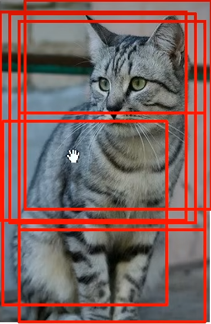

颜色偏差（color jitter）：

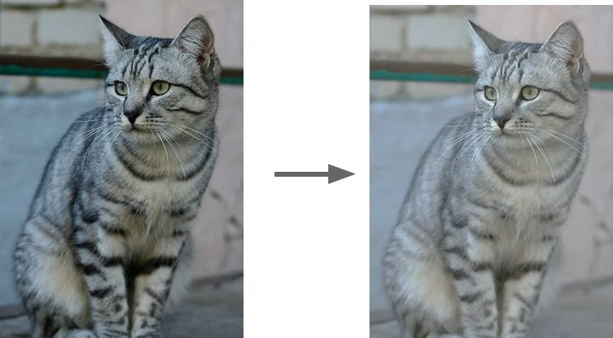

还有颜色变换、旋转、伸展、剪切变形、透镜扭曲等等等

#### 分数池化

池化的窗口不一定是正方形，而是随机生成池化的大小。训练的时候使用随机生成池化大小，预测的时候从不同的区域取平均值。


#### Stochastic Depth

随机深度，训练时随机跳过某一些层，让每一个层都能够表示独立的特征，独立决策，不依赖于其他的层，可以使得网络变得更深。预测时使用所有层。

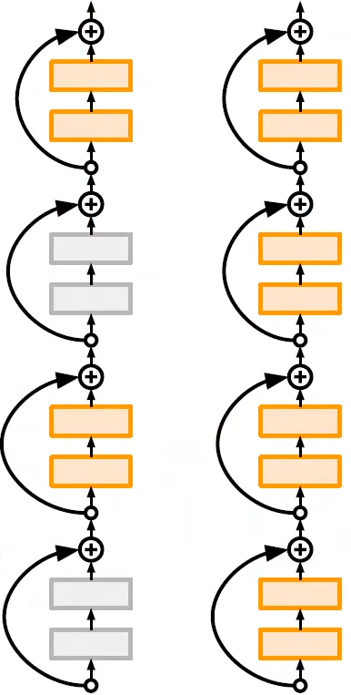

#### Cutout

Cutout 是随机将图像中某些区域抹除，随机让图像中的区域变为 0

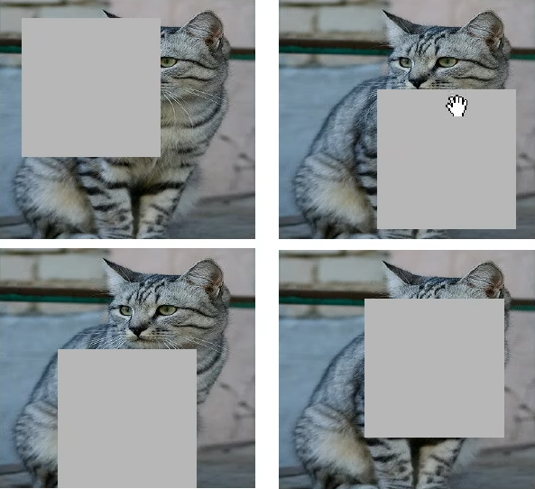

#### Mixup

将两幅图像混合到一起。

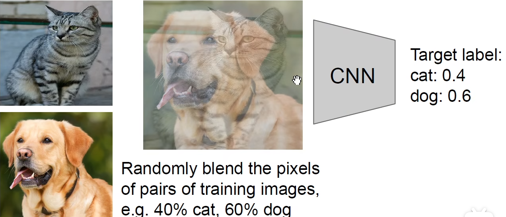

### 超参数选择

#### 训练调参方法

1. 核验初始损失函数的值，保证损失函数的初值分布在合适的数值范围
2. 在小数据集上尝试过拟合
3. 找到能够损失函数能够更快下降的学习率
4. 前期使用比较大的学习率进行训练
5. 后期用比较小的学习率进行训练
6. 观察损失函数的曲线
7. 反复观察损失函数曲线判断有没有过拟合，回到 (5)

#### 参数搜索

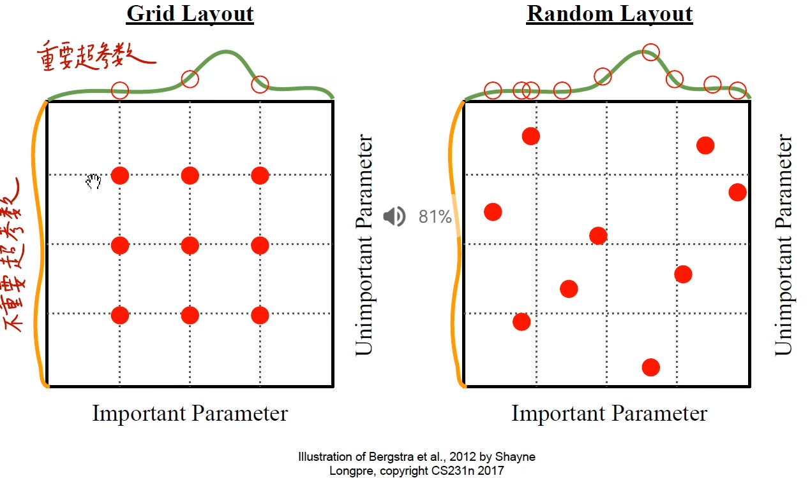

#### 权重更新量级

用权重的更新量除以权重得到更新的量级，更新的量级保持在 0.001 左右是比较好的。


