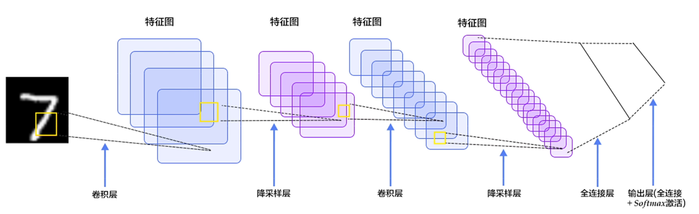
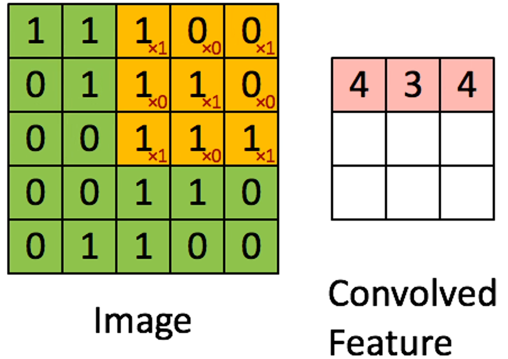
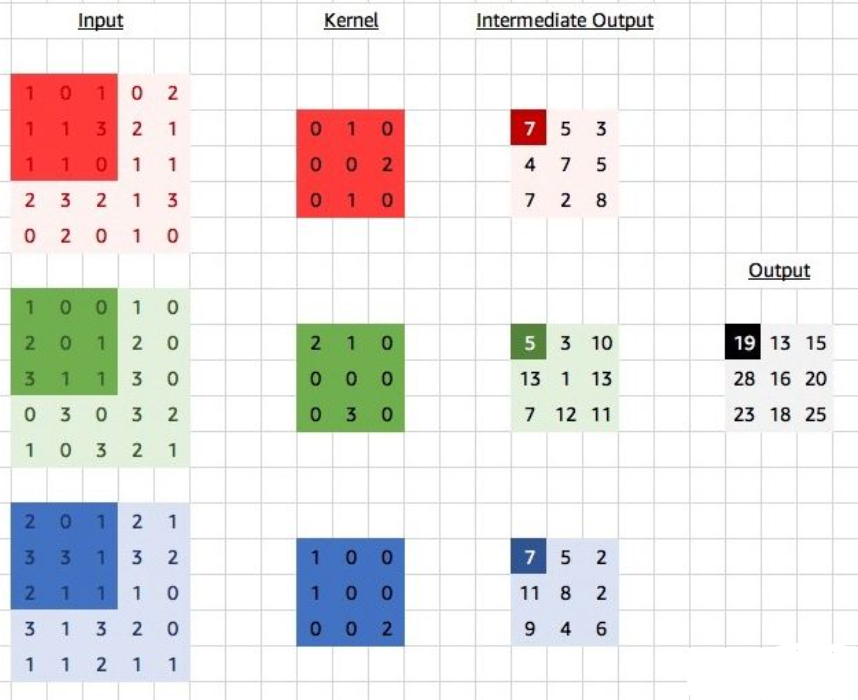
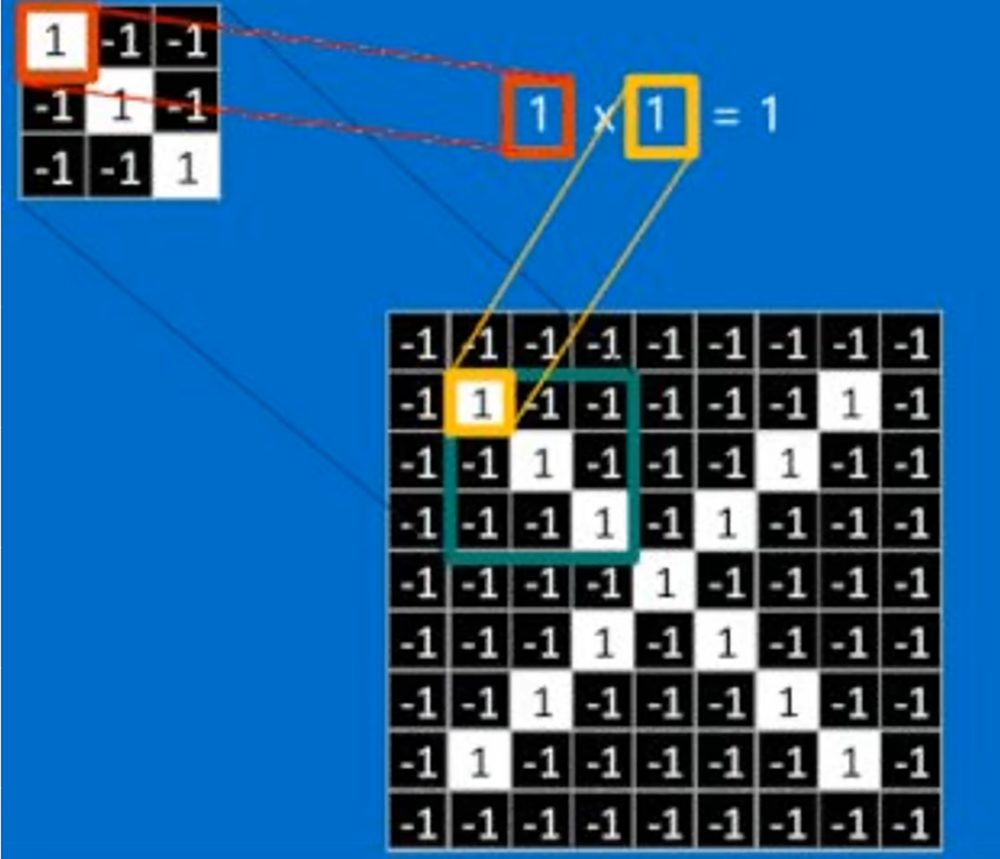
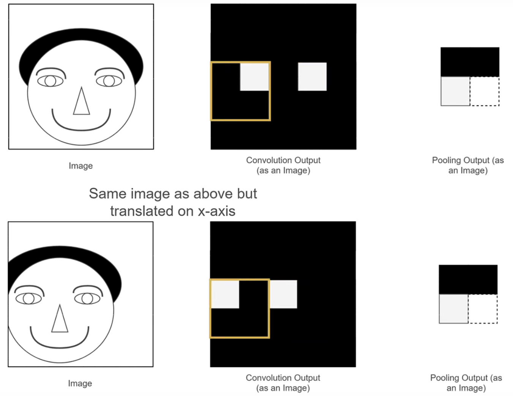
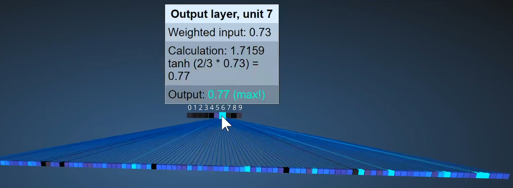
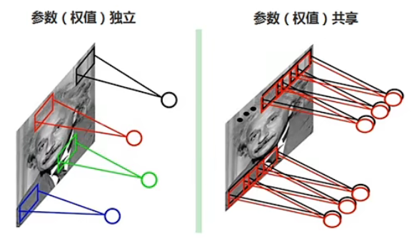
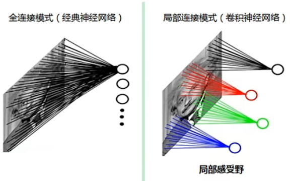
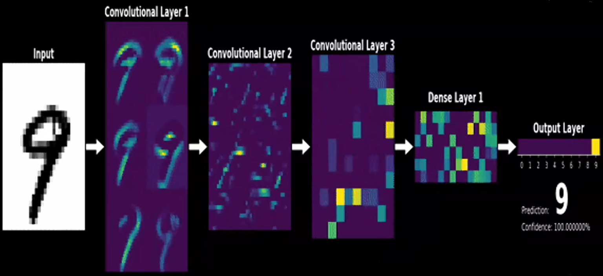
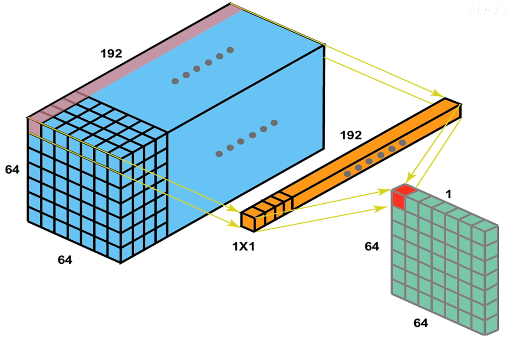

# 卷积神经网络

每个神经元只会关注图像上一小部分区域，也就是感受野。视觉是分层的。

## 抛出问题

因为使用全连接网络来对图像进行识别，全连接网络的输入是一个长向量，所以要将全连接网络应用在图像领域上需要将二维矩阵的图像变成一个长向量才可以进行处理，但这样会导致**丢失了图像的空间特征信息**，导致识别图像的效果下降。

例如，如果一个物体正好分布在图像的左上角和右上角，但是因为 “打平” 之后使得空间特征消失了，所以可能导致无法识别出来。使用全连接网络对于每一个像素都有对应的权重，根据每个像素的权重对图像进行识别和分类。所以提出了卷积神经网络解决这个问题。

卷积神经网络的特点：

- 权重共享：每次滑动卷积核当中的权重不变。
- 局部连接：每次只扫描图像的一小部分。

## CNN 组成

### 基本结构

卷积神经网络（以下简称 CNN）主要包括三个部分，**卷积层、池化层、全连接层**。

- 卷积层：提取图像上的特征。
- 池化层：对特征进行后处理，大而化之
- 全连接层：把不同的特征进行处理、汇总得到最终的结果。

以下为手写识别数字的示意图：

卷积神经网络可以把每个像素理解为一个节点，在感知机当中，一个节点就对应有他的权重。所以在卷积神经网络当中，对于图像像的每一个像素都是一个节点，对应一个节点都有对应的权重，它的卷积核就是对应的权重。

对于卷积神经网络，同一张图片可以使用不同的卷积核进行卷积操作来提取特征，有多少个卷积核(filter)最后输出的特征图通道数就有多少。所以一般在卷积过程中每一层卷积**输出的通道数可以由自己确定**（因为框架会帮你自动生成卷积核和自动初始化权重），而**特征图的大小**则是取决于**卷积核的大小、原图是否有 padding、步长**（一般来说也是由框架自动计算得出）。

:::tip

所以，卷积的过程中其实**代替的是感知机当中的线性函数的部分**，因为卷积这个操作对于图像方面来说更加适合，不会破坏图像的空间特征结构，同时还能到达感知机的效果，所以我们才要在**图像领域使用卷积神经网络**。

:::

### 卷积

卷积可以看作是用一个滑动窗口在图像上进行滑动，把对应位置的元素相乘，也就是图像的像素乘以对应位置卷积核上的权重，最后将每一次卷积的结果放到一个新的矩阵上，这个新的矩阵就叫特征图。示意图如下：

在卷积的过程中，卷积核的数值是不变的，所以这就是 CNN 具有**权重共享**特点。

每一次卷积操作都可以看作一个神经元。如果有多个通道那么卷积核也有多个通道，对于每一个通道都有一个卷积核，求解完卷积操作之后，对每个通道卷积之后的结果进行相加。

对于上图而言，对每一个通道都有一个卷积核，对于每一个卷积核在原图上的一次卷积会得到三个数，三个数累加之后就得到对应的数据结果。

因为直接在图像上进行卷积会导致丢失掉图像四周的边缘信息，通常来说会使用 padding 操作来对图像的边缘填 0，保留四周图像边缘的同时避免因为卷积导致图像大小缩小太多。

而且添加 padding 能够使得边缘周围能进行相同次的运算，因为中间的元素当步长为 1 的时候都会被计算很多次，所以通过 padding 能够使得周围像素计算的次数一致。

:::tip 卷积输出大小和参数量的计算

参数量其实就是权重的个数，也就是卷积核的个数。

对于图像长和宽为 $N$，卷积大小为 $K\times K$ 的前提，则卷积之后输出的图像大小为：
$$
n=\text{ceil}(\frac{(N-F)}{\text{stride}} + 1)
$$
其中，$\text{ceil}(\cdot)$ 表示上取整，而对于有 padding 大小为 $p$ 的图像而言，输出图像大小为：
$$
n=\text{ceil}(\frac{(N + 2p -F)}{\text{stride}} + 1)
$$
当步长为 1 时，则卷积的输入和输出长宽不变：
$$
p = \frac{F - 1}{2}
$$
也就是当 步长为1 且 padding 的大小为卷积核大小减 1 除以 2 时，卷积之后输出的大小与输入一致。

对于参数量而言（权重的个数），计算方式为：
$$
\text{params} = K\times K\times C + 1 \\
\text{total} = \text{params}\times \text{num\_of\_filter}
$$
其中，$\text{params}$ 表示单个卷积核的参数量，$K$ 表示卷积核的大小，$C$ 表示通道数，$+1$ 表示偏执项，$\text{num\_of\_filter}$ 卷积核的个数，$\text{total}$ 表示所有卷积核的总参数量。

:::

卷积其实就是**提取出图像上与卷积核的特征匹配的特征**，所以**卷积核代表了一定的意义**，卷积核就表示你想要提取的特征，因为如果满足你想要提取的特征，那么其权重乘起来之后会变得比较大，权重比较大就代表了符合相应的特征，**所以提取特征的过程其实就是匹配卷积核的过程**。

例如上图，我们想提取一个**对角线**的特征，如果使用这个卷积核进行扫描的时候，只有**原图上**符合这个卷积核的特征乘积起来之后得到的值才会比较大，**卷积核其实就是权重。**

对于其他种类的卷积可以看这个 [Github 仓库](https://github.com/vdumoulin/conv_arithmetic/blob/master/README.md)对应的动画来理解。

### 池化

池化是一个下采样特征图的算法，主要作用是对特征进行整合。因为如果只是用卷积产生的特征图占用空间比较大，比较浪费空间而且只使用卷积会导致特征表达的信息不够鲁棒，所以我们可以从中一个范围里面选择一个**像素值作为“代表”**，使得特征图中的一个像素能够表达的信息更多，**提高鲁棒性**。

**一般选取出 “代表” 的方法有：最大池化、平均池化。**

使用**池化**的原因：

1. 减少存储特征图的空间（减少参数量）。

2. 使得特征图中一个像素能表达的信息更多，更丰富。（引入平移不变性）

   如果要识别的物体产生了位置上的差距，如果只使用传统的卷积层的特征图会导致识别不出来，因为他们表达的不是相同的信息，而分别进行池化之后他们的特征图是一致的，所以使用池化能够使得特征图表达的特征更加抽象，具有更多的信息，过滤到无用的信息，提高模型的鲁棒性。

   

3. 防止过拟合（提高鲁棒性）

   过滤掉一些噪音点，引入平移不变性，达到大而化之的作用。

池化操作没有权重，只有卷积过程才有权重。

### 全连接

将特征图拉平成长向量，这个向量中的每一个元素都跟所有的特征图有相连，他们之间都有一定的关系，成功地模拟感知机的模型。

## CNN 反向传播

在卷积反向传播的过程中，其实就是更新卷积核的值，也就是卷积核权重和对应的偏置项，以及全连接层的权重和偏执项。

## CNN 的特点

- **局部感受野**每个神经元仅与输入神经元的一块区域连接，这块局部区域称作感受野(receptive field)。局部连接的思想，也是受启发于生物学里面的视觉系统结构，视觉皮层的神经元就是局部接受信息的。
- **权值共享**卷积核是共享的。
- **下采样、池化**减少参数，防止过拟合、平移不变性。

卷积过程中的特征可视化，可以看出随着卷积的深度越深，提取的特征就越抽象。

### 1 × 1 卷积

$1\times 1$ 卷积是比较经常用的操作，有如下特点：

1. 降为/升维
2. 跨通道信息交融
3. 减少参数量
4. 增加模型深度，提高非线性的表达能力

降维的原理：
 

对于上图，可以看到使用一个 $1\times1$ 的卷积核通道数跟特征图的通道数相同的卷积核，就能变成通道数为 1 的特征图，然后只要控制这个卷积核的数量就能够实现随意控制升维和降维。

## 总结

- CNN 本质上就是用卷积层、池化层、全连接层堆叠而成的网络
- 倾向于使用更小的卷积核和更深网络的
- 倾向于摆脱对于池化层和全连接层的依赖，只是用卷积层

## Reference

1. [https://www.bilibili.com/video/BV1K7411W7So](https://www.bilibili.com/video/BV1K7411W7So)
2. [https://ezyang.github.io/convolution-visualizer/index.html](https://ezyang.github.io/convolution-visualizer/index.html)
3. [https://github.com/vdumoulin/conv_arithmetic/blob/master/README.md](https://github.com/vdumoulin/conv_arithmetic/blob/master/README.md)
4. [https://cs.stanford.edu/people/karpathy/convnetjs/demo/cifar10.html](https://cs.stanford.edu/people/karpathy/convnetjs/demo/cifar10.html)
