# 循环神经网络

 循环神经网络一般是拿来处理序列数据的，因为可以保留序列的上下文的信息，RNN 能够使得过去发生的数据能够对当前的数据产生影响，具备一个上下文联系的特点。非序列化的数据也可以转换成序列化的数据传入到 RNN 网络当中进行处理。

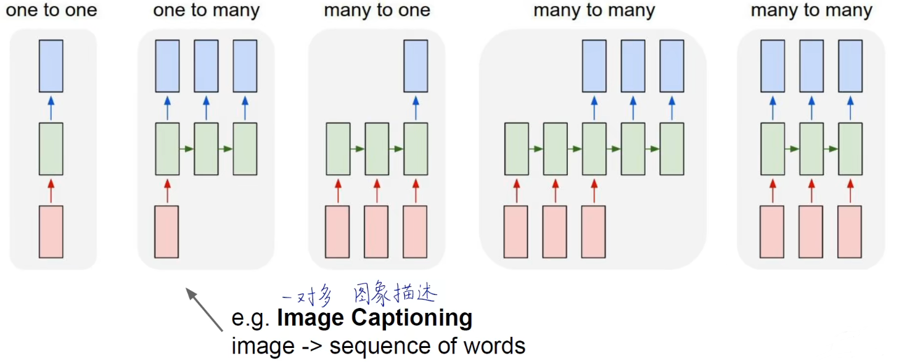

RNN 每一个节点的输出不仅取决于当前的输入，还取决于过去的输出结果，而过去的输出就是一个内部隐含的状态。RNN 可以用如下公式来表示：

其表示的对应结构为：

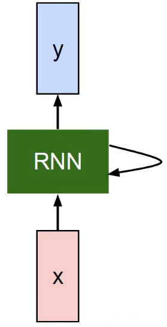

在整个传递过程中，循环神经网络是按照时间维度进行权值共享。在上面的公式中，$f_W(\cdot)$ 是权重共享的，每一个时刻的 $f_W$ 都相同。

:::tip

CNN：沿空间维度权值共享

RNN：沿时间维度权值共享

:::

可以用如下方式表示共享：

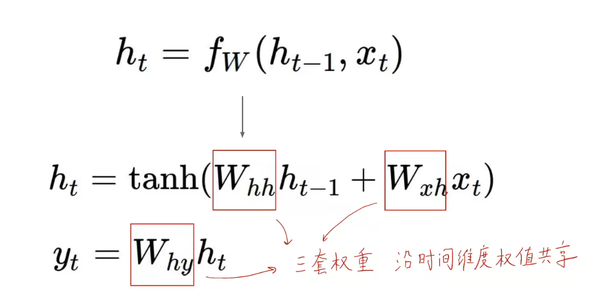

所以 RNN 的计算图表示如下：

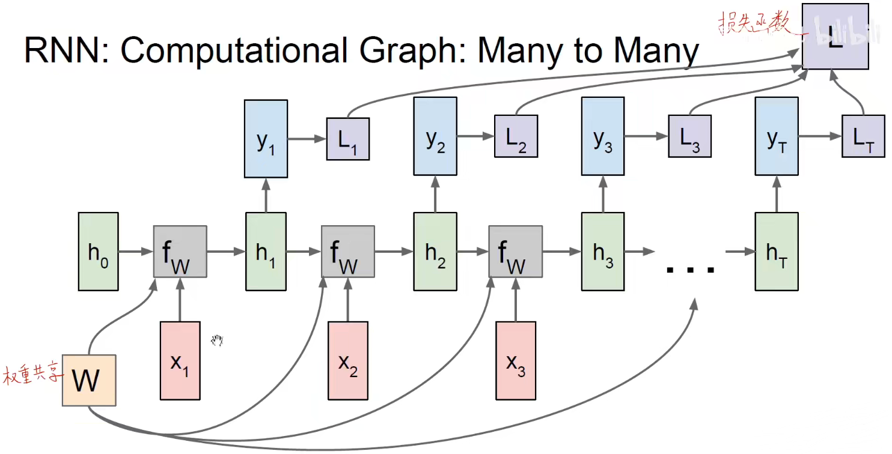

## Seq2Seq 模型

:::info References

Sutskever et al, “Sequence to Sequence Learning with Neural Networks”, NIPS 2014

:::

### 多对一

多对一通常可以称为编码器，编码器主要是把输入的数据进行编码，编码输入的序列到一个向量当中。

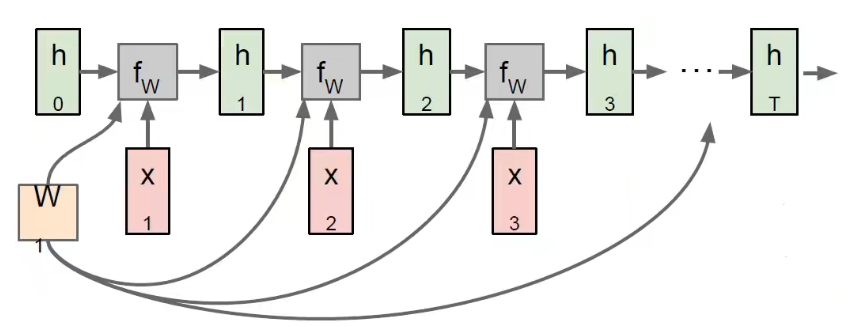

### 一对多

一对多通常可以称为解码器，解码器主要是将编码之后的特征转换到我们所需要的任务目标上，将之前编码的序列进行翻译，产生输出的序列。

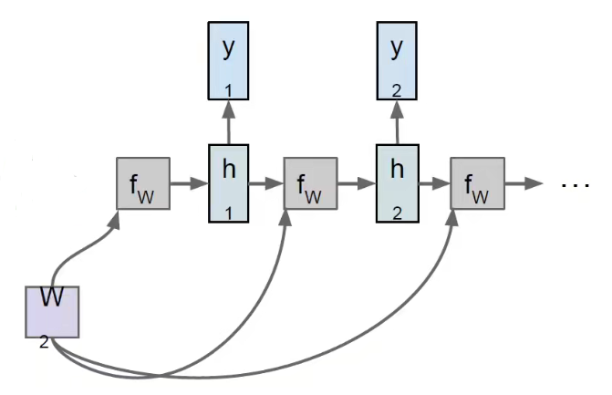

### Example

语言模型是一种经典的 Seq2Seq 模型，**语言模型是指用上文预测下文**。
$$
h_t = \tanh(W_{hh}h_{t-1} + W_{xh}x_t)
$$
假设你有一个字符序列 $[h, e, l, o]$，你想让它训练出一个 “hello” 的序列。

1. 对输入的序列进行 one-hot 编码，让用计算机的方式表示输入和输出的信息。

   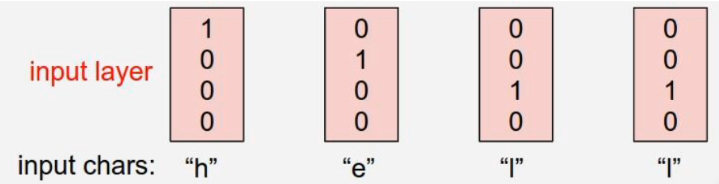

2. 将字符输入到网络得到三个神经元（隐含状态 $h$）

   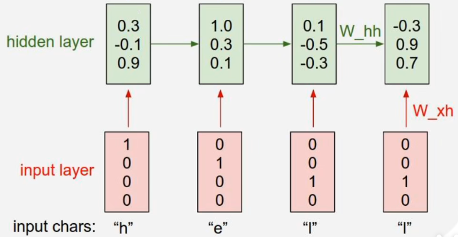

3. 由隐含状态产生多分类的结果

   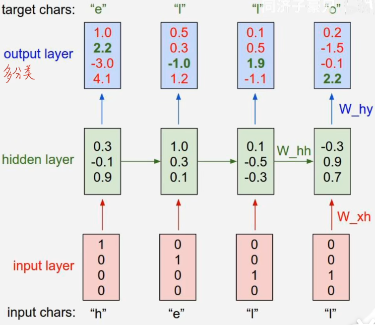

   在这里的情况下，我们要得到 “hello”，那么就需要先输入 h，h 的下一个要是 e，所以 target chars 就是 e，以此类推。也就是说，经过隐含状态之后要得到序列下一个最期望得到的结果。

4. 将上一层的输出结果经过 softmax 归一化到 [0, 1] 之后作为下一层的输入，继续经过一系列的传递，最终得到输出的序列。

   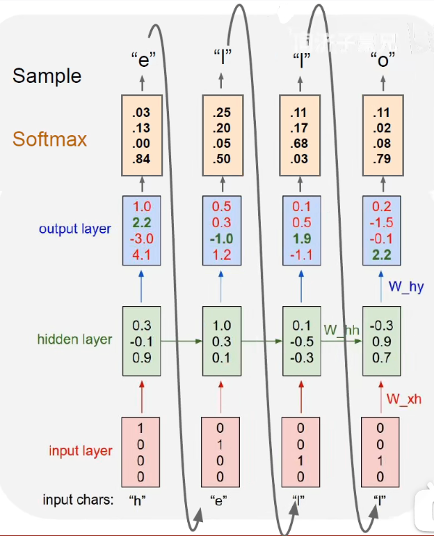

5. 进行反向传播更新参数，要对每一个时间维度进行求导，得到所有时间维度上的和得到最后的损失函数。

   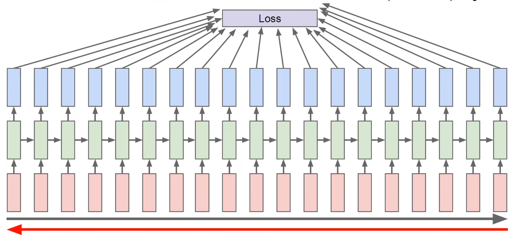

   但是通常文本可能会很长，所以一般会把文本截成多个片段进行反向传播的更新，一小块一小块地更新（类似 mini-batch）

## RNN 的可解释性

:::info Reference

Karpathy, Johnson, and Fei-Fei: Visualizing and Understanding Recurrent Networks, ICLR Workshop 2016

Explain Images with Multimodal Recurrent Neural Networks, Mao et al.

Deep Visual-Semantic Alignments for Generating lmage Descriptions, Karpathy and Fei-FeiShow and Tell:A Neural lmage Caption Generator, Vinyals et al.

Long-term Recurrent Convolutional Networks for Visual Recognition and Description, Donahue et al.

Learning a Recurrent Visual Representation for lmage Caption Generation, Chen and Zitnick

:::

我们可以从可视化的角度出发，将各个时刻隐含状态的值可视化出来。

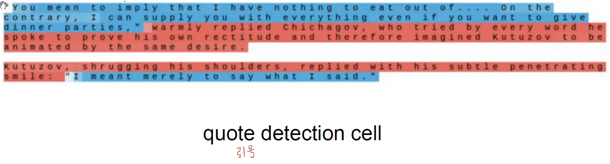

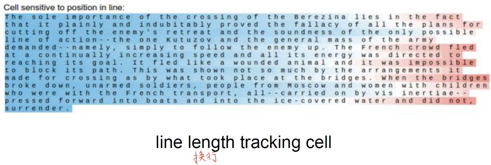

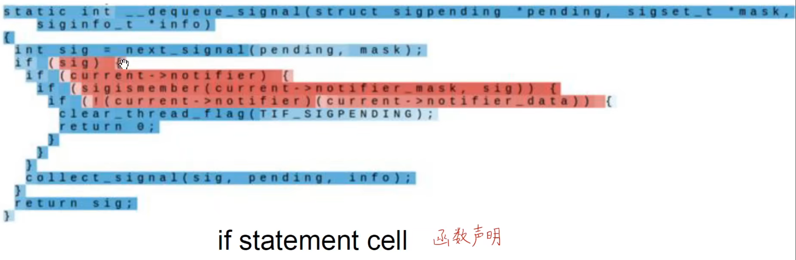

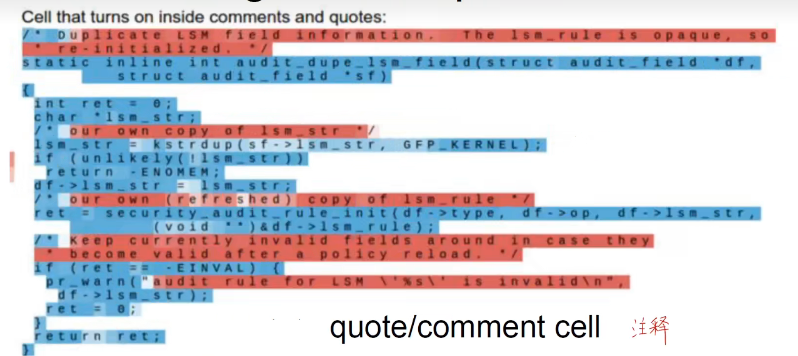

其实本质上也就是编码器和解码器的结构，编码器负责将不同类别的数据进行转换，转换到神经网络能够认识的数据，解码器就负责把处理好的数据转换成我们最终需要的数据。

## Improved RNN

随着 RNN 网络深度的加深，会产生梯度消失的问题。

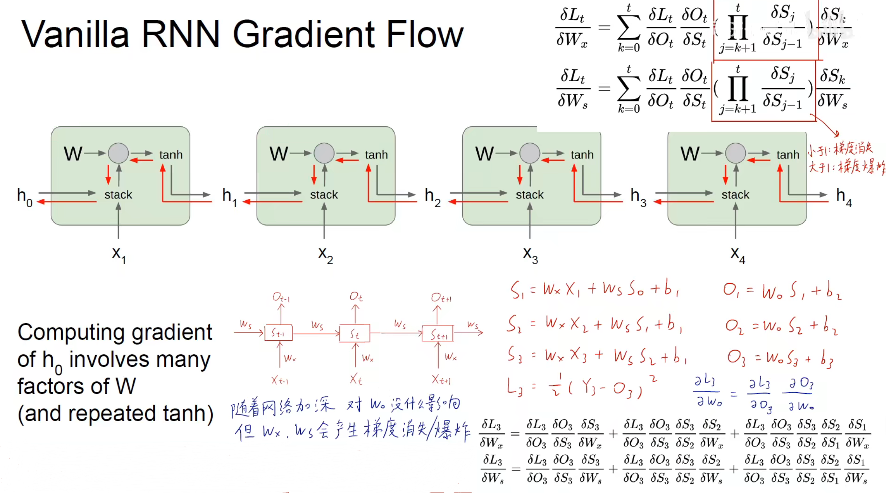

### LSTM

:::info

Hochreiter, Sepp, and Jürgen Schmidhuber. "Long short-term memory." *Neural computation* 9.8 (1997): 1735-1780.

:::

LSTM 称为长短时记忆神经网络，能够让神经网络拥有长期记忆和短期记忆，主要分为三个步骤：

1. 选择需要遗忘的信息

   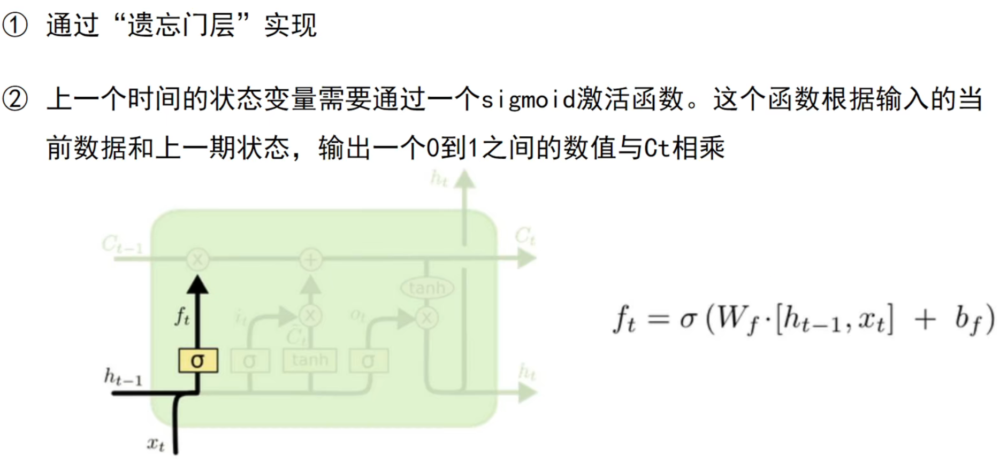

2. 选择需要被保留的信息

   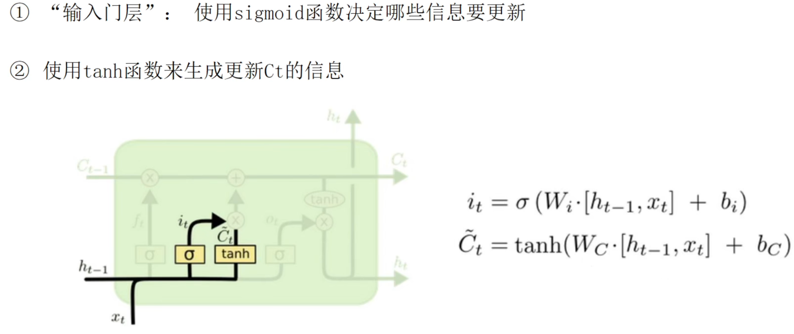

3. 更新神经元

   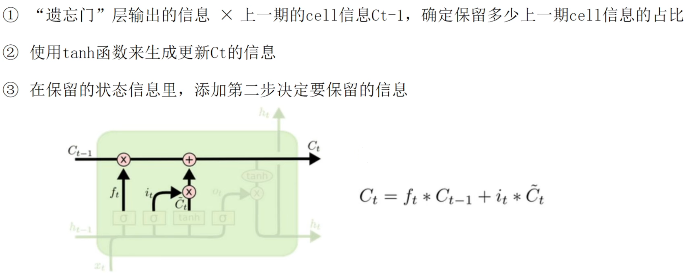

4. 决定输出

   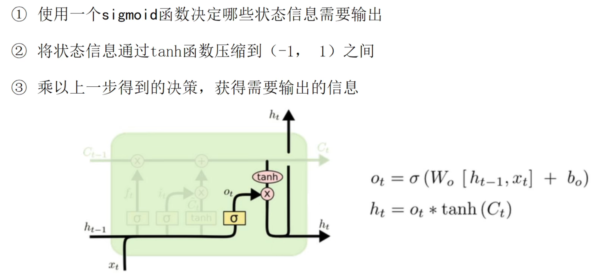

通过选择需要遗忘和保留的信息得到长时记忆（三个权重），通过另一个权重得到当前的短期记忆 $h_t$。

### GRU

