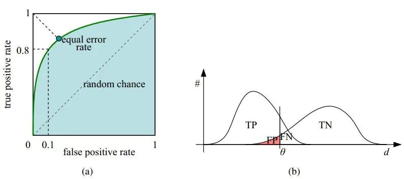

# 基础概念

## 数据样本相关

### 四种样本

- True positives（TP，真正） : 预测为正，实际为正
- True negatives（TN，真负）：预测为负，实际为负
- False positives（FP，假正）: 预测为正，实际为负
- False negatives（FN，假负）：预测为负，实际为正

### 样本指标

**TPR**（true positive rate，真正类率，灵敏度，Sensitivity）
$$
TPR = \frac{TP}{TP+FN}
$$
真正类率TPR代表分类器预测的正类中实际正实例占所有正实例的比例。

**FPR**（false positive rate，假正类率）
$$
FPR = \frac{FP}{FP+TN}
$$
假正类率FPR代表分类器预测的正类中实际负实例占所有负实例的比例。

**TNR**（ture negative rate，真负类率，特异度，Specificity）
$$
TNR = \frac{TN}{FP+TN} \\
TNR = 1 - FPR
$$
真负类率TNR代表分类器预测的负类中实际负实例占所有负实例的比例。

**Recall** = TPR（召回率）
$$
Recall = \frac{TP}{TP+FN}
$$
即当前被分到正样本类别中，真实的正样本占所有正样本的比例，即召回率（召回了多少正样本比例）；**（召回率表示真正预测为正样本的样本数占实际正样本的样本数的比率）**

**Precision**（精确率）
$$
Pre = \frac{TP}{TP+FP}
$$
当前预测为正样本类别中，被正确分类的比例（即正式正样本所占比例），就是我们一般理解意义上所关心的正样本的分类精确率确率；**（精确率表示真正预测为正样本的样本数占所有预测为正样本的样本数的比例）** 通俗说：预测为正样本中正确的占的比例

**Accuracy**（准确率，ACC）
$$
ACC = \frac{TP+TN}{TP+TN+FN+FP}
$$

表示预测正确的样本占所有样本的比率

**F-Score**

F-Score 是精确率 Precision 和召回率 Recall 的加权调和平均值。该值是为了综合衡量 Precision 和 Recall 而设定的。
$$
F=\frac{(a^2+1)P*R}{a^2(P+R)}
$$
如果 $a = 1$，则
$$
F1=\frac{2PR}{P+R}
$$

### 曲线

**ROC 曲线**

横坐标就是FPR，而纵坐标就是TPR，因此可以想见，当 TPR越大，而FPR越小时，说明分类结果是较好的。

