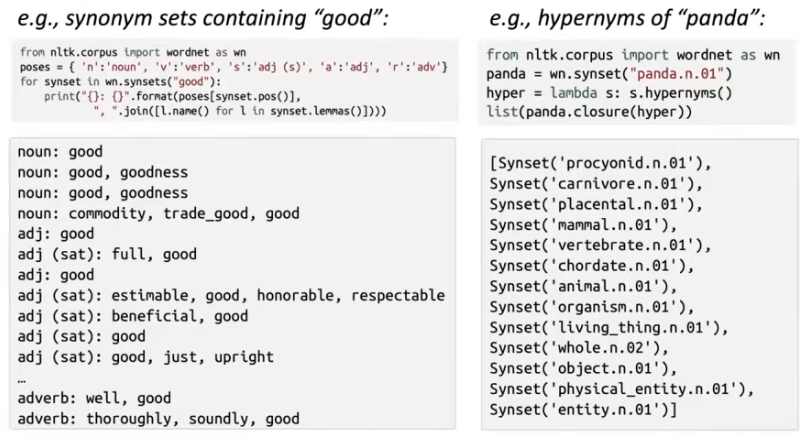
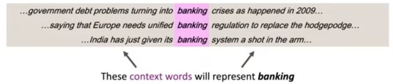
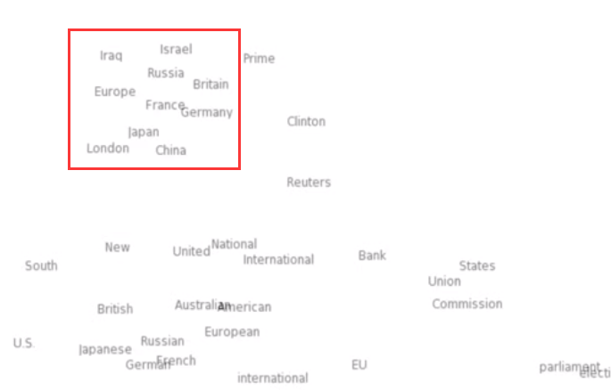
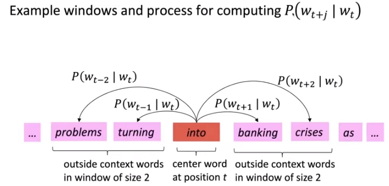
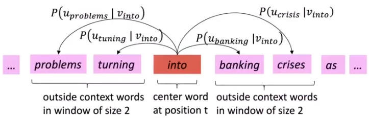
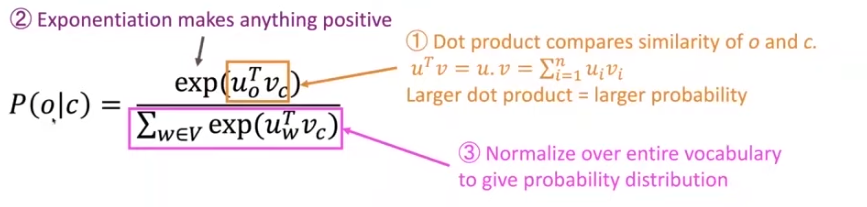
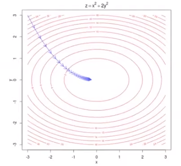

# Intro & Word Vectors

## Intro

这门课的三个目标：

1. 学习在 NLP 领域所使用的比较有效的深度学习方法。（RNN, Attention, Transformer）
2. 学习对于人类语言理解有一个大致的感觉和认识，语言怎么理解，语言怎么产生。
3. 学会使用和理解如何构建一个 NLP 的模型来解决问题。

## Importance of NLP

### 语言和词意

人类语言是复杂的，很容易产生一些误解之类的问题。语言实际上是一个社会系统，会因为人类而产生影响，因为是人类创造的系统。可能对于人类来说，理解语言很轻而易举，但对于计算机而言确实一个复杂的任务。所以，NLP 的主要目标是让计算系统能够猜测出语言的意思，甚至这些词是怎么样影响人们。

语言对于人类来说其实存在的时间不算长，但存在的目的是人类之间的交流。所以最主要的目的是计算机如何理解人类的语言的信息。

## Translation & Universal Models

在最近十年内，网络翻译器的出现让人们能够随心所欲地查看各国网站的新闻，通过翻译器就能够知道其他语言的大致意思。翻译器给这个信息大爆炸的时代增添了色彩。

基于这一点人们就开始思考能不能通过大型的网络来生成语言。既然我们能够提供语言给机器，让机器输出另一种语言，那是不是我们提供别的数据，也能够让机器输出对应的语言呢？是不是就能够让机器产生理解这一概念呢？所有就有 GPT-3 模型。

GPT-3 可以根据你给的例子，比如一小段文本，然后根据所学习到的特征拓展，得到一篇文章，基于现在的文本预测出更多文本。GPT-3 还有很多神奇的应用：

- 根据描述得到对应的 SQL 语句，也就是 SQL 语句生成
- ...

## Words

:::tip

任何领域的机器学习、深度学习方法都是基于将万物的一切转换为数学表达，从而能够应用数学方法来解决一系列问题。

:::

### Meaning of Words

要想将单词、短语、句子放在计算机里面，首先我们要对这些语言做形式化描述，将**文本问题转换成数学问题**。要能表达一个单词的意思，才能够对这些单词、短语、句子做处理。那么对于一个单词的意思 (meaning)，可以表示为
$$
\text{signifier}(\text{symbol}) \lrarr \text{signified}(\text{idea or thing})
$$
:::tip 语言学概念

- signifier 就是一个东西的形式（如何描述一个东西，你怎么叫它的）
- siginified 就是一个物体的本身（客观存在的物体，物体本身）
- denotation 指一个词语的本义（本来的意思，同志本来指的是光荣那种）
- connotation 指一个词语暗含的意思（signifier 可以改变，同志就可以是 homosexual）

:::

这个公式可以理解为，一个词能够表达的形式和物体本身是一致的。

### WordNet

:::info 名词解释

- synonym sets 同义词集
- hypernyms 统称、抽象（“is-a”关系）例：Color is a hypernym of red， red is a type of color.
- thesaurus 词库
- nuance 细微差别
- orthogonal 正交
- dense vector 密集的矢量

:::

传统的解决方案是使用 WordNet 来存储大量的词语集合。



但是如果使用 WordNet 来对我们的自然语言进行处理是完全不够的，会遇到一些问题，例如：

- 词库很庞大，但是词语之间细微的区别无法表示
  - “proficient” 是 “good” 的同义词，但在不同的上下文语境下并不是这个意思，某些情况下是这样。
- 无法表示单词新的意思
  - wicked, badass, nifty, wizard, genius, ninja, bombest 这些单词随着社会的发展有着不同的意思，我们不可能永远让 WordNet 保持最新
- 太过于客观
- 需要人为创建和维护
- 不能精确地计算单词的相似度

**此后，因为 WordNet 存在的问题，所以有人想到将单词转换成离散符号并且使用 one-hot 向量来表示。**传统的 NLP 主要是把每个单词看成离散符号。每一个单词使用 one-hot 向量来表示：

例如句子：hotel, conference, motel —— a localist representation

```python
model = [0 0 0 0 0 0 0 0 0 1 0 0 0 0]
hotel = [0 0 0 0 0 0 1 0 0 0 0 0 0 0]
```

向量的维度数就是在词汇表里面单词的数量。

但使用离散符号和 one-hot 向量来表达单词还是会存在问题，下面通过一个例子可以看到：

比如我们在搜索的时候，我们想搜索 “Seattle motel”，而且我们想让搜索系统返回 “Seattle hotel” 相关的内容。但如果我们使用 one-hot 向量，因为这两个向量是正交的，所以不能使用 one-hot 向量来表示他们之间的相似度。但也有人试图想了一些解决方案：

1. 我们能不能基于 WordNet 当中的同义词来计算相似度？

   但很明显这是不行的，因为 WordNet 并不能包含所有的单词

2. **尝试对向量本身进行相似度编码？（可采用的方案）**

为了能够对向量进行编码，你需要将单词的意思（语义）做形式化定义，将语义这一概念数学化。所以从分布语义学的角度来看**一个词的意思是由经常出现在附近的词所赋予的。**

:::tip Distrubutional semantics

From wiki:

**Distributional semantics** is a research area that develops and studies theories and methods for quantifying and categorizing semantic similarities between linguistic items based on their distributional properties in large samples of language data. The basic idea of distributional semantics can be summed up in the so-called [Distributional](https://en.wikipedia.org/wiki/Distributionalism) hypothesis: *linguistic items with similar distributions have similar meanings.*

> 分布语义学主要是开发和研究基于语言数据在大规模样本的分布特性对语言属性（linguistic items）之间的语义相似度进行量化和分类的理论和方法。分布语义学的基本思路可以总结为：*linguistic items with similar distributions have similar meanings.* （具有相似分布的语言属性之间具有相似的含义）

:::

**要表达一个单词的意思，需要通过在文章中的上下文来获得。**于是你需要定义上下文，我们可以这样定义，一个出现在文中的单词 $w$，那么它的上下文就是这个单词附近的多个单词组成的集合。（在一个固定大小的滑窗内）通过多个单词 $w$ 的上下文就可以表示单词 $w$ 的意思。



### Word Vectors

有了前面的理论基础，现在我们可以用向量来表达一个单词了。可以使用 word vector 来表达一个单词，在不同上下文当中的意思，这个意思可以用概率来表示。

所以，**我们可以对每个单词构建一个密集向量，选择与其出现在相似上下文中的单词向量相似的那些单词。**这个向量就能够某种意义上表达这些单词的意思。通过这样的向量，就可以预测出现在这个上下文当中的其他单词。比如现在有这样的一个向量：
$$
\text{banking}=\begin{pmatrix}
0.286 \\
0.792 \\
-0.177 \\
-0.107 \\
0.109 \\
-0.542 \\
0.349 \\
0.271
\end{pmatrix}
$$
上述的例子就是表示 banking 的词向量。如何表示一个单词的含义的方式就是使用这个向量来预测上下文中出现的其他单词。一般来说，word vector 维度数一般很高，单词可以表达的含义有很多。像 banking 这个单词会有超过 300 个维度以上的表示。

word vectors 也可以叫做 word embeddings 或者 word representations，这是分布的表示。但是人无法理解超过三维以上空间，对于这些高维向量人类无法处理，

:::danger 为什么要叫 embeddings ?

不同的语言都有大量的单词、词汇，不同的单词都有对应的 word vectors，这些所有的单词被放置在高维的向量空间。这样的行为有点像把向量嵌入（embedding）到一个向量空间，所以就有 embedding 这样的叫法。



其实他就是把我们所输入的单词，根据其共同的特点 map 到另一个高维空间，而 map 之后的结果是包含之前输入的 concept，对于不同的 concept 做一个分组，属于同一个 concept 上的单词就会被分到同一组（这个组可以用距离来理解，分到同一组说明这些词之间的距离非常相近）

> 向量空间本质上是多组线性无关的向量组成的向量集合，集合中任意两个向量的数乘和加法运算的结果仍然在这个集合里，那么这个集合就可以理解成为一个空间。所有的向量都是在这个空间里面的，有点像现实世界的空间，但抽象成用向量（数字）来组成。也可以认为，我们所处的空间，是由向量组成的。

所以，对于无论是单词还是其他数据的 embedding，都可以理解为将所输入的数据做 concept 归纳，然后嵌入到一个更高维度的向量空间。因为得到了其 concept，所以能够表达更加抽象的特征。

:::

世界上所有的词都有一个对应的向量，所有的词向量都被嵌入到一个向量空间中。根据不同的值可以说明不同词之间具有相似的关系。

### Word2Vec

:::info

word2vec 是一种中学习词向量的框架。

:::

- 庞大的文本语料库
- 对于每一个单词都会创建一个词向量
- 对于每个单词，都会计算其分布的相似性的任务。比如更好地预测从文本中学习到的词向量，会存在一个中心词 $c$ 和 上下文 $o$。
- 用 $c$ 和 $o$ 词向量之间的相似度来计算 $o$ 是中心词的概率。
- 目标：调整词向量，最大化上述所说到的概率。



对于每一个中心词 $c$，都要与上下文 $o$ 都要计算相似度。如上图所表示。所以，对于这个任务，我们最终的损失函数可以这样定义。

:::info 似然函数

似然函数描述的是指某一种事件发生的可能性。所以，我们可以在某一种条件的前提下，猜测一件事情发生的可能性，实际上就是条件概率函数。$L(b|A)=\alpha P(A|B=b)$

:::

对于每一个位置 $t$，有一个固定大小 $m$ 的滑窗来预测上下文，给定中心词 $w_j$，可以有[似然函数](https://zh.wikipedia.org/wiki/似然函数)：
$$
\text{Likehood} = L(\theta)=\prod_{t=1}^T\prod_{-m\le j\le m, j\not=0}\log P(w_{t+j}|w_t;\theta)
$$
:::danger

**因为最小化目标函数就等价于最大化预测的准确度**

:::

$\theta$ 是我们要优化的所有变量，那么我们的目标函数（损失 (loss) 函数，成本 (cost) 函数）就是使得上述的似然函数最大化，那么我们就可以对其构造目标函数：
$$
J(\theta)=-\frac{1}{T}\log L(\theta)=-\frac{1}{T}\sum_{t=1}^T\sum_{-m\le j\le m,j\not=0}\log P(w_{t+j}|w_t;\theta)
$$
其中在原来的基础上加上了负号和 $\log$，目的构造一个凸函数，我们对凸函数求得最小值就是我们的最优解（求解最小值比求最大值更加便捷）；取 $\log$ 是为了将连乘转换为连加来处理，在计算的时候更加简单。（这里这个操作叫平均负数 $\log$ 似然函数）

但是现在又产生了一个问题：我们该如何计算 $\log P(w_{t+j}|w_t;\theta)$？因为我们之前提到要计算中心词 $c$ 和 上下文 $o$，所以我们分别构造这两个向量：

- $v_w$ $w$ 是中心词
- $u_w$ $w$ 是上下文的词

所以我们可以这样计算：
$$
P(o|c)=\frac{\exp(u_o^Tv_c)}{\sum_{w\in V}\exp(u_w^Tv_c)}
$$
现在放到一个具体的实例来看，



这里使用的是 softmax 函数（归一化指数函数）作为例子，使用 softmax 函数来对中心词和上下文词进行分类：



:::info softmax 函数

softmax 是一个归一化指数函数，它能将一个含任意实数的 $K$ 维向量 $\mathbf {z}$ “压缩” 到另一个 $K$ 维实向量 $\sigma (\mathbf{z})$ 使得每一个元素的范围都在 $(0,1)$ 之间（形式描述可以这样理解 $\mathbb{R}^n\rarr(0,1)^n$），并且所有元素的和为 $1$ (也可视为一个 $(k-1)$ 维的 hyperplane 或 subspace)。该函数的形式通常按下面的式子给出：
$$
\sigma(\mathbf{z})_j=\frac{e^{z_j}}{\sum_{k=1}^Ke^{z_k}}
$$
softmax 在多分类问题上具有非常重要的作用。特别地，在多项逻辑回归和线性判别分析中，函数的输入是从K个不同的[线性函数](https://zh.wikipedia.org/wiki/線性函數)得到的结果，而样本向量 $\mathbf{x}$ 属于第 $\mathbf{j}$ 个分类的概率为：
$$
P(y=j|\mathbf{x})=\frac{e^{\mathbf{x}^T\mathbf{w}_j}}{\sum_{k=1}^Ke^{\mathbf{x}^T\mathbf{w}_k}}
$$
其中，softmax 表达的含义为：

- “max” 表示放大 $x_i$ 最大的概率，表示了是求概率的最大值
- “soft” 表示仍然将一小部分概率分配给 $x_i$，不会只求最大值，是比较灵活的，会把次最大值的情况也求出来。并不绝对求 max
- 经常在 DL 当中使用

:::

最后我们构造这样的词向量：
$$
\theta=\text{banking}=\begin{bmatrix}
0.286 \\
0.792 \\
-0.177 \\
-0.107 \\
0.109 \\
-0.542 \\
0.349 \\
0.271
\end{bmatrix}\in\mathbb{R}^{2dV}
$$
其中表示，一个单词的维度可能有 $d=300$，我们有 $V$ 个单词，并且包含中心词向量和上下文词向量，那么这个矩阵的大小为 $2\times300\times V$。

- Recall: $\theta$ 表示了**所有**模型参数，在一个很长的向量当中

- 最重要的一点：每一个单词都有两个词向量（中心词和上下文）

- 通过微积分的方式来优化目标函数，使其最小

  

对于求解过程上面目标函数的最小值，我们需要使用微积分的方式，但是每一个变量都是一个向量，所以在使用过程中需要先学习[矩阵微积分 - Wikipedia](https://en.wikipedia.org/wiki/Matrix_calculus)。推导过程如下：

## Q&A

1. 每个词的两个词向量之间的区别是什么？词库中的每一个单词都可以有好几个上下文词，但这里只有两个向量，我认为这两个向量可以理解为一个是实际的单词，另一个是上下文，但如果在多个上下文中，你再怎么只选择两个呢？

   在我们的优化的目标函数中，我们是对于每一个单词进行计算，第二个求和符号（从左往右）是针对上下文中的每一个单词进行计算。也就是对于每个中心词都会对每一个上下文单词进行计算，所以这是可以覆盖所有的情况的。再者，因为数学讲究美和简单，所以使用两个向量的方式已经能够使得中心词和上下文词之间是独立的。

2. 我们什么时候需要将向量投影到我们看到的 2D 平面上的词向量，类似于一群小正方形，可以看到哪些单词之间是类比比较相似的，这些关系向量之间是否存在关系，有点像向量的规则，类似于向量 O 的 C。

   你想检查这些向量的关系是非常简单的，只要你拥有这些词向量集合中的一组，你就可以知道这些词向量之间的关系。

3. 当你想同时给两个向量折叠的时候，通常都会取平均值吗？

   不同的人会做不同的事情，这是很常见的是一种方式。这是加载某一些词向量的时候，你会自然想到通过一些方式能够比较他们之间的不同之处。

4. 如果一个单词有两种或多种以上不同的意思，那我们还能够用相同的向量来表示吗？

   对于有些单词，特别是对于一些不常见的单词可能会有很多种意思，像 `star` 就有很多意思，然后将他们整合进单一的一个词向量。

5. 如何建立文本和语音之间的联系？

   这门课主要是集中讲本文信息，如果想学语音识别，可以去 CS224S

6. 有些反义词还是会比较相近，这样就很奇怪。但我也想知道正负平衡或者缺乏平衡，还是说在模型里面能够很好地捕捉这些特征，还是说对于这些词很难捕捉？

   确实捕捉反义词的特征确实比较难，而且也很差，你在上下文向量中获得的信息是非常相似的，对于情感方面的词也是会有同样的问题。人们希望能够用神经网络来解决内涵效应（connotation effect）的问题。虽然有一些现成的解决方案，但是也必须要做一些比较简单地预测单词的工作。对于像 on, so, like, at 等这些词都是属于比较常见而且是功能词，没有什么具体的含义，这个时候就很难表达他的上下文信息。
