# 可视化卷积神经网络

因为神经网络始终还是一个黑箱子，所以使用卷积神经网络的过程中我们需要对其中的过程进行了解才能更好地设计卷积神经网络的结构。

## 理解 CNN 的方式

- 可视化能够使得指定神经网络激活值最大的 patch

  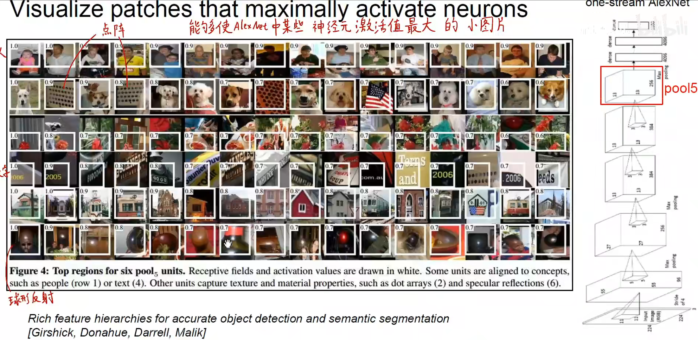

- 可视化权重

    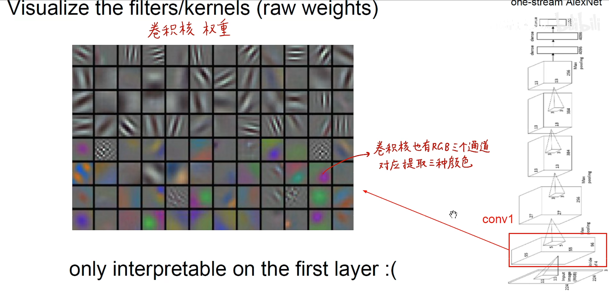

  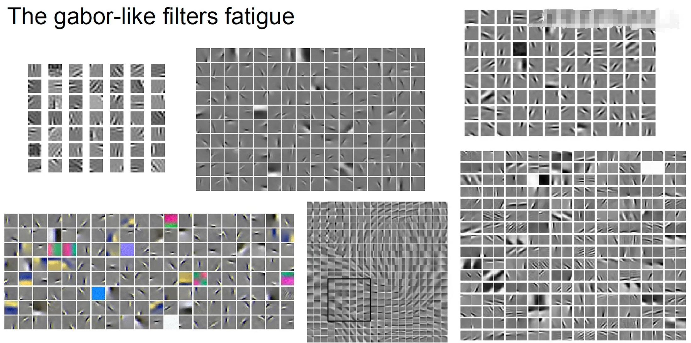

- 可视化特征空间，图像经模型编码后的表示空间

  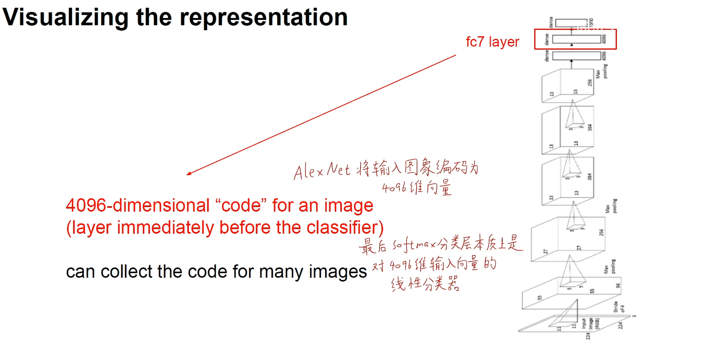

  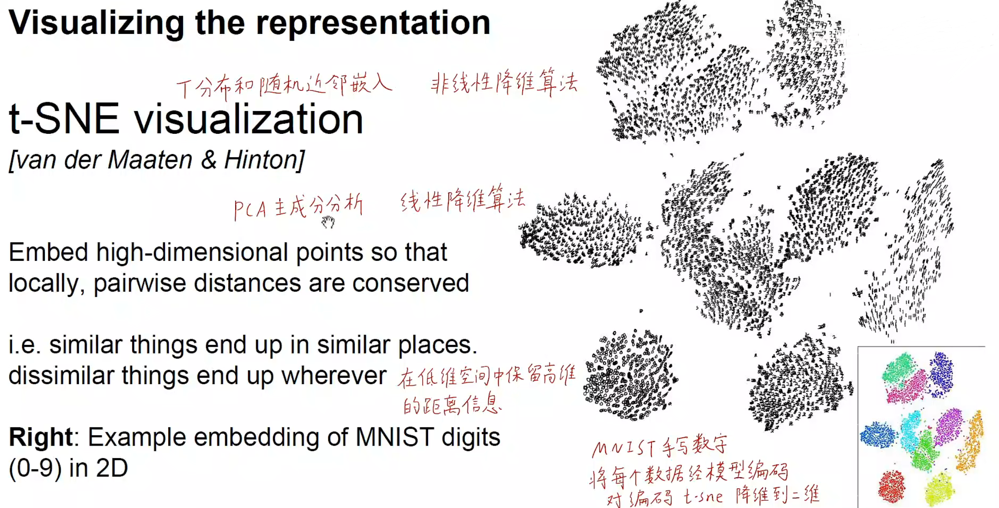

  为了能够观察到高维的特征信息，需要对特征进行降维，降维到 2D 或者 3D 人类才能够理解。常用降维方法就是 t-SNE（非线性） 和 PCA 方法（线性）。

- 遮挡实验

  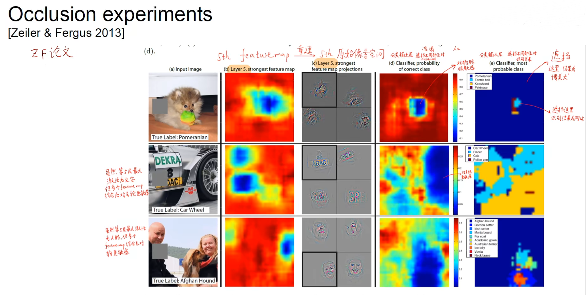

- 实验对比/反卷积方法

  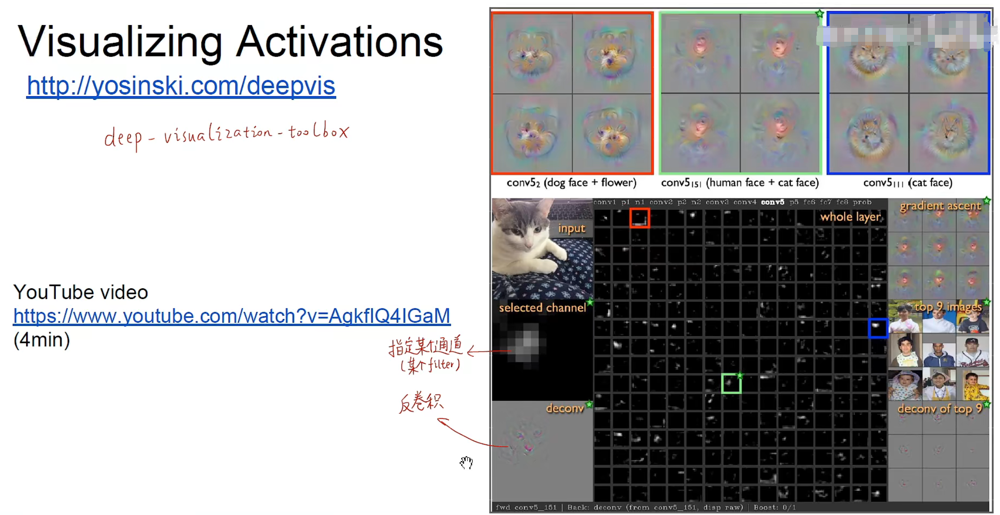

  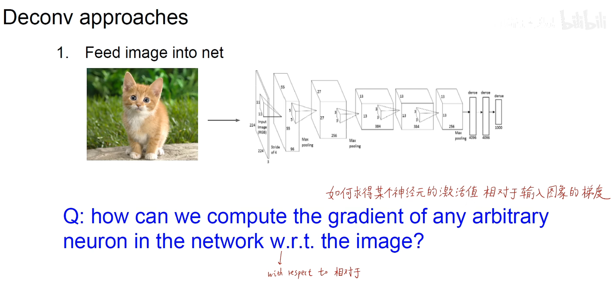

  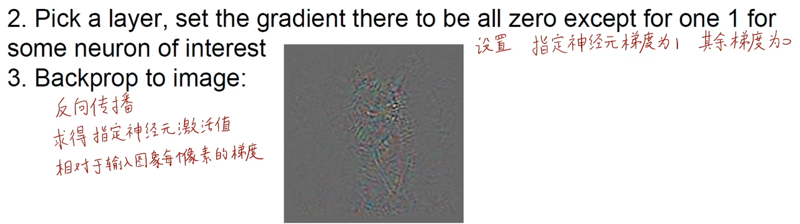

  通过反向传播或者导向反向传播能够获得到人类能够理解的特征图。

  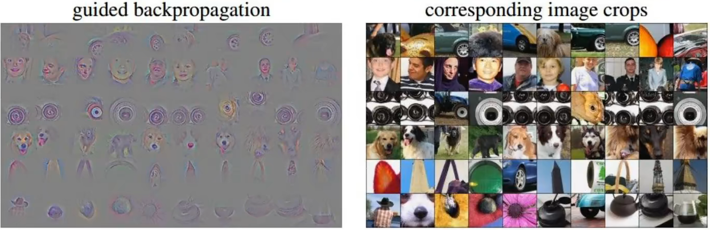

     

- 优化图像方法

  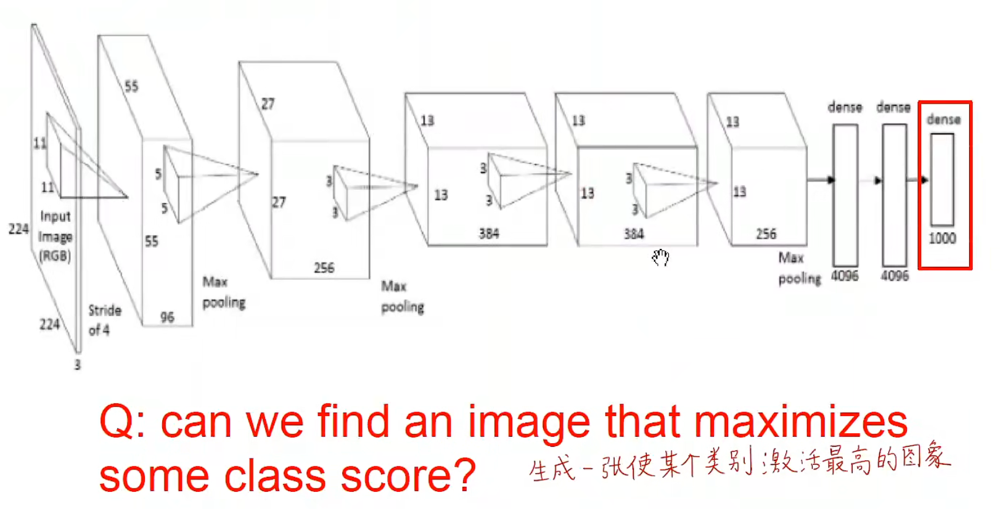

## 可参考论文

对于理解和可视化卷积神经网络，可以看一篇论文名为[《Visualizing and Understanding Convolutional Networks》](https://link.springer.com/chapter/10.1007/978-3-319-10590-1_53)的论文（ZFNet）。

通过可视化加强对于神经网络的理解，发现对应网络当中存在的一些问题。

## 特征可视化

- 直接提取出对应层的特征图进行可视化
- 进行 CAM (class attetion mapping) 可视化

为了能够使得我们**打破神经网络黑箱子**这个特性，所以我们非常有必要对中间的特征图进行可视化，通过可视化的结果**解释当前模型**所关注的特征以及发现问题和提出新的优化方法。（**这个步骤是非常重要的**）

使得我们能够看到模型到底关注了图像的哪个部分。

## Reference

- [https://projector.tensorflow.org/](https://projector.tensorflow.org/)
- [https://cs.stanford.edu/people/karpathy/cnnembed/](https://cs.stanford.edu/people/karpathy/cnnembed/)
- [http://yosinski.com/deepvis](http://yosinski.com/deepvis)
- [https://www.youtube.com/watch?v=AgkflQ4IGaM](https://www.youtube.com/watch?v=AgkflQ4IGaM)
- [https://arxiv.org/abs/1512.04150](https://arxiv.org/abs/1512.04150)