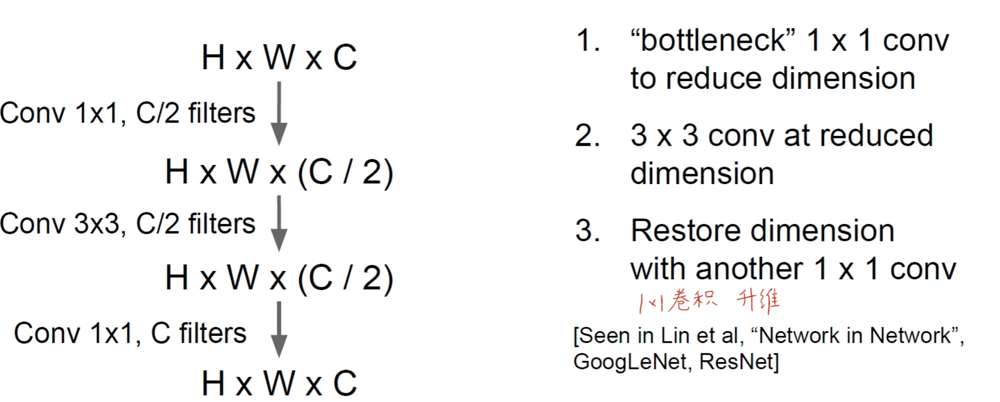
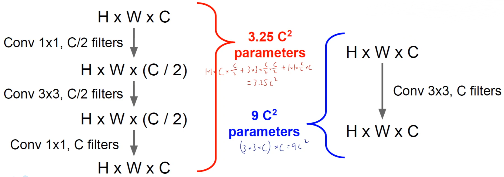
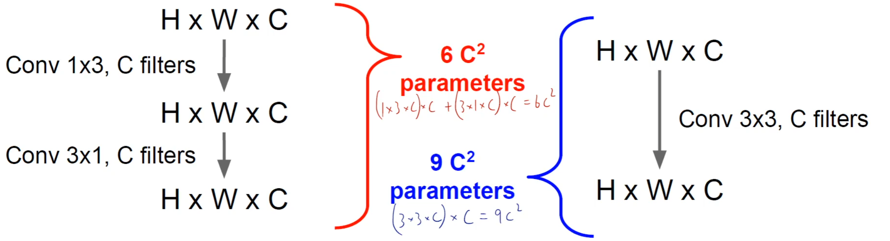
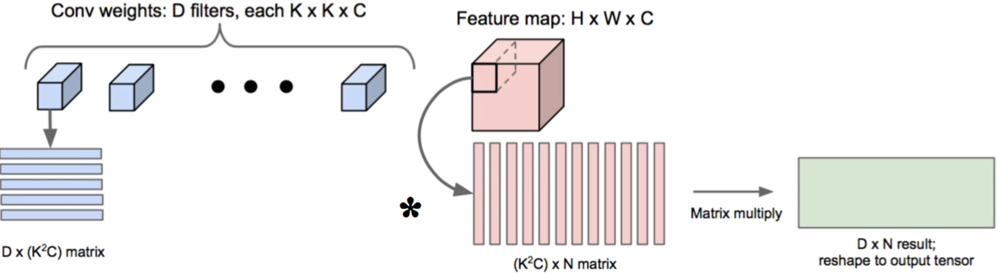
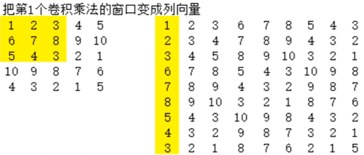
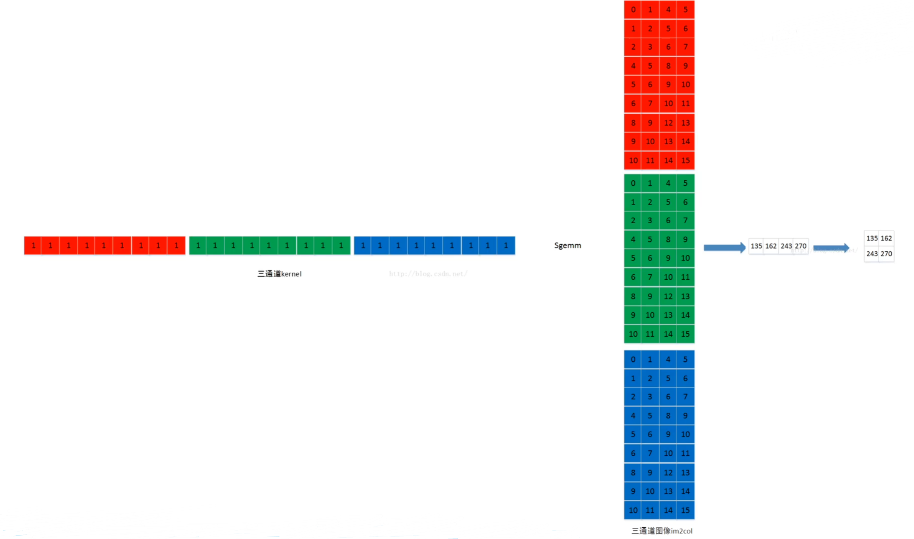
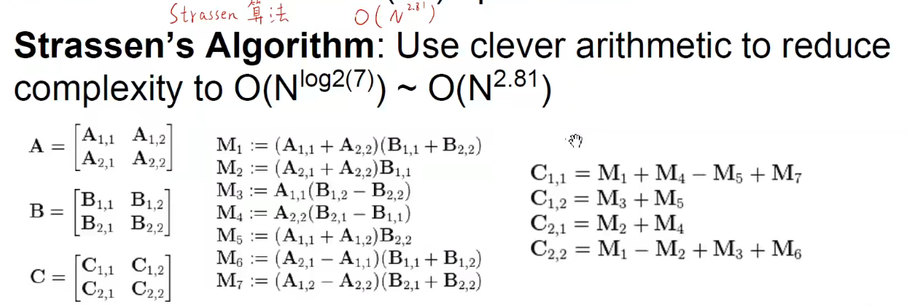
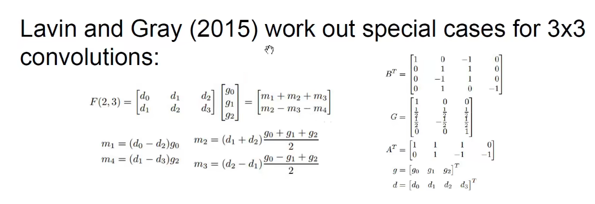

# CNN 工程实践技巧

## 小卷积核代替大卷积核

一次 $5\times5$ 的卷积可以用 两次 $3\times3$ 的卷积来代替，也就是说，两次 $3\times3$ 卷积之后特征图上一个像素就代表了原图上 $5\times5$ 的信息。可以对比一下彼此的运算量。

:::tip

乘法的运算量可以用以下公式计算：
$$
\text{mul\_ops}=\text{feature\_map大小} \times \text{卷积核感受野的大小}
$$

:::

- 一次 $7\times7$ 卷积

  $N=7\times7\times C\times C=49C^2$， 表示单个卷积核，$C$ 表示 $C$ 个卷积核

  $N_{ops}=(H\times W\times C)\times(7\times7\times C\times C)=49HWC^2$

- 三次 $3\times3$ 卷积

  $N=3\times3\times C\times C\times3=27C^2$，$3\times3\times C$，$C$ 表示 $C$ 个卷积核，$3$ 表示进行 $3$ 次卷积

  $N_{ops}=(H\times W\times C)\times(3\times3\times C\times C\times3)=27HWC^2$

通过对比可以发现，明显 $3\times3$ 的小卷积核计算量要小，计算乘法的次数上也是小卷积核的更少，参数量更少，并且更多的卷积核意味着可以给网络带来更多的非线性因素，模型的表示能力就更强。那我们是不是可以尝试用 $1\times1$ 卷积继续优化呢？

因为 $1\times1$ 卷积的作用主要是为了降维，可以先通过 $1\times1$ 卷积进行降维，$3\times3$ 提取特征，再用 $1\times1$ 卷积进行升维。（也就是 bottleneck 的结构，先降低维度，再升高维度）

使用这样的结构也能够继续降低参数量，同时能够带来更多的非线性因素更少的参数量和计算量。

 

同时，我们还可以改变卷积核的形状，不一定是要正方形，可以尝试 $3\times1$ 或者 $1\times3$ 两种，也能够实现同样的效果。

通过上面的几种方法，可以代替大卷积核而使用小卷积核进行采样。并且 $1\times1$ 是一种高效的降维或者升维的工具，也能够把 $N \times N$ 的卷积拆分成 $1\times N$ 和 $N\times1 $；最终都会带来更少的参数量、计算量、更多的非线性变换。

## 如何高效计算卷积

### 思路一：向量化矩阵方法

最简单的一种方式是将卷积运算转换为矩阵乘法，因为矩阵乘法目前已经被高度地优化加速了，有很多现成的工具包。转换成矩阵乘法只需要将卷积核权重矩阵拉成行，特征图矩阵拉成列，然后两者进行矩阵乘法即可实现。（多通道图像也是同理）

具体到数字可以这样表示：

相乘操作之后：

### 思路二：FFT

因为根据所学的傅立叶变换可以知道，卷积理论说，两个在时域上的卷积操作等价于两个在频域上的逐元素乘积操作。也就是两个函数的卷积等于两个函数经过傅立叶变换之后逐元素乘积的结果。步骤为：

1. 计算卷积核权重的 FFT
2. 计算输入图像的 FFT
3. 两个图像进行逐元素相乘
4. 进行逆 FFT 恢复到时域

这样操作对于大卷积核加速比较明显，小卷积核效果不明显。

:::caution 信号处理的角度理解卷积

其实图像上的卷积核本质上就是一个二维信号的滤波器，所有的理论都可以用信号的知识来理解。图像本质上也是一种信号，对于图像的理解其实就是二维信号，通过傅立叶变换之后能够从频域的角度来观测图像。

图像上的卷积本质上就是提取图像不同频率的特征。**用信号分析的方法来理解卷积**

:::

低通滤波器：通低频阻高频

高通滤波器：通高频阻低频

### 思路三：使用现成的算法进行加速

Strassen 算法：

Lavin 提出的算法：

