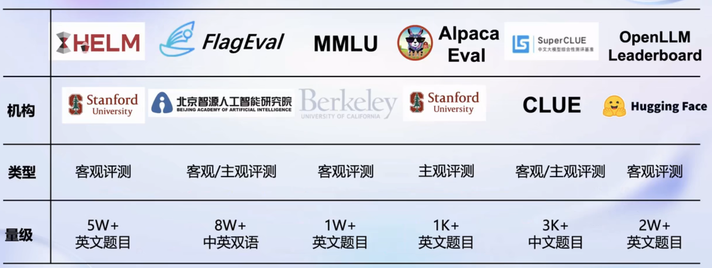
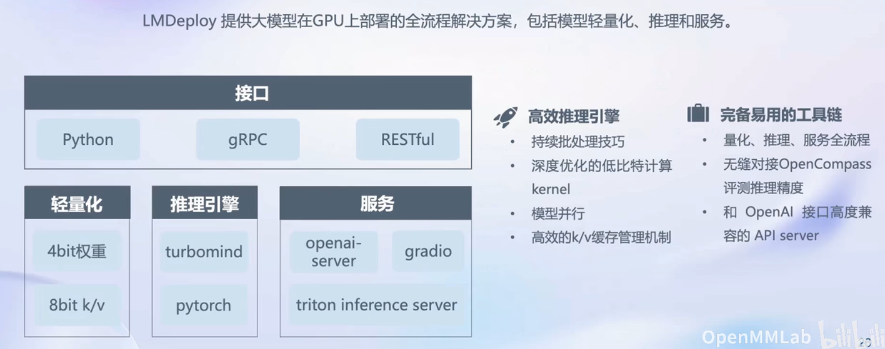

# 第一节课笔记

:::info
Title: 书生·浦语大模型全链路开源体系

Link: [https://www.bilibili.com/video/BV1Rc411b7ns/](https://www.bilibili.com/video/BV1Rc411b7ns/)
:::

## 书生·浦语大模型发展

从 2023 年 6 月 7 日发布，随着不断发展，对大模型包括但不限于数据、多模态、应用、智能体、参数量、开源工具栈等一系列角度来发展。

其中包含 7B，20B，123B 参数量的三种模型。不同大小的模型可以应用的角度也不相同。不同的参数量大小能够表示训练所用的数据、支持的上下文长度、模型能力等方面。

同时，书生浦语模型能够在各种能力上达到非常好的性能，特别针对中文进行了优化，是国内少有的能够支持高性能·1中文对话的模型。

## 大模型如何应用？

如果把大模型用到一些下游应用，我们要按如下角度来考虑：

1. 模型选型：选取符合自己任务的模型，对其进行测评。
2. 考虑业务场景是否复杂
3. 如果模型能够满足业务要求则需要看是否有足够的算力来微调
4. 同时根据现存算力决定是否全量微调或部分参数微调
5. 再者，如果大模型需要和环境进行交互，是否考虑构建智能体
6. 衡量模型的能力
7. 部署

## 书生·浦语全链条开源开放体系

大模型全流程全链条体系包括数据、预训练、微调、部署、评测、应用。

- 数据：书生万卷数据集（2TB）
- 预训练：InternLM-Train
- 微调：XTuner
- 部署：LMDeploy
- 评测：OpenCompass
- 应用：智能体 AgentLego、Lagent

### 数据

书生万卷数据集包含了大量文档数据、2200 多万图像文本数据、1000 多个视频数据。能够支持从语言模型到多模态模型的的训练。同时，也可以应用其数据预训练自己的大模型。

对于该数据集，其中进行了许多精细化的处理，包括语言筛选、文本提取、格式标准化、数据过滤和清洗、多尺度去重和数据质量评估。

### 预训练

训练框架兼容性强，能够支持 8 卡到千卡量级的训练，加速效率高。同时不需要接入主流 huggingface 生态。其中也对其进行了很多优化。

### 微调

能够支持大模型的增量续训和有监督微调。同时支持 LoRA 微调。其中的 XTuner 也能够适配现有的主流框架以及算法，能够直接对接现有生态。

### 评测

OpenCompass 能够从学科、语言、知识、理解、推理、安全几个维度来评测，使其更加客观。提供了许多测评的方法。

### 部署

内存开销大、缓存要求高、请求数不确定、设备要求、系统吞吐量、加速生成。部署挑战上来说模型并行、低比特优化、Attention 优化、计算访存优化、Batching

### 应用

能够直接调用动作，一站式的 Agent 设计和部署方案。
