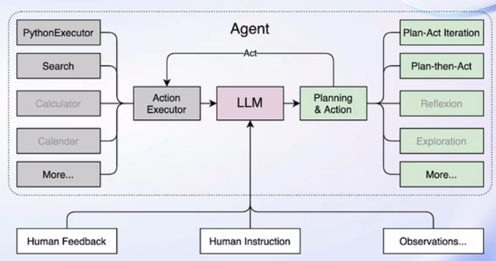

# 第二节课笔记

> Title: 轻松玩转书生·浦语大模型趣味 Demo
> Link: [https://www.bilibili.com/video/BV1Ci4y1z72H](https://www.bilibili.com/video/BV1Ci4y1z72H)
> Docs: [https://github.com/InternLM/tutorial/blob/main/helloworld/hello_world.md](https://github.com/InternLM/tutorial/blob/main/helloworld/hello_world.md)

## 简介

- InternLM 是一个开源的轻量级训练框架，旨在支持大模型训练而无需大量的依赖。基于InternLM训练框架，上海人工智能实验室已经发布了两个开源的预训练模型: InternLM-7B 和 InternLM-20B。
- Lagent 是一个轻量级、开源的基于大语言模型的智能体(agent)框架，用户可以快速地将一个大语言模型转变为多种类型的智能体。通过 Lagent 框架可以更好的发挥 InternLM 模型的全部性能。
- 浦语·灵笔是基于书生·浦语大语言模型研发的视觉·语言大模型，有着出色的图文理解和创作能力，使用浦语·灵笔大模型可以轻松的创作一篇图文推文。

## InternLM-Chat-7B 对话

InternLM-7B 包含了一个拥有 70 亿参数的基础模型和一个为实际场景量身定制的对话模型。该模型具有以下特点:

1. 利用数万亿的高质量 token 进行训练，建立了一个强大的知识库。
2. 支持 8k token 的上下文窗口长度，使得输入序列更长并增强了推理能力。

## Lagent

Lagent 是一个轻量级、开源的基于大语言模型的智能体 (agent) 框架，用户可以快速地将一个大语言模型转变为多种类型的智能体，并提供了一些典型工具为大语言模型赋能。架构如图所示:

## InternLM-XComposer-7B

浦语·灵笔是基于书生·浦语大语言模型研发的视觉-语言大模型，提供出色的图文理解和创作能力，具有多项优势:

1. 为用户打造图文并貌的专属文章。
2. 设计了高效的训练策略，为模型注入海量的多模态概念和知识数据，赋予其强大的图文理解和对话能力。

## 总结 & 思考

通过全链路的开发体系，减少了大模型应用的门槛，同时，框架对训练进行优化使得训练大模型不再遥远。以后希望通过 InternLM 体系开发一个属于个人的 AI 助手。