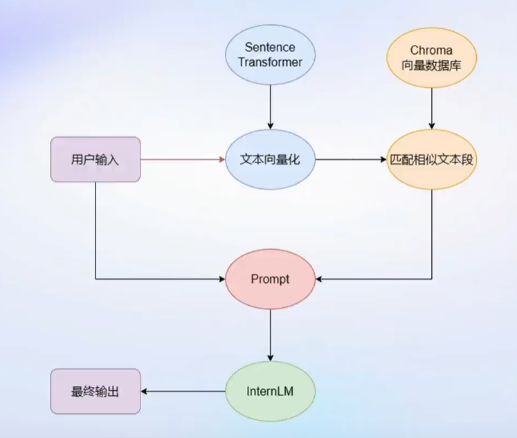
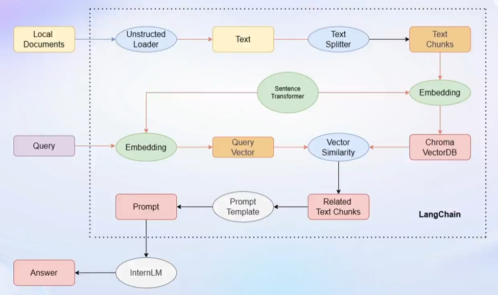
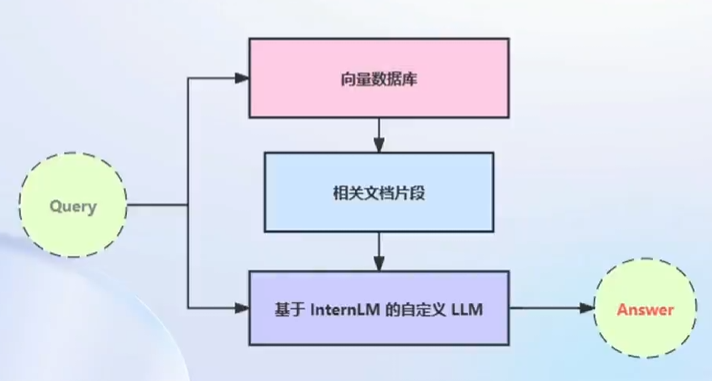

# 第三节课笔记

> Title: 基于 InternLM 和 LangChain 搭建你的知识库
> Link: [https://www.bilibili.com/video/BV1sT4y1p71V/](https://www.bilibili.com/video/BV1sT4y1p71V/)
> Docs: [https://github.com/InternLM/tutorial/blob/main/langchain/readme.md](https://github.com/InternLM/tutorial/blob/main/langchain/readme.md)

## 动机

- 大模型无法获取动态更新的知识：2023 年训练的模型无法知道 2024 年发生的事情
- 专业能力有限（垂直领域）
- 定制化成本高：个人专属的 LLM 应用门槛高

## 解决思路

### RAG

- 成本低，不需要重复微调大模型
- 实时更新数据库知识
- 对 Base Model 性能要求较高
- 单次回答知识有限，需要重复提问

流程可以表示为如下过程：

### Finetune

- 可以进行非常自由的调整
- 给什么数据就学什么
- 但微调模型成本较高
- 无法实时更新大模型的知识

## 技术前置知识

### LangChain

LangChain 框架是一个开源工具，通过为各种 LLM 提供通用接口来简化应用程序的开发流程，帮助开发者自由构建 LLM 应用。

> LangChain 的核心组成模块：
>
> 链 (Chains) : 将组件组合实现端到端应用，通过一个对象封装实现一系列 LLM 操作。E.g. 检索问答链，覆盖实现了 RAG (检索增强生成) 的全部流程

## 搭建过程

1. 构建向量数据库
   - 确定文件类型，不同文件使用不同的加载器（格式文本转换为无格式文本）
   - 根据上下文上限对文档进行切分（按长度分割、手动控制分割快的长度和重叠区间长度——n-gram）
   - 将文档提取 word embedding 后存入数据库（Chroma，支持多种语义检索的向量数据库）
2. 搭建检索问答链
   - LangChain 提供了检索问答链模版，可以自动实现知识检索、Prompt 嵌入、LLM
     问答的全部流程
   - 将基于 InternLM 的自定义 LLM 和已构建的向量数据库接入到检索问答链的上游
   - 调用检索问答链，即可实现知识库助手的核心功能

> RAG 问答优化：
>
> 基于RAG的问答系统性能核心受限于：
>
> - 检索精度
> - Prompt性能
>
> 一些可能的优化点：
>
> - 检索方面
>   - 基于语义进行分割，保证每一个chunk的语义完整
>   - 给每一个chunk生成概括性索引，检索时匹配索引
> - Prompt方面
>   - 迭代优化Prompt策略