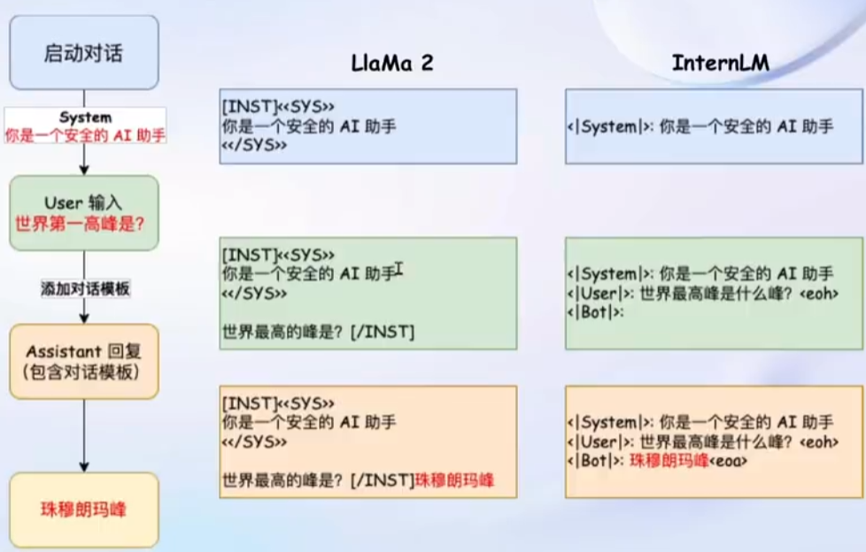
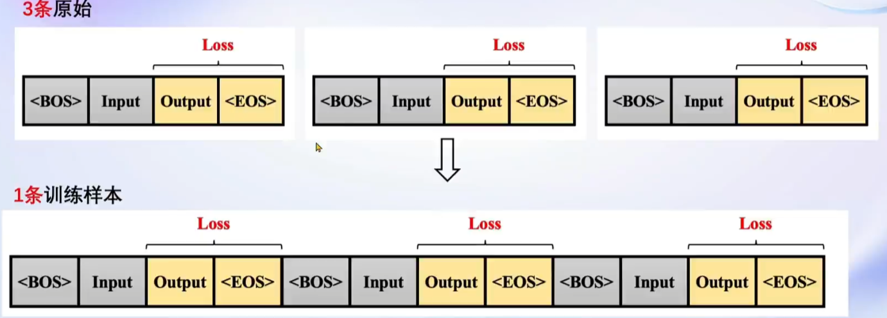

# 第四节课笔记

:::info
Title: XTuner 大模型单卡低成本微调实战

Link: [https://www.bilibili.com/video/BV1yK4y1B75J](https://www.bilibili.com/video/BV1yK4y1B75J)

Docs: [https://github.com/InternLM/tutorial/blob/main/xtuner/README.md](https://github.com/InternLM/tutorial/blob/main/xtuner/README.md)
:::

## 动机

将大模型应用到自己所需求领域的数据分为增量预训练和指令跟随能力两种微调方式。

1. 增量预训练（SFT）

   base 模型学习新的知识（e.g. 某个垂域的知识）

   数据：文章、书籍、代码

2. 指令跟随微调（IFT）

   模型学会新的对话方式，修改模型的 “说话方式”

   数据：高质量的对话、问答

## 微调方式

微调的流程图：

### 增量预训练微调

增量训练的数据不需要问答的形式，也就是大模型只需要知道一段话什么时候开始，什么时候结束即可，也可以是陈述句。可以将 System 和 User 留空，只留 Assistant 即可。

数据格式：

### 指令跟随微调

构造对话格式数据，对话包含三个角色：

1. System：表示当前对话的上下文信息，可以理解为是一个当前对话环境 Prompt
2. User：表示实际用户会输入的内容，提出一些问题（Input）
3. Assistant：根据 User 的输入，结合当前对话上下文环境（System）做出相应的回答（Output）

三种角色只是方便构造相应格式的数据，以便让 LLM 学习，实际使用并不会感知到这几种角色。

:::tip
假设现在有一问一答的数据，则相应的 Prompt 为：

- System：你是一个地理知识专家
- User：世界第一高峰是？
- Assistant：珠穆朗玛峰
:::

### 对话模板

为了方便实现上述的流程，通常会设计相应的对话模板，方便在指令微调过程中加入 Prompt 和指令微调的数据。不同的语言模型拥有不同的对话模板。

具体形式为：

这些模板都是隐藏在推理代码中，不会展现给用户，用户只需要输入自己的内容即可。

#### Training 过程

指令微调学习主要目的是让模型学会我们指定的回答，也就是希望学会答案（Output）而不是输入的问题（Input），所以计算 Loss 的时候只会对输出进行计算。

推理和训练都会加入相应的对话模板：

### LoRA & QLoRA

只训练两个低秩矩阵的参数即可，不需要整个网络训练。

## XTuner

- 集成了各种常用的配置文件，能够一键启动微调训练
- 支持各大平台模型
- 具备优化加速

### 数据处理

- 数据格式化：具备将原始问答预料转换成对话形式，然后再从对话形式格式化成对话模板的问答模板

- 多数据拼接：能够将多条样本拼接到一条样本上。

  

### 优化加速

- 集成了 Flash Attention
- 集成了 Deepspeed ZeRO

## 总结

利用 XTuner 很方便能够用自己的数据微调大模型，做成一个个人小助手，使得大模型微调能够进入一般用户的视野。
