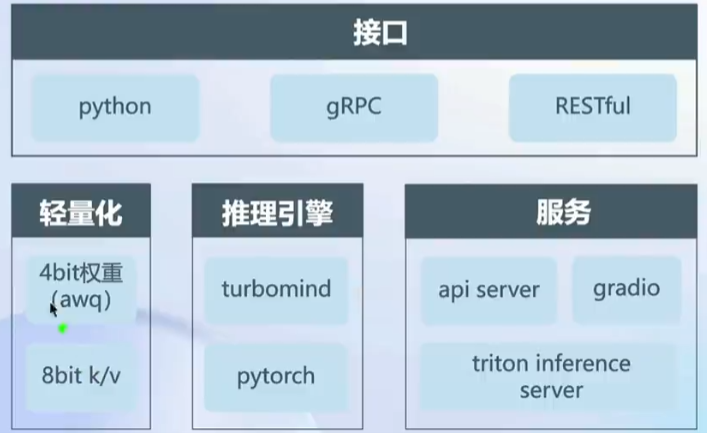
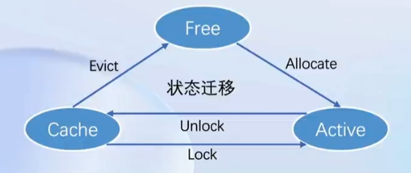

# 第五节课笔记

:::info
Title: LMDeploy 大模型量化部署实践

Link: [https://www.bilibili.com/video/BV1iW4y1A77P/?vd_source=5f3fde3ed54e5f3c92b4fc94386b106a](https://www.bilibili.com/video/BV1iW4y1A77P/?vd_source=5f3fde3ed54e5f3c92b4fc94386b106a)

Docs: [https://github.com/InternLM/tutorial/blob/main/lmdeploy/lmdeploy.md](https://github.com/InternLM/tutorial/blob/main/lmdeploy/lmdeploy.md)
:::

## 动机

为了能够将大模型部署到边缘侧设备，以便大模型应用落地。需要在部署过程中进行优化。模型部署将训练好的模型在特定软硬件环境中启动的过程，使
模型能够接收输入并返回预测结果。为了满足性能和效率的需求，常常需要对模型进行优化，例如模型压缩和硬件加速。主要针对云端、边缘计算端、移动端
计算设备有CPU、GPU、NPU、TPU 等。

### 为什么需要优化？

- 内存开销巨大
  - 庞大的参数量。7B 模型仅权重就需要 14+G 内存
  - 采用自回归生成 token，需要缓存 Attention 的 k/v,带来巨大的内存开销
- 动态 shape
  - 请求数不固定
  - Token 逐个生成，且数量不定
- 相对视觉模型，LLM 结构简单
  - Transformers 结构，大部分是 decoder-only。

### 部署需要考虑的问题

- 设备
  - 如何应对巨大的存储问题? 低存储设备 (消费级显卡、手机等)如何部署?
- 推理
  - 如何加速 token 的生成速度
  - 如何解决动态shape，让推理可以不间断
  - 如何有效管理和利用内存
- 服务
  - 如何提升系统整体吞吐量?
  - 对于个体用户，如何降低响应时间?

### 当前方案

- 技术点
  - 模型并行
  - transformer 计算和访存优化
  - Continuous Batch
  - 低比特量化
  - Page Attention
- 方案
  - huggingface transformers
  - 专门的推理加速框架
- 云端
  - Imdeploy
  - vllm
  - tensorrt-Ilm
  - deepspeed
- 移动端
  - llama.cpp
  - mlc-llm

## LMDeploy

:::tip
特点：

- 持续批处理技巧
  - Blocked k/v cache
  - 深度优化的计算kernels
  - 动态分割与融合
  - 完备易用的工具链
- 高效推理引擎
  - 量化、推理、服务全流程
  - 无缝对接opencompass
  - 评测推理精度
  - 多维度推理速度评测工具

:::

### 量化

为了在有限的显存情况下部署大模型应用，量化成为至关重要的一个环节。通过进行 weight only 的量化进一步提高运行效率。

LMDeploy 使用 AWQ 算法，量化为 4 bits 模型。计算的时候用 FP16 计算，读取的时候是 4 bits。	

### 推理引擎 - TurboMind

执行流程：

1. 持续批处理

   - 推理加入请求队列
   - batch 中有空槽则从队列拉取请求，填满空位。若无，则继续处理当前请求的 forward
   - 每 forward 一次判断是否有 request 推理结束，若有则释放槽位，若无则继续。

2. 有状态推理

   

3. Blocked k/v cache

   

4. 高性能 cuda kernel

   - 加入 flash attention 2
   - Fast W4A16, KV8
   - Split-k decoding
   - 算子融合

## 总结

使用 LMDeploy 能够在极低的显存开销的情况下部署属于自己的大语言模型，真正让 AI 应用走入人们的日常生活。