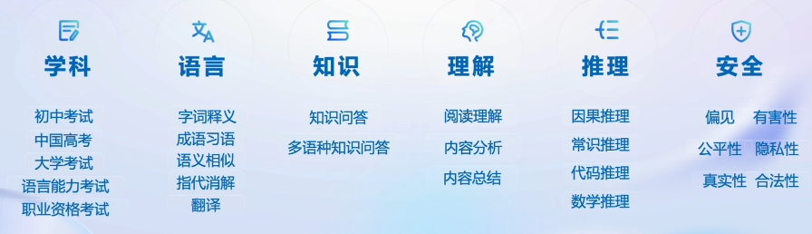
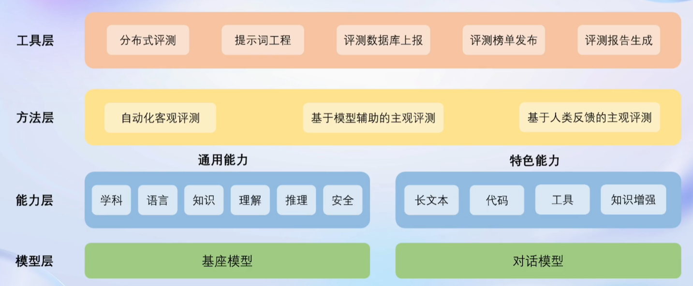
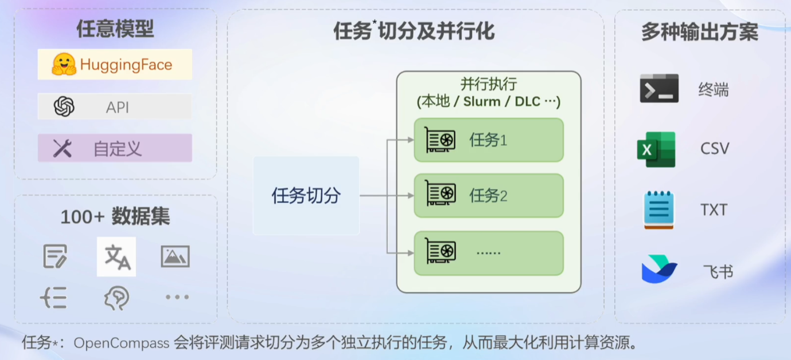

# 第六节课笔记

:::info
Title: OpenCompass 大模型评测解读及实战指南

Link: [https://www.bilibili.com/video/BV1Gg4y1U7uc/?vd_source=5f3fde3ed54e5f3c92b4fc94386b106a](https://www.bilibili.com/video/BV1Gg4y1U7uc/?vd_source=5f3fde3ed54e5f3c92b4fc94386b106a)

Docs: [https://github.com/InternLM/tutorial/blob/main/opencompass/opencompass_tutorial.md](https://github.com/InternLM/tutorial/blob/main/opencompass/opencompass_tutorial.md)
:::

## 动机

- 了解模型特色
- 监控模型性能及辅助优化
- 减少社会风险
- 找出最适合应用的场景

## 评测维度

- 基座模型（要加上 instruction）
- 对话模型（直接对话）

### 客观评测

- 问答题
- 多选题
- 判断题
- 分类题
- ...

### 主观评测

- 人类评价（打分）
- 模型评价（GPT）

## 测评能力

## 架构

流水线可分为：

## 总结

OpenCompass 目前已经是公认比较常用的测评平台，不仅支持纯文本，还支持多模态模型测评。包含许多实用工具，以便更好地测评大模型的能力。