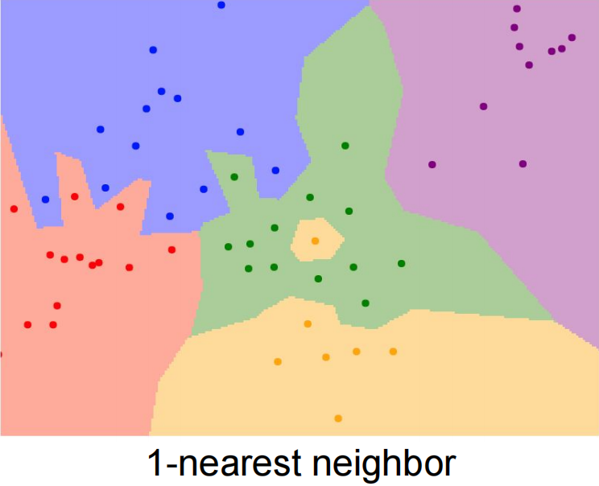
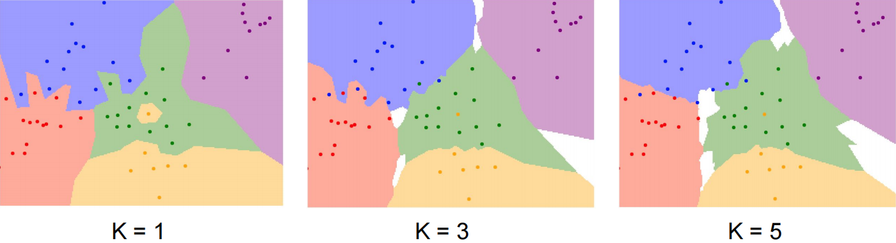
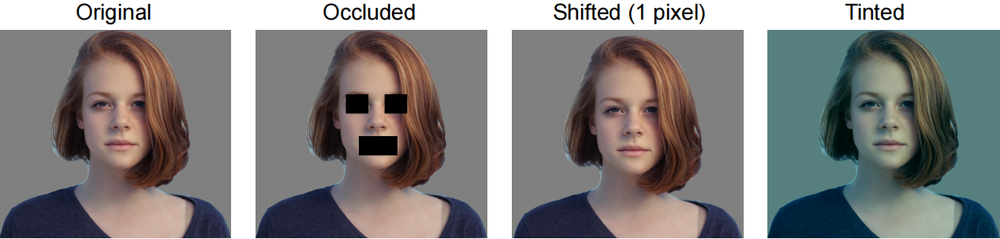
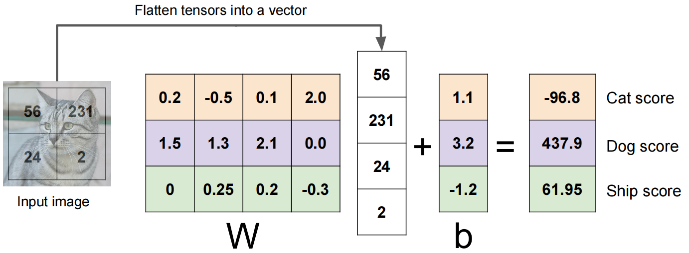
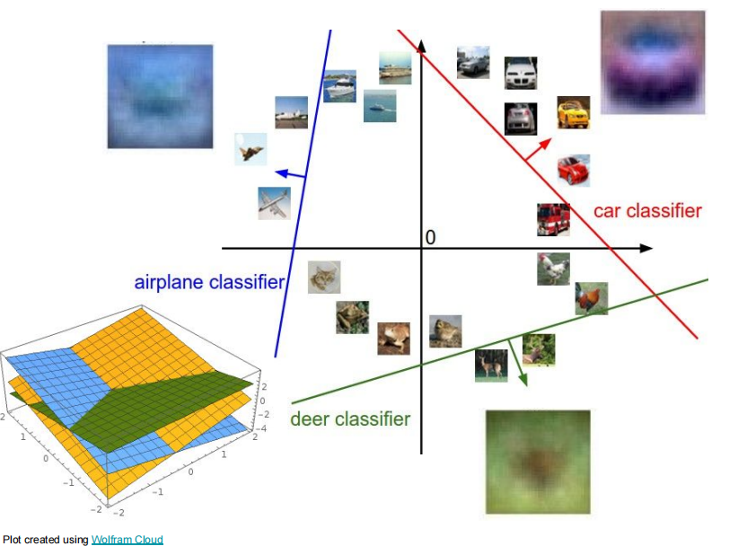

# KNN与线性分类器

## Background

随着对于图像的研究，我们可以知道图象其实就是很多个数字组合到一起之后形成的矩阵。对于不同的物体，其表达都不相同。那么就很需要一个分类器，能够对这些图片进行区分。所以就提出了以下两种用于分类的数学模型。

计算机视觉的任务之一就是要从一堆数据当中识别出对应的类别，就像我们人类能够识别不同的物体，所以图像识别任务本质上就是图像分类问题。

但是，要想识别图像并不像识别一串数字那么简单。一串数字我们可以通过传统的算法来自动求解，得到想要的结果，可以通过编写一个程序的执行顺序来逻辑识别。但是图像不同，图像是一大堆宏观看起来毫无规律的数字，传统算法无法处理这些数据，发掘不了其内在特征。**所以图像识别任务都是基于数据驱动的方法，通过收集数据，训练分类器，预测新的图片。**

学习图像的分布规律，提取出图像当中的特征，最终实现识别。

## KNN

KNN（第 k 最近邻算法），通过衡量两张图片的距离来比较图片的相似程度，根据距离最近的对图像数据进行分类。最常用的一般是 $L_1, L_2$ 距离。

$L_1$ 距离：
$$
L_1=\sum_p|I^p_1-I^p_2|
$$
 $L_2$ 距离：
$$
L_2=\sqrt{\sum_p(I_1^p-I_2^p)^2}
$$
:::tip

一般 $L_2$ 距离比较普适，$L_1$ 距离一般用于具有一定语义的数据。

:::

两张图片的距离越接近，说明越相似。使用 $L_2$ 距离更加接近平滑的边界。点击[此链接](http://vision.stanford.edu/teaching/cs231n-demos/knn/)可进入 knn 可视化展示。

当 $k=1$ 时，表示最近邻算法，表示数据集合中，待预测 $x_i$ 的数据与类别 $c_i$ 的数据距离最近，则 $x_i$ 属于 $c_i$ 这个类别。

当 $k \ge 2$ 时，表示数据集合中，待预测数据 $x_i$ 与类别为 $c_i$ 的大于等于两个数据最近，则 $x_i$ 属于 $c_i$ 这个类别。

:::info 在上面这个例子中，为什么要引入多个点的距离来判断是否属于同一类别呢？

因为从客观规律上来看，与类型相同的数据在一起说明有较大的概率这个数据也是这个类别。

:::

KNN 有两个[超参数](./00.名词解释#超参数)，$k$ 和 使用哪种距离指标（$L_1, L_2$）。

算法缺陷：

- 对于图像而言，不同图像质量各不相同，仅从距离这一角度来描述图像不够全面，过于宽泛，不能很好的区分各个类别。对于下面的图像使用距离就无法进行判断。

- 时间复杂度过高，对于三维数据，需要使用 $O(n^3)$ 的复杂度来计算，维度数越高复杂度越大。

## 数据集训练

有了数据 + 算法，我们就可以开始训练分类器的模型。对于每一次训练，**数据集的划分是至关重要的**，数据集划分的好坏决定了模型的好坏。

:::caution 为什么要划分训练集、验证集、测试集？

如果举例子来理解，最直观的是高考的例子，训练集就是我们平时学习训练的习题，通过练习来学会求解解题。验证集就是我们平时的模拟考试、期末考试等。测试集就是最终的高考试题。

那么平时做题训练的时候，有可能有的同学会死记硬背，就只记住这道题怎么写，下次换一下就不会了（过拟合）。有的同学是真的学会了做题，然后能应对考试中的题（拟合）。

从高考的角度而言，我们肯定是不希望出现只会死记硬背的同学，加入验证集就能够知道哪些同学是死记硬背的，然后反映出当前这次训练中到底也没有过拟合。如果出现了这样的情况我们能够及时知道并进行调整。但是平时测试终究还是测试，不是真正的高考。所以通过真正的高考能够真实反映模型的效果。

总结一下，划分这三个集合就是为了防止出现过拟合的现象，更好地反映训练过程中是否出现过拟合等情况，确保模型的泛化能力。测试集是我们人类都不能知道的，因为人这个因素会干扰模型的训练，当你觉得精度还可以提升时，往往继续训练就变成了过拟合。

:::

数据集划分一般可以分为几种模式（这里针对分布在同一个数据集）：

- 纯训练集（$100\%$ 训练集）

  缺陷：只能完美地拟合训练集，无法检测出训练的效果。

- 训练集 + 测试集（$X\%$ 的训练集，$(1-X)\%$ 的测试集）

  缺陷：只知道训练的效果，无法清楚对于新数据是否有效。

- 训练集 + 验证集 + 测试集

  目前比较常用的方法。

- 训练集 + K 折交叉验证集 + 测试集

  目前比较常用的方法。（数据量较小的情况下可用）

## 线性分类器

为了解决上述 KNN 描述问题，所以提出了一种基于参数的方法，通过线性函数来进行分类。因为线性函数能够很好地划分出类别，具有明显的特征性质。通过调节权重使得线性函数能够拟合某一个分布，使得这个线性函数能够划分出不同类别的数据。

线性分类器本质上就是**线性函数**，对于高维数据就是**线性方程组**。
$$
Y=f(X,W)=WX+b
$$
以 Cifar10 数据集举例（10类别），对于一个 $32\times32\times3$ 的数据，一般先对其进行向量化，转化成 $3072\times1$ 的向量，作为自变量 $X_{3072\times1}$，表示整个图像上所有的像素，对于所有的像素需要有一个权重，所以构造一个$10\times3072$ 的权重矩阵$W_{10\times3072}$，加上 $10\times1$ 的 bias $b_{10\times1}$。最后计算为：
$$
Y_{10\times1} = W_{10\times3072}X_{3072\times1} + b_{10\times1}
$$
上述式子的含义为：$WX$ 表示对于图像上每一个像素点都有一个权重，并且对于每一个类别都有一个权重。偏执 $b$ 表示对于每一个类别的都有一个偏执 bias，最后得到的向量 $Y$ 表示输入的 $X$ 对于每一个类别的分数，分数最高的就说明属于该类别。公式表示为：

假设上述表述用变量代替：
$$
X=[x_1,x_2,\dots,x_{3072}]^T \\
b=[b_1,b_2,\dots,b_{10}]^T \\
W=\begin{bmatrix}
w_{1\ 1} & w_{1\ 2}& \dots& w_{1\ 3072} \\
w_{2\ 1}& w_{1\ 2}& \dots& w_{2\ 3072} \\
\vdots &  &\dots&\vdots \\
w_{10\ 1} & w_{10\ 2} & \dots & w_{10\ 3072}
\end{bmatrix}
$$
线性方程组表示为：
$$
\begin{cases}
	y_1=w_{1\ 1}x_1+w_{1\ 2}x_2+\dots+w_{1\ 3072}x_{3072} \\
	y_2=w_{2\ 1}x_1+w_{2\ 2}x_2+\dots+w_{2\ 3072}x_{3072} \\
	 \hspace{4cm} \vdots \\
	y_{10}=w_{10\ 1}x_1+w_{10\ 2}x_2+\dots+w_{10\ 3072}x_{3072} \\
\end{cases}
$$
$y_i$ 表示类别 $i$ 的分数。

下面以一个仅包含 4 个像素的图片举例：

实际上，上述流程中，对于每一个类别都构建了一个线性分类器，一个线性分类器就对应一个高维向量的线性函数，对于不同类别就有不同的线性分类器。线性函数在 2d 上就表示一条直线，在 3d 上表示一个平面，超过 3d 上就表示为超平面。

线性分类器的缺陷：

- 无法解决异或性质的问题，因为异或本身就是一个非线性的问题，无法用线性描述。异或的特点：相同为 0，不同为 1。
- 对于圆形分布数据无法用线性划分。
- 三种数据模式无法划分。

对于以上问题，其实本质上就是非线性问题无法用线性函数来分类，所以在之后的章节中会讲到如何使用非线性函数解决分类问题。

最近邻算法，衡量两个图像的距离，L1距离（曼哈顿距离）有语义可用

因为一个最近邻边界不够平滑，所以可以增加附近k个点的投票，跟类型相同的一起大概率这个人也是这个类型的。距离的衡量还有L2，比较普适，更加平滑。关注算法直觉。

调参

knn在图像上应用的问题

线性分类器其实就是一个直线（2d）、平面（3d）