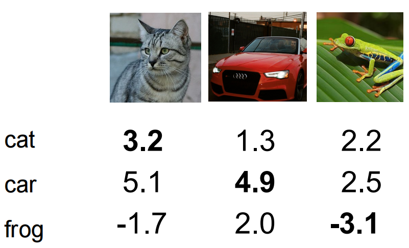

# 损失函数和梯度下降

经过[上一讲](./02.knn与线性分类器.md#线性分类器)，我们拥有线性分类器的模型之后，需要使用这个模型，而使用这个模型最关键的就是损失函数和梯度下降。因为线性分类器中有一个权重参数，需要求得这个权重参数后才可以进行分类，而且要求得一个分类准确度最高的一个权重。那么求解这个参数，在计算机里面就是通过迭代的方式，

## 损失函数

:::info

损失函数一般仅关注相对的大小，值本身没有什么含义。

:::

损失函数的目的是为了衡量**预测值和真实值**之间的差距的函数，一般衡量的是他们之间的距离，有多种衡量方式。

### 传统方式

我们可以通过使用随机数初始化一个权重矩阵，然后不断迭代，每次记录下识别准确率最高的一个权重矩阵，对此迭代后记录最大值，但这种方式非常低效且很难找到最符合数据样本的权重，所以一般不会使用这方式，所以就提出了使用损失函数和梯度下降的方法。

```python
def traditional_method():
    maxp = 0
    while True:
        W = randmatrix() # 0 to 1
        y = WX + b
        maxp = max(y, maxp)
    return maxp
    
```

### 先进版

根据损失函数的结果更新对应的的权重，而不是随机的方式来搜索和查找识别最准确的权重。

### Hinge Loss

以 Hinge Loss 为例子看到如何使用损失函数衡量当前分类器的好坏。假定 $x_i$ 是图像，$y_i$ 是标签，是个整数。损失函数可以用以下公式表示：
$$
L=\frac{1}{N}\sum_iL_i(f(x_i;W),y_i)
$$
 **Hinge Loss (Multiclass SVM Loss):**
$$
L_i=\sum_{j\not= y_i}\begin{cases}
0 & \text{if} s_{y_i}\ge s_j + 1 \\
s_j - s_{y_i} + 1 & \text{otherwise}
\end{cases}=\sum_{j\not=y_i}\max(0, s_j-s_{y_i}+1)
$$
其中 $s=f(x_i;W)$ 表示不同类别的分数向量。假设有如下分数：



假设现在要计算猫的loss，所以就拿其他类别的分数减去猫的分数再求和得到损失值：
$$
L_{cat}=\max(0,5.1-3.2+1) + \max(0, -1.7-3.2 +1)=\\
\max(0, 2.9) + \max(0, -3.9) = 2.9 + 0 = 2.9
$$
相似的，我们就可以得到其他类别的损失值，求其平均数就可以得到对应整个数据集上的损失值。


$$
L=\frac{1}{N}\sum_{i=1}^N L_i\\
=(2.9+0+12.9)/3\\
= 5.27
$$
:::info 几个问题

1. 当汽车的分数增加或减少1的时候，loss 会有什么变化？

   答：loss 不会发生变化，因为即使汽车的预测分数变化了 1 计算的结果也还是 0. 公式中的 1 其实一个**安全冗余度**，也就是说 **loss 只会惩罚和类别分数相近的预测**。

2. loss 的最小值和最大值是多少？

   答：最小值就是 0，最大值理论上是正无穷。

3. 刚刚开始训练的时候权重 $W$, 这时 loss 是多少呢？

   答：约等于分类错误的类别

4. 现在的损失函数是把错误的类比进行计算，如果把正确的类别也考虑进来呢？

   答：对于正确的预测 $s=0$ 那么损失会多加一个 1。所有图片的预测 loss 都加了一个 1，所以对于 loss 不会产生什么影响。

5. 如果用求平均去代替求和会怎么样？

   答：使用平均代替求和其实并不会发生太大的变化，因为只是在整个损失上乘了一个常数，损失函数的值只是相对大小，不会产生影响。

6. 如果我们对 Hinge Loss 进行平方呢？

   不会产生多大变化，只是变化的程度更大。

7. 当 $L=0$ 时，权重 $W$ 是唯一的吗？

   并不是唯一的，因为 $2W$ 仍然是他的解。

:::

简单代码实现：

```python
def L_vectorized(x, y, W):
    scores = W.dot(x)
    margins = np.maximum(0, scores - scores[y] + 1)
    margins[y] = 0
    loss_i = np.sum(margins)
    return loss_i
```

直接对权重进行数乘并不会改变权重本身的意义，也就是不会影响到最后识别的结果。用越简单的权重越好，减少计算量。根据奥卡姆剃刀原理，如无必要勿增实体，其实也就是越简单越好。所以提出了正则化的概念。减少模型的过拟合，防止死记硬背，让模型更加简单。

### 正则化方法

L1，L2

L2正则化相当于是雨露均沾，将权重正则化。相当于加入一个惩罚项，将学习到的高次系数进行惩罚，相当于还是要让模型越简单越好。

$L'(W)=L(W)+\lambda R(W)$


dropout bn层都是正则化的方法。

:::caution

作用：让权重和模型更加简单，减少过拟合，提高模型的泛化能力。其实本质上就是把权重摊开，不出现一个值特别大，另一个值特别小的情况。

:::

### Softmax和交叉熵损失

把分数变成概率，变成正且归一化到0到1区间，大小关系不发生变化。

极大似然：使得所有图片都被正确分类这一事件发生的联合概率。使得某个事件发生概率最大。其实就是使得似然函数最大。

指数函数可以把负数规范到整数并且保留单调性和变化程度。归一化可以把数据变换到0到1之间。

对数似然损失函数（交叉熵）
$$
L_i=-\log_2(0.13)
$$
因为已经归一化到0到1了，所以给对数取负，则保证x在0到1之间都是整数。带入到对应这个函数图像（$y=-\log_2(x)$），可以发现，当概率越大的时候，这个值越小。也就是说，当损失最小的时候，x越接近1，说明这个类别分类越准确。因为在这里x表示这个数据的类别的概率。求对数是为了把积变和（因为$-\log_2(x)$这个函函数没有改变原本概率变化的规律，所以可以用在这里），因为有负号所有最大似然求最大相当于求这个函数的最小。可以总结为：
$$
prop = \frac{e^sk}{\sum_je^sj} \\
L_i=-log_2(\frac{e^sk}{\sum_je^sj} \\
$$
softmax 可以把分数区分开，在比较数比较小的情况下看不出来的差距，经过一系列计算之后可以变得能够拉开距离。

## 梯度下降

使用导数（即变化量）调整自变量前进的方向，迭代寻找最值。

优化算法的核心目的就是让loss最小化，你可以吧loss比较一个崎岖不平的山坡，我们的最终目的就是到达山底（loss最小的位置）。为了实现这个目标所采用的理论基础就是**求导**。

梯度下降的过程可以用如下代码表示：

```python
while True:
    weights_grad  evaluate_gradient(loss_fun,data,weights)
    weights += - step_size * weights_grad 
```

不是梯度本身下降，而是指损失函数下降（求损失函数对每个权重的梯度，对损失函数求导，权重为自变量）

凸函数——只有一个全局最优解，函数图像是向下凸的函数。神经网络并不是一个凸函数，所以很容易陷入到局部最优解。

note:优化器原理

### Mini-Batch

一次只用一小批数据的损失函数值和梯度，相当于把一整个数据分批处理，一次性喂所有数据计算太慢，而梯度更新也慢，不利于梯度更新。每一次一批，虽然可能会有噪声或者波动，但是整体的趋势还是往下运行的。

学习率过小，下降的速度太慢，学习率过大，下降得幅度太大，难以到达最小值的点，开始左右横跳。

正则项能够影响损失函数的收敛，正则项太大导致权重惩罚过渡，正则项太小可能导致过拟合问题。


特征工程：人为的根据数据的特点发现相应的特征设计相关的计算方法。特征可以各种各样方法代替原来的图片，其实就是因为图像的编码不规律，无法通过传统的算法来识别图片，所以通过寻找他们的特征，用这些特征代替原来的图片，让图像能够使用算法来识别分类。根据问题打开脑洞分析所应该有的特征，自行设计。

词袋模型：将图片划分成一个又一个小块，得到一个语料库，下次再进来一张图片的时候也划分多个小块，然后看语料库中小块数量跟哪个类别的匹配。
