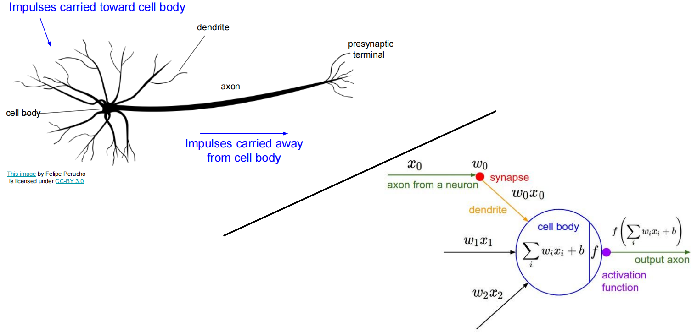
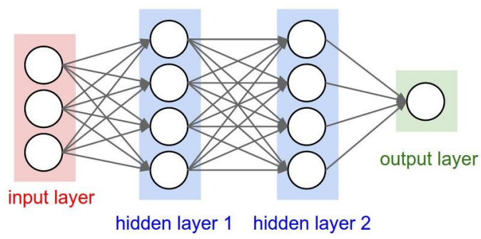
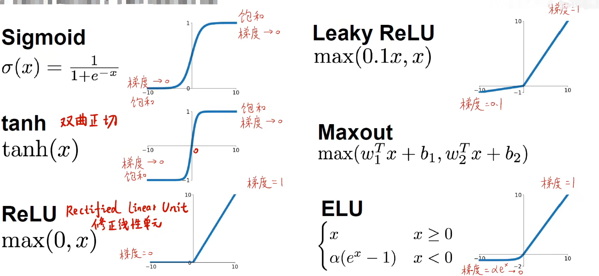
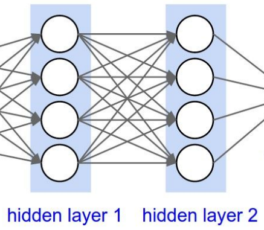
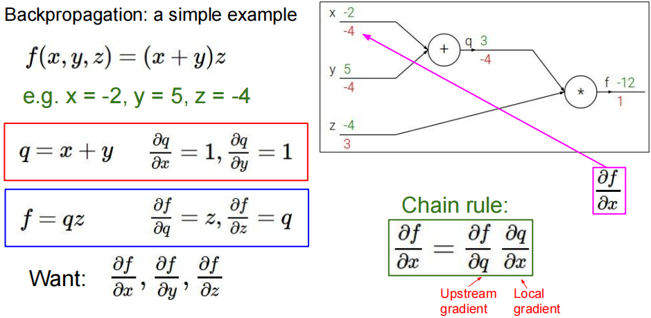

# 神经网络

因为**异或、圆形分布的数据无法用线性分类器**解决，常规的解决方案有：第一种解决方案是将非线性的数据线性化，提取更高级的特征，第二种办法就是引入非线性的因素。人们想到在线性分类器上加入非线性的因素，使其能够对非线性的数据进行学习，变成非线性的模型，所以提出了神经网络的方法。

神经网络模型模拟的是动物和人的大脑的工作，对这个过程进行建模，得到在数学上的表达可以等价为:



多个神经元堆叠：




## 感知机（Perceptrons / Fully-Connected Networks）

### 激活函数

因为有非线性激活函数的存在，导致分类器的输出变成一个非线性的输出。给神经网络带来了模型上的非线性。常见的激活函数有：



在这里不要简单看成普通的函数，因为在传播过程中，$x$ 轴代表了每次该层或者前面几层的线性计算结果（指代入线性函数公式），而且在更新权重的过程中需要对损失函数进行求导，而根据链式法则，要求损失函数的导数，需要对 $W$ 进行求导，而一般 $W$ 是被套在损失函数里面的，所以也需要对激活函数进行求导。对激活函数进行求导就能得到他的变化率，也就是梯度。

### 神经网络

一层里面每一个神经元都与前一层的所有神经元进行连接。



通过多次非线性的激活使得线性函数能够拟合非线性的数据。**本质上还是以线性函数为基础传递和学习权重**。通常的传播通过多次迭代线性函数，每一次迭代经过一个激活函数**使其变得非线性**，实现数据的前向传播。
$$
f = W_1x+b \\
f = W_2\max(0, W_1x+b) \\
f = W_3\max(0, W_2\max(0, W_1x+b)) \\
\vdots
$$
使用图示可以这么表示：


示例代码：

```python
import numpy as np
from numpy .random import randn

N, D_in, H, D_out = 64，1000，100，10
x, y = randn(N, D_in),randn(N，D_out)
w1, w2 = randn(D_in, H), randn(H, D_out)

for t in range( 2000) :
    h = 1 / (1 + np.exp(-x.dot(w1)))
    y_pred = h.dot(w2)
    loss = np.square(y_pred - y).sum()
    print(t, loss)
    
    grad_y_pred = 2.0* (y_pred - y)
    grad_w2 = h.T.dot(grad_y_pred)
    grad_h = grad_y_pred.dot(w2.T)
    grad_w1 = x.T.dot(grad_h * h * (1 - h))
    
    w1 -= 1e-4 * grad_w1
    w2-= 1e-4 * grad_w2

```

神经网络的隐含层越多，神经元越多，说明可以提取到的特征就越抽象，越底层，更能找到其本质的特征。同时也能够导致过拟合。所以，**神经网络不是越深越好，也不是越浅越好**，要根据实际的数据来决定神经网络的层数，同时为了应对神经网络过拟合的问题，又提出了很多有关防止过拟合的方法。

## 反向传播

反向传播是神经网络训练的方法，根据前向传播的结果，使用链式法则反向求解各个计算节点的梯度，用梯度来更新所输入的权重。因为神经网络形式不固定，而且维度层数很高，数据维度高等因素，导致无法通过直接迭代等方式更新，所以就引入**计算图和链式法则**。



可以看到，对应各个变量的梯度计算如下：

- 对 x 的梯度：$\frac{\partial}{}$

深度越深，特征能力表示越强，但是也越容易过拟合。

深度和宽度的选择原则，只有一个隐含层，只要神经元个数足够多，能够解决任何问题。


