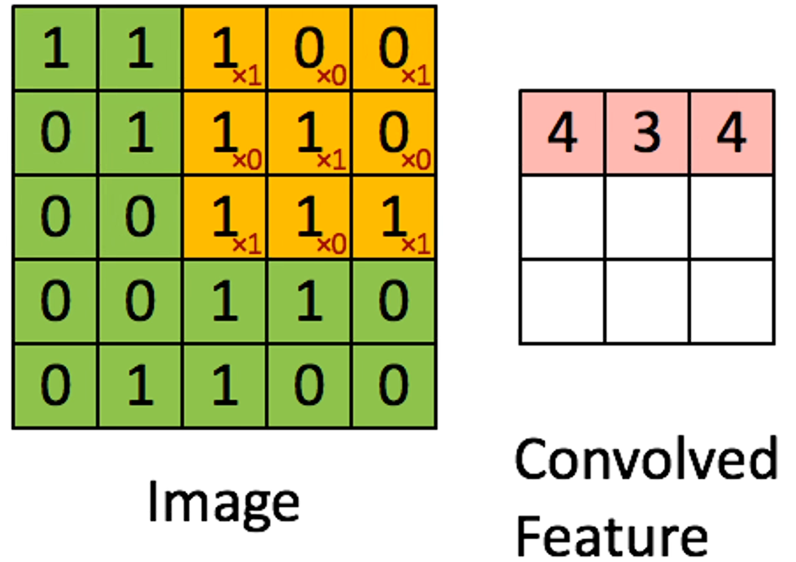

# 卷积神经网络

每个神经元只会关注图像上一小部分区域，也就是感受野。视觉是分层的。

## 抛出问题

因为使用全连接网络来对图像进行识别，全连接网络的输入是一个长向量，所以要将全连接网络应用在图像领域上需要将二维矩阵的图像变成一个长向量才可以进行处理，但这样会导致**丢失了图像的空间特征信息**，导致识别图像的效果下降。

例如，如果一个物体正好分布在图像的左上角和右上角，但是因为 “打平” 之后使得空间特征消失了，所以可能导致无法识别出来。使用全连接网络对于每一个像素都有对应的权重，根据每个像素的权重对图像进行识别和分类。所以提出了卷积神经网络解决这个问题。

卷积神经网络的特点：

- 权重共享：每次滑动卷积核当中的权重不变。
- 局部连接：每次只扫描图像的一小部分。

## CNN 组成

### 基本结构

卷积神经网络（以下简称 CNN）主要包括三个部分，**卷积层、池化层、全连接层**。

- 卷积层：提取图像上的特征。
- 池化层：对特征进行后处理，大而化之
- 全连接层：把不同的特征进行处理、汇总得到最终的结果。

以下为手写识别数字的示意图：

卷积神经网络可以把每个像素理解为一个节点，在感知机当中，一个节点就对应有他的权重。所以在卷积神经网络当中，对于图像像的每一个像素都是一个节点，对应一个节点都有对应的权重，它的卷积核就是对应的权重。

### 卷积

卷积可以看作是用一个滑动窗口在图像上进行滑动，把对应位置的元素相乘，也就是图像的像素乘以对应位置卷积核上的权重，最后将每一次卷积的结果放到一个新的矩阵上，这个新的矩阵就叫特征图。示意图如下：

在卷积的过程中，卷积核的数值是不变的，所以这就是 CNN 具有**权重共享**特点。

每一次卷积操作都可以看作一个神经元。如果有多个通道那么卷积核也有多个通道，对于每一个通道都有一个卷积核，求解完卷积操作之后，对每个通道卷积之后的结果进行相加。

对于上图而言，对每一个通道都有一个卷积核，对于每一个卷积核在原图上的一次卷积会得到三个数，三个数累加之后就得到对应的数据结果。

因为直接在图像上进行卷积会导致丢失掉图像四周的边缘信息，通常来说会使用 padding 操作来对图像的边缘填 0，保留四周图像边缘的同时避免因为卷积导致图像大小缩小太多。

而且添加 padding 能够使得边缘周围能进行相同次的运算，因为中间的元素当步长为 1 的时候都会被计算很多次，所以通过 padding 能够使得周围像素计算的次数一致。

### 池化

## CNN 反向传播

## Real-time Demo
