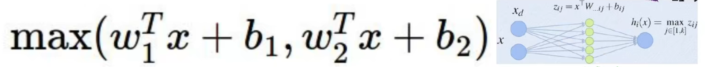
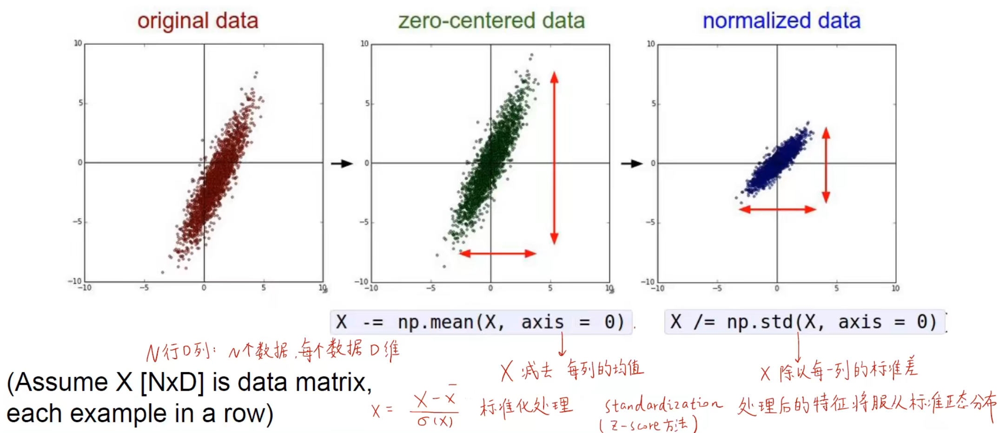
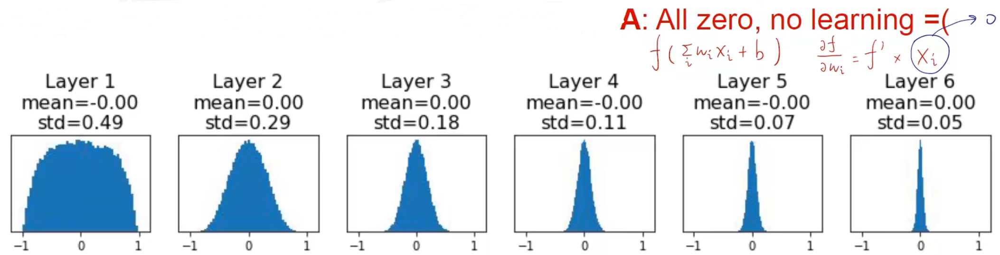
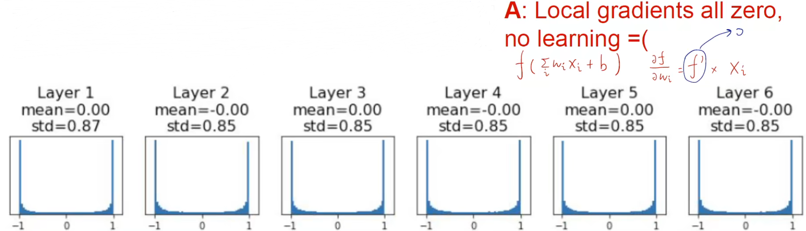
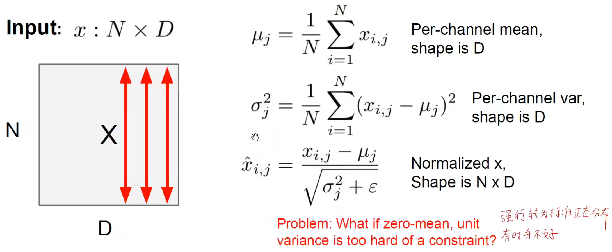

# 训练神经网络


## 激活函数的选择

### Sigmoid

产生的问题

1. 饱和导致梯度消失

2. 输出都为正

   偏导数同号，所有梯度变化的方向相同

3. 使用 exp()，计算量较大。

### Tanh

特点：

1. 饱和导致梯度消失
2. 输出有正有负，关于 0 对称，避免了梯度变化方向相同的问题。

### ReLU (Rectified Linear Unit)

1. 不会饱和

2. 计算量很小

3. 收敛速度比 Sigmoid/tanh 要快 6 倍

4. 不是关于 0 对称的，且小于 0 的时候梯度为 0.

   因为小于 0 的情况下对应的神经元直接不激活，导致永远都不会更新，但我们还是希望一开始至少会能更新，使得一开始能偶输出一个梯度，所有的梯度都能进行更新，所以会给 ReLU 添加一个偏执项。

### Leaky ReLU

1. 不会饱和
2. 计算量小
3. 收敛速度快
4. 解决了 ReLU 小于 0 的时候梯度为 0 的问题，泄露出去一点梯度，不会出现 “死亡” 的神经元。

### ELU

1. 相比于 LReLU 更具有鲁棒性，改善了 ReLU 没有关于 0 对称的问题。
2. 但是指数运算带来更大的计算量

### Maxout

使用另一个神经网络对两个神经元的输出做处理。但是缺点是参数的个数成倍增加。



### 使用原则

TLDR: Too long didn’t read，废话少说

1. 设计神经网络的时候尽量在网络中间使用 ReLU 激活函数，并且注意学习率的调整，太大可能会梯度消失。

   因为如果在中间使用 sigmoid 可能就会导致梯度饱和导致梯度消失的问题，并且 sigmoid 计算量较大。

2. 可以尝试使用 LReLU / Maxout / ELU 等激活函数

3. 对 tanh 激活函数不要抱太大希望

4. 在中间层不要轻易使用 sigmoid，simoid 一般在网络的末尾使用，特定情况可以用

## 数据预处理

解决一个问题时候最关键的是从数据入手，对数据进行**特征工程**和分析，最后得出一个数据处理的方案，再使用神经网络拟合对应的数据才能达到更好的效果。

:::danger

大部分时间主要花在对于数据的预处理。

:::

### 标准化

标准化一般是指将数据规范到某一个数据分布的原点，如下图所示，原始数据是分布在某一个数据空间，通过标准化把数据规范到一个数据空间的中心，即原点。可以理解为将任意一个分布变成正态分布。



一般我们可以通过 PCA 主成分分析和白化对数据进行处理。


通过找到两个主成分对数据进行线性降维投影，最后对每个数据除以对应的标准差就是对数据的白化，转换为标准的正态分布。

- 对数据进行降维并方差为 1 的分布（PCA 白化）
- 对数据还原到原始的坐标系上（ZCA 白化）

### 标准化的作用

一般来说，在标准化之前的数据会对于微小的权重变化比较敏感，导致每次学习都需要用非常小的学习率去学习，也很难去优化。

而在标准化之后，损失函数对于权重微小变化不那么敏感，使得权重更容易优化，不会出现大幅度的震荡，使得能够更快的收敛。


## 权重初始化

:::tip

设想一个问题：如果权重当中所有的数都相同会发生什么？

答：同一层当中所有的神经元的前向传播和反向传播完全相同，也就是说**中间所有的神经元都是等价**的。

:::

为了使得每一个神经元的权重互不相同，打破 “对称性”，使用不同的初始化方法变得尤为重要。

### 问题分析 

首先我们可以想到使用正态分布来初始化。

但是当初始化的幅值比较小的时候，收敛过程中会导致数据逐渐往 0 收敛。通过直方图可以看出，当求本层的梯度的时候，因为上一层是接近于 0 的，对于损失函数求导之后就会导致本层也接近于 0，因为上游梯度接近于 0。

```python
# 权重初始化 幅值=0.01
W = np.random.randn(Din, Dout) * 0.01
```




权重幅值较大的时候，局部梯度接近于 0，又导致了梯度消失。

```python
# 权重初始化 幅值=0.05
W = np.random.randn(Din, Dout) * 0.05
```




为了解决这个问题提出了新的权重初始化方法。

### Xavier 初始化

```python
# 权重初始化 幅值=1/din
W = np.random.randn(Din, Dout) * (1 / np.sqrt(Din))
```

 相当体育就是输入的大小越大，权重初始化时幅值就越小。对于其证明可以有如下推导：

**假设 $x, w$ 均值为 0 且独立同分布，**且目前没有考虑激活函数。
$$
y =Wx, h=f(y)
$$

$$
\text{Var}(y_i)=D_{in}\text{var}(x_iW_i) \\
=D_{in}(E[x_i^2]E[W_i^2]-E[x_i]^2E[W_i]^2) \\
=D_{in}\text{Var}(x_i)\text{Var}(W_i)
$$

如果 $Var(W_i)=\frac{1}{D_{in}}$，那么输入和输出的方差相等，使得输入和输出的变化幅度相同。

但是如果使用 ReLU 则会导致在 0 处接近于 0.

### Kaiming 初始化

为了解决考虑激活函数的问题，所以有 Kaiming 初始化。

他总结出：

若要让 $\text{Var}(y_i)=\text{Var}(x_j)$ 成立，则

若 $w_{ij}$ 服从正态分布，则 $w_{ij}\sim \text{Normal}(0, \frac{2}{d})$

若 $w_{ij}$ 服从均匀分布，则 $w_{ij}\sim \text{Uniform}(-\sqrt{\frac{6}{d}}, \sqrt{\frac{6}{d}})$

则初始化为：

```python
# 权重初始化 幅值=2/din
W = np.random.randn(Din, Dout) * (1 / np.sqrt(2 / Din))
```

## 批归一化（BN）

为了避免数据集中分布在某一个区间，我们在训练过程中对权重做多次的归一化，强制将**数据归一化到标准正态分布**，使得数据的分布更加均匀。因为我们传入的数据是一批一批的，所以我们使用批归一化的方式。



BN 一般放在非线性层之前。

### BN 层的作用

1. 能够让网络在训练的时候更快地收敛。
2. 改善梯度，减缓梯度消失。
3. 能够使得网络使用大学习率进行训练，因为数据对于权重的微小变化不敏感。
4. 使得网络对于权重初始化的依赖性没那么大。
5. 训练的时候起正则化的作用，对权重添加惩罚项。
6. 训练和测试的时候 BN 层不一样，训练的时候用一批里面的均值和方差，在测试的时候使用全局的均值和方差。

### 其他 BN


- BN：在 batch 层面上进行归一化，将一个 batch 里的某个 feature map 进行归一化。
- LN：在 layer 层面上进行归一化，将所有 channel 的 feature map 进行归一化。
- IN：在实例层面上进行归一化，将一个 batch 中的一张图片的第 c 个 feature map 进行归一化。
- GN：堆叠多个实例上进行归一化，将一个batch 中的一张图片的多个 feature map 进行归一化。

## 密切关注训练过程

### 优化器

优化器主要解决的问题是加快梯度下降的速度，也就是找到**最优解的速度并且不被局限在局部最优解**。如果只是单一调整学习率可能需要经过多次梯度下降之后才能找到最优解，但是并不是所有情况都可以适用学习率的调整，而且对于学习率的大小也会影响其梯度下降的速度，所以**需要有一种 “聪明” 的下降方式，也就是算法**，来提高训练的效率和模型的性能，使其能够找到**全局最优解**。从传统随机梯度下降的缺点主要有：

1. 梯度较大的方向上容易发生震荡，且不能单纯通过调整学习率解决。

2. 容易陷入局部最优点、鞍点，在高维空间中更普遍出现这个问题。

   高维空间中可能会出现多个可能是最优解的点，也就是局部最优解。

   

#### SGD + Momentum


### 学习率调整策略


### 模型集成（Model Ensembles）


### 正则化


### 超参数搜索


