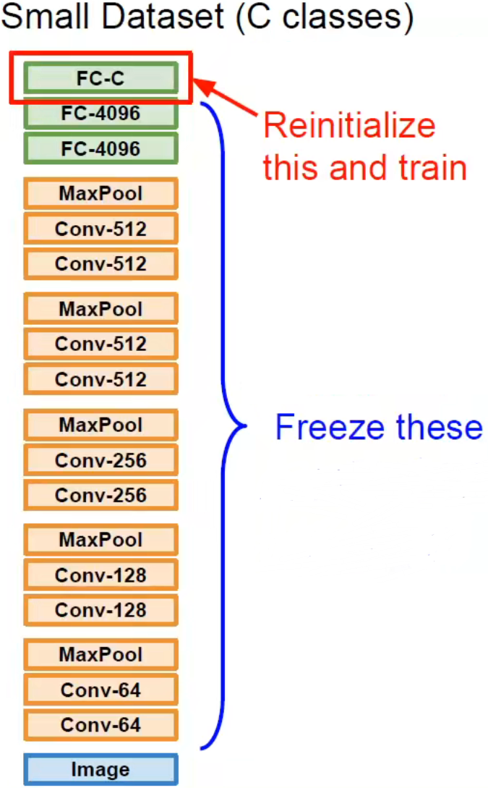
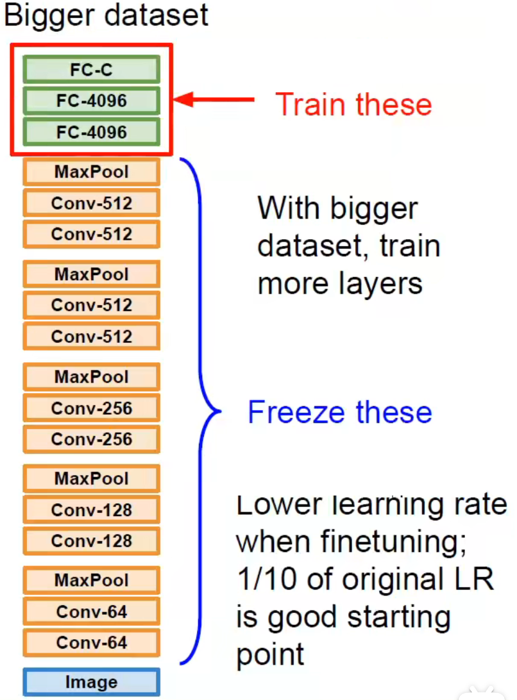
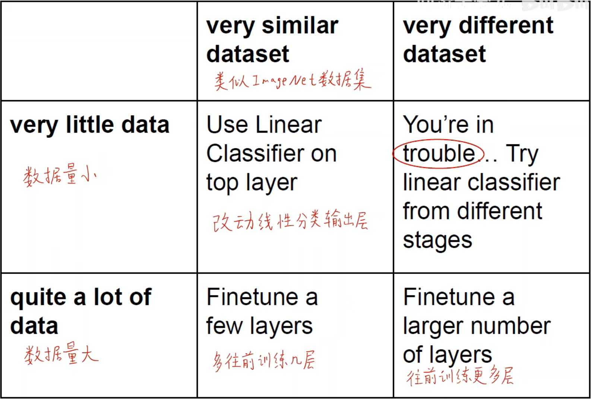
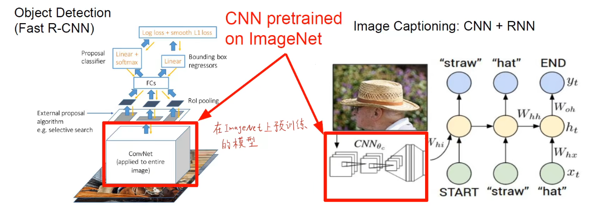
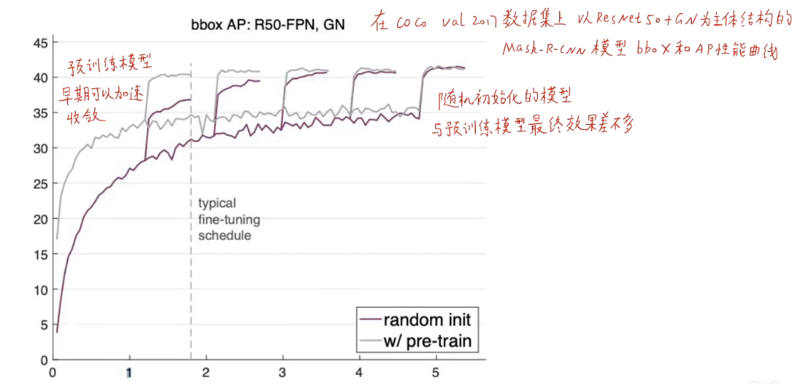

# 迁移学习和 fine tuning

## 迁移学习

深度学习需要大量的数据进行训练，而且每次都需要重新进行训练，那么人们就想到有没有一种方法能够站在巨人的肩膀上训练模型，所以人们就想到预训练模型。提前先训练好一个参数比较好的模型，然后基于这个模型再训练自己的数据。正因为迁移学习的出现，所以不需要大量的数据集也能使得模型泛化到比较好的效果。

:::info

迁移学习：借助与训练模型，泛化到我们到我们自己的数据集上 —— 站在巨人的肩膀上

:::

### Usage

具体食用方式：

1. 拿到对应的预训练模型
2. 在我们自己比较小的数据集上进行训练，重新初始化分类的输出层，比如：我们的数据集有 $c$ 类，那么就初始化 $c$ 个神经元，在我们的数据上训练输出层（训练输出层的时候冻结模型前面的结构和权重）
3. 得到输出结果

在小数据集上：

在大数据集上：

 

我们可以多向前训练几层保证输出层也足够的处理能力，因为数据量大说明特征信息也会变多，单层输出层特征表示能力有限。（同样需要冻结前面的结构和权重）

### 原理

用原来别人提供的预训练模型进行特征抽取等工作，将图片压缩成对应大小的向量，最后只需要在输出层进行 one-hot 编码以及调整输出类别的数量。基于前面所说到的，如何确定输出层的结果成为使用迁移学习最重要的问题之一。一般来说主要根据要训练自己的数据集来确定，一共分为如下几种情况：

其实就是我们不用从头开始进行训练，只需要用别人目前训练得比较优秀的模型进行改进和训练即可。

## 缺陷

但是预训练模型不一定是完全有效的，从 2017 年何恺明研究论文《Rethinking ImageNet Pre0-training》当中通过实验证明使用预训练模型不一定会让效果变好，只能说能够加快前期收敛的速度，最终模型的精度和随机初始化权重的模型效果差不多。

所以由此证明预训练模型不是万能的，要根据具体的问题具体分析。但是可以考虑的一个常规思路是：

如果你想拟合的数据集比较小，你可以先用一个比较大的数据集进行训练，然后对模型进行迁移学习和微调对应的参数使其能够泛化到你所需要的小数据集。

## Fine Tuning

详情可看：[https://www.bilibili.com/video/BV1K7411W7So?p=10&t=1088.1](https://www.bilibili.com/video/BV1K7411W7So?p=10&t=1088.1)

预训练模型的作用主要是特征提取，然后最后训练自己的线性分类器根据对应目标的任务进行输出。也就是说，我们可以认为所有预训练的卷积岑都是普适的。那么我们需要一种思路能够更好地帮助我们使用迁移学习：

1. 数据集很小，和 ImageNet 数据集比较相似

   修改最后输出层的线性分类器，特征提取部分使用预训练模型（训练的时候冻结特征提取的层）

2. 数据集很小，和 ImageNet 数据集不相似

   可以不用全连接层和后端的卷积层，可以把模型从中间截断，只要其一小部分浅层的卷积层，然后开始训练输出层的线性分类器

3. 数据集很大，和 ImageNet 数据集比较相似

   可以不冻结中间预训练的模型的卷积层，直接训练所有的权重，继续微调权重，按照预训练模型的权重进行初始化和调整，初始化线性分类层

4. 数据集很大，和 ImageNet 数据集不相似

   同 3 的处理方式

迁移学习的策略有很多，主要还是根据具体解决的问题具体分析，使用对应的迁移学习的方式来优化模型调参。

## References

- How transferable are features in deep neural networks
- Dermatologist-level classification of skin cancer with deep neural networks