# CNN 经典网络

:::info

学习传统模型的目的是为了培养对于算法的感觉，能够判断出哪种算法是解决那类问题的。通过学习传统网络的特点帮助设计我们自己的网络。经典论文务必要读。

:::

## LeNet-5

:::info

LeCun, Yann. "LeNet-5, convolutional neural networks." *URL: http://yann. lecun. com/exdb/lenet* 20.5 (2015): 14.

:::

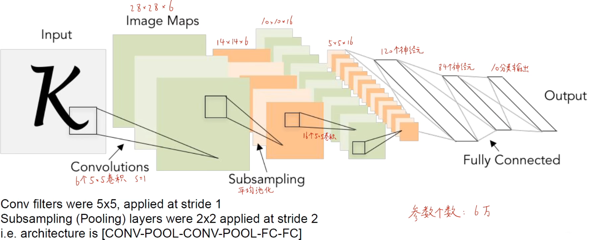

特点：通过 **卷积 - 池化 - 卷积 - 池化 - ... - 全连接 - 输出** 的结构实现。

在这篇论文当中，奠定了神经网络结构的基础，大概流程可以用以下几步进行描述：

1. 把手写字体图片转换成像素矩阵
2. 对像素矩阵进行第一层卷积运算，生成六个 feature map
3. 对每个 feature map 进行下采样（也叫做池化)，在保留 feature map 特征的同时缩小数据量。生成六个小图，这六个小图和上一层各自的 feature map 长得很像，但尺寸缩小了。
4. 对六个小图进行第二层卷积运算，生成更多 feature map
5. 对第二次卷积生成的feature map进行下采样
6. 第一层全连接层
7. 第二层全连接层
8. 高斯连接层，输出分类结果

同时也因为这篇论文提出了卷积神经网络的**平移、缩放、变形不变性**的性质，也就有了如下三个特点：

- **局部感受野**每个神经元仅与输入神经元的一块区域连接，这块局部区域称作感受野(receptive field)。局部连接的思想，也是受启发于生物学里面的视觉系统结构，视觉皮层的神经元就是局部接受信息的。
- 权值共享卷积核是共享的
- **下采样、池化**减少参数，防止过拟合

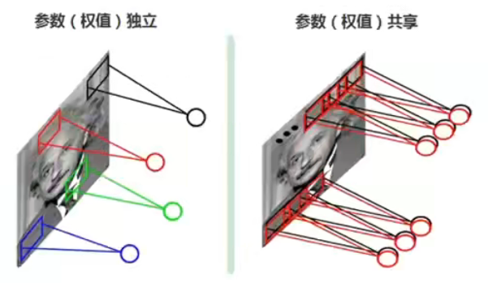

**平移、缩放、变形不变性**（统称**平移不变性**）是指无论要识别的物体在图像的哪个位置，他都是只要是属于同一个类别那么他的类别就是不变的，也就是和物体的类别和位置没有关系。因为在卷积过程中有提取到不同尺度，不同位置的特征，所以卷积神经网络能够识别这样的特征从而实现平移不变性。（主要是来自于下采样和池化操作）

## AlexNet

:::info

Krizhevsky, Alex, Ilya Sutskever, and Geoffrey E. Hinton. "Imagenet classification with deep convolutional neural networks." *Advances in neural information processing systems* 25 (2012).

:::

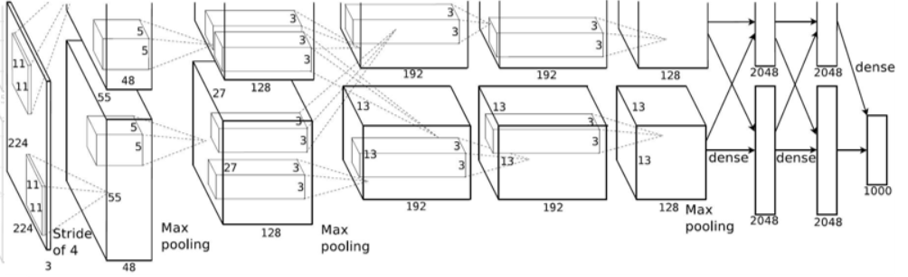

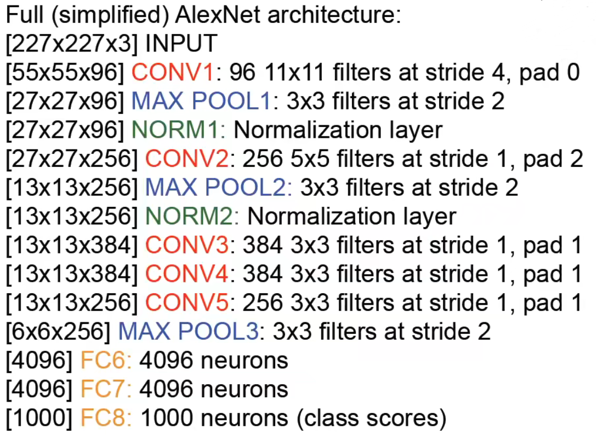

特点：

1. 第一次使用 ReLU 激活函数
2. 使用归一化层
3. 大量使用数据增强方法
4. 使用 dropout，概率为 0.5
5. batch size 为 128
6. 使用 SGD + Momentum 优化器
7. 学习率调整为 1e-2
8. L2 权重衰减率 5e-4
9. 7 个 CNN 模型集成

## ZFNet

:::info

Zeiler, Matthew D., and Rob Fergus. "Visualizing and understanding convolutional networks." *European conference on computer vision*. Springer, Cham, 2014.

:::

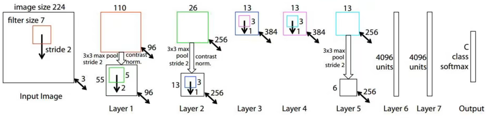

本篇论文的核心工作是在对于神经网络的**可视化**，网络结构与 AlexNet 类似，但最重要的是对卷积神经网络的可视化。提出了反卷积这一操作，通过对特征图进行反卷积，将图像还原回输入的样子从而得到特征图的可视化。

## VGGNet

:::info

Simonyan, Karen, and Andrew Zisserman. "Very deep convolutional networks for large-scale image recognition." *arXiv preprint arXiv:1409.1556* (2014).

:::

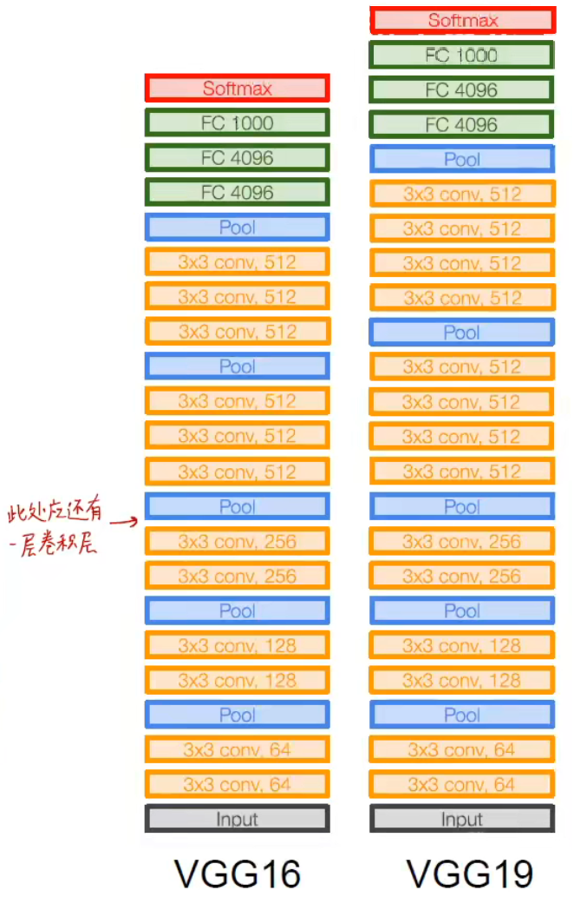

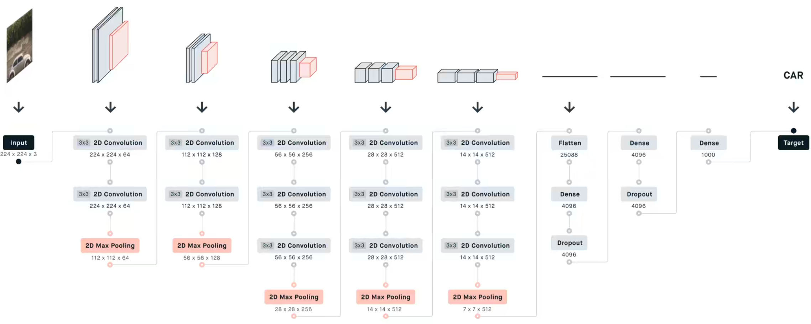

特点：

1. 全部使用 $3\times3$ 的卷积，并且步长为 1，padding 为 1

   全部使用 $3\times3$ 卷积的原因：因为 3 层 $3\times3$ 卷积的感受野和 1 层 $7\times7$ 卷积的感受野是相同的，在训练技巧一文中有讲到，同等效果的情况下使用更小的卷积核能够给网络带来更深的结构，提高提取特征的能力，并且效率更高，带来更少的参数量。

2. 全部使用 $2\times2$ 的池化，并且步长为 2

## GoogLeNet

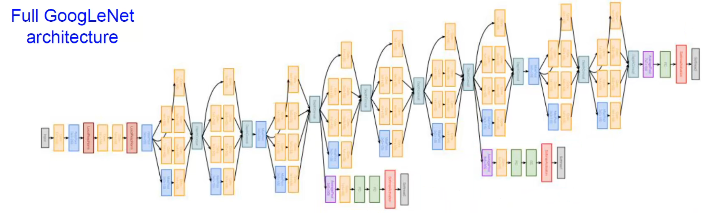

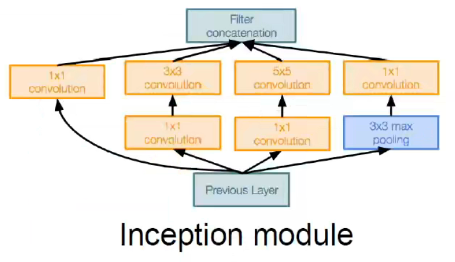

GoogleNet 主要是围绕 Inception 模块搭建，有点类似于并联的思想，在不同的分支使用不同的卷积策略，最后再融合到一起之后进行后续的处理。具有更深的网络，同时这样计算也比较高效。

特点：

1. 有 22 层卷积层，以及高效的 Inception 模块
2. 没有全连接层
3. 只有 5 million 的参数，比 AlexNet 减少了 12 倍
4. 能够在不同的分支使用不同的尺度进行训练，实现了多尺度并行卷积的效果

但是这个 Inception 模块有一个缺点，因为使用了多条分支进行卷积，所以卷积的运算量会大幅度上涨。

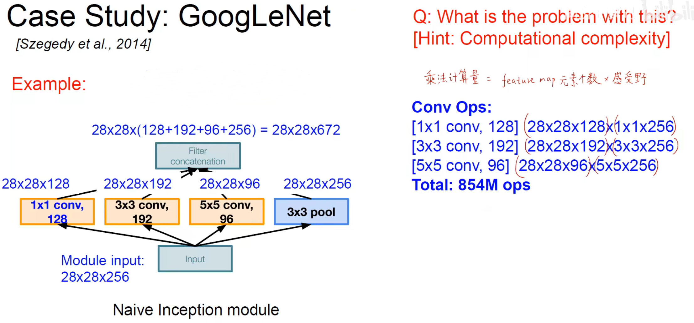

所以为了解决计算量大的问题使用 $1\times1$ 卷积来进行降维或者升维操作，作用：

1. 降维或者升维
2. 跨通道信息的交融
3. 减少参数量
4. 增加模型深度，提高非线性的表示能力

改进之后的结构如图：

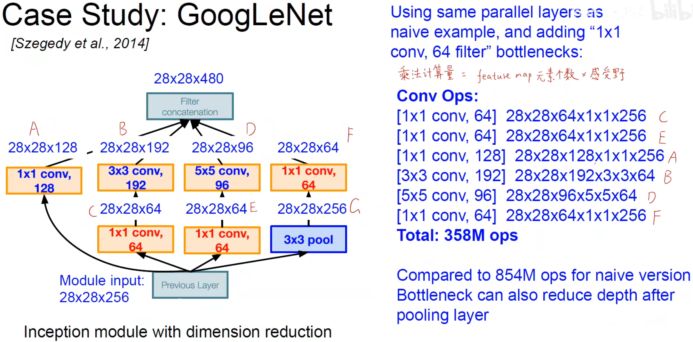

提取完特征后，传统方式是要用全连接层进行分类，但在 GoogLeNet 中使用全局平均池化（GAP）实现对应的效果。

:::tip Global Average Pooling

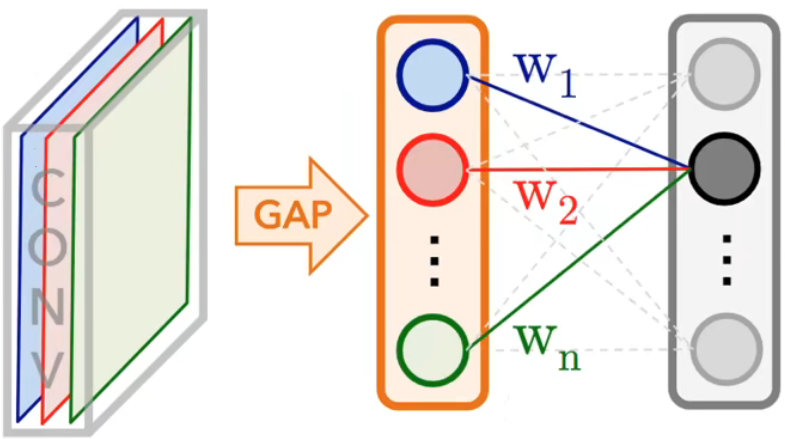

每一个通道选出一个代表作为权重，有效地减少了参数的数量。

:::

其他对于 Inception 模块的改进方法在之前训练 CNN 的技巧中以及提及。

## ResNet

:::info

He, Kaiming, et al. "Deep residual learning for image recognition." *Proceedings of the IEEE conference on computer vision and pattern recognition*. 2016.

:::

ResNet 主要是提出了残差模块的概念

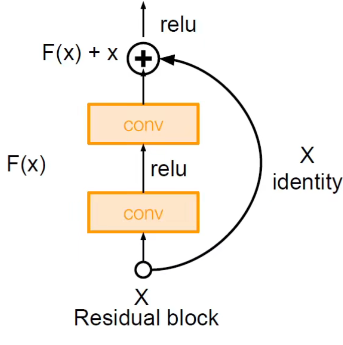

特点：

1. 堆叠残差模块
2. 每一个残差块都是两层 $3\times3$ 的卷积
3. 使用步长为 2 的卷积层代替池化层
4. 在网络开始的时候进行卷积
5. 网络的最后用 GAP 减少参数量
6. 只有最后一层才有全连接层

首先何恺明提出了网络是否越深越好的探究并进行了实验发现，网络并不是越深越好，网络越深反而效果会变差。网络越深会导致**梯度消失的问题**。

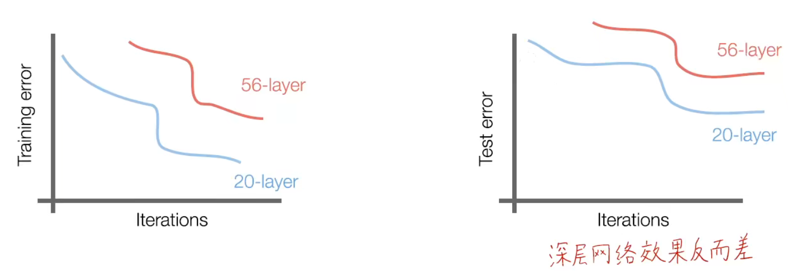

那么我们的 motivation 就是要解决优化问题中模型难以优化的问题。加深网络后效果至少要和不加深之前的效果相同，至少不要变，所以就想到一种方式：把浅层网络的结果加到深层的网络结果之上，就有了残差模块。

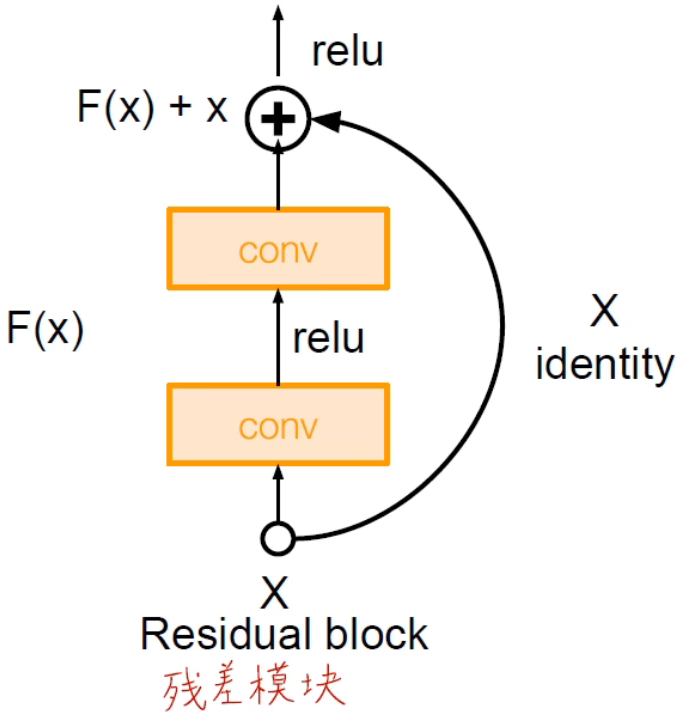

可以通过多次 skip-connection 避免梯度消失的情况，不断堆叠就可以把网络做的很深，而在 ResNet 当中没有池化层，因为使用了步长为 2 的卷积层代替了池化层。

在 ResNet 中使用的训练参数：

- Batch Normalization after every CONV layer
- Xavier 2 / initialization from He et al.
- SGD+ Momentum (0.9)
- Learning rate: 0.1 , divided by 10 when validation error plateaus
- Mini-batch size 256
- Weight decay of 1e-5
- No dropout used

同时还提出了不同的残差方式，如 Stochastic Depth，也就是随机残差，目的就是为了避免梯度消失和减短训练时间。

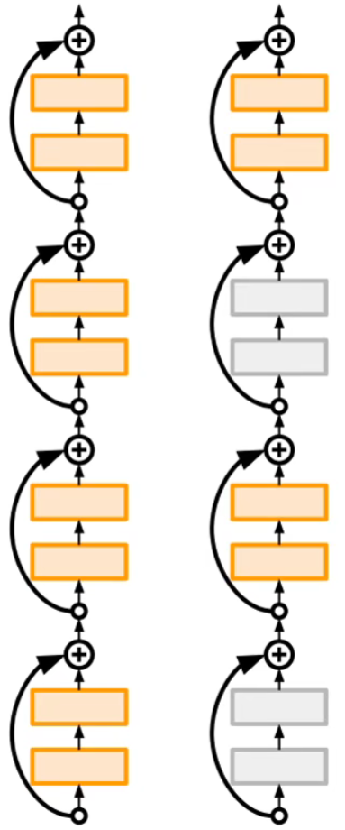、

## SENet

SENet，又叫 Squeeze-And-Excitation Networks，是注意力机制的基础。

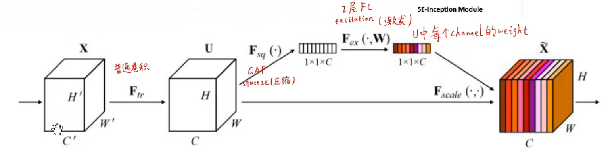

特点：

1. 添加了 “feature recabration” 模块，自适应地学习不同特征图之间的权重
2. 引入了全局信息（使用 GAP 层）+ 两个全连接层来判断特征的权重

## NiN

:::info

Lin, Min, Qiang Chen, and Shuicheng Yan. "Network in network." *arXiv preprint arXiv:1312.4400* (2013).

:::

NiN，全称 Network in Network，主要思想是在网络中间插入网络。

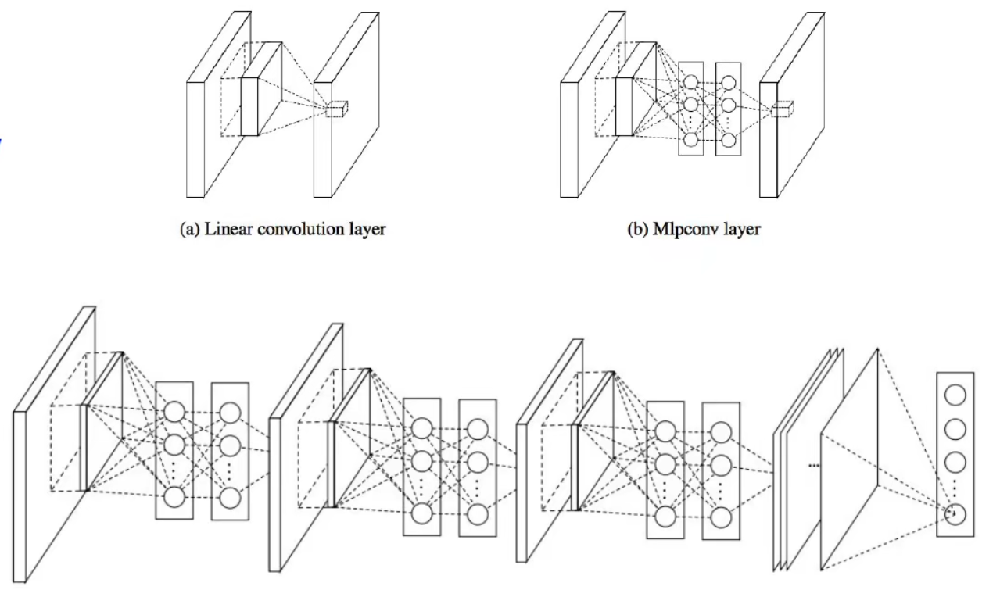

特点：

1. 在卷积层之间插入 线性模块 或者 MLP 模块，用来计算每一个卷积操作中更加抽象的特征
2. 微网络使用多层感知机（MLP）
3. 是 GooLeNet 和 ResNet “bottleneck” 层的前身
4. 受到 GooLeNet 的启发

## Identity Mappings in Deep Residual Networks

:::info

He, Kaiming, et al. "Identity mappings in deep residual networks." *European conference on computer vision*. Springer, Cham, 2016.

:::

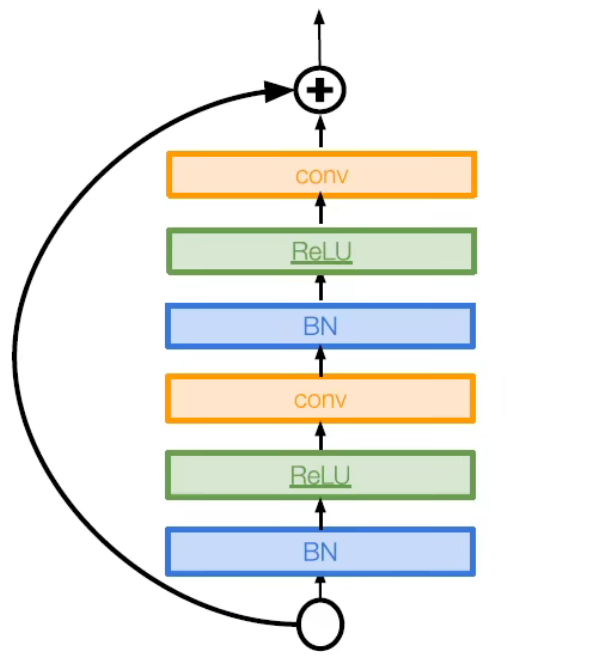

特点：

1. 改进残差块
2. 在前向传播干活城中创建更多 skip-connection
3. 提高性能

## Wide Deep Residual Networks

:::info

Zagoruyko, Sergey, and Nikos Komodakis. "Wide residual networks." *arXiv preprint arXiv:1605.07146* (2016).

:::

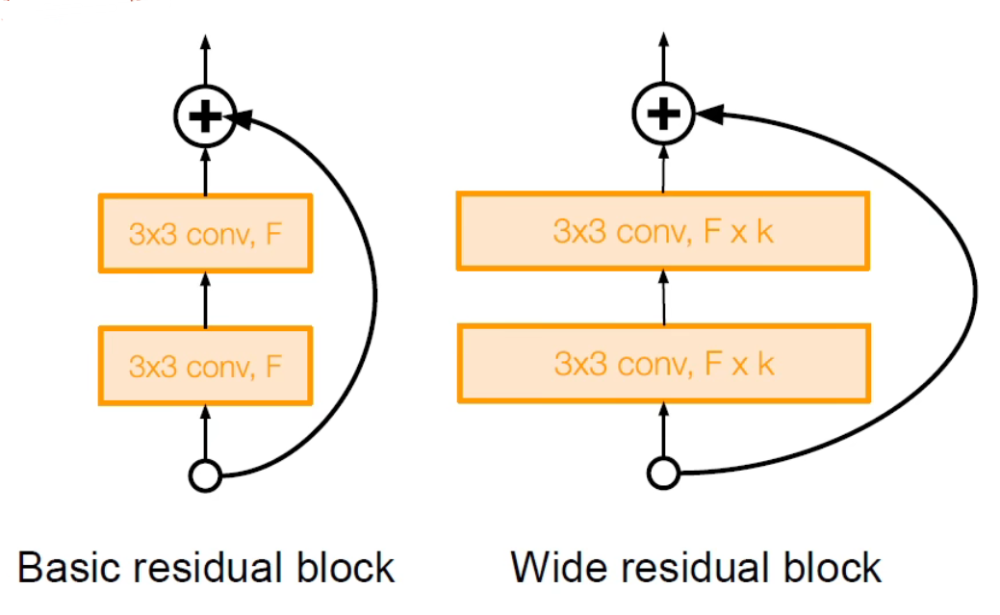

特点：

1. 讨论了残差的质量更重要而不是深度和数量
2. 使用更宽的残差块使用 $F \times k$  个滤波器
3. 50 层宽的 ResNet 比 152 层的传统 ResNet 效果更好
4. 增加宽度而不增加深度，使得计算更加高效

## ResNeXt

:::info

Xie, Saining, et al. "Aggregated residual transformations for deep neural networks." *Proceedings of the IEEE conference on computer vision and pattern recognition*. 2017.

:::

ResNeXt，又称 Aggregated Residual Transformations for Deep Neural Networks。

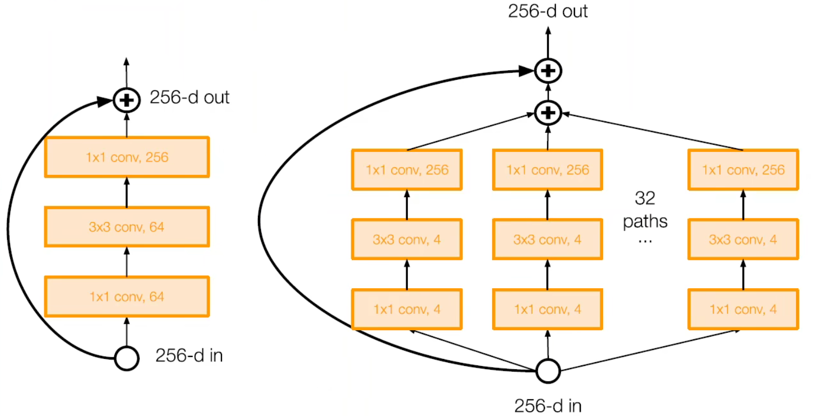

特点：

1. 增加了残差块的宽度，通过并行多路的方式
2. 受到 Inception 模块的启发

## FractalNet

:::info

Larsson, Gustav, Michael Maire, and Gregory Shakhnarovich. "Fractalnet: Ultra-deep neural networks without residuals." *arXiv preprint arXiv:1605.07648* (2016).

:::

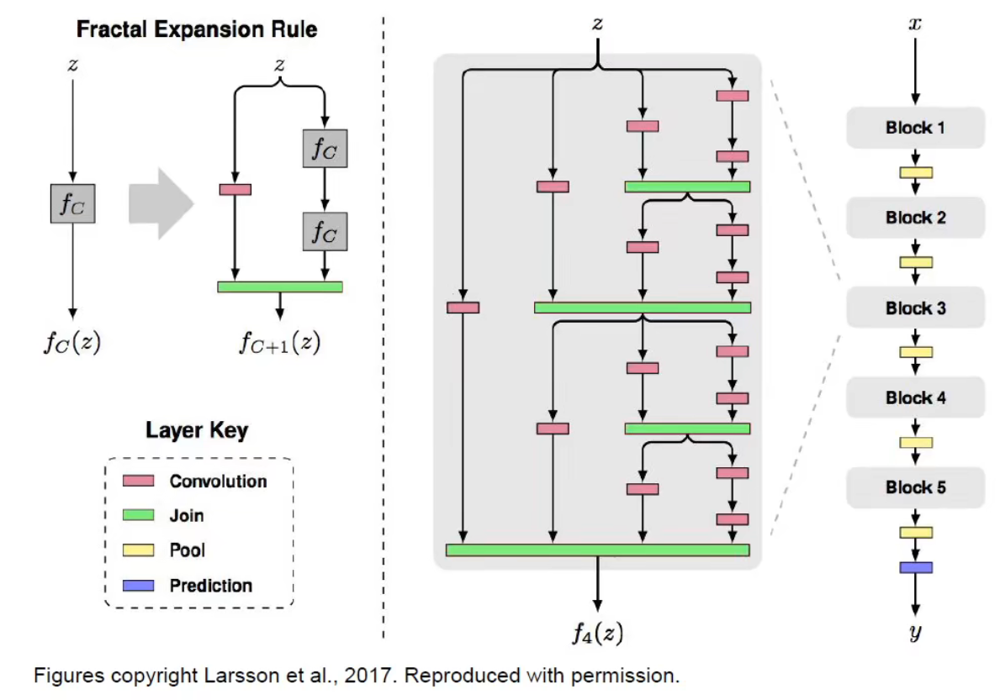

特点：

1. 讨论了有效使用深度和残差是不必要的
2. 分形结构同时使用了深度路径和浅层路径来输出
3. 通过 drop path 的方式训练（随机使某条路径的神经元失活）
4. 测试时使用整个网络

## DenseNet

:::info

Huang, Gao, et al. "Densely connected convolutional networks." *Proceedings of the IEEE conference on computer vision and pattern recognition*. 2017.

:::

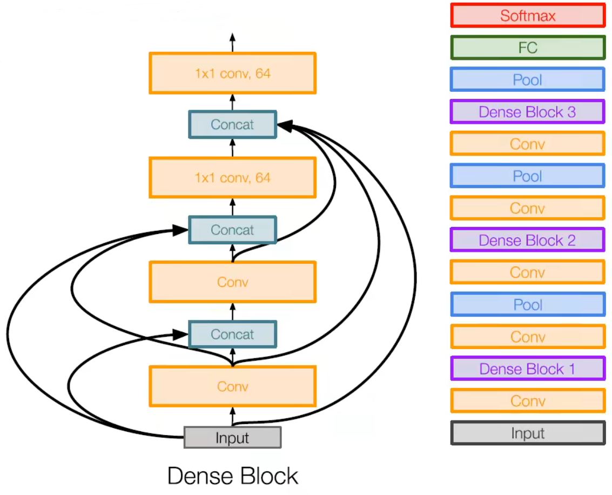

特点：

1. 使用压缩块，使得每一层都与前向的所有曾相连接
2. 减缓梯度消失，增强特征的重复使用和表示。

## MobileNet

:::info

Howard, Andrew G., et al. "Mobilenets: Efficient convolutional neural networks for mobile vision applications." *arXiv preprint arXiv:1704.04861* (2017).

:::

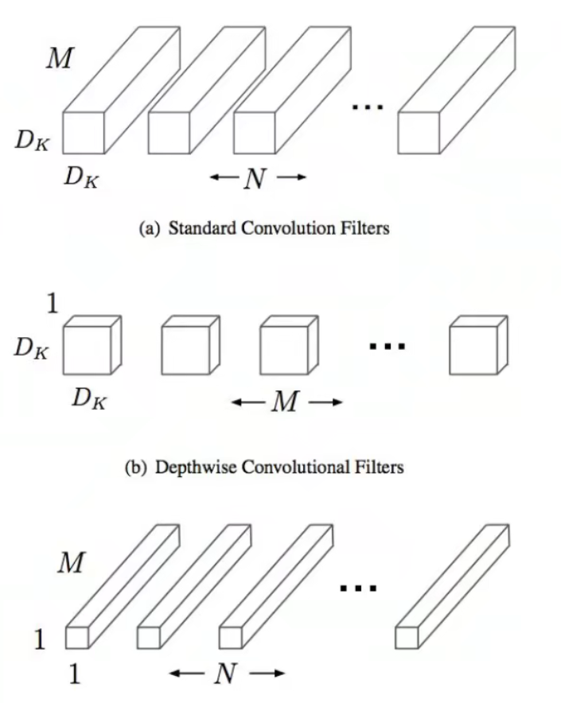

特点：

1. 提出了深度可分离卷积替换了传统的卷积方式，使用深度卷积和 $1\times1$ 卷积能够提高效率
2. 加快网络速度的同时尽可能减少对准确度的影响
3. 之后还有 MobileNet v2
4. 还有很多其他的工作 （ShuffleNet）

## NASNet

:::info

Zoph, Barret, and Quoc V. Le. "Neural architecture search with reinforcement learning." *arXiv preprint arXiv:1611.01578* (2016).

:::

NASNet 是基于神经网络结构搜索的方式实现，通过使用元学习，使得能够学习神经网络的结构，找到一种最优的结构进行训练和预测。这种方法是基于强化学习实现的。（Neural Architecture Search with Reinforcement Learning）

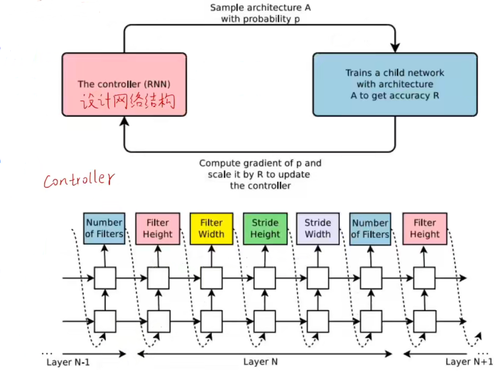

特点：

1. Controller 网络会学习设计一个好的神经网络结构
2. 在迭代过程中，会选择一种从搜索空间中选择一种结构；训练神经网络结构以获得 ”奖励“ R 对应于准确度；计算样本概率的梯度，并且根据 R 来调整 Controller 更新的参数

## Learning transferable Architecture for Scalable Image Recognition

:::info

Zoph, Barret, et al. "Learning transferable architectures for scalable image recognition." *Proceedings of the IEEE conference on computer vision and pattern recognition*. 2018.

:::

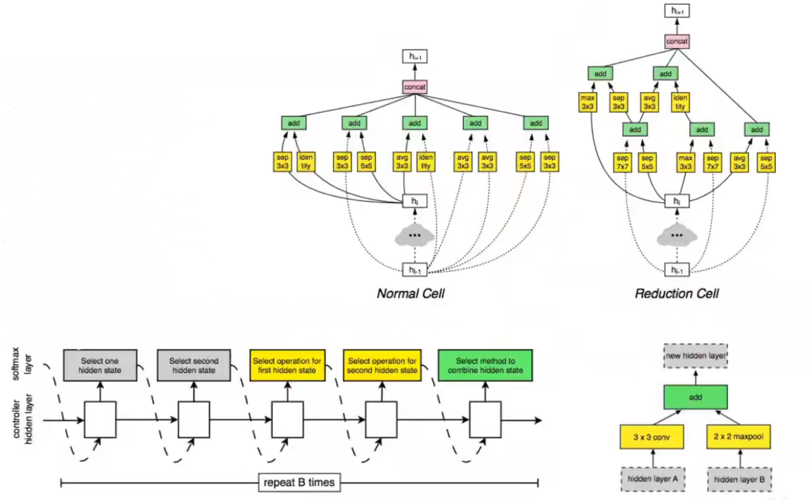

特点：

1. 使用 NAS 的方式在大型数据集上非常昂贵
2. 设计一种建造块的搜索空间，能够灵活堆叠块结构
3. NASNet：使用 NAS 找到更好的神经元结构，先在 cifar-10 数据集上进行训练，然后再迁移到 ImageNet
4. 后续的工作还有 AmoebaNet (Real et al. 2019) 和 ENAS (Pham Guan et al. 2018)

## 历史发展

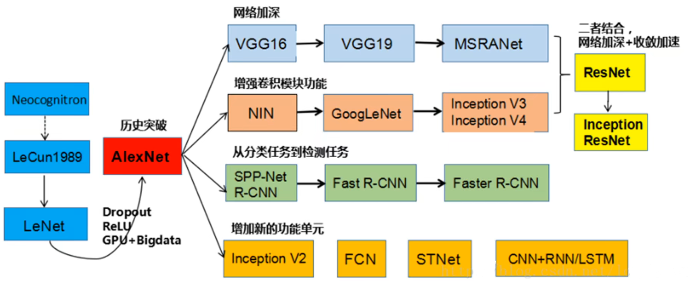

