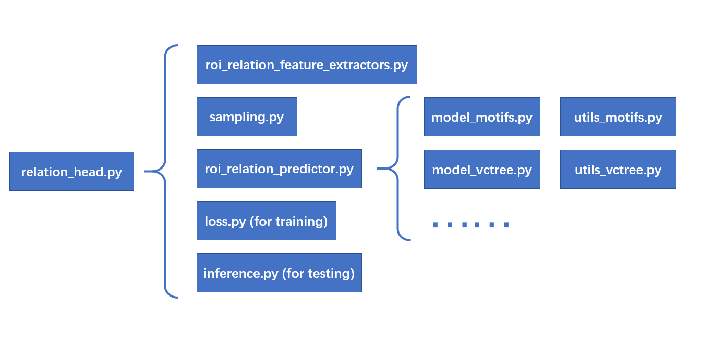

# Introduction

Scene Graph Benchmark 是 Kaihua Tang 在完成 [Unbiased Scene Graph Generation from Biased Training](https://arxiv.org/abs/2002.11949) 这篇工作的时候对 MaskRCNN Benchmark 做整理，在 Faster RCNN 的基础上扩展了 Scene Graph Generation 所用到的 Relation Head 等组件，并且加入 Faster RCNN 实现 Scene Graph Generation  网络框架的构建。

本项目旨在构建一个新的场景图生成（SGG）代码库，由于他们优雅的框架，这个代码库比以前的神经主题框架更适合新手，更容易阅读/修改你自己的项目（至少我希望如此）。遗憾的是，我在做这个项目的时候，detectron2 还没有发布，不过我觉得 maskrcnn-benchmark 可以考虑做一个更稳定，bug 更少的版本。SGG 中使用的所有新旧指标，并在METRICS.md 中解释了两个对SGG指标的常见误解，这些误解导致了一些论文中的异常结果。

## Core (Relation heads)

为了标准化 SGG，我将场景图生成定义为 RoI_Head。参考其他 roi_heads 如 box_head 的设计，我将大部分 SGG 代码放在 maskrcnn_benchmark/modeling/roi_heads/relation_head 下，调用顺序如下：



## Mode

共有三种模式

1. 谓词分类 (PredCls)：将 GT 边界框和标签作为输入；

   ```bash
   MODEL.ROI_RELATION_HEAD.USE_GT_BOX True MODEL.ROI_RELATION_HEAD.USE_GT_OBJECT_LABEL True
   ```

2. 场景图分类 (SGCls)：使用没有标签的 GT 边界框；

   ```bash
   MODEL.ROI_RELATION_HEAD.USE_GT_BOX True MODEL.ROI_RELATION_HEAD.USE_GT_OBJECT_LABEL False
   ```

3. 场景图检测 ( SGDet）：从头开始检测 SG。

   ```bash
   MODEL.ROI_RELATION_HEAD.USE_GT_BOX False MODEL.ROI_RELATION_HEAD.USE_GT_OBJECT_LABEL False
   ```

我们使用两个开关 MODEL.ROI_RELATION_HEAD.USE_GT_BOX 和 MODEL.ROI_RELATION_HEAD.USE_GT_OBJECT_LABEL 来切换不同的模式。

### Customize Your Own Model

如果想定制自己的模型，可以参考 `maskrcnn-benchmark/modeling/roi_heads/relation_head/model_XXXXX.py` 和 `maskrcnn-benchmark/modeling/roi_heads/relation_head/utils_XXXXX.py`。您还需要在 `maskrcnn-benchmark/modeling/roi_heads/relation_head/roi_relation_predictors.py` 中添加相应的 `nn.Module`。有时您可能还需要通过 `maskrcnn-benchmark/modeling/roi_heads/relation_head/relation_head.py` 更改模块的输入和输出。

## Tips

反事实推理不仅适用于 SGG。实际上，我的同事 Yulei 发现反事实因果推理在无偏 VQA 中也有很大的潜力。我们相信这种反事实推理也可以应用于许多具有显着偏见的推理任务。它基本上只运行模型两次（一次用于原始输出，另一次用于干预输出），而后一次获得应该从最终预测中减去的有偏先验。但是您需要牢记三个提示：

- 最重要的东西总是因果图。您需要找到正确的因果关系图，该因果关系图具有导致有偏差预测的可识别分支。如果因果图不正确，其余的就没有意义了。注意，因果图不是对现有网络的总结（而是构建网络的指导），你应该根据因果图修改你的网络，而不是相反。
- 对于因果图中具有多个输入分支的节点，选择合适的融合函数至关重要。我们测试了大量的融合函数，发现只有SUM融合和GATE融合始终工作良好。在大多数情况下，像元素式产生这样的融合函数不适用于TDE分析，因为来自多个分支的因果影响不再是线性分离的，这意味着，它不再是一个可识别的“影响”。
- 对于因果图中具有多个输入分支的那些最终预测，还可能需要为每个分支添加辅助损耗，以稳定每个独立分支的因果影响。因为当这些分支具有不同的收敛速度时，这些硬分支将容易被学习为依赖于最快/最稳定收敛分支的不重要的微小浮动。辅助损耗允许不同支路具有独立和相等的影响。
