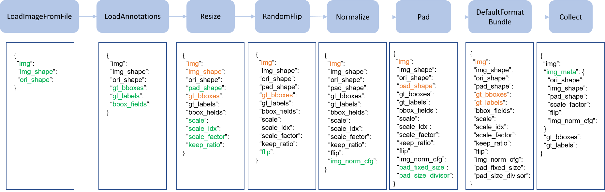

# Customize Data Pipelines

在传统的 pytorch 中，通常使用 `Datset` 和 `DataLoader` 来加载数据。`Dataset` 会返回一个装有数据的字典（也就是 model 里面 forward 方法的参数）。因为不同的数据集可能不同图片的大小是不一样的，所以我们引入了  mmcv 中的 `DataContainer`，用来分发不同的数据。

在这里，我们引入管道的观念。一般来说，一个数据集定义了如何处理标签，而管道定义了准备一个数据字典的所有处理方法，一个管道由一连串的操作组成，每次操作都是输入一个字典，最后返回一个字典。

下面这张图就表示了一个传统的 pipeline。蓝色块是对应的操作，随着 pipeline 的流动，不断地在字典里面添加（绿色）或者更新（橙色）键值对表示新的操作。



这些操作分为数据加载、预处理、格式化和测试时增强。下面是 `Faster R-CNN` 的 pipeline 样例。

```python
img_norm_cfg = dict(
    mean=[123.675, 116.28, 103.53], std=[58.395, 57.12, 57.375], to_rgb=True)
train_pipeline = [
    dict(type='LoadImageFromFile'),
    dict(type='LoadAnnotations', with_bbox=True),
    dict(type='Resize', img_scale=(1333, 800), keep_ratio=True),
    dict(type='RandomFlip', flip_ratio=0.5),
    dict(type='Normalize', **img_norm_cfg),
    dict(type='Pad', size_divisor=32),
    dict(type='DefaultFormatBundle'),
    dict(type='Collect', keys=['img', 'gt_bboxes', 'gt_labels']),
]
test_pipeline = [
    dict(type='LoadImageFromFile'),
    dict(
        type='MultiScaleFlipAug',
        img_scale=(1333, 800),
        flip=False,
        transforms=[
            dict(type='Resize', keep_ratio=True),
            dict(type='RandomFlip'),
            dict(type='Normalize', **img_norm_cfg),
            dict(type='Pad', size_divisor=32),
            dict(type='ImageToTensor', keys=['img']),
            dict(type='Collect', keys=['img']),
        ])
]
```

对于每个操作，我们都会列出被添加/更新/删除的相关dict字段

## 对应操作

### Data loading

`LoadImageFromFile`

- add: img, img_shape, ori_shape

`LoadAnnotations`

- add: gt_bboxes, gt_bboxes_ignore, gt_labels, gt_masks, gt_semantic_seg, bbox_fields, mask_fields

`LoadProposals`

- add: proposals

### Pre-processing

`Resize`

- add: scale, scale_idx, pad_shape, scale_factor, keep_ratio
- update: img, img_shape, *bbox_fields, *mask_fields, *seg_fields

`RandomFlip`

- add: flip
- update: img, *bbox_fields, *mask_fields, *seg_fields

`Pad`

- add: pad_fixed_size, pad_size_divisor
- update: img, pad_shape, *mask_fields, *seg_fields

`RandomCrop`

- update: img, pad_shape, gt_bboxes, gt_labels, gt_masks, *bbox_fields

`Normalize`

- add: img_norm_cfg
- update: img

`SegRescale`

- update: gt_semantic_seg

`PhotoMetricDistortion`

- update: img

`Expand`

- update: img, gt_bboxes

`MinIoURandomCrop`

- update: img, gt_bboxes, gt_labels

`Corrupt`

- update: img

### Formatting

`ToTensor`

- update: specified by `keys`.

`ImageToTensor`

- update: specified by `keys`.

`Transpose`

- update: specified by `keys`.

`ToDataContainer`

- update: specified by `fields`.

`DefaultFormatBundle`

- update: img, proposals, gt_bboxes, gt_bboxes_ignore, gt_labels, gt_masks, gt_semantic_seg

`Collect`

- add: img_meta (the keys of img_meta is specified by `meta_keys`)
- remove: all other keys except for those specified by `keys`

### Test time augmentation

`MultiScaleFlipAug`

## 自定义 Pipeline

1. 新建一个 pipeline 文件 `my_pipeline.py`，示例如下：

   ```python
   import random
   from mmdet.datasets import PIPELINES
   
   
   @PIPELINES.register_module()
   class MyTransform:
       """Add your transform
   
       Args:
           p (float): Probability of shifts. Default 0.5.
       """
   
       def __init__(self, p=0.5):
           self.p = p
   
       def __call__(self, results):
           if random.random() > self.p:
               results['dummy'] = True
           return results
   ```

2. 导入并使用自己定义的 pipeline 文件，确保时用相对路径导入的。

   ```python
   custom_imports = dict(imports=['path.to.my_pipeline'], allow_failed_imports=False)
   
   img_norm_cfg = dict(
       mean=[123.675, 116.28, 103.53], std=[58.395, 57.12, 57.375], to_rgb=True)
   train_pipeline = [
       dict(type='LoadImageFromFile'),
       dict(type='LoadAnnotations', with_bbox=True),
       dict(type='Resize', img_scale=(1333, 800), keep_ratio=True),
       dict(type='RandomFlip', flip_ratio=0.5),
       dict(type='Normalize', **img_norm_cfg),
       dict(type='Pad', size_divisor=32),
       dict(type='MyTransform', p=0.2),
       dict(type='DefaultFormatBundle'),
       dict(type='Collect', keys=['img', 'gt_bboxes', 'gt_labels']),
   ]
   ```

3. 可视化数据增广 pipeline 的输出

   为了可视化数据增强管道的输出，`tools/misc/browse_dataset.py` 可以帮助用户直观地查看检测数据集（包括图像和边界框注释），或者将图像保存到指定的目录。
