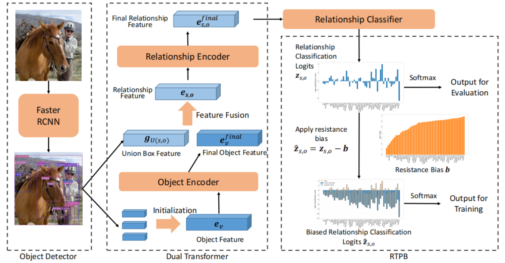
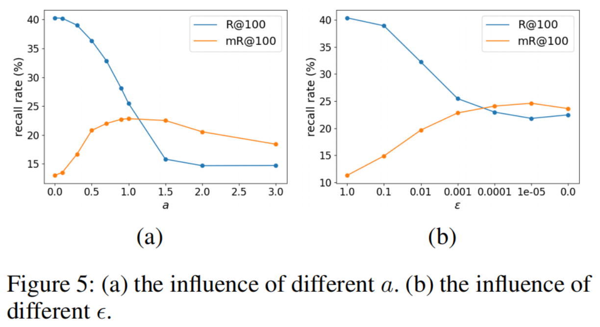
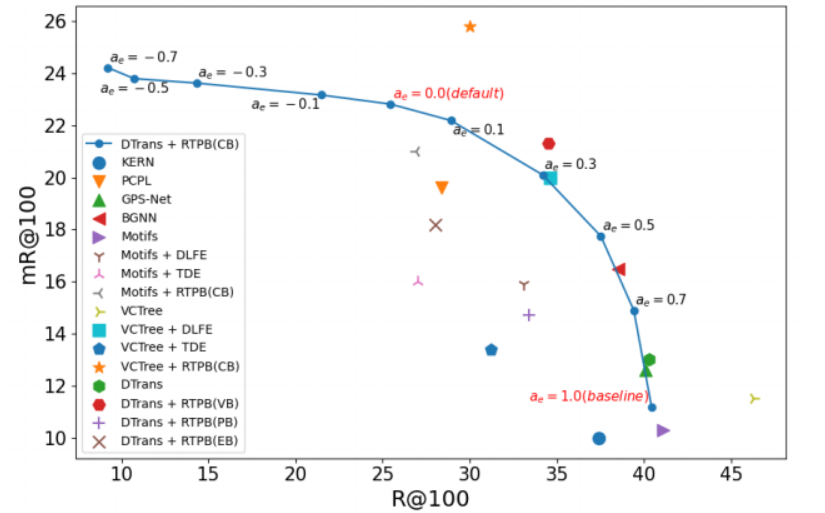
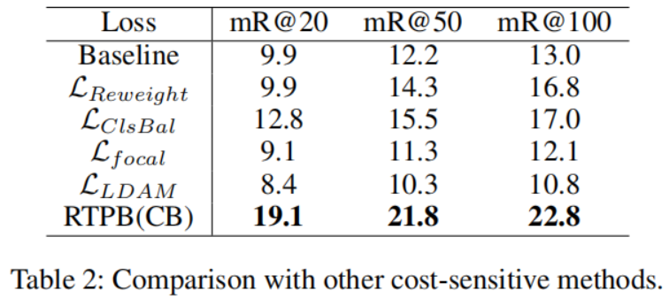

# Resistance Training using Prior Bias: toward Unbiased Scene Graph Generation

## Abstract

场景图生成的目标是用物体和不同物体之间的关系构建一种场景图表示。然而，因为 训练数据的分布有 long-tail 的问题，现在的 SGG 方法通常都会遇到达不到最优的场景图生成。为了解决这个问题，我们提出了 Resistance Training using Prior Bias (RTPB)。特别地，RTPB 使用基于分布的先验 bias 来提高模型在训练的时候对非常见的关系的检测，从而在 tail categroies 上提高模型的泛化能力。另外，为了获得更多物体和关系的上下文信息是，我们设计了一个上下文相关的编码 backbone 网络，称为 Dual Transformer。我们在非常知名的 benchmark VG150 上进行大量的实验，为了展示我们的方法在无偏 SGG 的有效性。特别地，我们 RTPB 达到了在现有的 SGG 方法上使用 平均召回率 为指标下超过 10% 的提升。同时，同时使用 DTrans 和 RTPB 模块能够在所有 SOTA 的方法上达到最优并且拉开较大的差距。

## Introduction

SGG 主要是通过场景图理解图像的语义信息，场景图中每一个节点表示视觉上的物体，每条边表示物体之间的关系。SGG 的一个样例就如 Fig 1，SGG 很好地在 low-level 的视觉感知信息和 high-level 的语义描述信息上面建立桥梁，联系起这两者之间的差距。因此，一个高效的场景图能够对下游任务提供强有力的帮助，例如：图像描述、图像解释、VQA 等任务。

SGG 通常会遇到 训练数据关系上的 long-tail 问题。例如，像 Fig 1(c) 展示的，通常会使用 SGG 相关的数据集，如  Visual Genome 数据集，这些数据集里面主要由一些粗粒度描述的关系（head categroies），而且其他没有足够标签用于识别**不常见的关系**（tail categroies）。严重的不平衡分布对于无偏 SGG 任务变得非常困难，考虑到现实情况下那些不常见的关系也只有少数的训练样本。

- head categroies: 一些粗粒度的关系
- tail categroies: 不常见的关系

为了解决上面提到的问题，有人就提出了许多对无偏 SGG 类别平衡的策略。然而，现有的方法仍然只是努力在 tail categories 上达到比较满意的效果并且希望有更多复杂的解决方案。**受到人们对抗阻力的方式训练力量来增强肌肉力量的启发**，我们提出了 resistance training using prior bias (RTPB) 来提高对不常见的关系的检测并且解决 SGG 中的 long-tail 问题。（可以理解为类似于要提高某样能力，就要反其道而行之去对抗这部分能力，从而得到提升）

RTPB 在训练过程中为模型分配一个针对类别的阻力，其中每一个关系上的阻力由一个先验 bias 决定，称为阻力 bias。阻力 bias 首先使用训练集中的关系的先验统计信息来初始化。阻力偏差的目的是为了加强模型，以加强对不常见关系的检测能力，因为它们总是对应于较强的阻力。通过这种方式，RTPB 使模型能够抵抗不平衡的训练数据集的影响。同时，为了更好的获得全局特征来识别关系，我们设计了一个上下文相关的编码 backbone 网络，称为 dual Transformer。

具体来说，DTrans使用两个 Transformer 堆叠到一起来依次对物体和关系的全局信息进行编码。为了评估所提出的 RTPB 的有效性，我们将其引入最近最先进的方法和我们的 DTrans。具体来说，与其他方法相比，RTPB在平均召回率标准方面可以提高10%以上。通过整合 DTrans，RTPB 为无偏场景图生成达到新的 SOTA。

本文的主要贡献：

1. 我们提出了一种新的利用先验偏差(RTPB)的阻力训练策略来提高模型对训练数据集中罕见关系的泛化性；
2. 定义了阻力偏差的一般形式，并通过不同的方法建模对象关系，设计了不同类型的特定偏差；
3. 引入了一个基于 Transformer 的上下文编码结构，形成了一个简单而有效的场景图生成的 baseline。

## Related Works

场景图的生成属于视觉关系的检测，它使用图来表示视觉对象及其之间的关系。

- 语义信息的缺失

  早期工作中，只是基于特定类别或者类别组检测和预测，不能够充分利用输入图像的语义信息。后来，为了考虑到上下文信息，又提出了各种各样的网络，如 BiLSTM、TreeLSTM、GNN。还有一些方法尝试引入额外信息，如：语言知识和知识图谱。到现在提出了 SGG。

- 训练数据分布不平衡

  然而，因为标签的效果以及图像的分布，这个任务会遇到严重的数据不平衡问题。大量的实验尝试解决这个问题，主要集中在减少 long-tail 分布的影响以及建立一个关系预测的平衡模型。还有一些工作尝试用 positive-unlabeled 学习的方式解决这个问题，引入 imbalanced learning 方法，如：resampling, cost-sensitive learning。与这些方法不同的是，我们采用 RTPB 在训练过程中对关系分类器使用 resistance bias 进行优化，并优化 loss 值以及每一种关系的分类边界。

- 不平衡学习 (imbalanced learning)

  - Resampling

    - oversampling: 提高不常见类别的数量，但会容易导致过拟合
    - undersampling: 减少类别较多的数量，但在数据不平衡的情况下使用会让他丢失有用的信息。

  - Cost-sensitive Learning

    - reweighting: 是一种广泛使用的 cost-sensitive 策略，使用先验知识在类别之间加权平衡。早期的工作中，使用频率的倒数或类频率的平方反比的平滑版本来调整不同类的训练损失。然而，这往往会增加在极端数据不平衡设置和大规模场景下进行模型优化的难度。

      Cui等人提出了类平衡(CB)权重，并将其定义为逆有效样本数。其他一些方法根据模型的性能动态调整每个样本的权重。

与这些直接处理损失函数的方法不同，我们根据训练数据集的分布，对每个类别添加了一个先验 bias。通过这种方法，我们提出了一种新的方法来导入额外的类别信息，并且通过调整分类边界来解决不平衡的问题。

## Methods

主要是引入了两种方法，对于信息提取使用 Dual Transformer，对于关系之间的计算使用阻力偏置的方式训练偏置项，用偏置项来优化最后的关系分类结果。

### Dual Transformer

Dual Transformer 主要是对 Object 和 Relationship 进行编码。

- Object Encoder

  将所有 detector 输出的 proposal 整合成一个特征向量
  $$
  e_v=W_o[pos(\bold b_v), \bold g_v, ebd(c_v)]
  $$
  $[\cdot, \cdot]$ 表示 concat 操作，$pos$ 表示可学习的对物体位置的位置编码方法，$ebd(c_v)$ 表示线性变换层。将上述信息输入到 $n_o$ 层 object encoding layer 的 transformer 获取物体的上下文特征 $e_{v}^{final}$。$e_v^{final}$ 首先被用来生成物体最终的分类结果。$p_v=\sigma(W_{cls}^oe_v^{final})$，$W_{cls}^o$ 表示物体的分类器，$e_v^{final}$ 也被用来生成物体的成对的关系特征。

- Relationship Encoder

  在进行关系特征编码之前，我们先融合特征来生成最基本的关系表示。对于每一个物体对 $(s,o)$，我们将视觉特征 $g_{U(s,o)}$ $s$ 和 $o$ 的 union box 进行 concat。然后我们使用线性变换曾获取 subject $s$ 和物体 $o$ 之间的关系表示。
  $$
  e_{s,o}=W_r[g_{U(s,o)},\bold e_s^{final}, \bold e_o^{final}]
  $$
  $W_r$ 表示线性变换层，用来压缩关系特征。$e_s^{final}$ 和 $e_o^{final}$ 是 $s$ 和 $o$ 最终的上下文感知特征

  然后使用 $n_r$ 层 relationship encoding layer 的 transformer 来编码 $s$ 和 $o$ 之间的关系特征，生成最后的 $e_{s,o}^{final}$ 特征。最后，$e_{s,o}^{final}$ 使用关系分类器来识别出成对之间的关系。
  $$
  \bold p_{s,o}=\sigma(\bold z_{s,o})=\sigma(W^r_{cls}e_{s,o}^{final})
  $$
  $\bold z_{s,o}$ 是关系分类器输出的 logits 向量，$W_r$ 是关系分类器。

### Resistence Training using Prior Bias

提出了多种不同因素决定的先验偏置。受到抗阻训练的启发，我们提出了使用先验 bias 进行抗阻训练。我们的 RTPB 仅在训练过程中使用先验偏差作为模型的阻力，以**调整不同关系下的模型强度**。
$$
\hat{\bold z_{s,o}}=\bold z_{s,o}-\bold b
$$
$\bold z_{s,o}=[z_1,z_2,...,z_{L_r}]$ 是关系分类的 logits 向量，$b=[b_1,b_2,...,b_{L_r}]$ 是对每一个关系的 resistance bias 向量。在训练的时候通过针对 tail relationships 相对地指定更重的阻力，我们能够让没有抗阻训练的模型更好处理 tail relationships 并且使得对 tail relationships 和 head relationships 之间分类效果的平衡。

在下面的描述中，我们在训练集上做先验统计提出四种 resistance bias，然后我们分析 loss 和 目的性 来表明 RTPB 的有效性。

Resistance Bias 的基本形式
$$
b_i=-\log(\frac{w_i^a}{\sum_{j\in\mathcal{C}_r}w_j^a}+\epsilon)
$$
$i$ 表示关系 $(i\in\mathcal{C}_r)$，$w_i$ 表示关系 $i$ 的权重，$a,\epsilon$ 是用来调整 $b_i$ 分布的超参数。对于 Resistence Bias，类别的权重 $w_i$ 与 $b_i$ 成反比。因此为了指定 head caegories 关系对应小阻力，$w_i$ 的分布应该和训练集的 long-tail 分布相关联。提出了以下四种 resistence bias: 

- Count Resistence Bias (CB)

  对于常规的分类任务，我们可以用训练集中每个关系的样本的比例来设置 resistence bias 的 bias 权重。我们将这种类型的叫做计数阻力偏置。

- Vaild Resistence Bias (VB)

  除了样本的数量外，在一般描述和详细描述之间也存在着长尾问题。因此，我们将有效对表示为：如果在训练集中存在 物体对 $(s,o)$ 的关系 $i\in\mathcal C_r$，则 $(s,o)$ 是一个有效的关系对 $i$。流行的 SGG 数据集 Visual Genome 的有效对计数的分布如 Fig 3，我们将权重 $w_i$ 设置为关系 $i$ 的有效对象对的比例。通过这种方式，RTPB 可以区分关系的一般描述和稀有关系的描述。我们称这种阻力性偏差为有效阻力偏置（简称VB）。

- Pair Resistence Bias (PB)

  然而，对于SGG任务，关系的分类不仅与关系有关，还与实体对有关。因此，我们尝试使用每个对象对的关系分布。对于不同的对象对，偏差是不同的。在应用中，我们根据对象的分类结果来选择偏差。物体对 $(s,o)$ 有如下关系：
  $$
  b_{s,o,i}=-\log(\frac{w_{s,o,i}^a}{\sum_{j\in\mathcal{C}_rw_{s,o,j}^a}}+\epsilon)
  $$
  其中，$w_{s,o,i}$  是训练集中所有主体 $s$ 和物体 $o$ 之间的关系中的关系 $i$ 的比率。我们将这种阻力偏差称为成对阻力偏置 (PB)

- Estimated Resistence Bias (EB)

  由于许多对 $s,o$ 只有少量的有效关系和很少的标签，因此在许多情况下，特定物体对的关系样本的数量很难显示关系的一般分布。因此，我们提出主谓词和谓词计数 $n^{sppo}$ 来估计关系分布。对主体 $s$，物体 $o$ 和 关系 $i$ 有如下计算：
  $$
  n_{s,o,i}^{sppo}=\sqrt{\sum_{o'\in\mathcal{C}_r}n_{s,o',i}\times\sum_{s'\in\mathcal{C}_e}n_{s',o,i}}
  $$
  $n_{s,o,i}$ 表示 $s$ 和 $o$ 之间的关系数量。然后我们提出了一种新的 resistance bias 来用比例 $\frac{n_{s,o,i}^{sppo}}{\sum_{j\in\mathcal{C}_r}n_{s,o,j}^{sppo}}$代替 $w_{s,o,i}$。我们将这种类型的抗性命名为估计阻力偏置 (EB)。

RTPB 的损失函数：

我们将通过分类损失来分析 RTPB 的影响。在分类器中，我们通过一个softmax 函数来确定最终的关系分类概率，并使用交叉熵 (CE) 来评估分类优化目标。分类概率和交叉熵损失如下所示：
$$
p_i=Pr(i|s,o,\mathcal{I})=\sigma(\bold z_{s,o})_i=\frac{e^{z_i}}{\sum_{j\in\mathcal{C}_r}e^{z_j}}
$$

$$
\mathcal{L}_i=-\log(p_i)=-\log(\frac{e^{z_i}}{\sum_{j\in\mathcal{C}_r}e^{z_j}})
$$

其中，$p_i$ 是图像 $\mathcal{I}$ 中的物体对 $(s，o)$ 之间的关系 $i$ 的概率，而 $z_{s,o}$ 是等式中提到的关系分类的 logits 向量。如果我们应用 RTPB，等式中的概率 $p_i$ 则得到：
$$
\hat{p_i}=\sigma(\bold z_{s,o}-\bold b)_i=p_i\frac{e^{-b_i}}{\sum_{j\in\mathcal{C}_r}e^{-b_j}p_j}
$$
$\bold b=[b_1,b_2,...,b_{L_r}]$ 是resistance bias 向量，则损失函数表示为：
$$
\hat{\mathcal{L}_i}=-\log(\hat{p_i})=-\log(\frac{e^{z_i-b_i}}{\sum_{j\in\mathcal{C}_r}e^{z_j-b_j}p_j})
\\=-\log(\frac{e^{z_i}}{\sum_{j\in\mathcal{C}_r}e^{z_j}p_j})+b_i+\log(\frac{e^{-b_j}e^{z_j}}{\sum_{k\in\mathcal{C}_r}e^{z_k}})\\=\mathcal{L}_i+\theta_i
$$
对于损失函数，RTPB 可以作为一种基于阻力偏差 $b_i$ 和关系预测 $p_i$ 的动态 re-weighting 方法。在等式中，$(s,o)$ 之间的关系i的权重为 $θ_i$。RTPB 可以增加对应于较大 resistence bias 的关系，而降低其余的权重。通过这种方式，RTPB 减少了 head relationships 的损失贡献，并突出了tail relationships，以保持 head 和 tail 之间的平衡。以二元分类为例，我们可以可视化地显示出具有特定 resistance bias 值的成对的损失值；该图如附录所示。

此外，当等式中 $p_i$ 的预测分布增大时，损失值往往较大，接近于 $e^{-b_i}=\frac{w_i^a}{\sum_{j\in\mathcal{C}_r}w^a_j}$ 的分布，这与等式中各关系的预定义权重 $w_i$ 的分布相关。由于 $w_i$ 的分布与训练集的长尾分布相关，因此阻力偏差提供了对 long-tail 分布的连续监督，以避免有偏预测。

从 RTPB 的另一个角度来看，我们可以简单地将 $\hat{\bold z}_{s,o}=\bold z_{s,o}−\bold b$ 视为在训练阶段需要优化的关节，在没有 RTPB 的情况下，结果应该接近 baseline。然后我们得到最终的预测 $\bold z_{s,o}=\hat{\bold z}_{s,o}+\bold b$。通过这种方式，与没有 RTPB 的模型相比，我们倾向于判断模糊的预测属于另一个具有较大阻力偏差的预测。因此，两类的分类边界倾斜于阻力较大的分类边界。倾斜度取决于两种关系类别之间的阻力偏差的相对值关系。例如，如果我们判断一个关系的标签为i，那么$\hat z_i$应该比所有其余的${\hat z_j,j\not=i}$都要好一个必要的分类边际$b_j−b_i$。

## Experiments

数据集：Visual Genomo

测试的任务：

- Predicate Classification: 在这个任务中，输入不仅包括图像，还包括图像中的 bbox 及其标签；
- Secen Graph Classification: 它只给出了 bbox
- Secen Graph Detection: 在此任务中，除了原始图像外，不会提供任何其他信息。

评价指标：Recall@k

参数：

- $n_o=4,n_r=2$
- $a=1,\epsilon=0.001$
- $\mathcal{C}_r=50$
- batchsize 16 iteration 18000

消融实验：

- Resistence Bias 的超参数

  

- Soft Resistence Bias

  

其他 cost-sensitive 方法：

## Conclusion

在本文中，我们提出了一种新的阻力训练策略，使用先验偏差(RTPB)的无偏 SGG。在流行的 VG 数据集上的实验结果表明，我们的 RTPB 在 SGG 任务上取得了更好的头尾权衡。我们还设计了一种新的基于转换器的上下文编码结构来编码视觉对象和关系的全局信息。与最近最先进的方法相比，我们获得了显著的改进，从而为无偏 SGG 设置了一个新的基线。