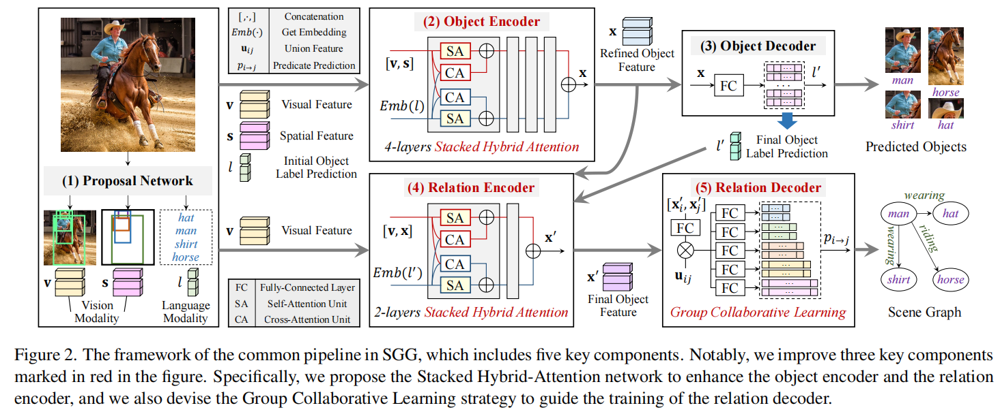
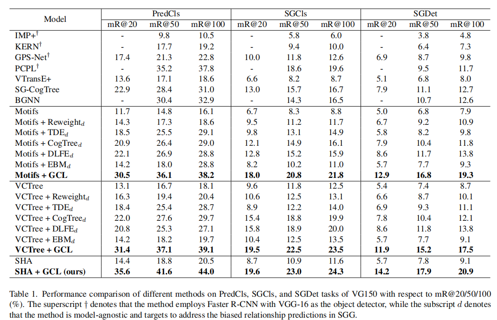
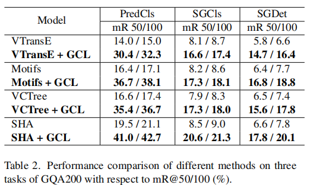
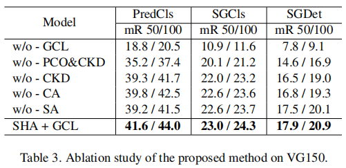
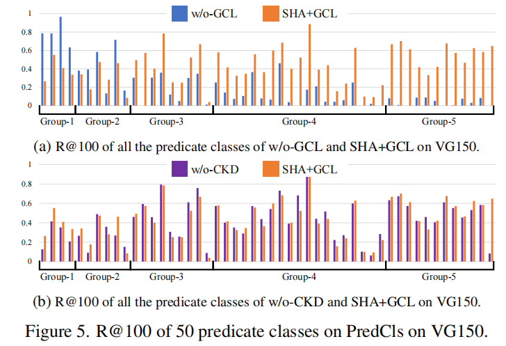
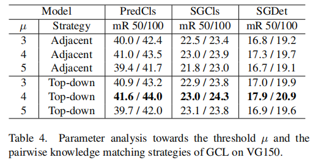

# Stacked Hybrid-Attention and Group Collaborative Learning for Unbiased Scene Graph Generation

## Abstract

场景图生成通常遵循常规的 Encoder-Decoder pipeline，其目的是首先对给定图像中的视觉信息进行编码，然后将它们解析成一个紧凑的摘要图。

现有的 SGG 方法不仅忽视了视觉和语言之间难以融合的特点，而且也没有能够提供信息谓词，导致 SGG 难以在现实当中使用。

为此，我们首先提出了一种堆叠混合注意力网络作为编码器，有利于在模态内的细化和多模态交互的实现。

然后，我们设计了一个全新的 Group Collaborative Learning 策略来优化解码器。特别是，我们发现一个分类器的识别能力会因为极度类别不平衡的数据集所局限之后，我们首先提出了一种分类器组能够很好地区分不同类别的所属的子集，然后从两方面共同优化它们从而提高无偏 SGG 的性能。

在 VG 和 GQA 数据集上的实验表明，我们不仅建立了一种新的 SOTA 方法，并且在两个 baseline 上有大概双倍的性能提升。

## Introduction

::: info Motivation

SGG is still far from satisfactory for practical applications due to the insufficient modality fusion and the biased relationship predictions.

由于模态融合不足和偏置关系预测不足，SGG 在实际应用中还远远不能令人满意。

:::

SGG 的目标是将所有物体以及物体之间的关系组织成一个图的形式。SGG 作为一种中间视觉理解任务，可以有利于各种视觉和语言任务，包括跨模态检索、图像字幕和视觉问题回答。然而，**由于模态融合不足和偏置关系预测不足，SGG 在实际应用中还远远不能令人满意。**

虽然明显证明将语义线索（物体类名的语言先验）到视觉内容（物体 proposal）可以显著提高生成能力，最近的大多数方法只是融合这些视觉和语义特征通过直接求和或 concat，限制模型进一步推断他们的交互信息。为了解决视觉内容和语义线索之间的模态融合不足，我们的目标是通过共同探索 intra-modal 和 inter-modal 交互来加强编码器，如图1所示。

为了实现这个想法，我们设计自注意力模块和交叉注意模块来分别捕捉 intra-modal 和 inter-modal 的信息。然后我们将这两个模块搭配使用后就变成 Hybrid-Attention (HA) 层，并且通过堆叠多个 HA 层来构建我们的 encoder。所提出的堆叠混合注意(SHA)网络可以充分探索多模态交互作用，从而提高关系预测性能。所提出的堆叠混合注意 (SHA) 网络可以充分探索多模态交互作用，从而提高关系预测性能。

**现有的 SGG 方法所面临的另一个主要问题是由于 long-tail 数据分布产生的是有偏的关系预测。**由于只有少数 head 谓词（例如：on, has 等词汇）拥有多样和各种各样的实例，它们将主导训练的过程，并以输出较少信息的 tail 谓词（例如：riding, watching 等）主导输出场景图，很难适应其他的下游任务。虽然已经提出了各种去偏置方法，但它们很容易导致 tail categories 的过拟合和 head categories的大量牺牲，从而导致另一个极端。在某种意义上，我们推测这种困境可能源于这样一个事实，即一个朴素的SGG模型，无论传统的或去偏的，都只能区分训练实例数量相对相等的有限谓词范围。

直觉上来说，由于单个分类器为了能实现比较合理的预测结果需要做出一些其他牺牲，我们可以把偏置谓词类别分成几个平衡的子集，然后引入更多的分类器来分类它们并且最终利用这些分类器共同解决这一问题。

实现这种类似分治的思想，我们提出了 Group Collaborative Learning 策略，分成三个步骤：

1. 分解

   单个分类器足以区分在一个平衡数据集的类别，我们首先把所有谓词根据训练集分成一组相对平衡的组。如 Fig 1

2. 处理

   我们借鉴类别增量学习的想法，为了让所有的分类器遵循一个连续递增的分类空间，即，每个分类器将通过合并一组新添加的谓词来扩展之前的分类空间。除此之外，我们设计了中值 resampling 策略，为每个分类器提供了相对平衡的训练集。基于这种组增量配置，这些嵌套的分类器可以平衡地处理其分类空间内的谓词，因此它们更有可能学习可区分的特征表达，特别是对新添加的组。

3. 整合

   我们利用这些分类器能够从两个方面共同增强无偏的关系预测。

   - 首先，我们提出了 Parallel Classifier Optimization (PCO) 来联合优化所有的优化器，这样的操作可以认为是 “弱约束”，由于我们希望收集到所有梯度信息来他提高每一个分类器的识别能力。
   - 其次，我们设计了 Collaborative Knowledge Distillation (CKD) 来确保之前学习到的区分能力可以很好地转换到后续的分类器中。这可以认为是 “强约束”，因为我们要求每一个分类器模仿其原始的预测行为。

   通过这两个约束条件，我们有效地减轻了对 tail categories 压倒性的惩罚，同时也补偿了对 head categories 的欠拟合。

本文的主要贡献：

- 我们提出了一种新的 Stacked Hybrid Attention 来加强 SGG 中的编码器，它解决了未被探索不足的模态融合问题。
- 我们设计了 Group Collaborative Learning 策略来优化 SGG 中的解码器。特别是，我们部署了一组分类器，并从两个方面对它们进行了协同优化，从而有效地解决了棘手的偏置关系预测问题。
- 在VG和GQA数据集上进行实验，实验表明，我们不仅达到了五偏置指标的新指标，而且在使用我们的模型无关的 GCL 时，与两个典型基线相比，我们的性能几乎提高了两倍。

## Related Works

### SGG

SGG通过将视觉关系解码为摘要图，为我们提供了一种**场景理解**的有效方法。

早期的方法主要致力于**整合来自不同模式的更多特征**，但它们忽略了丰富的视觉背景，导致了次优的性能。

为了解决这一缺陷，后来的方法采用了更强大的特征细化模块对**丰富的上下文信息进行编码**，如 passing strategy、sequential LSTMs、graph neural networks、self-attention networks。虽然在常规指标中性能得到了改善，但**由于有偏差的训练数据** (biased training data)，他们预测的关系往往微不足道，信息较少，这很难支持下游的视觉和语言任务。

因此，人们提出了各种方法来处理有偏关系预测，包括使用去除有偏差关系 (debiased relationships) 策略，如 resampling 或 re-weighting，从 biased 关系表示变成 unbiased 关系表示，以及利用树结构来过滤不相关的谓词。

然而，这些方法很容易在 tail categories 上进行过拟合，而在 head categories上做出了很大的牺牲。基于观察到单个分类器很难区分 biased 数据集中的所有类，并受到 “divide-conquer-cooperate” 的启发，我们提出了 Group Collaborative Learning 策略来指导解码器的训练。这样，我们不仅显著提高了对 tail categories 的预测性能，而且有效地保留了对 head categories 学习到的识别能力，从而实现了合理的预测权衡。

### Cross-attention Models

**改进多模态融合和构建 cross-attention 模型**的研究越来越引起了人们对各种**视觉和语言任务的兴趣。**

Yu et al. 等人在 VQA 领域提出了 deep Modular Co-Attention 网络来增强问答词汇和图像区域之间的交互和关联。

Lu et al. 提出 ViL-BERT 联合预训练图像和文字。

然而，SGG中很少有方法致力于解决对象建议和相应类名之间不充分的模态融合。

因此，我们提出了 Stacked Hybrid Attention (SHA)网络，以促进 intra-modal 和 inter-modal 交互。

### Knowledge Distillation

知识蒸馏的目的是将知识从一个较大的深度网络中提取成一个较小的深度网络，广泛应用于各种任务，包括模型压缩、标签平滑和数据增强。

请注意，传统的知识蒸馏方法通常遵循师生关系的 pipeline。这两个网络在不同的时间段中进行了优化，因为教师网络通常是事先可用的。与这种 model-to-model 范式不同的是，在添加了多个分类器后，我们允许之前的分类器生成输出作为软标签来约束后续的训练，从而建立一个层到层的“知识转移”。

## Methodology

### Problem Formulation

SGG 的目标是生成一个摘要图 $\mathcal G$，以高度一般化给定图像I的内容。为此，我们首先检测图像 $\mathcal I$ 中的所有对象，表示为 $O=\{o_i\}^N_{i=1}$。然后对于每个物体对 $(o_i, o_j)$，我们预测它的谓词$p_{i→j}$。最终，我们将所有这些预测以三元组的形式组织起来来构造场景图，它可以表示为 $G=\{(o_i，p_{i→j},o_j)|o_i,o_j\in\mathcal O,p_{i→j}\in\mathcal P\}$，其中 $\mathcal P$ 代表所有可能的谓词的集合。

### Overall Framework



- Proposal Network

  给定一个图像 $I$，它生成一组物体预测结果 $O=\{o_i\}^N_{i=1}$。对于每个物体 $o_i$，它提供了一个视觉特征 $v_i$、一个边界框坐标的空间特征 $s_i$，以及一个初始物体标签预测 $l_i$。

- Object Encoder

  目的是获得细化的物体特征 $x_i$，用于进一步的预测，其计算方法为：
  $$
  \bold x_i=Enc^{obj}([\bold v_i, FC(\bold s_i)],Emb(l_i))
  $$
  $Enc^{obj}(\cdot)$ 表示 object encoder，用来优化特征的模块（例如：BiLSTM、GNN 等），$[,\cdot,]$ 表示 concat 操作，$FC(\cdot)$ 表示全连接层，$Emb(\cdot)$ 表示基于其初始物体的标签预测结果 $l_i$ 来获取 $o_i$ 的语义特征的预先训练好的语言模型。（从标签映射到语言模型的特征映射）

- Object Decoder

  目的是基于细化的物体特征 $x_i$ 获得最终的对象标签预测 $l'_i$，计算结果为：
  $$
  l'_i=\text{argmax}(Softmax(Dec^{obj}(\bold x_i)))
  $$
  $Dec^{obj}(\cdot)$表示 object decoder，它是一个单一的全连接层。

- Relation Encoder

  用于获得谓词预测结果的最终物体的特征 $x'_i$，其计算方法为：
  $$
  \bold x_i=Enc^{rel}([\bold v_i,\bold x_i], Emb(l'_i))
  $$
  $Enc^{rel}(\cdot)$ 表示 relation encoder，和 object encoder 的结果基本相同

- Relation Decoder

  负责基于最终输出的 subject $o_i$ 和 subject $o_j$ 预测谓词标签 $p_{i\rarr j}$，计算方法如下：
  $$
  p_{i\rarr j}=\text{argmax}(\text{Softmax}(Dec^{rel}(\bold x'_i, \bold x'_j, \bold u_{ij})))
  $$
  $Dec^{rel}$ 表示 relation decoder。我们也加入了 物体对 $(o_i,o_j)$ 的 union feature $\bold u_{ij}$ 增强谓词预测的效果。

  值得注意的是，我们改进了 Fig 2 中用红色标记的三个关键组件提高无偏的 SGG 的效果。具体来说，对于 Object Encoder 和 Relation Encoder，我们提出了 Stacked Hybrid-Attention (SHA)网络来缓解模态融合不足的问题。对于 Relation Decoder，我们设计了 Group Collaborative Learning (GCL)策略来解决棘手的偏置关系预测问题。

### Encoder: Stacked Hybrid-Attention

除了理解给定图像的视觉内容（对象建议）之外，语义线索(参考SGG中的类名)对于稳健的关系预测也是必不可少的。但是大多数的 SGG 方法只是简单地通过直接求和或者 concat 融合两个模态之间的特征，这可能不足以挖掘潜在的 intra-modal，从而导致次优的性能。

为了解决这个问题，我们提出了整合了多层 SHA 层的 Stacked Hybrid Attention 网络。每一个 SHA 层包括两个并联的 Hybrid-Attention (HA) 单元，每一个 HA 单元由两种 attention 单元组成，例如：Self-Attention 单元提高 intra-modal 的细化能力，Cross-Attention (CA) 单元提高 inter-modal 交互。

根据 Fig 3，SA 和 CA 都是建立一个 multi-head 注意力模块和一个基于注意力机制的前向反馈传播网络。SA和CA的区别在于输入特征是否属于同一模态。

最终，我们通过按顺序级联 L-SHA 层来构建 SHA 网络。对于第 $l$ 层 SHA 层，特征传播过程可以表述为：
$$
\begin{cases}
\bold X^{(l)}=SA(\bold X^{(l-1)})+CA(\bold X^{(l-1)},\bold Y^{(l-1)}) \\
\bold Y^{(l)}=SA(\bold Y^{(l-1)})+CA(\bold Y^{(l-1)},\bold X^{(l-1)})
\end{cases}
$$
其中，$SA(\cdot)$ 和 $CA(\cdot)$ 分别表示自注意力和交叉注意力计算。对于第一个 SHA 层，我们设置其输入特征$\bold X^{(0)}=X$和 $\bold Y^{(0)}=Y$，其中 $\bold X$ 和 $\bold Y$ 分别表示原始视觉特征和语义特征。在得到最后一个 SHA 层生成的最终视觉特征 $\bold X^{(L)}$ 和语义特征 $\bold Y^{(L)}$ 后，我们将它们进行汇总，得到细化的输出，其中包含丰富的多模态交互信息。

### Decoder: Group Collaborative Learning

如上所述，面对一个极其不平衡的数据集时，一个普通的 SGG 模型很难对所有谓词达到满意的预测效果。为此，我们的目标是部署几个分类器，让不同谓词子集的分类器区分对应的谓词，并让这些分类器共同处理 biased 关系预测。基于这种“分-治-合作”的意图，我们提出了 Group Collaborative Learning  (GCL)策略。如 Fig 4 所示，GCL 包含以下五个关键步骤：

1. Predicate Class Grouping

   目的事为了将不平衡分布的数据集分成多个相对平衡的组，然后对所有的分类器配置对应的分类空间。基于我们观察到检测能力会受到偏数据分布的影响，我们的目标是为每个分类器提供一个相对平衡的训练集，从而可以充分学习对谓词子集的区分表示。

   因此，我们首先根据谓词类的训练实例的数量按降序排序，得到一个排序的集合 $\mathcal P_{all}=\{p_i\}^M_{i=1}$。然后，我们根据预定义的阈值 $\mu$ 将 $\mathcal P_{all}$ 划分为 $K$个互斥组 $\mathcal P^K_{k=1}$。算法 1 总结在工作流中，其中 $Count(p_i)$ 表示谓词 $p_i$的训练实例数量。算法 1 中的第3行确保对于每一组 $\mathcal P_k$，最大训练实例的最大数量将不超过最小数量的 $\mu$ 倍，因此 $\mathcal P_k$ 中的谓词共享的数量相对相等。

   ```
   Input: A sorted predicate set Pall = {pi}^M_{i=1}, m
   Output: K mutually exclusive groups {Pk}^K_{k=1}
   Set cur = 1, k = 1, and P1 = {}; 
   for i ← 1 to M do
   	if Count(pcur) > m ∗ Count(pi) then
   		cur = i;
   		k = k + 1;
   		Set Pk = {};
   		end
   	Pk = Pk ∪ {pi}
   end
   ```

   然后，我们借用了类别增量学习的想法，并部署了一组分类器 $\{\mathcal C_k\}^K_{k=1}$，它遵循一个不断增长的分类空间。除第一个分类器 $\mathcal C_1$ 外，其他分类器应该识别之前和当前组的谓词类，即 $\mathcal C_k$ 中的分类空间为$P'_k=P_1∪P_2∪···∪P_k$。注意，我们只选择最后一个分类器 $\mathcal C_K$ 来在评估阶段获得最终的谓词预测

2. Balanced Sample Preparation

   平衡样本准备的目的是通过重新采样实例来实现为进一步联合优化提供的几个平衡训练集。对于每个包含新添加的组 $\mathcal P_k$ 来扩展之前的分类空间 $\mathcal P'_{k−1}$ 作为 $\mathcal P'_k=\mathcal P_k∪\mathcal P'_{k−1}$ ，我们期望它可以充分学习对谓词的区别表示，特别是在新添加的组 $\mathcal P_k$ 中。因此，对于 $\mathcal P_k$ 组中的谓词，我们应该保留其所有的训练实例，以促进收敛。对于之前的分类空间 $P'_{k−1}$ 中的谓词，由于它们在原始数据集中有更多的样本，我们应该对它们的训练实例进行欠样本，以避免有偏差的预测。

   为了实现上述的方法，我们提出了中值 resampling 策略。对于每一个分类空间 $\mathcal P'_k$，我们首先计算 $\mathcal P'_k$ 内所有类的中值 $Med(\mathcal P'_k)$。（如：如果 $\mathcal P'_k$ 按降序排列，包含 9 个 谓词，则 $Med(\mathcal P'_k)=Count(p_5)$））然后对于 $\mathcal P'_k$ 中的每一个谓词类 $\mathcal P^k_i$，计算采样率为：
   $$
   \phi_i^k=\begin{cases}
   \frac{Med(\mathcal P'_k)}{Count(p_i)}, \bold{if} Med(\mathcal P'_k)<Count(p_i),\\
   1.0,\bold {if} Med(\mathcal P'_k)\ge Count(p_i)
   \end{cases}
   $$
   通过使用上述策略，每个分类器都将是区分谓词的能手，特别是在新添加的组中。例如，因为我们欠采样的实例组 3 训练 第 4 和 第 5 分类器，第 3 分类器更有可能实现更好的性能在区分谓词组 3，我们保留这组的所有样本让第 3 分类器充分学习鉴别特征表示。

3. Class Probability Prediction

   类别概率预测的目的是将采样实例解析为类别概率 logits，以进行进一步的损失计算和模型优化。对于中值 resampling 策略选择的物体对 $(o_i,o_j)$，在得到主体特征 $x'_i$、对象特征 $x'_j$ 及其联合特征 $u_{ij}$ 后，分类器 $\mathcal C_k$生成的类概率预测 $w^k_{ij}$ 计算如下：
   $$
   \bold w^k_{ij}=\text{Softmax}(FC([\bold x'_i,\bold x'_j])\otimes \bold u_{ij})
   $$
   $\otimes$ 表示逐元素相乘。

4. Parallel Classifier Optimization

   并行分类器优化的目的是通过联合优化所有的分类器来规范最终的分类器 $\mathcal C_K$。在训练阶段，对所有 $K$ 个谓词分类器的参数同时进行优化，其中目标函数可定义为：
   $$
   \mathcal L_{PCO}=\sum^K_{k=1}\frac{1}{|\mathcal D_k|}\sum_{(o_i,oj)\in\mathcal D_k}\mathcal L_{CE}(y_{ij}, \bold w^k_{ij})
   $$
    $\mathcal D_k$ 为中值重采样策略选择的物体对的集合，$|·|$ 为给定集合的长度，$y_{ij}$ 为对象对的地面真谓词标签 $(o_i,o_j)$，$LCE(\cdot)$ 为正则的交叉熵代价函数。并行分类器优化可以被视为组协作学习的 “弱约束”，因为我们期望从所有分类器中收集梯度将促进最终分类器 $\mathcal C_K$ 的收敛。

5. Collaborative Knowledge Distillation

   协同知识精馏旨在建立一种知识转移机制，以提高最终分类器 $\mathcal C_K$ 的无偏预测能力。如前所述，每个分类器都专门用来区分谓词，特别是在新添加的组中。为了保存和翻译这些学习良好的知识，以弥补头部类的欠拟合，我们提出了 Collaborative Knowledge Distillation (CKD)，其目标函数定义为：
   $$
   \mathcal L_{CKD}=\frac{1}{|\mathcal Q|}\sum_{(m,n)\in\mathcal Q}\frac{1}{|\mathcal D_n|}\sum_{o_i,o_j\in\mathcal D_n}\mathcal L_{KL}(\bold w_{ij}^m,\bold{\hat{w}}_{ij}^n)
   $$
   其中，$\mathcal Q$ 表示从分类器 $\mathcal C_m$ 到分类器 $\mathcal C_n$ 的成对知识匹配的集合 $(m<n)$。我们提供了两种备选方案，即相邻策略和自顶向下策略，来配置集合 $\mathcal Q$（这两种策略如 Fig 6 和参数分析所示）。注意，输出 $\bold w^n_{ij}$ 生成的分类器 $\mathcal C_n$ 包含新的谓词类不包括在前面的分类空间 $\mathcal P'_m$，我们利用 $\hat{w}^n_{ij}$ 表示切片输出通过切断的增量添加类不包括在 $\mathcal P'_m$，从而确保 $\hat{\bold w}^n_{ij}$ 和 $\bold w^m_{ij}$ 共享相同的维度。$\mathcal L_{KL}(\cdot)$ 是一种规则的 Kullback-Leibler Divergence loss ，定义为：
   $$
   \mathcal L_{KL}(\bold w_m,\hat{\bold w}_n)=-\sum^L_{l=1}\bold w^l_m\log\hat{\bold w}_n^l
   $$
   通过将分类器 $\mathcal C_m$ 之前的谓词概率输出 $w_{ij}^m$ 作为软标签，CKD 迫使当前的分类器 $\mathcal C_n$ 模拟 $\mathcal C_m$ 所擅长的预测行为，因此可以被视为一个“强约束”。最终，我们提出的 Group Collaborative Learning (GCL)的目标函数是PCO和CKD的结合，其定义为：
   $$
   \mathcal L_{GCL}=\mathcal L_{PCO}+\alpha\mathcal L_{CKD}
   $$
   其中，$\alpha$ 是衡量总损失 $\mathcal L_{GCL}$ 的预定义超参数。通过采用这两种约束类型的方法，我们有效地减轻了对 tail categories 的压倒性惩罚，并补偿了对 head categories 的不拟合，这有利于在谓词预测过程中建立合理的权衡。

6. 

## Experiments

- 数据集：VG, GQA
- 任务：Predicate Classification, Secen Graph Classification, Scene Graph Detection
- 指标：Recall@K, R@K, mR@K
- 实现细节：我们采用了一个预先训练好的更快的 RCNN[25]，由[30]提供的 ResNeXt-101-FPN[39] 作为对象检测器。我们使用 Glove[24] 来获得语义嵌入。对象编码器和关系编码器分别包含 4 个层和 2 个 SHA 层。我们设置部门阈值 $\multimap=4$，并采用自上而下的策略（每个分类器被迫学习预测行为的前辈，见图6的更多细节）构建成对知识匹配集 $q$ 超参数 $\alpha$ 平衡优化目标设置为 1.0。我们用 Adam 优化器优化所提出的网络，动量为 0.9。对于所有三个任务，总训练阶段持续 60,000 steps，batchsize 为 8。初始学习率为 0.001，我们采用与[30]相同的热身和衰减策略。所有实验均使用一个 RTX2080 Ti 进行。

### 与之比较的方法

我们想声明，我们提出的方法不仅在生成无偏场景图方面很强大，而且也适用于各种SGG方法。对于前者，我们将其与最先进的方法进行了比较，包括再生的 IMP+[40]、KERN[3]、GPS-Net[20]、PCPL[42]、再生的 VTransE+[49]和BGNN[17]。对于后者，我们采用了两个典型的基线，即 Motifs[47]和 VCTree[31]，以与其他模型不可知的方法进行公平的比较，如重新加权[4]，TDE[30]，CogTree[43]，DLFE[4]和EBM[29]。

表1和表2分别显示了在VG150和GQA200上进行的不同方法的性能。





我们有以下一些观察结果：

1. 我们提出的SHA+GCL在所有三个任务上都显著优于所有基线。据我们所知，我们的工作是第一次在PredCls上突破了mR@50和mR@100的40%的精度，我们也在 SGCls 和 SGDet 任务上达到最好的性能。
2. Motifs+GCL和VCTree+GCL与Motifs和VCTree相比，几乎是所有三个任务的平均回忆性能的两倍。结果表明，所提出的GCL是模型不可知的，可以在很大程度上增强无偏关系预测。
3. 与Motifs+GCL和VCTree+GCL相比，我们发现SHA+GCL有明显的性能提高。结果表明，所提出的SHA模块可以促进模态内细化和模态间交互作用，从而实现更准确的预测。总之，SHA+GCL有效地解决了SGG中的两个问题，即模态融合不足和偏倚关系预测。

### 消融实验

如前所述，我们提出堆叠混合注意(SHA)网络改进对象编码器和关系编码器，并提出集团协作学习(GCL)策略，采用并行分类器优化(PCO)“弱约束”和协作知识蒸馏(CKD)“强约束”，指导解码器的训练。为了证明上述组件的有效性，我们在VG150上对各种烧蚀模型进行了如下测试：

- w/o-GCL：为了评估 GCL 的有效性，我们让关系解码器为一个一层分类器，其中执行一个规则的交叉熵损失。
- w/o PCO&CKD：为了评估 PCO 在 GCL 中的有效性，我们消除了 PCO 损失和 CKD 损失，并且在优化步骤中只使用中位数重采样策略和规则的交叉熵损失。
- w/o CKD：为了评估 CKD 在 GCL 中的有效性，我们删除了CKD的损失，但保留了所有的分类器来计算PCO的损失。
- w/o CA或w/o SA：为了评估 SHA 的有效性，我们在每个 SHA 层中删除了交叉注意(CA)单元或自我注意(SA)单元。



表3为所有消融模型的结果。我们有以下几个观察结果：

1. 与w/o-GCL相比，SHA+GCL的性能几乎翻了一番。此外，在图 5a 中，我们比较了所有谓词类中 w/oGCL 和 SHAL+GCL 与 R@100 的关系。可以观察到，SHA+GCL 明显提高了大多数谓词类的性能，只有在组 1 和组 2 中，头部类有可接受的衰减，显示了生成无偏场景图的强大能力。
2. 与 w/oPCO&CKD 相比，w/o-CKD 明显提高了预测性能，表明“弱约束”，即从所有分类器中收集梯度，将有助于最终分类器的收敛。
3. 与 w/o-CKD 相比，我们看到 SHA+GCL 有明显的性能提高。此外，我们还比较了w/o-CKD和SHA+GCL对VG150上每个谓词类的详细精度。如图 5b 所示，CKD 有效地阻止了模型在头部类上牺牲很多东西，并实现了与尾部预测相当的性能。结果表明，“强约束”，即知识转移范式，可以通过保留先前学习到的识别能力，有效地补偿头部类的欠拟合，从而有利于实现合理的权衡。
4. 从表 3 的最后三行中，我们可以看到，无论是在删除 CA 单元还是 SA 单元时，性能都出现了明显的下降。验证了结合两种注意可以有效缓解模态融合不足，从而得到更准确的预测。



### 参数分析

如前所述，阈值 $\mu$ 和组织策略会影响 GCL 的效果。如图 6 所示，对于前者，我们设置了 $\mu=3, 4, 5$，并分别得到了 6, 5 和 4 个组的划分。对于后者，我们提供了两种选择，即相邻策略和自上而下策略，它们的区别在于每个分类器是可以从其最近的前任（相邻）还是从所有的前任（自上向下）学习知识。表4给出了性能比较，其中 $\mu=4$ 和自上而下的策略是最好的组合。



## Conclusion

在这项工作中，我们声明了两个限制SGG实际应用的问题，即模态融合不足和偏关系预测。为了解决这一缺陷，我们提出了堆叠混合注意网络和小组协作学习策略。这样，我们建立了一种新的最先进的无偏度量方法，并提供了一种模型不可知的去偏度量方法。在未来，我们计划探索更稳健的群体划分方法，并设计更多的知识蒸馏策略。
