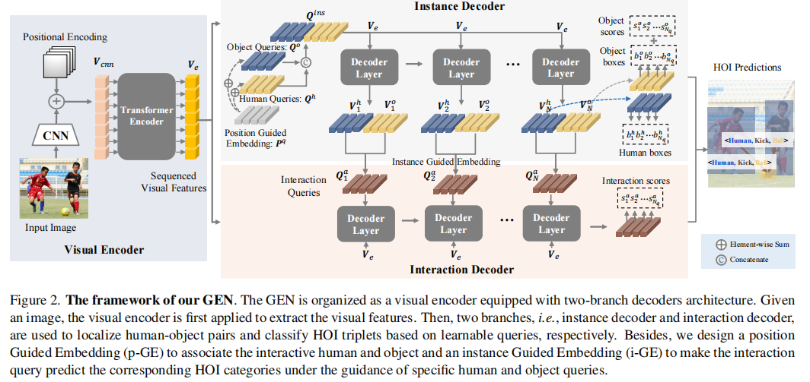
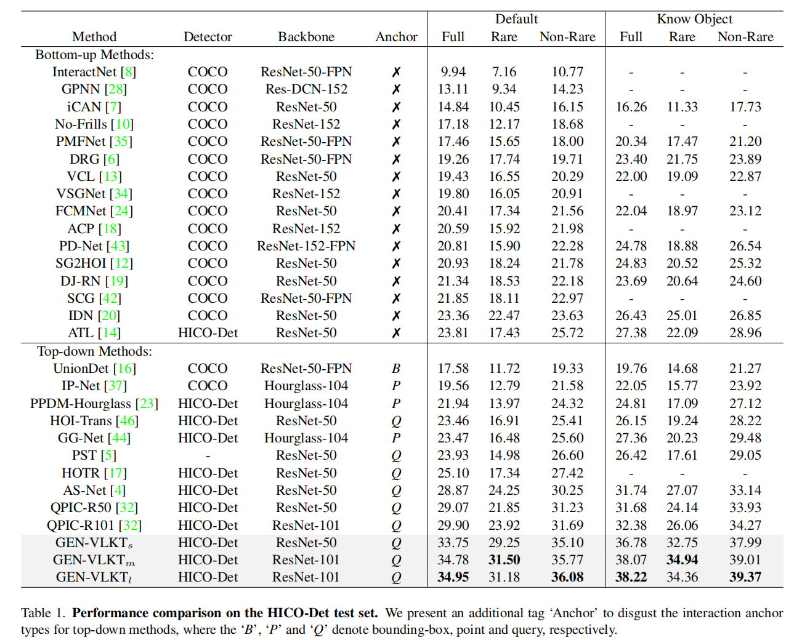
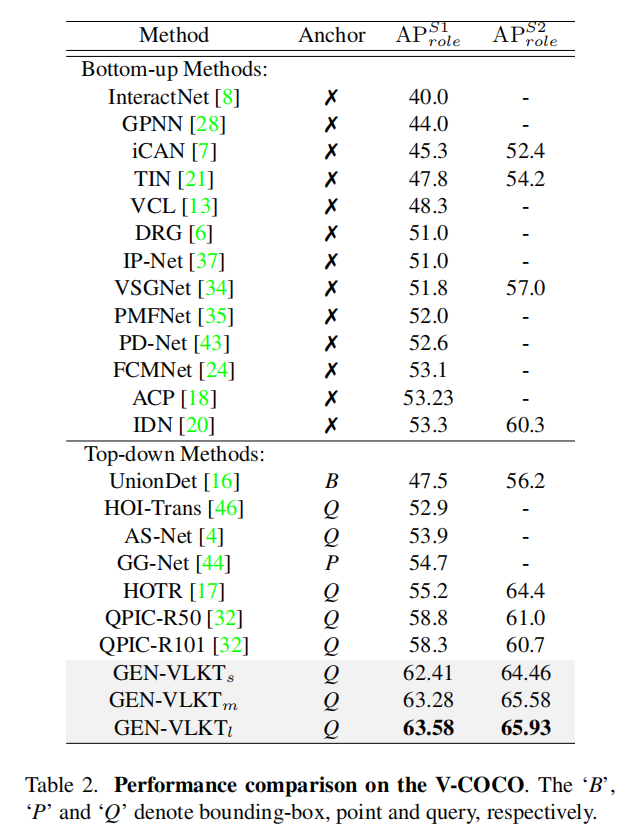
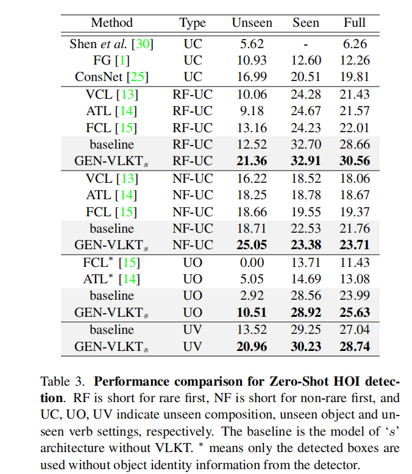
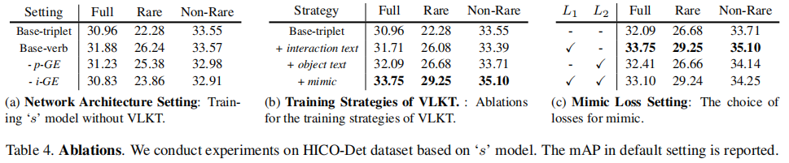

# GEN-VLKT: Simplify Association and Enhance Interaction Understanding for HOI Detection

## Motivation

1. 人和物关联任务：之前的 two-branch 方法存在时间复杂度高，后处理开销较大等问题。单分支会忽略不同任务之间的区别。
2. 交互理解任务：长尾分布和对于没见过的关系难以识别的问题。

## Information

对于人和物体之间的关联，通常分为两种模式：从上到下，从下到上

1. 从下到上：首先检测人和物体，然后通过分类器或者图模型来得到人和物体之间的关系。
2. 从上到下：首先会标记一个锚点，用来表示他们之间的关系。然后通过预先定义好的关系来关联人和物体。

Transformer 是一种 query-based 方法。主要分为两种流派：

1. 先预测再匹配：先通过 detector 检测出人和物体，然后再尝试设计更高效的匹配方法或者复杂的后处理方法。
2. 直接预测：基于多头的单个查询，以端到端的方式检测人、对象和相应的交互。

Mimic 策略？

CLIP 的优势？或者说知识蒸馏的优势？

## Summary

- 通过设计 two-branch 的方式实现 one-stage 的 HOI 检测。一个 encoder 和 两个 decoder (instance decoder 和 interaction decoder)

- 通过知识蒸馏的方式能够优化 long-tailed 分布所带来的问题。利用一些 visual-linguistic 的模型，本文是 CLIP，来填补 long-tailed 分布造成的问题。

- 实验

  消融实验数量不在于多，没有必要每一个点都验证，但关键是验证自己的改进是否有效，比如加入这个模块和不加入这个模块怎么样。也不用交叉验证加哪两个模块就有效，只需要验证指定的那一点即可。

## Introduction

HOI 检测任务是要使得机器能够理解图像上的人类活动。在这个任务中人类活动可以被表示为 <Human, Object, Verb>。所以 HOI 检测器需要定位人和物体的位置并且识别他们之间的关系。

对于 HOI 检测最核心的问题是要找一种方法，怎么样能够通过人和物体之间联系起来，并且理解他们之间的行为活动 (Verb)。因此，我们从两方面考虑优化 HOI 检测器。

- 得益于 Transformer 模型的发展，query-based 的方法有效地提高了 HOI 检测的性能。目前主要被分成两种流派：

  - 先预测再匹配：先通过 detector 检测出人和物体，然后再尝试设计更高效的匹配方法或者复杂的后处理方法。(two-branch)
  - 直接预测：基于多头的单个查询，以端到端的方式检测人、物体和相应的交互行为。(single-branch)

- *human detection and object detection*

  为了提高 two-branch 的性能，我们提出了一种不用复杂的后处理方式的 two-branch方法，如图 1a。我们提出了 Guided Embedding Network (GEN)，使用一个 visual encoder 和两条 decoder 分支 (instance decoder 和 interaction decoder)，和设计了一种指导性的 embedding 机制，利用预先定义好的交互行为作为指导。我们可以将任务分解成三个部分：human detection, object detection, interaction understanding。human detection 和 object detection 主要是根据他们相应区域内的特征进行预测。interaction understanding 主要是根据 人的 posture 或者 context 进行预测。

  - Instance Decoder

    对人和物体设计了两个独立的 query 集合。除此之外，我们还提出了一种位置 GE (position Guided Embedding, p-GE)，通过分配在相同位置上的 human query 和 object query 来分辨不同 <人, 物体> 这样的 tuple。

  - Interaction Decoder

    我们设计了一个 instance Guided Embedding (i-GE)，用来生成每一个特定的人和物体的 queries 所得到的 interaction queries 来预测 HOI 关系对。

  因此，GEN 可以让不同的特征来应对不同的任务，并且在网络前向传播的时候不需要任何的后续处理操作就可以进行 association 的操作。

- *Interaction Understanding*

  因为传统的多标签分类器等类似的方式都会有 long-tailed 数据分布和 zero-shot 难以识别的问题（因为在现实常见中人类活动太多太过于复杂了。）虽然现阶段通过数据增强或者设计 loss 能够减轻这些问题，但是 performance 的提升仍然受限于训练规模、数据集。

  为了提高这个性能，我们设计了一个 Visual-Linguistic Knwoledge Transfer 模型，如图 1b。训练策略是将知识从 CLIP 上转移到 HOI detector 来增强 *Interaction Understanding*，这样不用增加额外的开销。所以我们从两个主要的问题进行考虑。

  - 整合先验知识的 Text-driven 的分类器

    对于 text-driven 的分类器和视觉特征对齐，我们提出了一种知识蒸馏的方法来指导 HOI 检测的视觉特征来模拟CLIP 特征。因此，基于 VLKT 我们可以很好地捕捉 CLIP 当中的信息，同时还能够在预测的时候不增加额外的计算成本从而简单地扩充 HOI 类别。

  - zero-shot HOI discovery

    首先将每一个 HOI triplet 标签转换成短语，然后基于 text encoder CLIP 提取他们的 text embedding。最后我们使用所有 HOI triplet 标签的 text embedding 来初始化分类器的权重。

    通过这样的方式，我们能够非常简单地通过添加 text embedding 到矩阵里面来扩展 HOI triplet 的种类。同时，我们使用 CLIP 初始化过的物体分类器来扩展新的物体检测。

## Related Works

:::info

我们的目的是探索应用视觉语言预训练模型的交互理解。

:::

- HOI Detection

  1. 引用 3,6,7,10,18,19,21,22,24,35,38,45 是自下而上的方式，首先检测所有的人和物体，然后再关联人和物体，通过额外的分类器来预测他们的 HOI 类型。这些方法都是 two-stage 的模式。
  2. 基于图结构的方法，引用 28,34,36,40,45 实现了较好的性能。但是计算开销比较大，因为要处理大量的人和物体的 triplet。
  3. 引用 4,16,17,23,32,37,46 是自上而下的方法。自上而下的方法主要是为了给关联人和物体设计额外的 anchor。交互 anchor 是从早期的交互点 [23,37] 和 union box[16] 到最近的交互 query [4,17,32,46] 与 visual transformer 的发展。
  4. CDN 是一种 one-stage 的方法。用级联的 decoder 来发掘出 two-stage 和 one-stage 的 HOI detector。我们的 GEN 是不同 CDN 的方法。

- Zero-shot HOI Detection

  引用 1,11,13,14,15,25,27,30,33,39 发现了一些方式解决 zero-shot HOI detection。

  1. 引用 1,11,30,33 通过对 verbs 和 object 的分解推理，对人的特征和 subject 特征进行分解，然后在推理过程中产生新的 HOI trplets。
  2. VCL [13] 将分解后的 object 和动词特征与成对图像和图像内部相结合，组成了新的 HOI 样本。
  3. FCL [15] 提出了一个 object 生成器来为罕见的和 unseen 的 HOI 生成虚假的对象表示。
  4. ATL [14]从额外的 object 图像中探索 object 的启示，以发现新的 HOI 类别。
  5. ConsNet [25] 明确地将 object, action 和 interaction 之间的关系编码到一个无向图中，以便在 HOI 类别及其组成部分之间传播知识。Visual-Linguistic 模型[27,39] 将可见的视觉短语 embedding 与先前的语言知识转移到 unseen 的HOI中。

- HOI Detection with Visual-Linguistic Model

  一个HOI triplet 可以看作是一种结构性的语言描述，因此将语言先验知识整合到 HOI 检测中是一种很自然的思想。

  1. 引用 6,17,27,43 是传统的方法，专注于挖掘 inductive bias 作为一种成对的频率先验方式，或仅仅利用单词 embedding 作为附加特征。
  2. 引用 26,29,31 利用大规模的预训练 visual-linguistic 模型展现出了强大的性能和泛化能力。

## Methods

### Guided Embedding Network

:::info

具有简单的关联机制的单阶段双分支 HOI 检测器

:::

Interaction Decoder 可以在人和 object query 的指导下预测相应的 HOI 类别。

- Visual Encoder

  是一个 CNN Transformer 的结构。输入图像 $I$ 经过 CNN 提取特征得到 $V_{cnn}\in\mathbb{R}^{H'\times W'\times C'}$，之后压缩特征到 $C_e$ 个通道，随后打平成 $(H'\times W')\times C_e$，最后输入到 Transformer encoder 并提取 sequenced 视觉特征 $V_e\in\mathbb{R}^{(H'\times W')\times C_e}$

- Two-branch Decoder

  这两个分支中的解码器共享相同的架构，我们遵循基于 Transformer 的检测器[2,4]，采用基于 query 的 Transformer 解码器框架。

  首先，我们将一组可学习的查询 $Q\in R^{N_q\times C_q}$，最后一层的输出，视觉特征 $V_e$ 和 位置编码 $P^q$ 输入到 $N$ 个 transformer 解码器层，并在自注意和共注意操作后输出更新后的查询。然后使用单独的FFN 头，将查询转换为其专用任务的 embedding，即分别由第一条解码器分支和第二条解码器分支进行的实例和交互表征。

  - instance decoder

    通过初始化的 human 和 object queries，分别把位置编码 $P^q$ 加到这两个 query 当中，最后进行 concat 得到 $Q^{ins}$。
    $$
    Q^{ins}=[Q^h+P^q,Q^o+P^q]
    $$
    最后输入到 decoder 预测得到 human-object 的 bbox 对 $(b_i^h,b_i^o,s_i^o)$，$b_i^h\in B^h,b_i^o\in B^o,s_i^o\in S^o$，分别表示 人的 bbox，物体的 bbox 和预测是某一类物体的分数。将得到的特征 $V^h$ 和 $V^o$ 进行 concat 开始预测他们之间的 interaction。

  - interaction decoder

    这个分支需要将 interaction query 与 human-object query 对关联起来，并对 interaction 进行分类。在这里，我们将为关联引入一个实例引导 embedding（i-GE）方法。 通过动态生成 interaction query 的方式来引导 interaction query 匹配 人和物体 queries。第 $k$ 层 interaction decoder 的可以这样计算得到：
    $$
    Q^a_k=(V_k^h+V_k^o)/2
    $$
    然后再解码其特征得到 interaction 的特征 $V_k^a$。 

### Visual-Linguistic Knowledge Transfer

:::info

采用大规模的视觉语言预训练模型 CILP，以增强第3.2节中的交互理解。

:::

通过从大规模的 visual-languistic 预训练模型进行知识迁移。主要分为两个步骤，先经过 CLIP 文本 embedding 来分类 interaction 和物体，然后再将 visual 知识从 CLIP 图像 embedding 迁移到 interaction decoder 中。

- Text Embedding for Classifier Initialization

  因为 CLIP 和 HOI 检测的任务不同，所以要先将 HOI triplet 转换成文本描述，对于一个 triplet <Human, Object, Verb> 可以转换成 “A photo of a person [Verb-ing] a/an [Object]”，对于物体标签，可以转换成 “A photo of a person and a/an [Object]”。

  然后通过预训练的 CLIP text-encoder 来对每一个 HOI triplet 和 object text label 生成 text-embedding。最后得到 text embedding $E^a\in\mathbb{R}^{c_t\times N}$ 和 $E^o\in\mathbb{R}^{c_t\times N_o}$。$N_a$ 和 $N_o$ 分别表示 HOI  triplet 类别和物体类别的数量，$c_t$ 表示从 CLIP 文本编码器中 text embedding 的维度数。

  通过这些先验的 text embedding 来指导对 interaction 和 object 的分类。所以要采用 text embedding 来初始化分类器的权重，采用这种 embedding 来初始化可学习分类器的权重，并以较小的学习率对分类器进行微调，以适应特定的数据集。通过这种方式，计算每个输出查询特征与所有精细化文本嵌入的余弦相似度，并在分类过程中返回一个相似度得分向量。

  具体地说，我们将交互分类器和对象分类器分别表示为 $\mathcal{C}^a\larr E_a$ 和 $\mathcal{C}^o\larr E_o$。以交互分类器 $\mathcal{C}_a = [w^a_1,w_2^a,...,w^a_{N_a}]$ 为例，给出一个输出交互查询 $v_i^a$，我们通过以下方法计算相似度得分：
  $$
  s^a_i = \theta[\text{sim}(v_i^a, w^a_1), \text{sim}(v_i^a, w_2^a), \cdots , \text{sim}(v_i^a, w^a_{N_a})]
  $$
  其中sim表示余弦相似度操作，例如 $\text{sim}(v_i^a,w^a_1)=(v_i^a\cdot w^a_1)/(vi akk wa 1 k)$，θ是CLIP [29]之后的logit比例因子。对象的分类化分数也可以用同样的方法得到。否则，我们遵循[32]分别应用焦点损失和交叉熵损失来训练交互分类器和目标分类器。

- Visual Embedding Mimic

  CLIP 对 图像-文本对数据进行训练，并将 visual embedding 和 text embedding 对准到一个统一的空间中。我们设计了一种 visual embedding Mimicking 机制，通过拉开交互特征与剪辑视觉嵌入之间的距离，将交互特征拉到这样一个统一的空间中。Teacher 模型是 CLIP，Ineteraction Decoder 扮演 Student 的角色。由于 CLIP 图像编码器是建立在整个图像之上的，因此我们从全局图像级设计了知识蒸馏策略。

  :::danger
  
  将 CLIP 作为其中的大模型专门学习 Visual Embedding，给后面的小模型提供特征信息。将大模型的信息传递给小模型。
  
  :::
  
  我们首先将调整后和裁剪后的图像输入预先训练好的 CLIP visual encoder，并提取 visual embedding $\hat v_{clip}$ 用于教师监督。通过在所有输出 interaction query 特征之间进行平均池化来生成全局的 student visual embedding。$L_1$ 损失是用来拉开学生和老师之间的距离。我们将全局知识的蒸馏方法表述为：
  $$
  \mathcal{L}_{glo}=|\hat v_{clip} - \frac{1}{N_q}\sum_{i=1}^{N_q}v_i^a|
  $$
  $N_q$ 表示 query 的数量。

### Training and Inference

- Training

  损失函数表示为：
  $$
  \mathcal{L}_{cost}=\lambda_b\sum_{i\in(h,o)}\mathcal{L}^i_b+\lambda_u\sum_{j\in(h,o)}\mathcal{L}_u^j+\sum_{k\in(o,a)}\lambda_c^k\mathcal{L}_c^k
  $$
  其中，$\lambda_b,\lambda_u$ 和 $\lambda^k_c$ 是调整每个损失权重的超参数。然后，考虑到模拟损失，最后的训练损失为：
  $$
  \mathcal{L}=\mathcal{L}_{cost}+\lambda_{mimic}\mathcal{L}_{glo}
  $$
  其中，$\lambda_{mimic}$ 是用于提取图像 embedding 的超参数权重。此外，我们对每个解码器层的输出应用了一个中间监督。

- Inference

  visual embedding minic 只对训练阶段有贡献，在推理过程不使用 mimic。对于 human-object bbox 对 $(b^h_i,b^o_i)$，都有预测概率得分 $s_i^o$，从 instance decoder 得到。来自 instance decoder 分支的 interaction 的预测概率得分 $s^a_i$。

  然后，我们将 $s^o_i$ 从 $N_o$-dim 扩展到 $N_a$-dim，其中特定对象类别的分数将对所有对应的 HOI 类别复制粘贴几次。HOI triplet 分数是用 $s^a_i + s^o_i(N_a)s^o_i(N_a)$ 而不是 $s^a_i s^o)i(N_o)$ 来平衡交互分数和对象分数的权重。top-k 置信度得分的 HOI triplets 经过 triplet NMS 处理之后作为最终结果。

## Experiments

### Setting

- 数据集

  - HICO-Det

    47,776 张图像（38,118 张用于训练，9,658 张用于测试）。它包含由 80 个对象类别和 117 个动作类别构造的600类 HOI triplet。

  - V-COCO

    COCO 数据集的一个子集，有 10396 张图像（5400 张用于训练，4964 张用于测试）。它有 29 个动作类别，其中包括 4 个身体运动，不与任何物体交互。它有相同的 80 个对象类别。它的动作和对象构成了 263 类HOI triplets。

- 评价指标

  - mAP

- 其他细节

  （见原文 4.1 节）

### Results

#### HICO-Det

#### V-COCO

#### Zero-shot

### Ablation Study

本文从三个层面来考虑消融实验：

- 网络结构设置

  - 我们实现了两个没有 VLKT 的常规训练策略的基本模型。

    - 我们遵循之前的基于 query 的方法，对 GEN 采用了一个具有 117 个类别的动词分类器，即表 4a中的 “Base-verb”。（31.88 mAP）

    - 我们将动词分类器替换为 600 个 triplet 分类器，即“Base-triplet”。（drop mAP compare with “Base-verb”）

  - 探讨了 GEN 中各部分成分的重要性

    - 我们删除了 p-GE，并将独立的人和物体的 query 替换为 “Base-verb” 中的两个任务的统一 query。（drop 0.65 mAP）
    - 我们删除了 i-GE，并使用一个可学习的 embedding 和随机初始化一个由 p-GE 生成的 interaction query，用于 “Base-verb” 中的 interaction query。（drop 1.05 mAP）

- VLKT 的训练策略

  验证 VLKT 的有效性，在表 4b。Baseline 是 “Base-triplet”。

  - 将 interaction 分类器换成 text embedding initialization。（“Rare” improved a lot）

    **这样做可以缓解 long-tailed 分布带来的问题**

  - 加入 text embedding driven object 分类器（improved 0.38 mAP）

  - 给 visual knowledge 迁移的 CLIP 添加 mimic loss（improved a lot）

- Mimic 损失设置

  讨论选用 mimic loss 类型，$L_1$ 或者 $L_2$ 损失，结果在表 4c。

  - 只使用 $L_1$（improved 1.66 mAP，最优选）
  - 只使用 $L_2$（improved a lot）
  - 同时使用 $L_1$ 和 $L_2$（drop a lot）

## Conclusion

提出了一种全新的框架，提高 query-based HOI detector，从两方面入手：

- association

  设计了一个 two-branch 的网络结构，用 GEN 代替后处理的匹配过程。

- interaction understanding

  新的训练策略 VLKT，采用 CLIP 来增强 interaction understanding。

GEN-VLKT 在 HICO-Det 和 V-COCO 数据集上的常规和 zero-shot settings 上取得了领先的性能。我们进行了一次关于 CLIP 的简单尝试，其中仅对 visual feature mimic 采用全局知识蒸馏可能不足以完成密集的理解任务。在未来，我们的目标是进一步挖掘 CLIP 对 HOI 检测的好处，并改进 mimic 策略。
