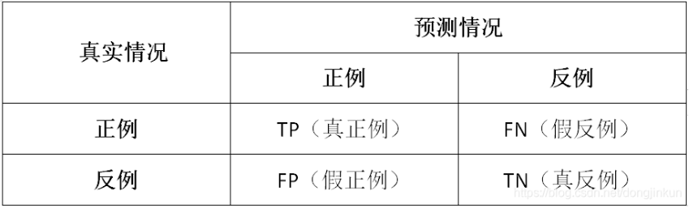

# TP, TN, FP, TN 区别

## 基础概念

- TP：被模型预测为正类的正样本
- TN：被模型预测为负类的负样本
- FP：被模型预测为正类的负样本
- FN：被模型预测为负类的正样本

## 理解

以西瓜数据集为例，我们来通俗理解一下什么是TP、TN、FP、FN。

TP：被模型预测为好瓜的好瓜（是真正的好瓜，而且也被模型预测为好瓜）
TN：被模型预测为坏瓜的坏瓜（是真正的坏瓜，而且也被模型预测为坏瓜）
FP：被模型预测为好瓜的坏瓜（瓜是真正的坏瓜，但是被模型预测为了好瓜）
FN：被模型预测为坏瓜的好瓜（瓜是真正的好瓜，但是被模型预测为了坏瓜)

## Precision 和 Recall

- Precision: 准确率，看查找得准不准，准确的程度有多少。
  $$
  P=\frac{TP}{TP+FP}
  $$
  

- Recall: 召回率，看查找得全不全，是不是包括所有要找的。
  $$
  R=\frac{TP}{TP+FN}
  $$

## Reference

- [(193条消息) TP、TN、FP、FN超级详细解析_奋斗の博客的博客-CSDN博客_tp,fp,tn,fn](https://blog.csdn.net/dongjinkun/article/details/109899733)