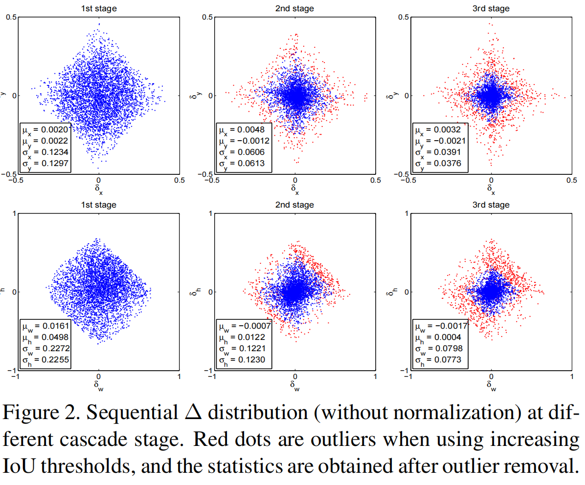
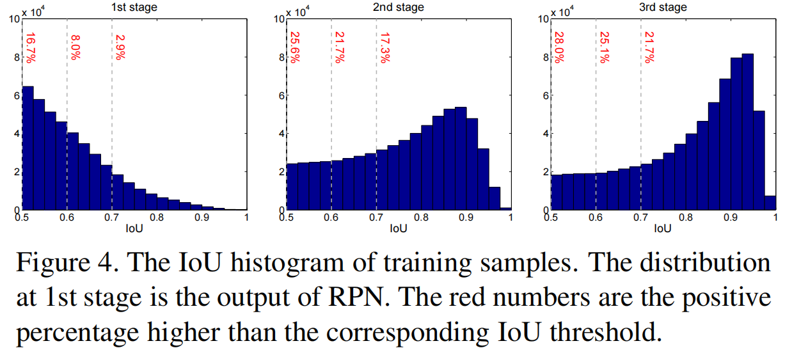
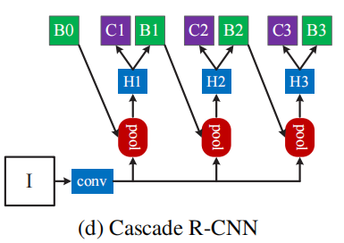
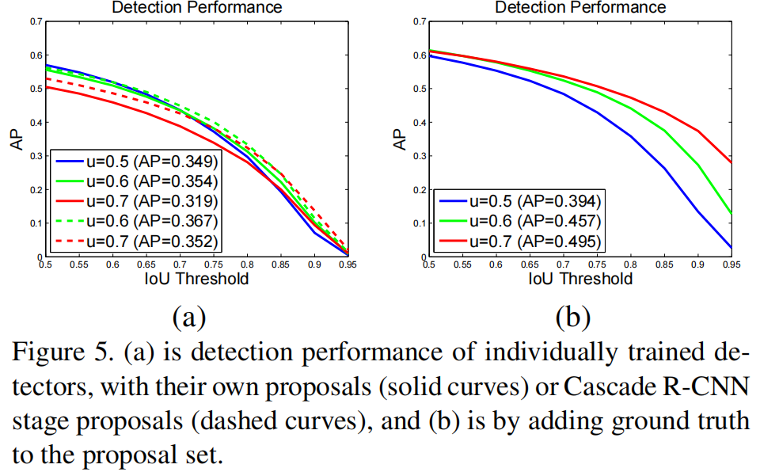
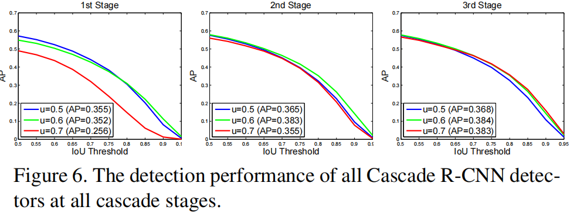
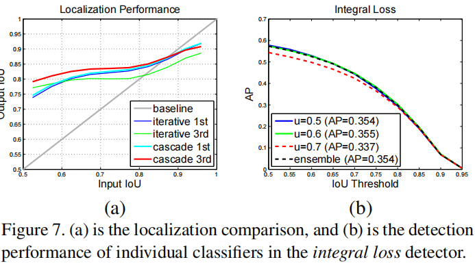
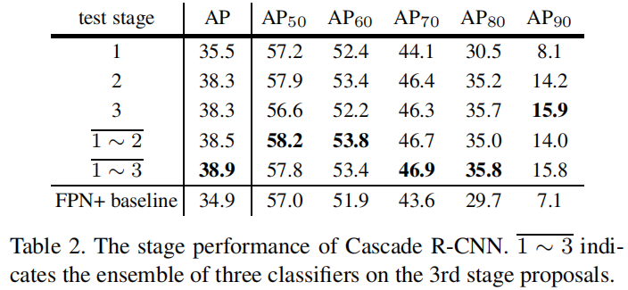
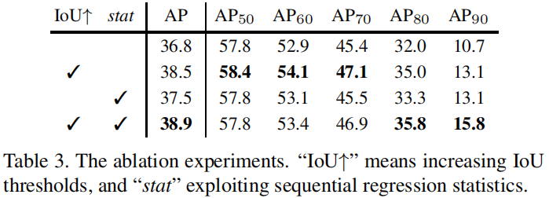
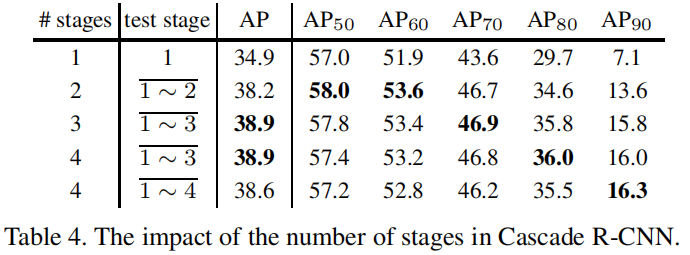

# Cascade R-CNN: Delving into High Quality Object Detection

## Abstract

:::info

1. **hypotheses**：假设，猜想；在文中可以理解为：proposal，object candidate 或 pred bbox，以下就不中文翻译此词了；
2. close false positives：缩写close FP，指目标检测任务中与 ground true 很靠近，却属于 false positives，很容易被检测器**误检为正样本的负样本**，也即 “close but not correct” bbox；

:::

在目标检测当中，IoU 是决定正样本和负样本的重要参数。同时，检测的性能会随着 IoU 与阈值的提高而下降。造成这样的原因主要有两个：

1. 训练中由于正样本呈指数级消失导致过拟合。提高了 IoU 阈值导致满足这个阈值条件的 proposal 比之前少了，容易导致过拟合。
2. 推理时，检测器最优的 IoU 阈值 和输入的 proposal 之间不匹配（mismatch 问题）

为了解决以上两个问题，本文提出了以下几种方式解决：

1. 本文的网络结构是把经过不同 IoU 阈值训练的检测器组合在一起，对 close FP 有更强的鲁棒性。分多个阶段来训练检测器，用上一个检测的输出的分布作为输出，输入到下一个检测器以便能够训练更高的检测器。
2. 逐步改进 proposal 的重采样，保证所有的检测器都有一组相同大小的正样本集，减少过拟合的问题。
3. 在推理过程中同样使用级联操作，使得 proposal 和每个阶段的检测器的输出结果之间更加匹配。

在 COCO 数据上，本文算法超过了所有单模型的目标检测算法，还可以将本文算法迁移到其他目标检测算法时，作为 baseline  也能够取得性能上的提升。

## Introduction

目标检测主要解决两个任务：

1. recognition：检测器要解决 recognition 的问题，把前景目标从背景力提取出来，并且给予正确的类别标签。（一般来说，人脸检测只需要把前景从背景提取出来即可，通用的目标检测需要给出准确且清晰的类别）
2. localization：检测器要解决 localization 的问题，给前景目标预测出正确的 bbox 位置。

解决这两个任务会面临海量 “close” false positives （像正样本，但是不是正样本 FP），而且还会和 TP 混淆，不仅要检测出 TP 还要抑制 close FP。

现在大多数都是使用 two-stage 的方式实现目标检测，也就是同时完成 分类 + bbox 回归的 multi-task，IoU 阈值用来定义生成的正负样本，使用 $u$ 值表示 IoU 阈值，通常来说 $u = 0.5$ 对正样本来说条件比较宽松，像 figure 1 (a) 中会产生许多噪声 bbox。人眼能够判断为 close FP 的 proposal 可以通过使用 $IoU \ge 0.5$ 的方式来约束，尽管使用 $IoU=0.5$ 可以生成数量足够多且多样化的正样本，但是也会导致 close FP 的生成，导致检测器很难区别 close FP 和 TP。

:::tip

- **hypothesis 的质量**：hypothesis 与 ground true 的 $IoU$；

- **detector 的质量**：用于训练该 detector 的 $IoU$ 阈值 $u$；

:::

为了能够实现 figure 1 (b) 的效果，输出要尽可能减少 close FP，本文主要探索在给定什么 IoU 阈值的情况下能够达到最优的效果，而不是考虑降低 FP 的数量。

figure 1 (c) 和 (d)展示了在 IoU 阈值 u = 0.5、0.6、0.7 下，训练的检测器在 localization 和 detection 上的性能，fig 1(c)为 localization 性能，基于输入 / 输出 proposals 与ground true 的 IoU 评估（三条彩色线都在baseline的灰色线之上，说明检测器输出的结果对于输入而言，性能还是有提升的），figure 1 (d)为 detection 性能，使用COCO中经典的动态调整 IoU 阈值得到不同 AP 性能的方案。

figure 1 (c) 中，每个 bbox 回归器只有在训练时给定 IoU 阈值的情况下才对应最佳的检测性能，直到过拟合。从 figure 1 (d) 中可以看出，$u = 0.5$ 训练的检测器在低 IoU 阈值下，性能优于 $u = 0.6$，但在高 IoU 阈值下，性能低于 $u = 0.6$，同理 $u = 0.7$；这说明如果仅使用单一的 IoU 阈值训练检测器，其并不能在各个 level 的 proposals 上都取得最佳性能。（检测器在低 IoU 的情况下训练能够让其知道如何把不准确的 proposal 大幅度调整到和 ground true 匹配，但对于高质量的 proposal，主要稍微调整就可以和 ground true 匹配）

上面得出了一个**结论**：不同质量的 proposal 最好使用不同分支进行操作，对于不同质量的 proposal 需要在不同 IoU 阈值的情况下训练才能更好地和 ground true 以及对应的 proposal 匹配。

通常来说，一个检测器只能在单一的 IoU 阈值下面进行优化，并不会其他 IoU 阈值下达到最优。

所以，为了训练更高质量的检测器，只是简单提高训练过程中的 $u$ 值是远远不够的。正如 figure 1 (d) 所说的 提高 $u$ 值会降低检测性能。问题在于：

1. 政府样本分布不均衡，如果再提升 IoU 阈值来筛选样本，正样本的数量会大幅度呈指数级减少，导致样本更不均衡了，同时也导致模型过拟合。
2. 经过 figure 1 (c)，可以看出，看个检测分支经过特定 IoU 阈值下取得的样本训练后，若检测的 hypothese 也处于该 IoU 的范围内就可以获得较优的检测效果。反之，如果该分支作用在其他 IoU 阈值下获得的只能是次优的效果。也即在训练、测试阶段，不同 IoU 阈值下获取的样本训练的检测分支效果不同。

所以对于整个检测网络来说，最优的方式应该是：在低 IoU 阈值的情况下训练低质量的 hypotheses，经过 refine 后，低 IoU 阈值的分支无法处理高质量的 hypotheses，此时把高质量的 hypothese 交给高 IoU 阈值的分支进行训练，使其恰好能够 match，可以做进一步 refine。（通过观察figure 1 (c)中各区间段性能就可以发现，不同IoU分支最适合处理其对应训练IoU下的hypotheses。）

另一个主要的不同之处在于本文使用了 resampling 不是为了挖掘难以区别的负样本，相反，是通过调整 bbox 让每一个阶段都找到一组接近 close FP 的 stage 来 train 下一个 stage。这样做就可以解决过拟合的问题。

在推理过程中，使用与训练相同的级联操作。经过不同 IoU 分支训练之后提升的 hypotheses 可以更好在每个阶段提升检测的质量。

本文算法不仅可以吊打所有的单模型目标检测网络，在 COCO等更高评估标准上也同样能够吊打，还能够把本文的思想迁移到其他任意 R-CNN 的 two-stage 方法上，提升 2 ~ 4 个点效果非常显著。

## Related Works

基于 R-CNN 的 two-stage 目标检测算法，包含了 proposal detector + region-wise classifier 两步骤，同时完成分类 +  bbox 回归的 multi-task。

为减少 R-CNN 中的冗余计算，SPPNet、Fast RCNN 使用 region-wise feature extraction（空间金字塔pooling、RoI pooling），只需对图像单次前向卷积提特征，避免了多个 proposals 重复计算卷积提特征的高计算量，Faster R-CNN 采用 RPN 进一步提高提取 proposals 的速度且做到了整个检测框架的 end2end；

**R-FCN：**通过替换 RoI pooling 为 position sensitive RoI pooling，采用 region-wise 的全卷积替换 Fast R-CNN 中的 fc 层，将 Faster RCNN 中 2nd-stage 的 Fast RCNN 计算量进一步压缩，速度快，效果好；

**MS-CNN、FPN：**two-stage，在特征金字塔的多个分支上生成 proposals，可以有效避免 Faster R-CNN 中单个 feature map 上目标尺度与感受野尺度不匹配的问题，以达到 proposals 的高召回率；

**YOLO：**one-stage，对图像一次前向操作即可在 7 x 7 的 feature map 网格上得到检测结果，检测速度实时，且效果还不错；

**SSD：**one-stage，采用了 RPN 中预定义 anchor + YOLO 中同时输出 分类得分 + bbox回归 的思想，而且在特征金字塔 FPN 的多个不同分辨率分支上预测不同尺度目标，速度快，性能更好；

**RetinaNet：**one-stage，通过 focal loss 改进目标检测中 foreground / background 类别不平衡的问题，比 sota 的 two-stage 方法性能还要好；

**iterative bbox reg：**multi-stage，如fig 3(b)，通过对同一个 R-CNN 操作多次，以生成更高质量的 bbox；

**AttractioNet、CRAFT：**使用 multi-stage 操作生成更准确的 proposals，再用 Fast-RCNN 做进一步目标检测；

**Cascade CNN、CC-Net：**使用经典的 Cascade 方案完成人脸、目标检测；

## Object Detection

下面介绍目标检测所包含的任务。

- 第一阶段：在整张图像上使用 proposal 子网络 H0，生成最初的 proposal。
- 第二阶段：hypotheses 输入到 RoI 检测子网络 H1，表示检测头（detection head）
- 最终每个 hypotheses 得到一个分类分数 C 和 bbox 回归值 B

Cascade RCNN关注于multi-stage的检测子网络，proposals基于RPN（Region Proposal Network）生成。

### BBox 回归

一张图像 $x$ 上预测的 bbox 坐标：$\bold b = (b_x, b_y, b_w, b_h)$，bbox 回归任务：学习一个回归器$f(x, \bold b)$，将 $\bold b$ 尽量靠近 ground true bbox $\bold g$；训练流程通过训练样本集 $\{g_i, b_i\}$，最小化损失函数 $L_{loc}$ 实现：
$$
\mathcal{R}_{loc}[f]=\sum_{i=1}^NL_{loc}(f(x_i,\bold b_i), \bold g_i)
$$
$L_{loc}$ 在 R-CNN 中为 L2 loss，Fast R-CNN 中为 Smoothed L1 loss；为了保证回归对尺度、位置的不变性，一般 $L_{loc}$ 会操作向量 $\Delta=(\delta_x, \delta_y, \delta_w, \delta_h)$，处理方式表示为：
$$
δ_x = (g_x − b_x)/b_w,\ δ_y = (g_y − b_y)/b_h \\ δ_w = \log(g_w/b_w),\ δ_h = \log(g_h/b_h).
$$
$g$ 表示 ground true 对应的坐标，$b$ 表示预测出来的坐标。因为 refine 的幅度可能比较小，（2）中的数值也比较小，为了提升训练的效率，会对 $\Delta$ 做正则化，用 $δ_{x}' = (δ_x − \mu_x) / \sigma_x$ 替代 $\delta_x$。

还有一种观念认为，单个回归操作 **f** 并不能对 bbox 准确定位，那么在检测出 proposals 之后，可以叠加回归操作 **f** 若干次，作为 post-processing step 来更精确地调整 bbox：
$$
f'(x,\bold b)=f\circ f\circ f\circ\cdots\circ f(x,\bold b)
$$
这种方式也称为 *iterative bound ing box regression*，但所有的 head 都相同参数（即同一个 **f** ），但此操作会带来两个问题：

1. 如 figure 1 (c) 所示，一个回归器 **f** 在 u = 0.5 阈值下训练，那么仅对同样为 u = 0.5 范围内的 hypotheses 性能最佳，更高 IoU 对应的 hypotheses 在该同样的 **f** 下性能不是最好的，而且 观察 figure 1 (c) 可以看到，对于 IoU > 0.85 的 hypotheses，u = 0.5阈值下训练的 **f** ，refine 输出后性能竟然还下降了。
2. 如 figure 2 所示，bbox 向量内各元素数据的分布随着每个 stage 操作都会有很大变化，尽管最开始 u = 0.5 的回归器 **f** 对于该 hypotheses 的分布处理是最优的，但接下来两个 stage，很明显数据分布都改变了，再要求 **f** 同样能搞定它们就达不到好的效果。

经过不同阶段的训练，$\Delta$ 的大概分布如图，红点表示增加 IoU 阈值之后的离群值，剔除之后得到的数据。

### Classification

分类器 $h(x)$ 的目标是将一张图像 $x$，预测为 M + 1 个类别中的一个类，因为分类对应的是一个 $M+1$ 维的向量，所以基于各个类别的后验分布函数 $h_k(x)=p(y=k|x)$ 得到对应的类别。$y$ 就是类别。假设给定训练集 $(x_i, y_i)$，最小化优化的目标是：
$$
R_{cls}[h]\sum_{i=1}^NL_{cls}(h(x_i), y_i)
$$
$L_{cls}$ 一般用交叉熵损失函数。

### Detection Quality

目标检测一般使用 IoU 确定正负样本集，如果与某个 ground true 的 $IoU >  u$，那么 hypotheses 可以认为是该 ground true 类下对应的一个正样本，那么 hypotheses 的类标签是 $u$ 的函数：
$$
\begin{cases}
g_y, & IoU(x, g)\ge u \\
0,& \text{otherwise}
\end{cases}
$$
目标检测比较难搞的一个原因是，不管 IoU 阈值 u 如何设定，检测任务总是一个对抗互斥关系的（detection setting is highly adversarial）：

- $u$ 设置得高一点吧，正样本里 background 信息少，但对正样本的标准高了，正样本数量就少。
-  $u$ 设置得低一点吧，可以获得到更多样化，数量更多的正样本，训练的检测器就搞不定 close FP 。

另一种解决方案如 figure  3 (c)，集成若干个不同检测能力的检测分支，各个分支也设定不同的 $u$，损失函数也定位于学习各个分支的参数（optimized with a loss that targets various quality levels）：
$$
L_{cls}(h(x), y)=\sum_{u\in U}L_{cls}(h_u(x), y_u)
$$
$U：IoU$ 阈值集，如 $U = \{ 0.5, 0.55, ...,0.75 \}$，类似 *integral loss*，但可以发现各个分支是独立输出预测结果的，没有cascade的叠层进阶关系。最后融合各个分支的检测结果，得到最终的检测结果。

但此操作还是有这么个问题：IoU 阈值高的话，正样本依然不好收集，正负样本依然不平衡，就依然会对高 IoU 阈值下的检测分支产生过拟合。

从 figure 4 中可以看到，1st-stage 输入 hypotheses 由 RPN 生成，质量比较低（大部分都是IoU：0.5 ~ 0.6之间），随着 IoU 阈值的提升，对应直方图数据分布就减少，如果依旧用这些 hypotheses 训练 *integral loss* 的各个高 IoU 阈值分支，经过 u 筛选之后，原先低 IoU 阈值的分支的正样本就分类到负样本了，正样本更少，正样本更加不均衡。

## Cascade R-CNN

Cascade R-CNN  的结构如下图所示：

### Cascade BBox Regression

$$
f(x,\bold b)=f_T\circ f_{T-1}\circ\cdots\circ f_1(x, \bold b)
$$

$T$ 表示 Cascade RCNN 叠加的分支数；cascade 中每个分支 $f_t$ 通过各个分支上的训练数据 $\{ b_t \}$优化，$\{ b_t \}$ 来源于 $\{ b_1 \}$ 经过之前所有分支输出后的结果，而非直接使用 RPN 的初始分布 $\{ b_1 \}$ 来训练 $f_t$。；---- 这也是Cascade RCNN中经过进阶方式逐步提升hypotheses质量的精髓；

Cascade RCNN 与 iterative BBox 的不同之处在于：

1. iterative BBox 相当于一个提升检出 bbox 质量的后处理步骤，但 Cascade RCNN 中各个分支上的回归操作相当于在每一个阶段通过改变 hypotheses 的分布达到了**重采样**目的

2. Cascade RCNN 同时应用于 train + inference，两者实操过程在性能上不会有差异

3.  每个专门的检测分支 $\{ f_T，f_{T−1},\cdots ,f_1 \}$ 基于每个 stage 调整分布后的 hypotheses 进行训练，而 iterative BBox仅使用到了一个 **f** ，该 **f** 来自于 RPN 输出的初始化分布。

   优势：Cascade RCNN 随后的分支可以做更精细化的回归训练，预测也能得到更精准的定位结果，且不需要人为干预；

### Cascade Detection

如 figure 4(a)，RPN 输出的初始 hypotheses 质量还是比较低的，大部分都在 $u = 0.5 ~ 0.6$，Cascade RCNN 通过各个分支 cascade 式叠加达到对 hypotheses重采样的目的；同样受启发于figure 1(c)，三条彩色线都在 baseline 的灰色线之上，说明所有 $u$ 阈值下训练的检测器，输出的结果对于输入而言，性能还是有提升的。

给定初始hypotheses：$(x_i，\bold b_i)$，cascade 上检测分支对 $(x_i, \bold b_i)$ 一番操作，产生新的样本分布 $(x_i'，\bold b_i')$ 以适配更高 IoU 阈值下的检测分支，那么如 figure 4，经过每个 stage 的样本重采样工作，hypotheses 质量也变得越来越好，且即使 IoU 阈值和检测分支性能逐步提升，在所有 stage中正样本的数量大致保持在稳定范围内。

以上操作两个优势：

1. 不会出现因正样本过少带来的训练过拟合，如 fig 4，每个 stage 上正样本的数量都比较充足；
2. 更高 stage 上的检测分支使用更高 IoU 阈值下收集的样本训练，且从 fig 2 中可知，通过逐步提升的 IoU 阈值可以在各个 stage 上去除 outliers，就可以筛选到足够高质量的 hypotheses 用于训练各个分支；

每个 stage $t$，检测分支包含分类器 $h^t$ + 回归器 $f^t$，并使用 $IoU = u^t$ 阈值下收集的样本集，且 $u^t > u^{t−1}$，损失函数为：
$$
L(x^t, g)=L_{cls}(h_t(x^t), y^t)+\lambda[y^t\ge1]L_{loc}(f_t(x^t, \bold b^t), g)
$$
其中，$b^t = f^{t−1}(x^{t−1}, b^{t−1})$, $g$ 对应 $x^t$ 的 gt bbox，$λ = 1$ 表示权重因子； $[·]$ 表示只在正样本上算 reg loss，$y^t$就是 $x^t$ 按照公式 (5)和 $u^t$ 计算出的 label。

与公式(6)中 iterative BBox 的 loss 不同之处在于，公式 (7)、(8) 确保各个检测分支的检测质量逐步提升。

在预测阶段，hypotheses 随着 cascade 上各个检测分支的操作，质量逐步提升，且更高质量的 hypotheses 刚好对应基于更高 IoU 阈值训练的检测分支，最终就产生 fig 1(c)、(d)中检测性能越来越好的效果。

## Experiment

### Baseline Networks

三个baseline检测器：

1. Faster-RCNN：VGG 作主干网；原始 frcnn 中 2nd-stage 的 Fast RCNN 有连个 fc 层，本文做了精简以减少参数数量，每个 fc 层输入 2048 个单元，无 dropout，128 RoIs / images；
2. R-FCN：ResNet 作主干网；R-FCN 基于 ResNet 使用全卷积操作完成 分类 + bbox回归（Cascade RCNN 的 head 与之保持一致），无 OHEM，256 RoIs / images；
3. FPN：ResNet 作主干网；使用了 RoIAlign，实验中表示为 FPN+，主干网 ResNet-50 用于消融实验，最终预测使用 ResNet-101，256 RoIs / images；

都使用原论文中默认训练参数，采用end2end训练；

### Quality Mismatch

如 fig 5(a)，三个独立训练的检测器在阈值 U = { 0.5，0.6，0.7 }下的AP，可以发现 u = 0.5 下训练的检测器，在低 IoU 条件下性能优于 u = 0.6 下训练的检测器，但高 IoU 条件下 u = 0.6 的性能更好，u = 0.5 的检测器性能最差；---- **但终究都是IoU阈值越高，检测器的AP性能越差；**

fig 5(b)：改变了预测阶段 proposals 的质量：将 ground true bbox 也加入至 RPN 输出的初始化 proposals 中，可以发现所有阈值 u 下训练的检测器性能都有提升，且 u = 0.7 下性能提升最明显，说明两个问题：

1. u = 0.5下训练的检测器并不利于精准地检测目标，仅仅在低质量 hypotheses 下表现出色；
2. 若想得到高精度的检测结果，就需要 hypotheses 质量更能匹配上检测分支的质量；

fig 5(a)中虚线：将初始化的 proposals 替换为 Cascade R-CNN 中 2nd（u = 0.6）、3rd（u = 0.7）输出的更高质量proposals，**结果也说明了测试阶段当 proposals 的质量与检测器更匹配时，其性能会显著提升。**

从 Cascade RCNN 的所有 stage 上做性能测试，得到的结果也大致类似，如 fig 6 中可知，当使用更高质量 hypotheses 时，各个检测器性能提升明显，特别是高 IoU 阈值下训练的检测分支，性能提升得更夸张；例如：u = 0.7的检测器在低质量 proposals 的 1st-stage 性能很差，但 2nd、3rd-stage 若输入了更高质量的 hypotheses，u = 0.7 的检测器性能提升也很明显；

此外，对比 fig 6 与 fig 5(a)，尽管使用了相同的 proposals，fig 6 中基于 cascade 方式进阶训练的检测器，性能明显优于 fig 5(a) 中各个分支独立训练的检测器，这充分说明了，Cascade RCNN 这种通过进阶 boosting 改变训练数据分布的方式，训练的检测器性能更好；

### Comparison with Iterative BBox and Integral Loss

我们比较了我们的方法和 Iterative BBox、Integral Loss 方法。Iterative Loss 方法是使用 FPN+ 持续迭代三次实现。Integral Loss 有相同数量的 heads，分别对应 $U=\{0.5, 0.6, 0.7\}$

**Localization**

fig 7(a)：Iterative BBox 与 Cascade RCNN 在定位性能上的比较；

Iterative BBox 中，1st-stage 在高 IoU 的 hypotheses 输入时，其输出性能竟然下降了（低于 baseline 的灰色线），且在 iterative BBox 的 3rd-stage 分支下，其性能进一步下降。但 Cascade RCNN 中 3rd-stage 性能优于 1st-stage，且在所有输入 IoU hypotheses 情形下，输出的 hypotheses 性能都优于 Iterative BBox；

**Integral Loss**

Integral Loss Detector：与 Cascade RCNN 相同数量的 cls heads，性能如 fig 7(b)；u = 0.6 下检测器性能最好，u = 0.7 下性能却最差，且即使所有检测器 ensemble，性能也没显著提升；

Table 1 中，iterative BBox / integral loss / Cascade RCNN 三者性能都优于 FPN+的baseline，且随着 AP 标准的提升，Cascade RCNN 的领先优势更明显；

### Ablation Experiments

**Stage-wise Comparison**

table 2 为针对 stage 的消融实验，可以发现仅融合 1st-stage 性能就优于 baseline（受益于 multi-stage multi-task 的训练方式），2nd-stage、3rd-stage 也可以进一步提升性能，并且可以发现不同于 integral loss，更高的 IoU 检测分支，性能是提升的；最终三个检测分支 ensemble 后性能最好；

**IoU Thresholds**

row 1：baseline 版 Cascade RCNN，所有检测分支的 head 使用同样 IoU 下收集的样本训练，各个 stage 的差异就仅体现在输入 hypotheses 的差异上（参照 fig 1(c)、fig 2，各个 stage 输入还是有区别的，但大致与 fig 2 中一致）；但从 row 1 中可以看到，尽管各个分支在同 IoU 下收集的样本，但cascade结构还是提升了 baseline 性能，充分证明了 cascade 结构之优越性；

row 2：通过进阶提升 IoU 阈值 u 的方式，各个分支可以获得更多的 close FP 用于训练，进而可以提升更多的检测精度，结果与 4.2 小节分析保持一致；

**Regression Statistics**

如 fig 2，进阶地探索回归的统计结果有利于 cls + reg 的 multi-task 学习，从 table 3 中也可以看到该方案的优势，但作者提到：The learning is **not sensitive** to these statistics，为什么我觉得还是有区别的？

**Number of Stages**

table 4 中针对 stage 的消融实验，对比 baseline，增加一个 stage 性能提升明显 (34.9% -> 38.2%)，增加两个 stage 性能提升更明显，但增加三个 stage（u = 0.75）性能却还下降了，此外可以发现 4th-stage 的 AP 性能尽管降低了，但却在AP90下性能依然是最好的；

总结下来，3-stage 是性能 / 速度的最佳 trade-off；

### Comparison with the Sota

table 5，Cascade RCNN + FPN+ + ResNet-101 的 single-model 检测器，RoIs 数量：512；

table 5 中group 1：1-stage检测器；group 2：2-stage；group 3：3-stage；所有其他检测器在 u = 0.5阈值下训练，从frcnn + FPN+ 拓展成 Cascade RCNN，性能提升 4% (38.8% -> 42.8%)，从table 5中可以发现，Cascade RCNN 在 single-model 下，各个指标都是 sota；

AttractioNet：multi-stage，通过 Iterative BBox 生成 proposals，但性能还是比 Cascade RCNN 差了 7.1%，且 Cascade RCNN 不像 Mask R-CNN 那样，还需要使用分割的监督信息；

### Generalization Capacity

Faster RCNN、R-FCN、FPN+上都添加了3-stage的Cascade R-CNN结构，性能对比如table 6；

**Detection Performance**

从 table 6 中可以发现，添加 Cascade RCNN 结构后，三个 baseline 都能在 val / test-dev 上获得 2 ~ 4% 的性能提升，充分说明 Cascade RCNN 的普适性。

**Parameter and Timing**

随着 cascade 检测分支数量的增加，模型的参数也会增大，但对于 baseline head 来说，**检测分支数量增加带来的模型参数增加却是线性的**，此外各个检测分支的计算量一般远远小于 RPN 层，因此 train / test 阶段，Cascade RCNN 的计算量带来的额外开销都比较少；

## Conclusion

1. 我们提出了一个 two-stage 的目标检测框架，Cascade R-CNN，用于检测高质量的 proposal
2. 这个架构避免了训练过程中过拟合和推理过程中 quality mismatch 的问题
3. Cascade RCNN 在 COCO 上的高性能充分说明，通过理解和掌握影响目标检测的各种小因素，并作出一丢丢小改进，也会有很大的性能提升空间；
4. 本文算法可以应用在更多目标检测算法上，可以作为一个很好的 baseline