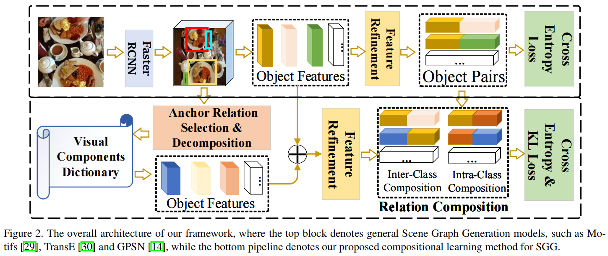
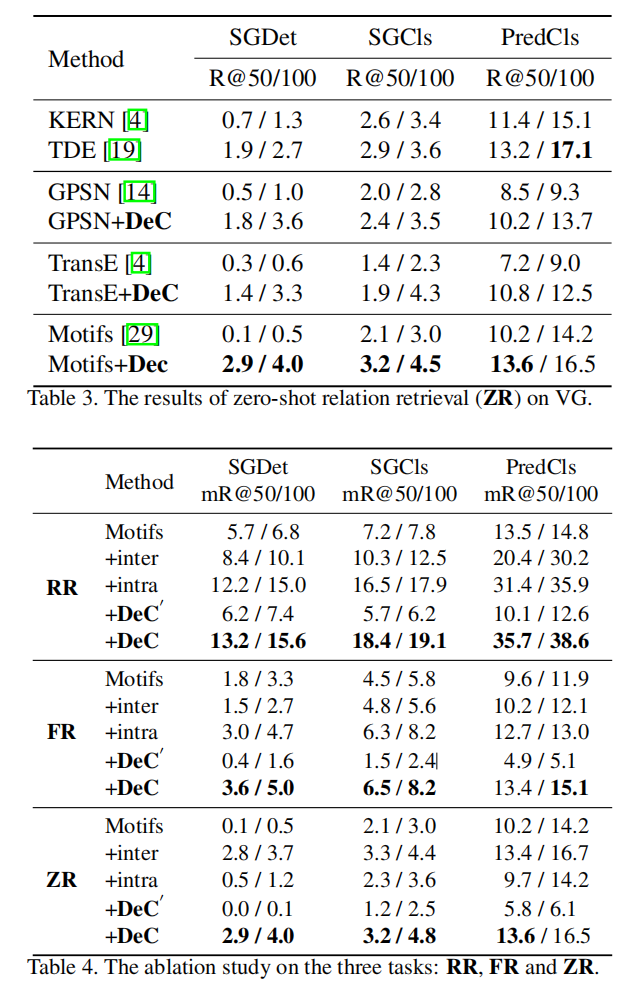

# Semantic Compositional Learning for Low-shot Scene Graph Generation

## Abstract

问题（Motivation）：

- 许多场景图生成（SGG）模型只能使用有限的注释关系三元组进行训练，导致它们在 low-shot（few and zero）场景中表现不佳，特别是在罕见的谓词上。

解决方案：

- 提出了一种新的语义组合学习策略，使与来自不同图像的物体构建额外的、现实的关系三元组。
- 我们的策略通过识别和去除不必要的组件来分解一个关系三元组，并通过与 visual component dictonary 中的语义或视觉上相似的对象融合来组成一个新的关系三元组，同时确保新组成的三元组的真实性

总结：

- 对于最近的三种SGG模型，添加我们的策略将它们的性能提高了近50%，并且所有它们的性能都大大超过了目前的最先进水平。

## Introduction

场景图生成 (SGG) 是一个基本任务为许多下游应用程序在计算机视觉，包括视觉描述[26,25]和 VQA[21,2]，SGG 可以提供这些任务与一个特定的关系图的图像，这使得下游模型进行高级图推理生成的场景图和进一步捕获更全面的信息。一般来说，一个场景图 (SG) 可以表示为一组关系三元组，即 <主体、谓词、物体>，或简单的 <s, p, o>。据观察，

在真实世界的数据集中，一些谓词，例如 flying in，是极其罕见的。此外，可能的关系的数量随着主体、物体和关系的数量的乘积而增长。在大规模数据集中有数百个主体/物体，可能有数百万个可能的关系。这些因素使得场景图的生成更具挑战性。

具体来说，正如最近的一项研究[29]所示，在广泛使用的视觉基因组数据集[12]中，有150个对象类别和50个不同的关系。因此，关系三元组的组合总数超过 100 万张，而训练图像的总数只有 50,000 张左右。这一事实导致了一个艰巨的挑战，即大多数关系三元组可能只有少数样本，尽管相应的谓词有许多样本。

:::info 举例

在 Visual Genome (VG) 数据集中，谓词属于超过 3000 个样本。但是，如果我们关注每个三元组关系的样本数量，可以观察到大部分样本属于 <man, sitting on, chair>，但只有几个样本是 <man, sitting on, car>。因此，即使一个模型可以很好地分类前者，它也可能会失败在罕见的关系三元组上，如 <man, sitting on, car>。

:::

此外，我们还观察到给定一个关系三元组，在许多情况下，主语和宾语对谓词的影响是不同的。

:::info 举例

例如，如图1(a)所示，即使我们从图像中删除了滑板，我们仍然可以猜测谓词可能会 standing on，因为 standing on 更与主体相关，而不是其物体本身。也就是说，主体的姿势主要决定了谓词，而物体的视觉外观特征几乎没有什么影响。

:::

在此基础上，我们设计了一个框架，首先将三元组关系的表示分解为两部分：重要的和不重要的，同时将它们的相关性分配到谓词上，然后通过将重要元素与另一个潜在对象融合来组成一个新的关系。具体来说，这样做有三个好处：

1. 对于这些罕见的关系，我们的方法可以生成足够的样本来进行有效的学习。以罕见的关系三元组 <man, sitting on, car> 为例，很明显，目标 car 扮演了一个不重要的角色，因此当我们改变汽车实例与其他车实例时，谓词仍然是 sitting on。幸运的是，VG 数据集有许多具有广泛的视觉外观特征的汽车实例，包括颜色、形状和纹理。因此，通过分解和组合运算，我们可以为关系  <man, sitting on, car>  生成许多额外的三元组，从而缓解了这些罕见关系在训练集上数据分布不均衡的问题。
2. 我们的策略可以解决 zero-shot 关系识别的具有挑战性的任务。具体地说，我们的方法可以通过将基本元素与来自语义上相似的物体类别的实例融合来组成新的关系三元组。例如，在 VG 数据集中，没有关系三元组 <man, sitting on, train>，但在实践中，虽然这种关系很少发生，但它确实存在于一些电影中。大多数现有的 SGG 模型[29,19,20,24,23]很可能将这个谓词预测为不是一种关系，因为这些模型在训练集中没有看到这种三元组。在我们的方法中，我们首先分解三元组 <man, sitting on, train> 分成两部分：人和车，然后组成新的关系，关系的三元组融合的基本的人与实例语义相似的物体类别，如火车和船，两者都属于载具。在此之后，我们的模型可以用那些新合成的、数据集中原本不存在的三元组进行训练，从而解决 zero-shot 关系检测问题。
3. 我们的策略可以与现有的 SGG 模型无缝集成，因为我们的策略只涉及关系构建，而其他特征学习策略，如[29,30,14]可以继续使用。图1(b) 强调了我们的模型对 R@100 的罕见谓词的有效性。它绘制了我们提出的方法和两个竞争模型对 15 个最罕见关系的性能比较结果，其中 TDE[19] 是之前的最好模型。可以明显地看到，两种比较方法对罕见关系的处理都很差 ( R@100 值接近0)，而我们的模型在所有这些关系上都表现得明显更好。

本文所做的贡献：

- 我们首先提出了一种新的场景图生成分解和合成策略，解决了关键的低镜头和零镜头关系检测问题。此外，我们的方法可以无缝地插入其他SGG模型，并显著提高它们的性能。
- 我们开发了一种简单有效的方法来计算主语和物体与谓词的相关性，以检索最佳匹配的视觉成分。
- 我们在关系检索、few-shot 和zero-shot 设置的标准任务上评估我们的模型。在所有这三种情况下，我们的模型都显著超过了最先进的方法。值得注意的是，我们的模型与它们相比实现了近 50% 的改进。

## Related Works

**场景图生成（SGG）**是一项检测视觉关系的任务，它需要利用模型进行定位和识别。主要的挑战是主体和物体的组合的可变性，这导致了大多数关系有数据饥饿问题。

在过去，大多数SGG方法主要集中于[23,15,16,8,6,9]早期的对象和关系特征的细化，而始终忽略了视觉基因组(VG)数据集的一个重要属性，即其关系分布是 long-tail 的。这种具有偏差的分布首先在Motifs[29]中被发现，它在统计上显示了每个关系的频率。有趣的是，我们观察到，当只使用统计频率信息作为先验知识对关系进行分类时，即不考虑任何视觉特征，Motifs获得了竞争性的结果，仅比最先进的方法[23,15]低约1.5%。

受Motifs的启发，[27,20,19,4]最近的许多工作都投入了大量资金来解决 SG 数据集中的数据偏差或长尾问题。然而，当面对那些非常罕见或看不见的关系三元组时，这些方法仍然会失败。

**组合学习**在许多视觉任务[3,11,31]中受到了极大的关注。组合学习的核心思想是使用有限的样本来组成额外的样本，以保持主要的语义意义。克里斯托弗等人。[3]提出了一种组合生成模型，称为多物体网络(MONet)，通过多个变分自动编码器网络将场景分解为抽象的构建块。

对于多标签分类问题，Alfassy等人。[1]提出了一种特征组合网络，通过模拟集合操作来生成新的多标签。Kato，Li和Gupta[11]提出了一个新的框架，它包含了一个外部知识图，然后使用图卷积网络为对象对组成分类器。侯氏教授等人。al.[10]提出了一种通过在特征空间中组合新的交互样本来实现 Human-Object Interaction (HOI)检测任务的组合学习策略。佩尔等人。[17]使用类比来学习主题、谓词和对象的组合表示，在测试阶段，他们使用最近邻搜索来检索相似的三元组。

这三个[11,10,17]的作品都试图通过组合不可见的交互作用来解决 HOI 检测中的 zero-shot 学习问题。我们的想法在两个重要方面与它们不同。

- 首先，人机交互的交互三元组中的主语是固定的，这导致现有的方法没有考虑主语对动词（即谓词）的影响，只需要改变宾语。因此，场景图关系的组合比 Hoi 中的交互更具挑战性。
- 其次，现有的作品只考虑类别间组合，始终忽略类内的构成，留下了很大的潜在改进空间。

## Methodology

图 2 说明了我们的整体框架，其中的上半部分通常描述了约定的 SGG 模型，而下半部分显示了我们提出的组合策略。我们的策略可以分为两个阶段：

1. 锚关系选择和分解
2. 关系组成。具体来说，第一阶段的选择目标是锚定关系三元组，即可以分解的，然后将它们分解为本质和非必要两部分。然后，我们利用相似度度量从目标检测网络生成的视觉组件字典中找到最佳匹配的候选对象。在第二阶段，我们使用锚定关系和这些候选关系来与类间和类内实例组成新的关系。

### Revising Scene Graph Generation Models

1. 使用现成的预先训练的目标检测网络，例如 Faster-RCNN[18]，来提取空间、语义和视觉对象特征。
2. 部署了一个上下文学习模块来细化这些特性，例如，局部的上下文[29]或边缘方向的上下文[14]。
3. 从同一幅图像中构造主体-物体对，并部署一个谓词分类器来对这些物体对进行分类。

可以用如下公式表示：
$$
\bold p = cls(\mathcal C(\mathcal F(\mathcal D(I))))
$$
其中，$\mathcal D(\cdot)$ 是目标检测网络，旨在检测图像 $I$ 中的视觉成分，即目标 proposal。$\mathcal F (\cdot)$ 是特征细化模块，如[29,23,14]。$\mathcal C (\cdot)$ 是一个主体-物体对的构造函数，旨在将两个对象特征融合成一个关系表示。$cls (\cdot)$ 是最终的关系分类器，$\bold p$ 是预测的关系得分。

如前文所述，大多数现有的工作把努力在修改特征细化模块 $\mathcal F$。然而，他们只使用同一图像中检测到的物体组成关系三元组。但他们忽略了一个事实，两个物体从不同的图像也可以组成一个关系三元组。基于这一观察结果，我们主要可以用下面的公式来表达我们的想法：
$$
\bold p=cls(\mathcal C'(\mathcal F(\mathcal S(\mathcal V))))
$$
其中，$\mathcal V$ 表示由 $\mathcal D$ 检测到的训练集的视觉成分字典；$\mathcal S$ 是一个选择函数，从所有候选对象中选择合适的锚定关系三元组和视觉成分；和 $\mathcal C’(\cdot)$ 是一个组合函数，但不同于 $\mathcal C(\cdot)$ 在下面的小节中，我们将描述每一个小节。

### Visual Components Detection

第一步是生成数据集的所有可视化组件。在大多数 SGG 模型[29,5]之后，我们还使用预先训练好的 Faster-RCNN[18] 作为骨干目标检测网络。随后，部署一个 Region Proposal Network (RPN) 生成一组 $n$ 个边界框 $\mathcal B_i=\{b_1,b_2,…,b_n\}$ 对于每个图像 $i$，其中 $b_j=[x^j_t,y_t^j,x^j_b,y^j_b]$，$(x_t^j,y^j_t)$ 表示左上坐标， $(x^j_b，y^j_b)$ 是右下坐标。对应的对象视觉特征表示为 $\mathcal O_i=\{\bold f_1^o, \bold f_2^o,…,\bold f^o_n\}$，由一个 RoIAlign 模块[7]对齐，其中 对于每 $j$ 个 $\bold f$，有 $\bold f_j^o \in \R^{4096}$ 。此外，我们提取了物体 proposal 的位置特征，并将每个边界框 $\bold b_j\in\R^4$ 转换为一个 128 维的信息空间特征向量，记为 $\bold f_j^s\in\R^{128}$。

之前的工作表明，**语言先验知识可以作为辅助信息来丰富物体特征**。因此，我们进一步提取了物体标签 $l_j$ 的单词嵌入特征为 $\bold f_j^w\in\R^{200}$。最后，我们将这三种类型的特征连接成一个综合的向量作为视觉分量，即 $f_j^i=[f_j^o;f_j^s;f_j^w]\in\R^{4424}$。因此，视觉组件字典 $\mathcal V$ 记为 $\{\{\bold f_j^1\}_{j=1}^n,\{\bold f^2_j\}^n_{j=1},\cdots,\{\bold f^m_j\}^n_{j=1}\}$，其中 $m$ 为图像数。

###  Anchor Relation Selection and Decomposition

:::info

Anchor Relations 可以理解为是对关系的 Anchor，就像目标检测里面有 Anchor 框一样，根据给定的 Anchor Relations 选择和分解出一些新的关系进行组合。

:::

我们的总体目标是分解一个真实的关系，并通过与另一个视觉组件融合来组成一个新的关系。从理论上讲，我们可以制定这个目标如下：
$$
f(r')\approx f(r),where:\\
f(r')=f(r)\ominus f(u)\oplus f(u')
$$
其中，$f$ 为特征学习函数；$\ominus$ 表示分解运算，而 $\oplus$为组合运算。$f(r)\ominus f(u)\oplus f(u')$ 是组合关系三元组，$u$ 是 $r$ 中的非必要对象，$u’$ 是 $\mathcal V$ 中的另一个视觉分量。$u’$ 的选择将在下一节中描述。$r$ 表示 Anchor Relations。

- Anchor Relation Selection

  根据前面的分析，我们观察到有一些关系三元组的主体和物体对于使用不同的谓词描述表达的意思不同，并且去除掉其中不必要的部分对他们关系没有影响。我们将那些满足这个属性的关系三元组命名为 Anchor Relations。并不是所有的关系三元组都是 Anchor Relations。直观地说，如果一个关系中的两个对象的三元组比较复杂，它们的共享信息应该更少，因为许多共享信息意味着两个对象对它们的关系都有很大的影响，而且它们的联系相对紧密，这使得难以将它们分解。也就是说，$f(r)\ominus f (u)$ 可能离 $f (r)$ 太远，因此使得等式 3 变得难以满足。另一方面，共享的信息可以作为某些谓词的重要线索，但分解操作可能会打破这一线索。对于 Anchor Relations 的选择，我们需要选择主体和物体纠缠较少的对象。因此，如果主体和物体的关系中的 box 的相交区域越小，即 IoU 得分越小，它们的常见信息就越少。

- Anchor Relation Decomposition

  这个操作的目的是确定，给定一个主体或物体的 Anchor Relations $r$，在等式中表示为 $u$、应该从 Anchor Relations 中进行分解出来。较小物体在大多数情况下通常是无关紧要的，因为它的特征对它们的联合特征的贡献较小。此外，小物体的种类，如 bowl 和 fork 比大物体小得多。因此，我们选择较小物体作为分解后的元素。

  综上所述，给一定一个三元组 $<s,r,o>$，我们可以定义选择和分解的规则如下：
  $$
  \mathcal S(s,o)=\begin{cases}
  s & \text{if \ IoU}(\bold b_s, \bold b_o)<\delta\ \&\ A(\bold b_s) < A(\bold b_o) \\
  o & \text{if \ IoU}(\bold b_s, \bold b_o)<\delta\ \&\ A(\bold b_s) > A(\bold b_o) \\
  -1 & \text{otherwise}
  \end{cases}
  $$
  其中 $s$ 和 $o$ 表示 主体和物体关系三元组的 ground-true；−1表示该关系不是 Anchor Relations，否则 $\mathcal S(\cdot)$ 返回不必要的元素。$A(\bold b_s)$是一个边界框 $b_s$ 的面积计算函数；$\text{IoU}(b_s,b_o)$ 返回两个边界框 $b_s$ 和 $b_o$ 的 IoU 分数；而 $\delta$ 是 IoU 得分的阈值。在我们的实验中，我们根据经验设置它为 0.3。

### Relation Composition

::: info

本质上来说，因为有一些关系对于同一个主体和谓词，使用不同的物体来表示的关系都是合法的。比如：<man, sitting on, car>，还可以有 <man, sitting on, train> 等其他类别。这样的类别通常在数据集里面是没有的，所以提出了一个可以组合关系的方法，进一步优化数据分布。

:::

在这一阶段，我们的目标是基于 Anchor Relations 组合新的关系三元组，其中最关键的挑战在于如何选择最佳合适的visual component，即等式 3 中，与 Anchor Relations 的融合，使组合关系在语义上和视觉上都接近于 Anchor Relations。如等式 3 所示，我们的目的是强制组合关系的特征表示，即 $f(r’)$ 要接近 Anchor Relations $f (r)$。

更具体地说，我们设计了两种类型的组合策略，类别内组合和类别间组合。更快的 RCNN 特征细化交叉熵损失特征细化交叉熵和 KL 损失，无论 $u$ 和 $u’$ 的物体标签是否相同。

- 类别内组合，我们需要 $u$ 和 $u’$ 属于相同的物体类别，**这可以解决 low-shot 关系分类问题**。

  直观地看，两个物体视觉特征的距离是衡量两个同类别物体相似性的一种很好的方法，但关键的缺点在于时间效率。由于对象特征是 4096 维向量，因此计算每个u0的距离在计算上是不可行的。作为一种替代方法，我们设计了一个简单但有效的度量在两个 bbox 的形状，因为我们认为物体的形状可以是区分它们彼此的重要线索。主要原因有两个。

  - 对于大多数静态物体，如盘子和瓶子，它们的形状和姿势没有很大的变化，因此，如果它们有相似的形状，它们在视觉上是相似的。
  - 对于那些动态的物体，例如，人或动物，在某种程度上，它们的形状信息可以表示它们的视觉外观特征。可以认为，形状信息在表示这些动态物体时可能不是太精确。但是，由于这些对象在谓词中总是扮演着重要的角色，所以我们通常不分解它们，即 $u$ 不太可能是一个动态对象。图 3 给出了一些由 $u$ 的形状检索到的例子 $u’$。

  形式上，给定 $u$ 和 $u'$ 的两个边界框  $\bold b_u$ 和 $\bold b_v$，我们首先将它们的左上角规范化为 $(0,0)$，如下所示：
  $$
  \bold b_u'=[0,0,x_b^u-x_t^u,y_b^u-y_t^u]
  $$

  $$
  \bold b_v'=[0,0,x_b^v-x_t^v,y_b^v-y_t^v]
  $$

  然后，我们使用两个 box 的重叠度来衡量它们的相似性：
  $$
  \text{InS}(\bold b_u',\bold b_v')=\min(x_b^{u'},x_b^{v'})\cdot\min(y_b^{u'},y_b^{v'})
  $$

  $$
  \mathcal M(\bold b_u',\bold b_v')=\frac{\text{InS}(\bold b_u',\bold b_v')}{x_b^{u'}\cdot y_b^{u'}+x_b^{v'}\cdot y_b^{v'}-\text{InS}(\bold b_u',\bold b_v')}
  $$

  

  其中 $x_b^{u’}$ 和 $x^{v’}_b$ 为标准化坐标，$\text{InS}$ 计算两个 box 的重叠的面积，$\mathcal M$ 计算两个 box 的形状相似度。

- 类别间组合可以组成不存在于训练数据集的新关系三元组，**这有助于模型解决 zero-shot 关系分类问题**。

  与上面不同的是，这个组合运算符不要求 $u$ 和 $v$ 具有相同的物体类别。因此，我们可以组成数据集中没有的关系组合，例如 <man, sitting on, train> 可以从 Anchor Relations <man, sitting on, car>。**这个模块的关键问题是，我们需要保证组合关系是合理的，例如，<man, sitting on, eye> 是非常不现实的。**

  为了解决这个问题，我们首先使用先验语言，即 $u$ 的对象类别的词嵌入来检索语义上最相似的物体类别。例如，如果属于汽车，检索到的物体很可能是火车、飞机或自行车，因为它们都是车辆，因此它们的语言先验特征是接近的。当我们获得可行的物体时，我们在类内组合中使用相同的相似性度量来获得最佳合适的 visual components。

### Training and Inference

**训练**我们使用交叉熵（CE）损失来优化等式 2，和 Kullback-Leibler (KL) 损失优化等式 3 并使得组成关系的分布不要远离它们的 Anchor Relations。值得注意的是，$\mathcal F$ 在等式中 2 可以是任何功能**细化模块**，如Motifs [29]、TransE [30]或GPS-Net [13]等。此外，我们的方法能够组成许多额外的关系三元组，其标签依赖于锚定关系。因此，为了平衡每个训练批中的谓词，我们使用平衡采样策略对图像进行采样。具体来说，我们首先从每个训练批的所有谓词中随机选择 $N$ 个谓词，然后对每个抽样谓词采样 $K$ 个图像。因此，批大小等于 $N×k$。好处是每个谓词都可以相等地采样，避免了对频繁谓词的过采样，而对罕见谓词的过采样不足。

**推理**在测试过程中，我们丢弃了组合策略，并使用了等式中定义的标准SGG模型 1、生成场景图。

## Experiments

在本节中，我们评估了我们的模型的关系检索（RR）任务，以及它的两个更具挑战性的设置，即少镜头和零镜头关系检索（分别为FR和ZR）。此外，我们还讨论了消融研究中各成分的有效性。更多的实验设置、结果、讨论、定性分析以及源代码可以在补充材料中找到。

### Implementation Details

- Dataset: Visual Genome
- Baseline: 分解和组合操作（DeC）应用于三个开源的具有代表性的SGG模型： Motifs [29]、GPSN [14]和TransE [30]，并与这些没有 DeC 的模型进行性能比较。此外，我们还与其他一些最近的SGG型号进行了比较： KERN [4]、GLAT [28]、GB-Net [27]和 TDE [19]。对于 TDE，我们选择 TransE [30]作为基础模型，选择 SUM [19]作为融合函数，因为结果表明该组合获得了最好的性能[19]。
- Tasks: 我们在关系检索（RR）及其 few-shot（FR）和 zero-shot（ZR）变量的共同任务来评估我们的模型，这些变量由于训练样本的减少而变得越来越困难。具体来说，FR 测试了一个模型仅从几个训练例子中学习的能力。我们只为每个谓词抽样几个样本（5个和10个）来训练模型。ZR [15]旨在评估一个模型在看不见关系上的普遍性。在测试阶段，我们选择新的关系三元组作为评估三元组，遵循TDE [19]。每个任务包括三个子任务：带有地面真实对象标签和盒子的(a)谓词分类（PredCls）；只有标签的(b)场景图分类（SGCls）；以及都没有标签的(c)场景图检测（SGDet）。
- Metrics: 在本文中，我们报告了无偏度量平均RC@K（mR@K），而不是传统的R@K，因为在文献中已经表明，R@K是有偏的，不能反映模型在尾部关系[4,19,22]上的真实表现。请注意，所有的实验都是在一个约束方案[4]下进行的。

根据最近的工作[29,19]，我们使用预先训练的 Faster-RCNN [18]作为目标检测网络，并冻结其参数来训练我们的 SGG 模型。对于每个批处理，我们设置谓词的数量 N = 5 和每个谓词 K = 1的图像数量。在训练过程中，我们不会一次性生成所有的视觉组件，因为总数很大。相反，我们维护一个固定大小的可视化组件字典，其大小设置为 3000。当字典满时，我们随机选择要删除的组件。对于关系分类，我们为每幅图像设置了特定于任务的最大关系三元组数：为 PredCls 和 SGCls 设置了256个。对于 SGDet 的任务，对象建议的最大数量设置为 80，分类三元组的数量设置为 1,024。此外，训练迭代的总数约为 13 万次，组合的关系三元组数为60万，包括类间和类内的组合。

### Ablation Study

我们进一步研究了在我们的框架中，每个模块对RR、FR和ZR三个任务的有效性。具体来说，我们将我们的框架分为五个变量：

1. 没有使用任何策略的 Baseline；
2. 加入类别之间的策略，表示具有类间关系组成的 Baseline 模型；
3. 加入类别内的策略，表示具有类内关系组成的 Baseline 模型；
4. 加入 $\bold{DeC'}$ 模块，表示 Baseline 采用随机策略在等式 3 中选择 $v$ 为 $u$ 而不是我们提出的相似度度量；
5. 加入 $\bold {DeC}$，这是我们的完整模型。我们选择 Motifs 作为 Baseline 模型，结果如表 4 所示。请注意，在 FR 的任务中，我们为每个谓词设置了 $S=10$。

根据这些结果，我们可以得到以下观察结果。

在这三个任务上，类间和类内的组合对模型性能都有积极的贡献，但它们具有不同的任务特定效果。更具体地说，是关于 RR 的主要任务。类内组合优于类间关系，因为测试集中的大部分关系由共同关系组成，只有一小部分关系被训练模型看不到。因此，类内组成在 RR 任务中起着更重要的作用。对于 FR 的任务，由于所有的关系都只有很少的样本，类内策略可以组成许多额外的相同的关系，从而导致显著的改进。

最后，对于简单地评估不可见关系的ZR任务，类间组合精确地创建了新的关系样本，并显示出比类内组合更好的有效性。此外，当我们将相似度度量改为随机策略时，我们可以看到两种组合策略对这三个任务都无效，这证明了我们提出的相似度计算方法是有效的。

## Conclusion

本文提出了一种无模型生成场景图的策略，它可以有效地解决视觉关系检测中的低镜头和零镜头学习问题。综合实验有力地证明了我们的模型在关系检索方面优于目前最先进的方法，其中我们的模型在 mR@K 上平均显著优于当前的最佳模型近 50%。在更具挑战性的少镜头和零镜头设置中，我们也取得了最好的性能。